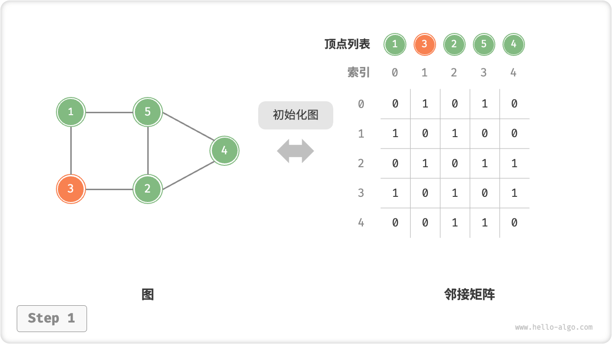
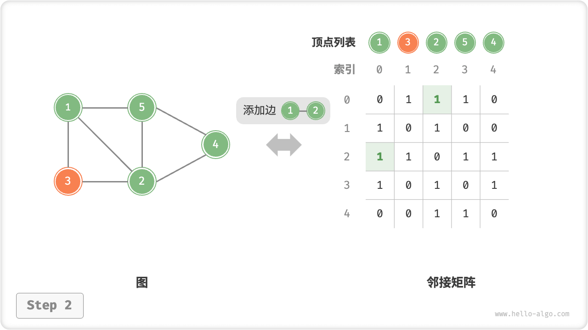
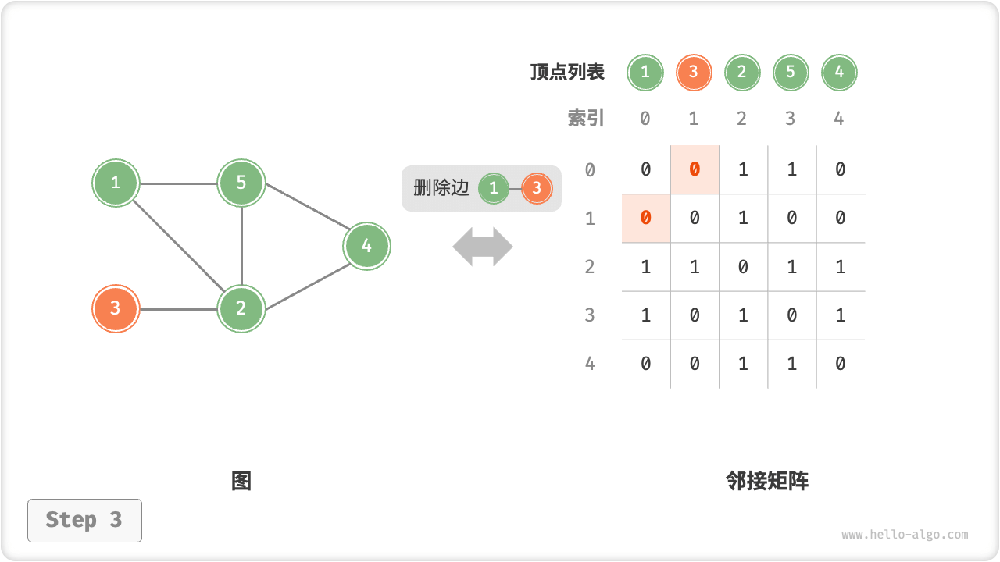
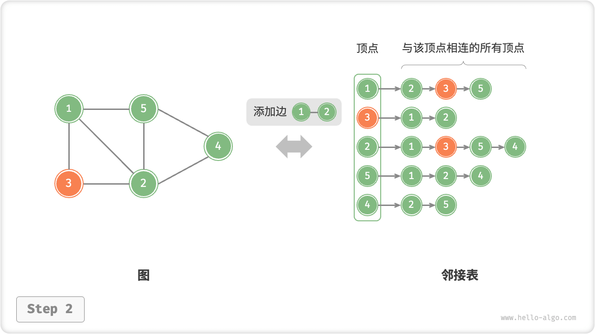
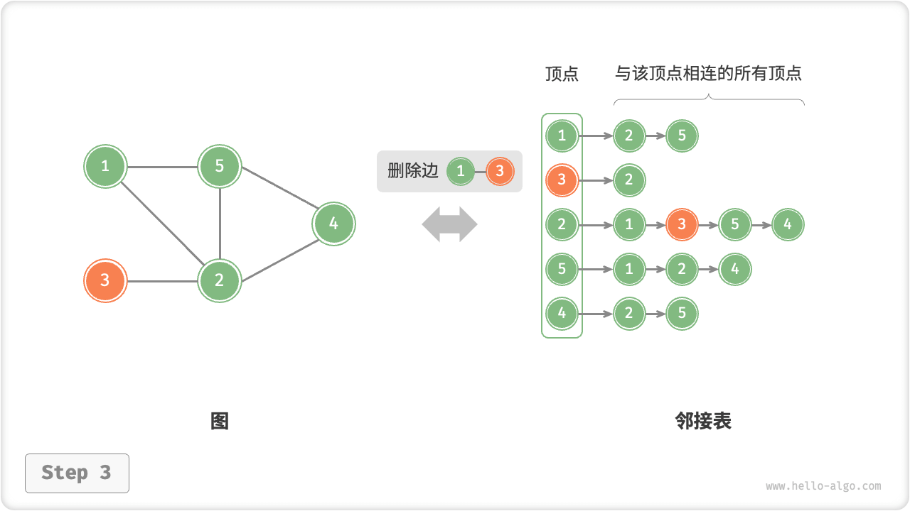
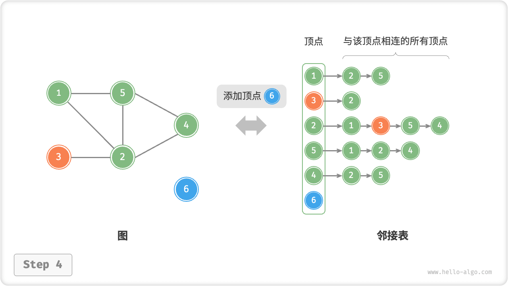
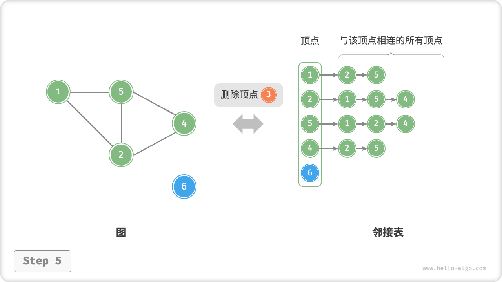

# Graph Basic Operations

The basic operations on graphs can be divided into operations on "edges" and operations on "vertices". They are implemented differently in the "adjacency matrix" and "adjacency list" representations.

## Implementation Based On Adjacency Matrices

Given an undirected graph with $n$ number of vertices, the various operations are implemented as shown in the figure below.

- **Add or remove edges**: just modify the specified edges directly in the adjacency matrix, using $O(1)$ time. And since it is an undirected graph, you need to update the edges in both directions at the same time.
- **Add vertex**: add a row and a column to the end of the adjacency matrix and fill them all $0$ that's it, using $O(n)$ time.
- **Delete vertex**: deletes a row and a column in the adjacency matrix. The worst case is reached when deleting the first row and column, which requires $(n-1)^2$ elements to be "shifted up to the left", thus using $O(n^2)$ time.
- **Initialize**: pass $n$ vertices, initialize the list of vertices `vertices` of length $n$, using $O(n)$ time; initialize the adjacency matrix `adjMat` of size $n \times n$, using $O(n^2)$ time.

=== "Initialize the adjacency matrix."
    

=== "Add edge"
    

=== "Delete edge"
    

=== "Add vertex"
    

=== "Delete vertex"
    

The following is the implementation code based on the adjacency matrix representation of the graph.

```src
[file]{graph_adjacency_matrix}-[class]{graph_adj_mat}-[func]{}
```

## Implementation Based On Adjacency Lists

Let the total number of vertices of an undirected graph be $n$ and the total number of edges be $m$ , then various operations can be realized according to the method shown in the figure below.

- **Add Edge**: just add the edge at the end of the linked list corresponding to the vertex, using $O(1)$ time. Since it is an undirected graph, you need to add edges in both directions.
- **Delete Edge**: finds and deletes the specified edge in the linked list corresponding to the vertex, using $O(m)$ time. In an undirected graph, edges in both directions need to be deleted simultaneously.
- **Add vertex**: add a linked list to the adjacency list and use the added vertex as the linked list node, using $O(1)$ time.
- **Delete vertex**: need to traverse the entire adjacency list and delete all edges containing the specified vertex, using $O(n + m)$ time.
- **Initialization**: create $n$ vertices and $2m$ edges in the adjacency list, using $O(n + m)$ time.

=== "Initialize the adjacency list."
    

=== "Add edge"
    

=== "Delete edge"
    

=== "Add vertex"
    

=== "Delete vertex"
    

The following is the code implementation of the adjacency list. Comparing to the figure above, the actual code has the following differences.

- To make it easier to add and remove vertices, and to simplify the code, we use lists (dynamic arrays) instead of linked lists.
- A hash table is used to store the adjacency table, `key` is the vertex instance, and `value` is the list of adjacency vertices (linked list) for that vertex.

In addition, we use the `Vertex` class to represent the vertices in the adjacency table because if we use the list index to distinguish different vertices as in the adjacency matrix, then suppose we want to delete a vertex with index $i$, we need to traverse the whole adjacency list and subtract all indexes greater than $i$ from $1$, which is very inefficient. If each vertex is a unique instance of `Vertex`, then after deleting a vertex, there is no need to change the other vertices.

```src
[file]{graph_adjacency_list}-[class]{graph_adj_list}-[func]{}
```

## Efficiency Comparison

Given that there are $n$ vertices and $m$ edges in the graph, the table below compares the time and space efficiency of the adjacency matrix and adjacency list.

<p align="center"> Table <id> &nbsp; Adjacency matrix vs. adjacency list </p>

|                             | Adjacency matrix | Adjacency list (linked list) | Adjacency table (hash table) |
| --------------------------- | ---------------- | ---------------------------- | ---------------------------- |
| determine whether adjacency | $O(1)$           | $O(m)$                       | $O(1)$                       |
| Add Edge                    | $O(1)$           | $O(1)$ $O(1)$ $O(1)$         |
| Delete Edge                 | $O(1)$           | $O(m)$                       | $O(1)$                       |
| Add vertex                  | $O(n)$           | $O(1)$                       | $O(1)$                       |
| Delete vertex               | $O(n^2)$         | $O(n + m)$                   | $O(n)$                       |
| Memory Space Occupancy      | $O(n^2)$         | $O(n + m)$                   | $O(n + m)$                   |

Observing the above table, it seems that the adjacency list (hash table) is optimal in terms of time and space efficiency. But in fact, the efficiency of operating edges in the adjacency matrix is higher, only one array access or assignment operation is needed. Taken together, the adjacency matrix reflects the principle of "space for time", while the adjacency list reflects the principle of "time for space".
