# Iteration Of Graphs

Trees represent "one-to-many" relationships, while graphs have a higher degree of freedom and can represent arbitrary "many-to-many" relationships. Therefore, we can consider a tree as a special case of a graph. Obviously, **the traversal operation of tree is also a special case of the traversal operation of graph**.

Both graphs and trees require searching algorithms to realize traversal operations. There are two types of graph traversal: breadth-first traversal and depth-first traversal. They are often called "breadth-first search" and "depth-first search", or BFS and DFS for short.

## Breadth-First Traversal

**Breadth-first traversal is a proximity-first traversal that starts from a node and always prioritizes visiting the closest vertex and expands outward one level at a time**. As shown in the figure below, starting from the top-left vertex, all the adjacency vertices of that vertex are traversed, then all the adjacency vertices of the next vertex are traversed, and so on, until all the vertices have been visited.


### Algorithm Implementation

BFS is usually implemented with the help of queues. Queues have a "first-in, first-out" nature, which is similar to the "near and far" idea of BFS.

1. Add the traversal start vertex `startVet` to the queue and start the loop.
2. In each iteration of the loop, the queue head vertex is popped and the visit is recorded, and then all the adjacency vertices of that vertex are added to the tail of the queue.
3. Loop step `2.` until all the vertices are visited and finished.

To prevent repeated traversal of the vertices, we need to keep track of which nodes have been visited with the help of a hash table `visited`.

```src
[file]{graph_bfs}-[class]{}-[func]{graph_bfs}
```

The code is relatively abstract and it is recommended that you compare it to the figure below for a better solution.

=== "<1>"
    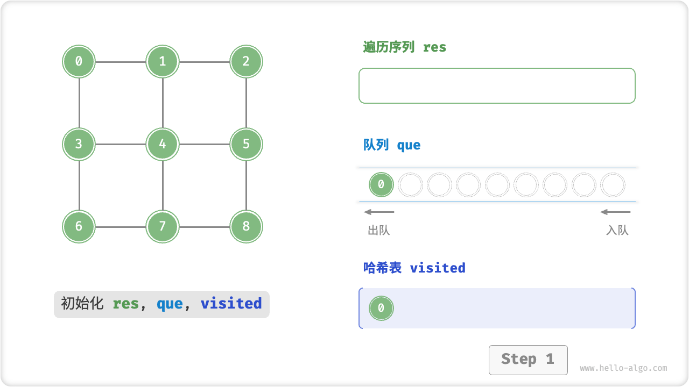

=== "<2>"
    

=== "<3>"
    

=== "<4>"
    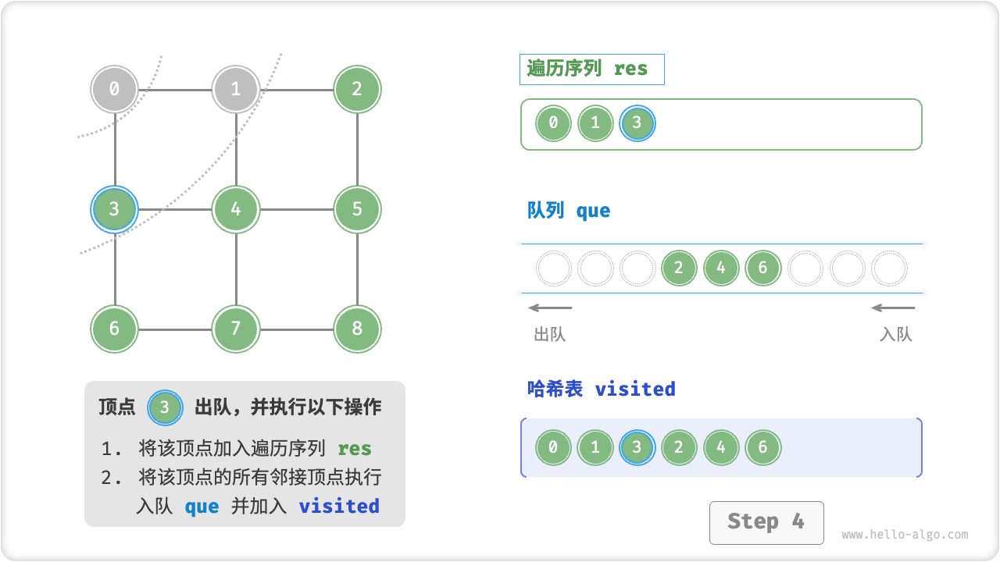

=== "<5>"
    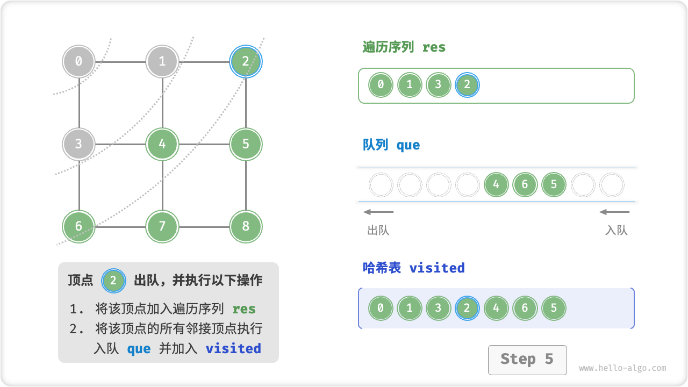

=== "<6>"
    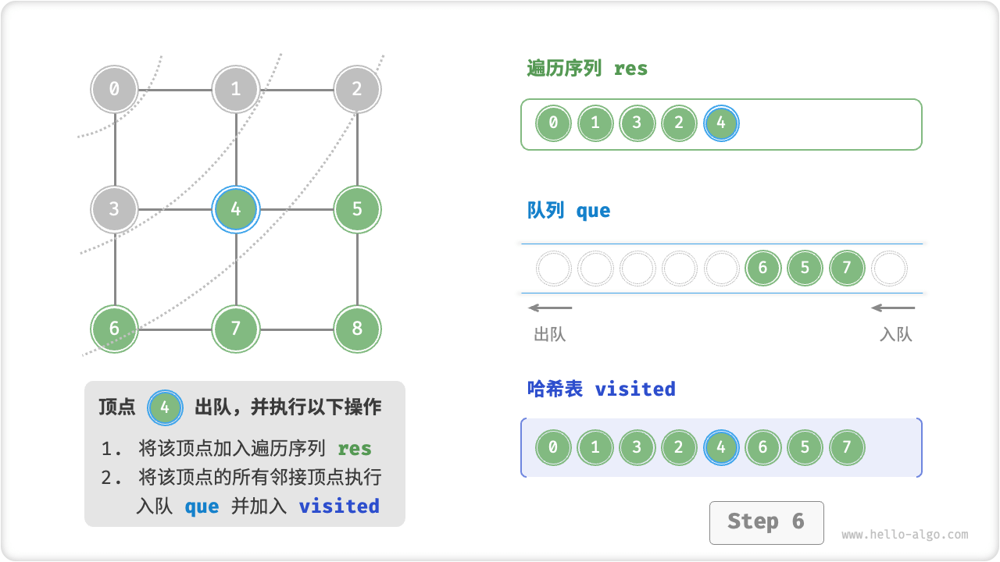

=== "<7>"
    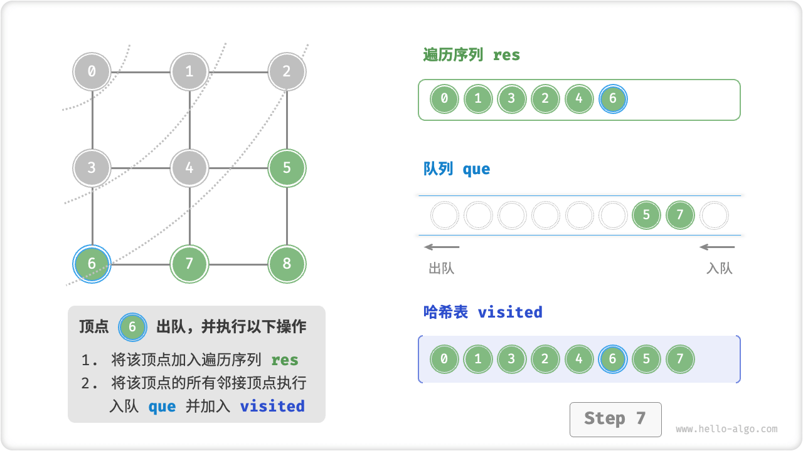

=== "<8>"
    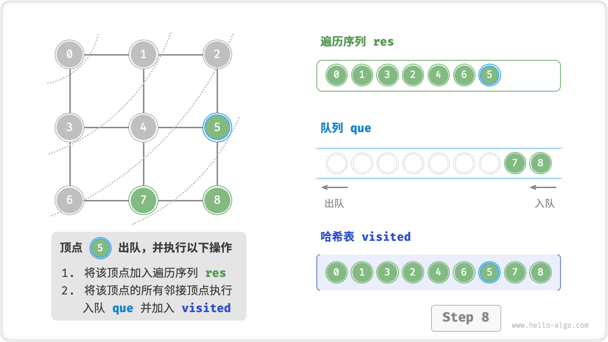

=== "<9>"
    

=== "<10>"
    

=== "<11>"
    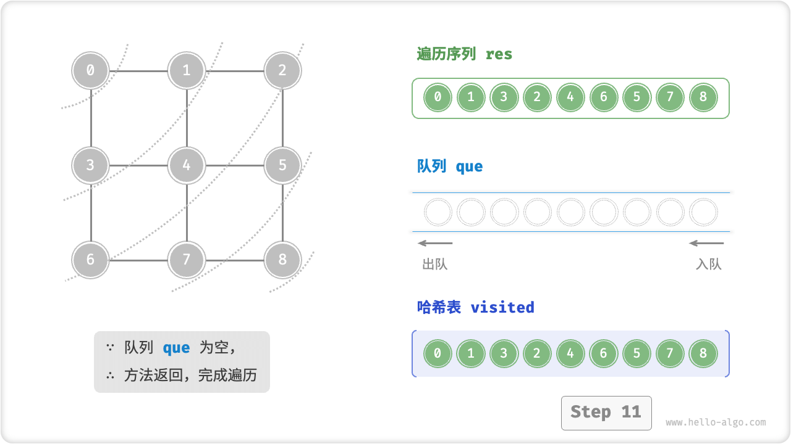

!!! question "Is the sequence of breadth-first traversals unique?"

    No, it isn't. Breadth-first traversal only requires traversing in "near to far" order, **while the traversal order of multiple vertices of the same distance is allowed to be arbitrarily disrupted**. Take the figure above as an example, the access order of vertices $1$, $3$ can be swapped, and the access order of vertices $2$, $4$, $6$ can be swapped arbitrarily.

### Complexity Analysis

**Time complexity:** All vertices are queued in and out once, using $O(|V|)$ time; during traversal of the adjacency vertices, since it is an undirected graph, all the edges are accessed $2$ times, using $O(2|E|)$ time; and overall using $O(|V| + |E|)$ time.

**Space complexity:** The maximum number of vertices in a list `res` , hash table `visited` , and queue `que` is $|V|$ , using $O(|V|)$ space.

## Depth-First Traversal

**Depth-first traversal is a type of traversal that prioritizes going to the end and turning back when there is no way out**. As shown in the figure below, starting from the top-left vertex, you visit one of the current vertex's adjacency vertices until you return at the end of your walk, then continue to the end and return, and so on until all vertex traversal is complete.


### Algorithm Implementation

This algorithmic paradigm of "go to the end and back" is usually implemented based on recursion. Similar to breadth-first traversal, depth-first traversal requires a hash table `visited` to keep track of the vertices that have already been visited, in order to avoid revisiting vertices.

```src
[file]{graph_dfs}-[class]{}-[func]{graph_dfs}
```

The algorithm flow for depth-first traversal is shown in the figure below.

- The **straight dashed line represents a downward recursion**, indicating that a new recursion method is opened to access the new vertex.
- The **curved dashed line represents upward backtracking**, indicating that this recursion method has returned, back to the point where it was opened.

For a better solution, it is recommended to combine the graphs with the code to simulate the entire DFS process in your head (or draw it down with a pen), including when each recursion method opens and when it returns.

=== "<1>"
    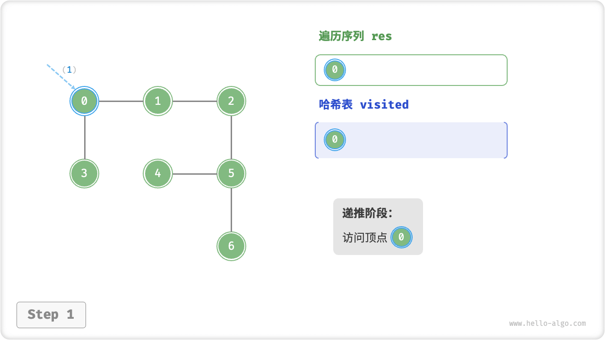

=== "<2>"
    

=== "<3>"
    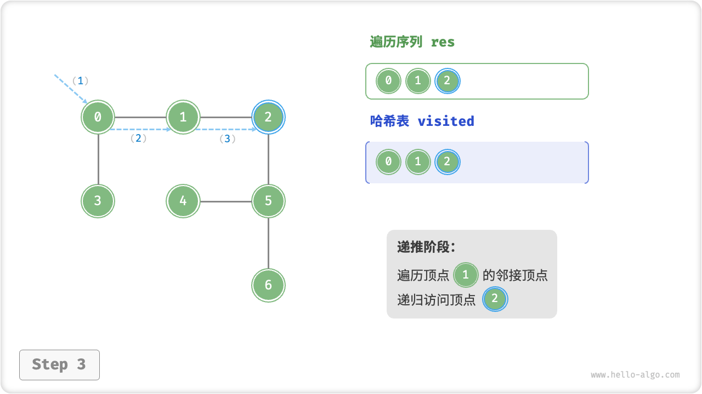

=== "<4>"
    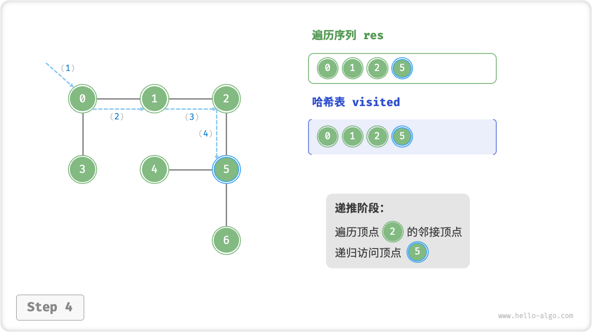

=== "<5>"
    

=== "<6>"
    

=== "<7>"
    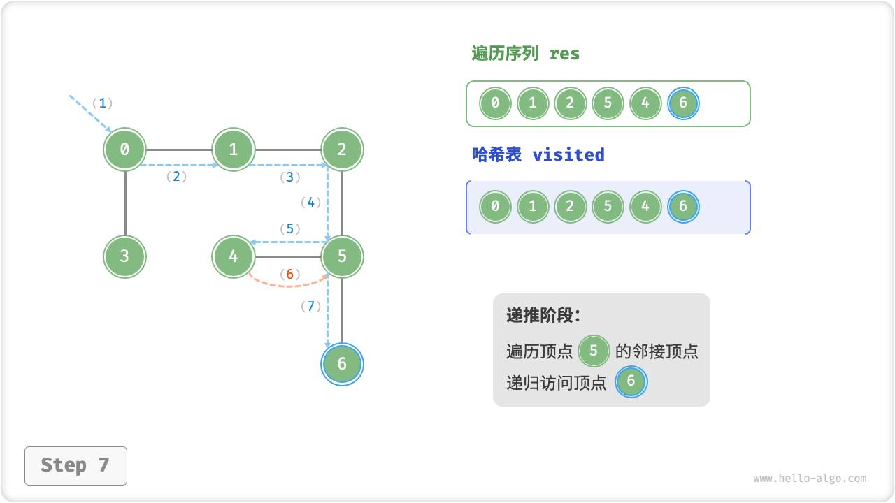

=== "<8>"
    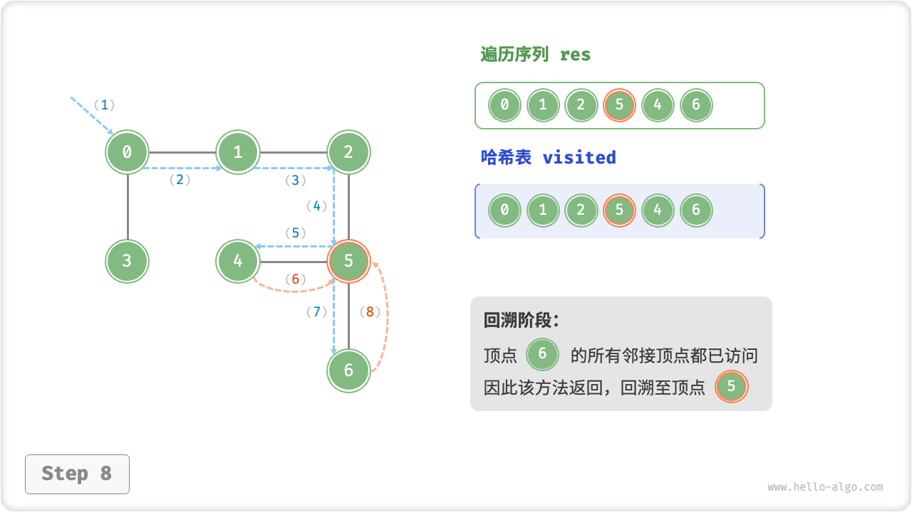

=== "<9>"
    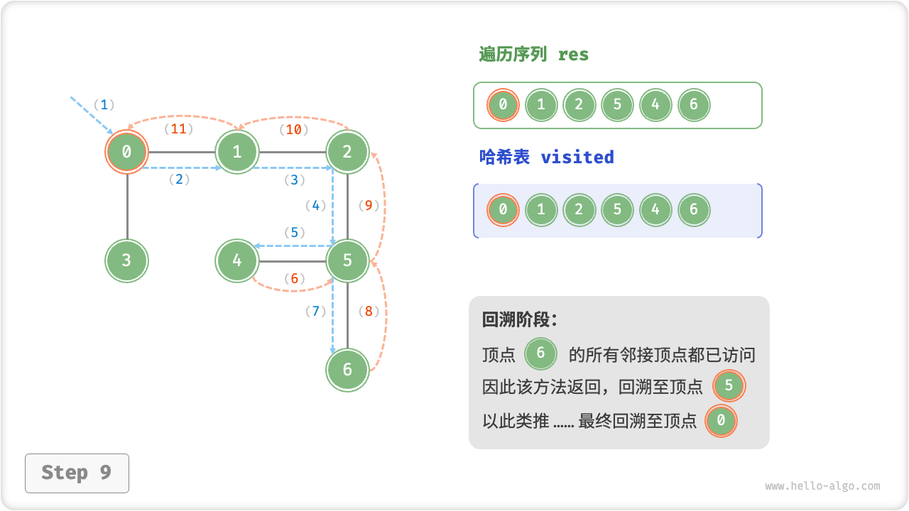

=== "<10>"
    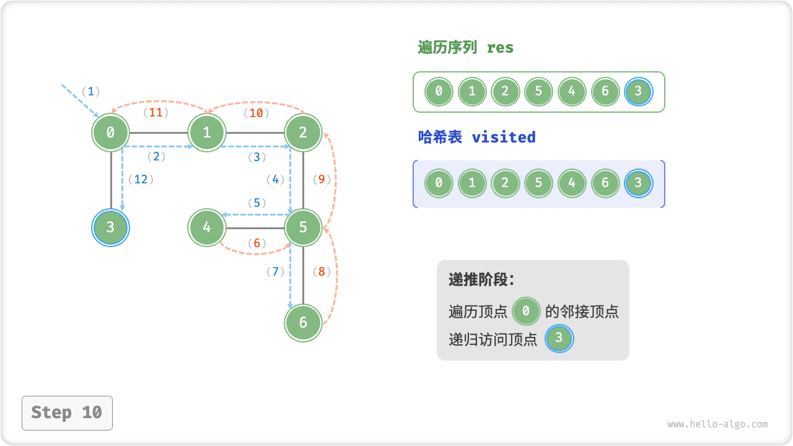

=== "<11>"
    

!!! question "Is the sequence of depth-first traversal unique?"

    Similar to breadth-first traversal, the order of the depth-first traversal sequence is not unique. Given a vertex, it is possible to explore in either direction first, i.e., the order of the adjacency vertices can be arbitrarily disrupted, and it is all depth-first traversal.
   
    Taking tree traversal as an example, "root $\rightarrow$ left $\rightarrow$ right" and "left $\rightarrow$ root $\rightarrow$ right", "left $\rightarrow$ right $\rightarrow$ root" corresponds to preorder, middle-order, and postorder traversals, respectively, and they demonstrate three different traversal priorities, however, all three are depth-first traversals.

### Complexity Analysis

**Time complexity:** All vertices are visited $1$ times, using $O(|V|)$ time; all edges are visited $2$ times, using $O(2|E|)$ time; and overall $O(|V| + |E|)$ time.

**Space complexity:** lists `res` , hash tables `visited` The maximum number of vertices is $|V|$ , and the maximum depth of recursion is $|V|$ , so $O(|V|)$ space is used.
