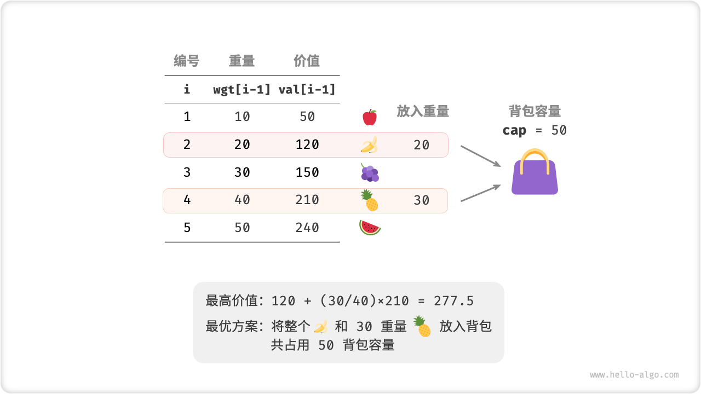

# Fractional Knapsack Problem

!!! question

    Given $n$ items, the weight of the $i$th item is $wgt[i-1]$, the value is $val[i-1]$ , and a backpack with capacity $cap$. Each item can be selected only once, **but a portion of the item can be selected, and the value is calculated in proportion to the weight of the selection**. Please return the maximum value of the items in the backpack without exceeding the capacity of the backpack.



Fractional backpacks are very similar to 0-1 backpacks in general, in that the state contains the current item $i$ and the capacity $c$ , and the goal is to find the maximum value without exceeding the capacity of the backpack.

The difference is that this question allows to select only a part of the item. As shown in the figure below, **we can slice the item arbitrarily and calculate the value of the item in proportion to its weight**.

1. For an item $i$ , its value per unit weight is $val[i-1] / wgt[i-1]$ , abbreviated as unit value.
2. Assuming that a portion of the item is put in $i$ and the weight is $w$, the value added to the backpack is $w \times val[i-1] / wgt[i-1]$ .


### Greedy Strategy Determination

Maximizing the total value of the items in the backpack, **essentially means maximizing the value of the items per unit weight**. This leads to the greedy strategy shown in the figure below.

1. Sort items from highest to lowest unit value.
2. Iterate over all items, **greedily choosing the item with the highest unit value each round**.
3. If the remaining backpack capacity is insufficient, simply use a portion of the current item to fill the backpack.


### Code Implementation

We create an item class `Item` in order to sort items by unit value. The loop makes a greedy selection, jumps out when the backpack is full and returns the solution.

```src
[file]{fractional_knapsack}-[class]{}-[func]{fractional_knapsack}
```

In the worst case, the entire list of items needs to be traversed, **hence the time complexity is $O(n)$** , where $n$ is the number of items.

Since a list of `Item` objects is initialized, **the space complexity is $O(n)$**.

### Proof Of Correctness

The counterfactual method is used. Assume that item $x$ is the item with the highest unit value, and use an algorithm to find the maximum value as `res` , but the solution does not include item $x$ .

Now take any item of unit weight from the backpack and replace it with an item of unit weight $x$ . Since item $x$ has the highest unit value, the total value after replacement must be greater than `res` . **This contradicts the fact that `res` is the optimal solution and shows that the optimal solution must include the item $x$** .

For the other items in this solution, we can also construct the above contradiction. In sum, **the item with a greater unit value is always the better choice**, which shows that the greedy strategy is effective.

As shown in the figure below, the fractional knapsack problem can be transformed into "find the maximum enclosing area for a finite interval of the horizontal axis" by considering the weight of the item and the unit value of the item as the horizontal and vertical axes, respectively, of a 2D graph. This analogy helps us understand the effectiveness of the greedy strategy from a geometric perspective.


