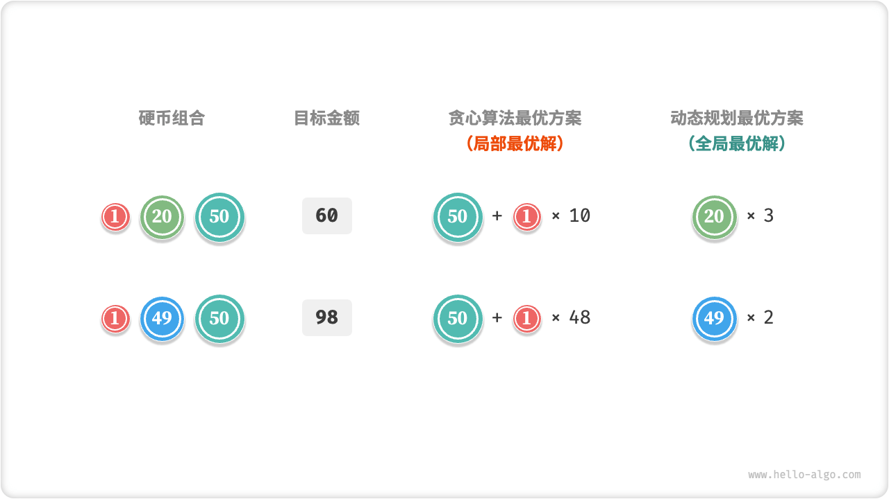

# Greedy Algorithm

"Greedy algorithm greedy algorithm is a common algorithm for solving optimization problems. Its basic idea is to choose the current seemingly optimal choice at each decision-making stage of the problem, i.e., to greedily make the locally optimal decision in the hope of obtaining the globally optimal solution. Greedy algorithms are simple and efficient, and are widely used in many real-world problems.

Both greedy algorithms and dynamic programming are commonly used to solve optimization problems. There are some similarities between them, such as both relying on the optimal substructure property, but the working principles are different.

- Dynamic programming takes into account the current decision in light of all decisions made in previous phases and uses the solution of the past subproblem to construct the solution of the current subproblem.
- The greedy algorithm does not reconsider past decisions, but makes greedy choices all the way forward, continually narrowing the problem until it is solved.

Let's start by understanding how the greedy algorithm works with the example problem "Change Exchange". This problem was introduced in the chapter on dynamic programming, so I'm sure you're familiar with it.

!!! question

    Given $n$ coins, the face value of the first $i$ coin is $coins[i - 1]$ and the target amount is $amt$ , each coin can be selected repeatedly, ask the minimum number of coins that can make the target amount. If the target amount cannot be reached, return $-1$.

The greedy strategy for this problem is shown in the figure below. Given a target amount, **we greedily choose the coin that is no larger than and closest to it**, and keep cycling through that step until we come up with the target amount.


The implementation code is shown below. You may not be able to help but exclaim: So Clean ! The greedy algorithm solves the change exchange problem in just ten lines of code.

```src
[file]{coin_change_greedy}-[class]{}-[func]{coin_change_greedy}
```

## Greedy Advantages And Limitations

**The greedy algorithm is not only straightforward to operate and simple to implement, but it is also usually very efficient**. In the above code, noting that the smallest denomination of the coin is $\min(coins)$ , the greedy selection is looped at most $amt / \min(coins)$ times with a time complexity of $O(amt / \min(coins))$ . This is an order of magnitude higher than the time complexity of the dynamic programming solution $O(n \times amt)$ .

However, **for some combinations of coin denominations, the greedy algorithm does not find the optimal solution**. Two examples are given in the figure below.

- **Positive Example $coins = [1, 5, 10, 20, 50, 100]$**: given any $amt$ , the greedy algorithm can find the optimal solution given that coin combination.
- **Counterexample $coins = [1, 20, 50]$**: Assuming $amt = 60$, the greedy algorithm can only find a combination of exchanges of $50 + 1 \times 10$ for a total of $11$ coins, but the dynamic programming can find the optimal solution of $20 + 20 + 20$ for only $3$ coins.
- **Counterexample $coins = [1, 49, 50]$**: Assuming $amt = 98$, the greedy algorithm can only find a combination of $50 + 1 \times 48$ exchanges for a total of $49$ coins, but the dynamic programming can find the optimal solution $49 + 49$ for only $2$ coins.



That is, for the change exchange problem, the greedy algorithm is not guaranteed to find a globally optimal solution and is likely to find a very poor solution. It is more suitable for solution with dynamic programming.

In general, the greedy algorithm is applicable to the following two types of problems.

1. **can be guaranteed to find the optimal solution**: greedy algorithms are often the optimal choice in this case, as they tend to be more efficient than backtracking, dynamic programming.
2. **Approximate optimal solutions can be found**: greedy algorithms are also available in this case. For many complex problems, finding a globally optimal solution is very difficult, and it is nice to be able to find a suboptimal solution at a higher efficiency.

## Properties Of The Greedy Algorithm

So the question arises, what kind of problems are suitable to be solved by greedy algorithm? Or under what circumstances is the greedy algorithm guaranteed to find an optimal solution?

Compared to dynamic programming, the greedy algorithm is used under more stringent conditions, and it focuses on two properties of the problem.

- **Greedy Choice Property**: a greedy algorithm is guaranteed to obtain an optimal solution only if locally optimal choices can always lead to a globally optimal solution.
- **Optimal Substructure**: the optimal solution of the original problem contains the optimal solution of the subproblem.

Optimal substructures have already been introduced in the dynamic programming chapter and will not be repeated. It is worth noting that some problems for which the optimal substructure is not obvious can still be solved using greedy algorithms.

We mainly explore the method of determining the greedy choice property. Although its description seems relatively simple, **in practice for many problems proving the greedy choice property is not an easy task**.

The change exchange problem, for example, is more difficult to confirm, although we can easily give counterexamples that falsify the greedy choice property. If one asks, **What conditions are satisfied for a coin combination to be solved using a greedy algorithm**? we can often only give an ambiguous answer by intuition or by giving examples, and it is difficult to give a rigorous mathematical proof.

!!! quote

    One paper gives an $O(n^3)$ time complexity algorithm for determining whether a combination of coins can be used to find an optimal solution for any amount using a greedy algorithm.

    Pearson, David. A polynomial-time algorithm for the change-making problem. Operations Research Letters 33.3 (2005): 231-234.

## Greedy Solution Steps

The solution process for the greed problem can be broadly divided into the following three steps.

1. **Problem Analysis**: sorting out and understanding the problem characteristics, including state definitions, optimization objectives, and constraints. This step is covered in both backtracking and dynamic programming.
2. **Determine a greedy strategy**: determine how to make greedy choices at each step. This strategy can reduce the size of the problem at each step and can eventually solve the entire problem.
3. **Proof of Correctness**: it is usually necessary to prove that the problem has the greedy choice property and the optimal substructure. This step may require the use of mathematical proofs, such as induction or inversion.

Determining a greedy strategy is a central step in solving the problem, but it may not be easy to implement, mainly for the following reasons.

- **The variation in greedy strategies is large for different problems**. For many problems, the greedy strategy is relatively shallow, and we can arrive at it by some rough thinking and trying. For some complex problems, the greedy strategy may be very hidden, and this situation is a great test of one's solution experience and algorithmic ability.
- **Some greedy strategies are highly disorienting**. When we confidently design a greedy strategy, write the solution code, and submit it to run, we are likely to find that some of the test samples do not pass. This is because the greedy strategy is only "partially correct", as in the case of the change exchange described above.

In order to ensure correctness, we should provide a rigorous mathematical proof of the greedy strategy, **which usually involves the use of the inverse method or mathematical induction**.

However, proving correctness is also likely not an easy task. If we don't have a clue, we usually choose to Debug the test cases to modify and verify the greedy strategy step by step.

## Typical Examples Of Greed

Greedy algorithms are often applied to optimization problems that satisfy the greedy selection property and the optimal substructure, some typical greedy algorithm problems are listed below.

- **Coin Change Problem**: the greedy algorithm always yields an optimal solution under certain coin combinations.
- **Interval Scheduling Problem**: Suppose you have a number of tasks, each of which takes place over a period of time, and your goal is to complete as many tasks as possible. If you choose the task with the earliest end time each time, then the greedy algorithm can obtain an optimal solution.
- **Fractional knapsack problem**: given a set of items and a load, your goal is to select a set of items such that the total weight does not exceed the load and the total value is maximized. The greedy algorithm can lead to an optimal solution in some cases if you choose the most cost-effective (value / weight) item each time.
- **Stock Buying and Selling Problem**: Given the historical prices of a set of stocks, you can buy and sell them multiple times, but if you already hold the stock, you can't buy it again until you sell it, with the goal of maximizing profit.
- **Hoffman coding**: Hoffman coding is a greedy algorithm for lossless data compression. By constructing a Hoffman tree node and choosing the two nodes with the smallest frequency of occurrence to merge each time, the final Hoffman tree obtained has the smallest weighted path length (i.e., encoding length).
- **Dijkstra's algorithm**: it is a greedy algorithm that solves the problem of the shortest path from a given source vertex to each of the remaining vertices.
