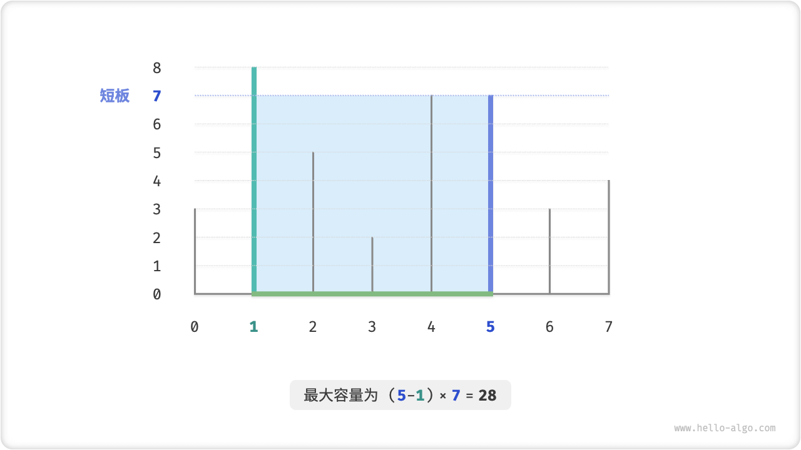
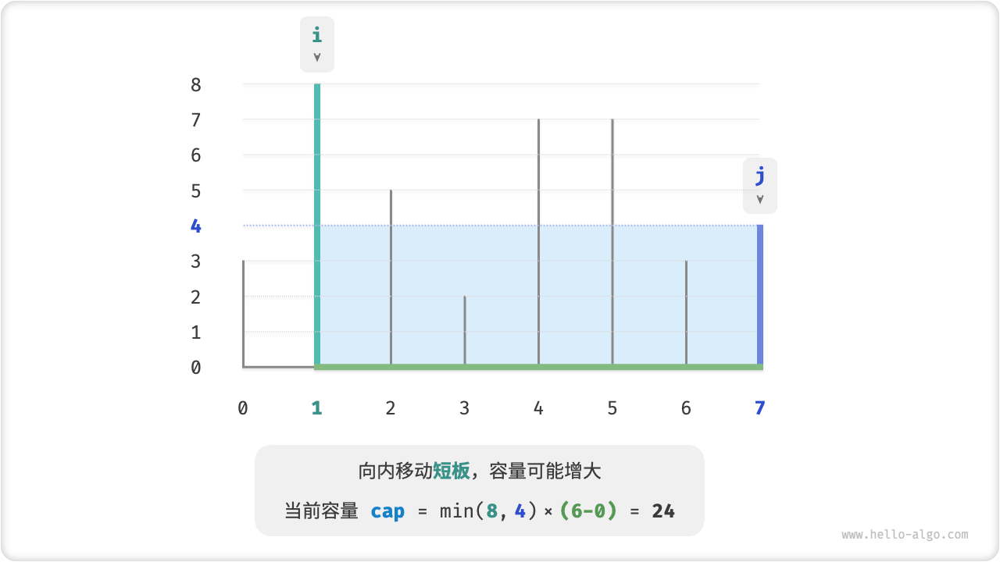
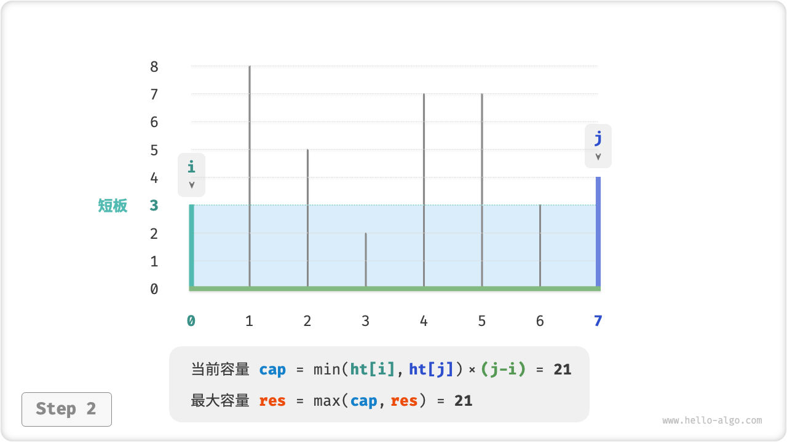
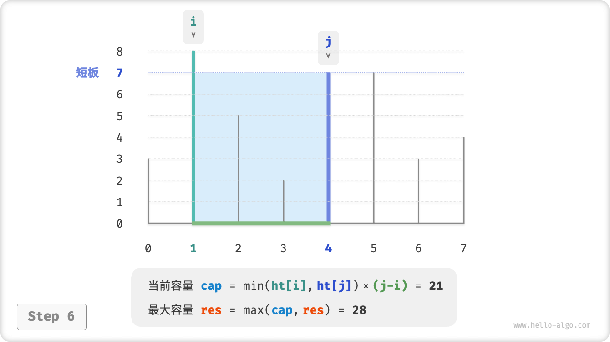
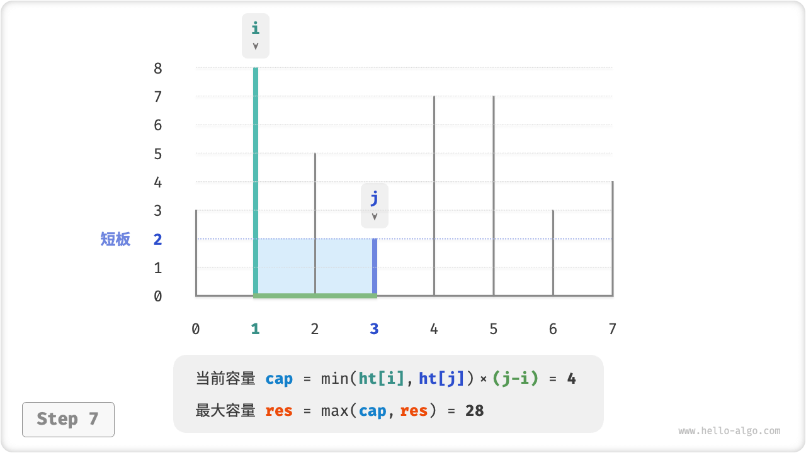
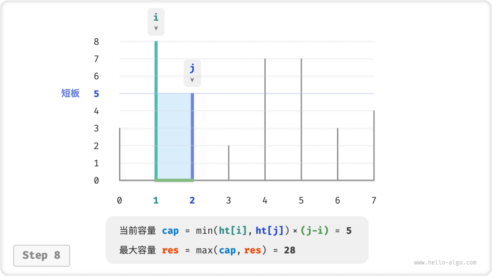
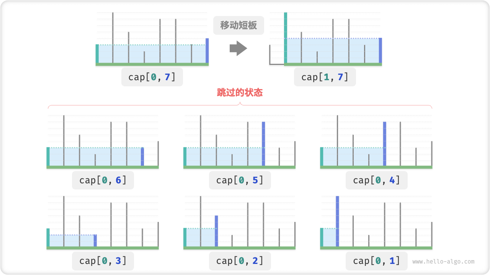

# Maximum Capacity Problem

!!! question

    Enter an array $ht$ , with each element of the array representing the height of a vertical partition. Any two partitions in the array, and the space between them, can form a container.
   
    The capacity of a container is equal to the product of the height and the width (i.e., the area), where the height is determined by the shorter partition and the width is the difference between the indexes of the arrays of the two partitions.
   
    Please select two partitions in the array such that the resulting container has the largest capacity, returning the maximum capacity.



The container is enclosed by any two partitions, **so the state of this problem is the index of the two partitions, denoted $[i, j]$** .

According to the question, the capacity is equal to the height multiplied by the width, where the height is determined by the short board and the width is the difference between the indexes of the two partitions. Let the capacity be $cap[i, j]$ , then the formula can be obtained:

$$
cap[i, j] = \min(ht[i], ht[j]) \times (j - i)
$$

Let the length of the array be $n$ , and the number of combinations of two partitions (i.e., the total number of states) be $C_n^2 = \frac{n(n - 1)}{2}$ . Most directly, **we can exhaustively enumerate all states to find the maximum capacity with a time complexity of $O(n^2)$** .

### Greedy Strategy Determination

There is a more efficient solution to this problem. As shown in the figure below, now pick a state $[i, j]$ which satisfies index $i < j$ and height $ht[i] < ht[j]$, i.e., $i$ is a short board and $j$ is a long board.


As shown in the figure below, **If the long board $j$ is moved closer to the short board $i$ at this time, the capacity must become smaller**.

This is because after moving the long board $j$, the width $j-i$ must become smaller; and the height is determined by the short board, so the height can only be unchanged ($i$ is still the short board) or smaller ($j$ becomes the short board after moving).


Thinking backwards, **we can only make the capacity bigger by shrinking the short board $i$ inwards**. Because although the width must become smaller, **the height may become larger**(the short board $i$ may become longer after moving). For example, in the figure below, the area becomes larger after moving the short board.



This leads to the greedy strategy for this problem: initialize the two pointers to split the ends of the container, and contract the pointers corresponding to the short board inward each round until the two pointers meet.

The figure below illustrates the execution of the greedy strategy.

1. In the initial state, the pointers $i$ and $j$ are listed at the ends of the array.
2. Calculate the capacity of the current state $cap[i, j]$ , and update the maximum capacity.
3. Compare the heights of board $i$ and board $j$ and move the short board inward by one square.
4. Loop through steps `2.` and `3.` until $i$ and $j$ meet.

=== "<1>"
    

=== "<2>"
    

=== "<3>"
    

=== "<4>"
    

=== "<5>"
    

=== "<6>"
    

=== "<7>"
    

=== "<8>"
    

=== "<9>"
    

### Code Implementation

The code loops for at most $n$ rounds, **so the time complexity is $O(n)$**.

The variables $i$, $j$, $res$ use constant size extra space, **so the space complexity is $O(1)$** .

```src
[file]{max_capacity}-[class]{}-[func]{max_capacity}
```

### Proof Of Correctness

The reason why greedy is faster than exhaustive is that each round of greedy choices "skips" some states.

For example, in state $cap[i, j]$, $i$ is the short board and $j$ is the long board. Greedily moving the short board $i$ inward by one frame will cause the states shown in the figure below to be "skipped". **This means that the capacity of these states cannot be verified later**.

$$
cap[i, i+1], cap[i, i+2], \dots, cap[i, j-2], cap[i, j-1]
$$



Observe that these skipped states are actually all the states that move the longboard $j$ inwards. And in the second step, we have shown that moving the longboard inward must result in a smaller capacity. That is, **none of the skipped states can be optimal solutions skipping them will not result in missing the optimal solution**.

The above analysis shows that **moving the short board is "safe"** and that the greedy strategy is effective.
