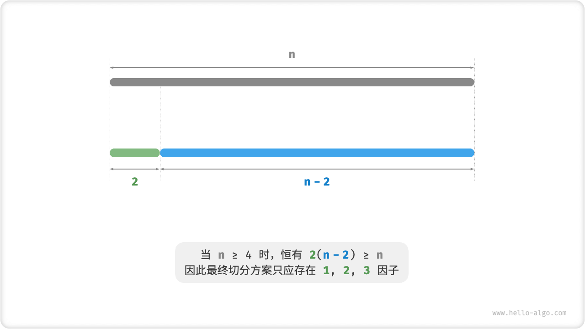

# Maximum Cut Product Problem

!!! question

    Given a positive integer $n$ , cut it into the sum of at least two positive integers and find the maximum product of all the integers after the cut.


Suppose we slice $n$ into $m$ integer factors, where the $i$th factor is denoted as $n_i$ , i.e.

$$
n = \sum_{i=1}^{m}n_i
$$

The goal of this problem is to find the maximum product of all integer factors of

$$
\max(\prod_{i=1}^{m}n_i)
$$

What we need to think about is: how big should the number of cuts $m$ be, and how much should each $n_i$ be?

### Greedy Strategy Determination

As a rule of thumb, the product of two integers is often larger than their sum. Suppose a factor $2$ is divided from $n$ , then their product is $2(n-2)$ . We compare this product with $n$:

$$
\begin{aligned}
2(n-2) & \geq n \newline
2n - n - 4 & \geq 0 \newline
n & \geq 4
\end{aligned}
$$

As shown in the figure below, when $n \geq 4$, the product will be larger after cutting out a $2$, **This means that any integer greater than or equal to $4$ should be cut**.

**Greedy Strategy I**: If the slicing scheme contains a factor of $\geq 4$, then it should be continued to be sliced. Only the factors $1$, $2$, and $3$ should appear in the final slicing scheme.



Next think about which factor is optimal. Among the three factors $1$, $2$, and $3$, it is clear that $1$ is the worst because $1 \times (n-1) < n$ holds, i.e., slicing out $1$ will instead result in a smaller product.

As shown in the figure below, when $n = 6$, there are $3 \times 3 > 2 \times 2 \times 2$ . **This means that slicing out $3$ is better than slicing out $2$**.

**Greedy Strategy II**: In the cut scheme, at most two $2$ should exist. This is because three $2$ can always be replaced by two $3$ , resulting in a larger product.


Summarizing the above, the following greedy strategy can be introduced.

1. Input an integer $n$ , from which the factors $3$ are continuously sliced until the remainders are $0$, $1$, $2$.
2. When the remainder is $0$, it means that $n$ is a multiple of $3$, so nothing is done.
3. When the remainder is $2$, do not continue the division and keep it.
4. When the remainder is $1$, the last $3$ should be replaced by $2$ since $2 \times 2 > 1 \times 3$.

### Code Implementation

As shown in the figure below, instead of slicing the integers by loops, we can use downward division to get the number of $3$ $a$ and modulo operation to get the remainder $b$, which we have:

$$
n = 3 a + b
$$

Note that for the boundary case of $n \leq 3$, a $1$ must be split and the product is $1 \times (n - 1)$ .

```src
[file]{max_product_cutting}-[class]{}-[func]{max_product_cutting}
```


**The time complexity depends on the programming language's implementation of the power operation**. In Python, for example, there are three commonly used power calculation functions.

- Both the operator `**` and the function `pow()` have a time complexity of $O(\log a)$.
- The function `math.pow()` internally calls the C library's `pow()` function, which performs floating-point power-taking with a time complexity of $O(1)$.

The variables $a$ and $b$ use extra space of constant size, **so the space complexity is $O(1)$** .

### Proof Of Correctness

Using the counterfactual, analyze only the case of $n \geq 3$.

1. **All factors $\leq 3$** : Assuming that there is a factor $\geq 4$ of $x$ in the optimal cutoff scheme, it must be possible to continue dividing it into $2(x-2)$ and thus obtain a larger product. This contradicts the assumption.
2. The **-slicing scheme does not contain $1$** : Assuming that a factor $1$ exists in the optimal slicing scheme, it must be possible to merge it into another factor to obtain a larger product. This contradicts the assumption.
3. **The cut scheme contains at most two $2$** : Assuming that the optimal cut scheme contains three $2$, then it must be possible to replace it with two $3$ with a larger product. This contradicts the assumption.
