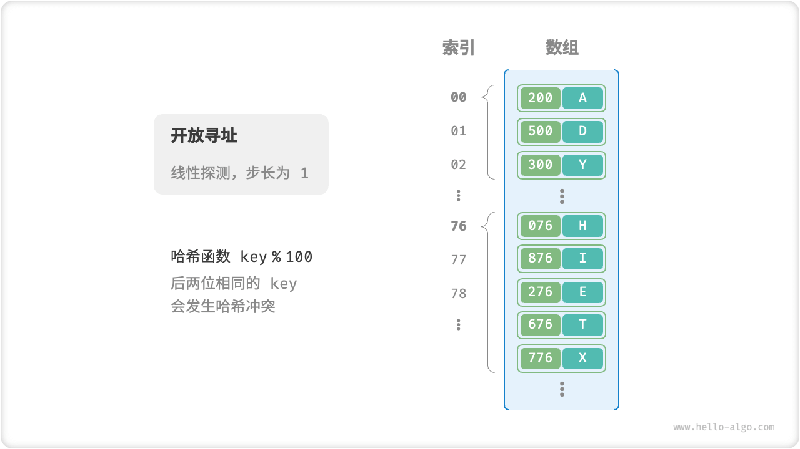

# Hash Collision

As mentioned in the previous section, **Typically the input space of a hash function is much larger than the output space**, so theoretically hash collisions are inevitable. For example, if the input space is the whole integer and the output space is the size of the array capacity, there are inevitably multiple integers mapped to the same bucket index.

A hash collision can lead to incorrect query results and seriously affect the availability of the hash table. To solve this problem, we can expand the hash table whenever we encounter a hash collision until the conflict disappears. This method is simple, brutal and effective, but the efficiency is too low, because the hash table expansion requires a lot of data handling and hash value calculation. In order to improve efficiency, we can use the following strategy.

1. Improving the hash table data structure, **makes the hash table work properly in the presence of hash collisions**.
2. The expansion operation is performed only when necessary, i.e., when hash collisions are more severe.

The structural improvements to hash tables include "separate chaining" and "open addressing".

## Separate Chaining

In the original hash table, each bucket can store only one key-value pair. "Chained address separate chaining" converts a single element into a linked list, using key-value pairs as the linked list nodes and storing all conflicting key-value pairs in the same linked list. The figure below shows an example of a chained address hash table.


The following changes have occurred in the method of operation of hash tables based on separate chaining address implementations.

- **Query element**: input `key`, after the hash function to get the bucket index, you can access the head node of the linked list, and then traverse the linked list and compare `key` to find the target key-value pairs.
- **Add element**: first access the linked list head node via hash function and then add the node (i.e. key-value pair) to the linked list.
- **Delete Element**: accesses the head of the linked list based on the result of the hash function, then traverses the linked list to find the target node and deletes it.

Separate chaining of addresses has the following limitations.

- **Increase in space occupied**: A linked list contains pointers to nodes, which are more memory space intensive compared to arrays.
- **The query is less efficient**: Because it requires linear traversal of the linked list to find the corresponding element.

The following code gives a simple implementation of a separate chaining hash table of addresses, with two points to note.

- Code is simplified by using lists (dynamic arrays) instead of linked lists. In this setup, hash tables (arrays) contain multiple buckets, each of which is a list.
- The following implementation contains the hash table expansion method. When the load factor exceeds $\frac{2}{3}$, we expand the hash table up to $2$ times.

```src
[file]{hash_map_chaining}-[class]{hash_map_chaining}-[func]{}
```

It is worth noting that when the linked list is very long, the query efficiency $O(n)$ is very poor. In this case, the linked list can be converted to an "AVL tree" or a "red-black tree" **to optimize the time complexity of the query operation to $O(\log n)$** .

## Open Addressing

"Open addressing open addressing" does not introduce additional data structures, but through the "multiple probing" to deal with hash collision, probing methods mainly include linear probing, square probing, multiple hash and so on.

The following will mainly take linear probing as an example to introduce the working mechanism and code implementation of open addressing hash tables.

### Linear Probing

Linear probing uses a fixed-step linear search for probing, which operates differently from a regular hash table.

- **Insert Element**: compute the bucket index by hash function, and if an element is already found in the bucket, traverse backward linearly from the hash collision position (the step size is usually $1$ ) until an empty bucket is found, and insert the element into it.
- **Find Element**: if hash collision is found, use the same step to traverse backward linearly until the corresponding element is found, return `value` and that's it; if an empty bucket is encountered, it means that the target element is not in the hash table, and return $\text{None}$ .

The figure below shows the distribution of key-value pairs for an open addressing (linear probing) hash table. According to this hash function, the last two identical `key` are mapped to the same bucket. And by linear probing, they are stored sequentially in that bucket as well as in the buckets below it.



However, **linear probing is prone to "aggregation phenomenon"**. Specifically, the longer the consecutive occupied positions in the array, the greater the possibility of hash collision at these consecutive positions, which further promotes the growth of the heap at the position, forming a vicious cycle, and ultimately leading to the deterioration of the efficiency of the operation of adding, deleting, checking and altering.

It is worth noting that **we cannot delete elements directly in an open addressing hash table**. This is because deleting an element creates an empty bucket within the array $\text{None}$ , and when querying for an element, linear probing returns that empty bucket, so any elements under that empty bucket can no longer be accessed, and the program may incorrectly determine that those elements do not exist.


To solve this problem, we can use the "lazy deletion" mechanism: instead of removing elements directly from the hash table, **we use a constant `TOMBSTONE` to mark the bucket**. Under this mechanism, both $\text{None}$ and `TOMBSTONE` represent empty buckets, and both can place key-value pairs. However, the difference is that when linear probing hits `TOMBSTONE`, we should continue traversing because there may be key-value pairs underneath it.

However, **lazy deletion may accelerate the performance degradation of hash tables**. This is because each deletion operation generates a deletion token, and as `TOMBSTONE` increases, the search time increases because linear probing may require skipping multiple `TOMBSTONE` to find the target element.

To this end, consider recording the index of the first `TOMBSTONE` encountered in a linear probing and swapping the position of the searched target element with that `TOMBSTONE`. The advantage of this is that when each time an element is queried or added, the element is moved to a bucket closer to the desired position (the start of the probe), thus optimizing query efficiency.

The following code implements an open addressing (linear probing) hash table with lazy deletions. In order to more fully utilize the space of the hash table, we treat the hash table as a "circular array", and when we cross the end of the array, we return to the head to continue traversing it.

```src
[file]{hash_map_open_addressing}-[class]{hash_map_open_addressing}-[func]{}
```

### Square Detection

Square probing is one of the common strategies for open addressing, similar to linear probing. Instead of simply skipping a fixed number of steps when a conflict occurs, square probing skips the "square of the number of probes" steps, i.e. $1, 4, 9, \dots$ steps.

Square probing has the following main advantages.

- Square probing attempts to mitigate the aggregation effect of linear probing by skipping squared distances.
- Squared detection skips larger distances to find empty positions, helping to distribute the data more evenly.

However, square detection is not perfect.

- There is still clustering, whereby certain locations are more likely to be occupied than others.
- Due to square growth, square probing may not probe the entire hash table, which means that even if there is an empty bucket in the hash table, square probing may not be able to access it.

### Multiple Hashes

Multiple hash uses multiple hash functions $f_1(x)$, $f_2(x)$, $f_3(x)$, $\dots$ for detection.

- **Insert element**: if the hash function $f_1(x)$ hash collision, then try $f_2(x)$, and so on, until the empty bucket is found and the element is inserted.
- **Find Element**: performs a lookup in the same hash function order until the target element is found and returns; or returns $\text{None}$ when an empty bucket is encountered or all hash functions have been tried, indicating that the element does not exist in the hash table.

Multiple hash methods are less prone to aggregation than linear probing, but multiple hash functions add additional computation.

!!! tip

    Note that open addressing (linear probing, square probing, and multiple hash) hash tables suffer from the problem of "not being able to delete elements directly".

## Programming Language Selection

Various programming languages have adopted different strategies for implementing hash tables, a few examples are given below.

- Java uses separate chaining. Since JDK 1.8, when the length of the array in a HashMap reaches 64 and the length of the linked list reaches 8, the linked list is converted to a red-black tree to improve lookup performance.
- Python uses open addressing. Dictionary dict uses pseudo-random numbers for probing.
- Golang uses separate chaining of addresses.Go specifies that each bucket stores up to 8 key-value pairs, beyond which an overflow bucket is connected. When there are too many overflow buckets, a special equal-expansion operation is performed to ensure performance.
