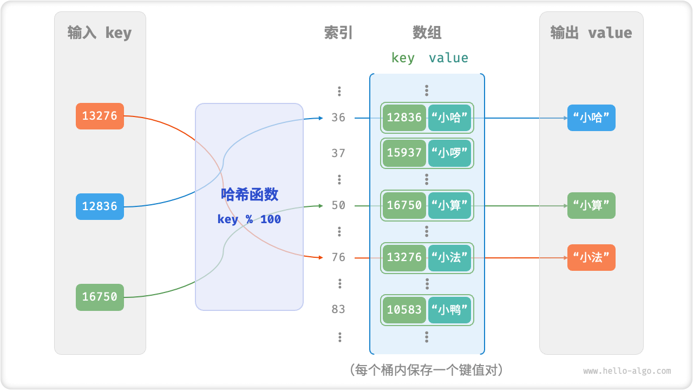
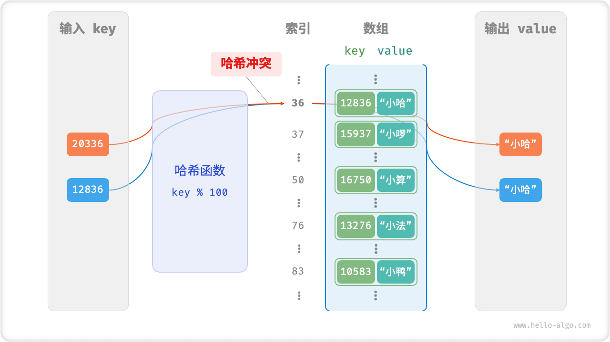
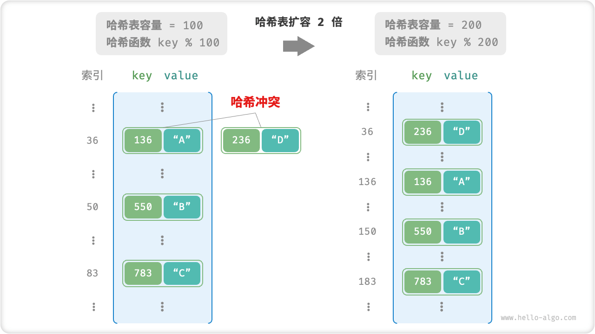

# Hash Table

A "hash table", also known as a "hash list", achieves efficient querying of elements by establishing a mapping between keys `key` and values `value`. Specifically, if we input a key `key` into a hash table, we can get the corresponding value `value` within $O(1)$ time.

As shown in the figure below, given $n$ students, each student has two pieces of data, "name" and "student number". If we want to realize the query function of "input a student number, return the corresponding name", we can use the hash table shown in the figure below to realize it.


In addition to hash tables, arrays and linked lists can also realize the query function, and their efficiency comparison is shown in the table below.

- **Add element**: simply add the element to the end of the array (linked list), using $O(1)$ time.
- **Query element**: since arrays (linked lists) are disordered, you need to iterate through all the elements in them, using $O(n)$ time.
- **Delete Element**: you need to query for the element and then delete it from the array (linked list), using $O(n)$ time.

<p align="center"> Table <id> &nbsp; Element Query Efficiency Comparison </p>

|                | arrays | linked lists         | hash tables |
| -------------- | ------ | -------------------- | ----------- |
| Find Elements  | $O(n)$ | $O(n)$               | $O(1)$      |
| Add Element    | $O(1)$ | $O(1)$ $O(1)$ $O(1)$ |
| Delete Element | $O(n)$ | $O(n)$               | $O(1)$      |

Observe that the time complexity of all additions, deletions, checks, **and modifications in a hash table by is $O(1)$** , which is very efficient.

## Common Operations On Hash Tables

Common operations on hash tables include: initialization, query operations, adding key-value pairs and deleting key-value pairs.

=== "Python"

    ```python title="hash_map.py"
    # Initialize the hash table
    hmap: dict = {}
   
    # Add operations
    # Add key-value pairs (key, value) to the hash table
    hmap[12836] = "little ha"
    hmap[15937] = "Xiaoluo"
    hmap[16750] = "small count"
    hmap[13276] = "Little Law"
    hmap[10583] = "Duckling"
   
    # Query operations
    # Enter the key into the hash table to get the value value
    name: str = hmap[15937]
   
    # Delete operations
    # Remove key-value pairs from hash table (key, value)
    hmap.pop(10583)
    ```

=== "C++"

    ```cpp title="hash_map.cpp"
    /* Initialize hash table */
    unordered_map<int, string> map;
   
    /* Add operation */
    // Add the key-value pair (key, value) to the hash table.
    map[12836] = "Little Hah";
    map[15937] = "Xiaoluo".
    map[16750] = "Small count";
    map[13276] = "Minor Law".
    map[10583] = "Duckling";
   
    /* Query operations */
    // Enter the key into the hash table, and get the value
    string name = map[15937];
   
    /* Delete operation */
    // Remove the key-value pair (key, value) from the hash table.
    map.erase(10583);
    ```

=== "Java"

    ```java title="hash_map.java"
    /* Initialize hash table */
    Map<Integer, String> map = new HashMap<>();
   
    /* Add operation */
    // Add the key-value pair (key, value) to the hash table.
    map.put(12836, "smallha");
    map.put(15937, "Xiaoluo");;
    map.put(16750, "Small count");
    map.put(13276, "Little Law");
    map.put(10583, "Duckling").
   
    /* Query operations */
    // Enter the key into the hash table, and get the value
    String name = map.get(15937);
   
    /* Delete operation */
    // Remove the key-value pair (key, value) from the hash table.
    map.remove(10583);
    ```

=== "C#"

    ```csharp title="hash_map.cs"
    /* Initialize hash table */
    Dictionary<int, string> map = new() {
        /* Add operation */
        // Add the key-value pair (key, value) to the hash table.
        { 12836, "little ha" }.
        { 15937, "Koro" }.
        { 16750, "small calculations" }.
        { 13276, "Minor law" }.
        { 10583, "Duckling" }
    };
   
    /* Query operations */
    // Enter the key into the hash table, and get the value
    string name = map[15937];
   
    /* Delete operation */
    // Remove the key-value pair (key, value) from the hash table.
    map.Remove(10583);
    ```

=== "Go"

    ```go title="hash_map_test.go"
    /* Initialize hash table */
    hmap := make(map[int]string)
   
    /* Add operation */
    // Add the key-value pair (key, value) to the hash table.
    hmap[12836] = "little ha"
    hmap[15937] = "Xiaoluo"
    hmap[16750] = "small count"
    hmap[13276] = "Little Law"
    hmap[10583] = "Duckling"
   
    /* Query operations */
    // Enter the key into the hash table, and get the value
    name := hmap[15937]
   
    /* Delete operation */
    // Remove the key-value pair (key, value) from the hash table.
    delete(hmap, 10583)
    ```

=== "Swift"

    ```swift title="hash_map.swift"
    /* Initialize hash table */
    var map: [Int: String] = [:]
   
    /* Add operation */
    // Add the key-value pair (key, value) to the hash table.
    map[12836] = "Xiaoha"
    map[15937] = "Xiaoluo"
    map[16750] = "small count"
    map[13276] = "Little Law"
    map[10583] = "Duckling"
   
    /* Query operations */
    // Enter the key into the hash table, and get the value
    let name = map[15937]!
   
    /* Delete operation */
    // Remove the key-value pair (key, value) from the hash table.
    map.removeValue(forKey: 10583)
    ```

=== "JS"

    ```javascript title="hash_map.js"
    /* Initialize hash table */
    const map = new Map();
    /* Add operation */
    // Add the key-value pair (key, value) to the hash table.
    map.set(12836, 'small-ha');
    map.set(15937, 'Xiaoluo');
    map.set(16750, 'Small count');
    map.set(13276, 'Small Law');
    map.set(10583, 'Duckling');
   
    /* Query operations */
    // Enter the key into the hash table, and get the value
    let name = map.get(15937);
   
    /* Delete operation */
    // Remove the key-value pair (key, value) from the hash table.
    map.delete(10583);
    ```

=== "TS"

    ```typescript title="hash_map.ts"
    /* Initialize hash table */
    const map = new Map<number, string>();
    /* Add operation */
    // Add the key-value pair (key, value) to the hash table.
    map.set(12836, 'small-ha');
    map.set(15937, 'Xiaoluo');
    map.set(16750, 'Small count');
    map.set(13276, 'Small Law');
    map.set(10583, 'Duckling');
    console.info('\nAfter the addition is complete, the hash table is \nKey -> Value');
    console.info(map);
   
    /* Query operations */
    // Enter the key into the hash table, and get the value
    let name = map.get(15937);
    console.info('\n input student number 15937, query name ' + name);
   
    /* Delete operation */
    // Remove the key-value pair (key, value) from the hash table.
    map.delete(10583);
    console.info('After \n deletes 10583, hash table is \nKey -> Value');
    console.info(map);
    ```

=== "Dart"

    ```dart title="hash_map.dart"
    /* Initialize hash table */
    Map<int, String> map = {};

    /* Add operation */
    // Add the key-value pair (key, value) to the hash table.
    map[12836] = "Little Hah";
    map[15937] = "Xiaoluo".
    map[16750] = "Small count";
    map[13276] = "Minor Law".
    map[10583] = "Duckling";

    /* Query operations */
    // Enter the key into the hash table, and get the value
    String name = map[15937];

    /* Delete operation */
    // Remove the key-value pair (key, value) from the hash table.
    map.remove(10583);
    ```

=== "Rust"

    ```rust title="hash_map.rs"
    use std::collections::HashMap;
   
    /* Initialize hash table */
    let mut map: HashMap<i32, String> = HashMap::new();

    /* Add operation */
    // Add the key-value pair (key, value) to the hash table.
    map.insert(12836, "Xiaoha".to_string());
    map.insert(15937, "Xiaoluo".to_string());;
    map.insert(16750, "small count".to_string());
    map.insert(13279, "Small Law".to_string());
    map.insert(10583, "duckling".to_string());

    /* Query operations */
    // Enter the key into the hash table to get the value value.
    let _name: Option<&String> = map.get(&15937);

    /* Delete operation */
    // Remove the key-value pair (key, value) from the hash table.
    let _removed_value: Option<String> = map.remove(&10583);
    ```

=== "C"

    ```c title="hash_map.c"
    // C does not provide a built-in hash table
    ```

=== "Zig"

    ```zig title="hash_map.zig"

    ```

Hash tables have three common traversals: traversing key-value pairs, traversing keys, and traversing values.

=== "Python"

    ```python title="hash_map.py"
    # Iterate over the hash table
    # Iterate over key-value pairs key->value
    for key, value in hmap.items():
        print(key, "->", value)
    # Iterate over the key alone key
    for key in hmap.keys():
        print(key)
    # Individual traversal value value
    for value in hmap.values():
        print(value)
    ```

=== "C++"

    ```cpp title="hash_map.cpp"
    /* Iterate over the hash table */
    // Iterate over key-value pairs key->value
    for (auto kv: map) {
        cout << kv.first << " -> " << kv.second << endl;
    }
    // Iterate over key->value using iteration.
    for (auto iter = map.begin(); iter != map.end(); iter++) {
        cout << iter->first << "->" << iter->second << endl;
    }
    ```

=== "Java"

    ```java title="hash_map.java"
    /* Iterate over the hash table */
    // Iterate over key-value pairs key->value
    for (Map.Entry <Integer, String> kv: map.entrySet()) {
        System.out.println(kv.getKey() + " -> " + kv.getValue());
    }
    // Iterate over keys individually key
    for (int key: map.keySet()) {
        System.out.println(key);
    }
    // Iterate over values individually value
    for (String val: map.values()) {
        System.out.println(val);
    }
    ```

=== "C#"

    ```csharp title="hash_map.cs"
    /* Iterate over the hash table */
    // Iterate over key-value pairs Key->Value
    foreach (var kv in map) {
        Console.WriteLine(kv.Key + " -> " + kv.Value);
    }
    // Iterate over keys individually key
    foreach (int key in map.Keys) {
        Console.WriteLine(key);
    }
    // Iterate over values individually value
    foreach (string val in map.Values) {
        Console.WriteLine(val);
    }
    ```

=== "Go"

    ```go title="hash_map_test.go"
    /* Iterate over the hash table */
    // Iterate over key-value pairs key->value
    for key, value := range hmap {
        fmt.Println(key, "->", value)
    }
    // Iterate over keys individually key
    for key := range hmap {
        fmt.Println(key)
    }
    // Iterate over values individually value
    for _, value := range hmap {
        fmt.Println(value)
    }
    ```

=== "Swift"

    ```swift title="hash_map.swift"
    /* Iterate over the hash table */
    // Iterate over key-value pairs Key->Value
    for (key, value) in map {
        print("\(key) -> \(value)")
    }
    // Iterate through the keys individually Key
    for key in map.keys {
        print(key)
    }
    // Iterate through the values individually Value
    for value in map.values {
        print(value)
    }
    ```

=== "JS"

    ```javascript title="hash_map.js"
    /* Iterate over the hash table */
    console.info('\n traversing Key->Value pair Key->Value');;
    for (const [k, v] of map.entries()) {
        console.info(k + ' -> ' + v);
    }
    console.info('\n traversing Key Key alone');;
    for (const k of map.keys()) {
        console.info(k);
    }
    console.info('\n traversing the values individually Value');;
    for (const v of map.values()) {
        console.info(v);
    }
    ```

=== "TS"

    ```typescript title="hash_map.ts"
    /* Iterate over the hash table */
    console.info('\n traversing Key->Value pair Key->Value');;
    for (const [k, v] of map.entries()) {
        console.info(k + ' -> ' + v);
    }
    console.info('\n traversing Key Key alone');;
    for (const k of map.keys()) {
        console.info(k);
    }
    console.info('\n traversing the values individually Value');;
    for (const v of map.values()) {
        console.info(v);
    }
    ```

=== "Dart"

    ```dart title="hash_map.dart"
    /* Iterate over the hash table */
    // Iterate over key-value pairs Key->Value
    map.forEach((key, value) {
      print('$key -> $value');
    });

    // Iterate through the keys individually Key
    map.keys.forEach((key) {
      print(key);
    });

    // Iterate through the values individually Value
    map.values.forEach((value) {
      print(value);
    });
    ```

=== "Rust"

    ```rust title="hash_map.rs"
    /* Iterate over the hash table */
    // Iterate over key-value pairs Key->Value
    for (key, value) in &map {
        println!("{key} -> {value}");
    }

    // Iterate through the keys individually Key
    for key in map.keys() {
        println!("{key}");
    }

    // Iterate through the values individually Value
    for value in map.values() {
        println!("{value}");
    }
    ```

=== "C"

    ```c title="hash_map.c"
    // C does not provide a built-in hash table
    ```

=== "Zig"

    ```zig title="hash_map.zig"

    ```

## Simple Implementation Of Hash Tables

Let's first consider the simplest case, **implementing a hash table using only an array**. In a hash table, we call each empty space in the array a "bucket bucket", and each bucket can store a key-value pair. Therefore, the query operation is to find the bucket corresponding to `key` and get `value` in the bucket.

So, how to locate the corresponding bucket based on `key`? This is achieved by the hash function. The function of hash function is to map a larger input space to a smaller output space. In a hash table, the input space is all the `keys` and the output space is all the buckets (array indexes). In other words, by inputting a `key` , **we can use the hash function to get the storage location of the key-value pair corresponding to that `key` in the array**.

Input a `key` , the hash function is computed in the following two steps.

1. The hash value is calculated by some hash algorithm `hash()`.
2. The hash value is modulo the number of buckets (array length) `capacity` to get the index of the array `index` corresponding to the `key`.

```shell
index = hash(key) % capacity
```

We can then use `index` to access the corresponding bucket in the hash table to get `value` .

Given the length of the array `capacity = 100`, the hash algorithm `hash(key) = key`, it is easy to obtain the hash function as `key % 100`. The figure below shows how the hash function works, using `key` school number and `value` name as examples.



The following code implements a simple hash table. In it, we encapsulate `key` and `value` into a class `Pair` to represent key-value pairs.

```src
[file]{array_hash_map}-[class]{array_hash_map}-[func]{}
```

## Hash Collision And Capacity Expansion

Essentially, the hash function maps the input space consisting of all the `keys` to the output space consisting of all the indexes of the array, and the input space is often much larger than the output space. Therefore, **theoretically there must be "multiple inputs correspond to the same output" case**.

For the hash function in the above example, when the last two digits of the input `key` are the same, the output of the hash function is also the same. For example, when querying the two students with student numbers 12836 and 20336, we get:

```shell
12836 % 100 = 36
20336 % 100 = 36
```

As shown in the figure below, two school numbers point to the same name, which is obviously not correct. We call this case of multiple inputs corresponding to the same output "hash collision".



It is easy to think that the larger the hash table capacity $n$ is, the lower the probability that multiple `key` are assigned to the same bucket, and the fewer hash collisions. Therefore, **we can reduce hash collision by expanding the hash table**.

As shown in the figure below, the key-value pairs `(136, A)` and `(236, D)` were in conflict before expansion, and the conflict disappears after expansion.



Similar to array expansion, hash table expansion requires migrating all key-value pairs from the original hash table to the new hash table, which is very time-consuming. And because the hash table capacity `capacity` change, we need to recalculate all the key-value pairs through the hash function to store the location, which further increases the computational overhead of the expansion process. For this reason, programming languages usually reserve a large enough hash table capacity to prevent frequent expansion.

"Load factor" is an important concept of hash table, which is defined as the number of elements divided by the number of buckets, used to measure the severity of hash collision, **is also often used as a trigger for the expansion of the hash table capacity**. For example, in Java, when the load factor exceeds $0.75$, the system will expand the hash table capacity to $2$ times its original size.
