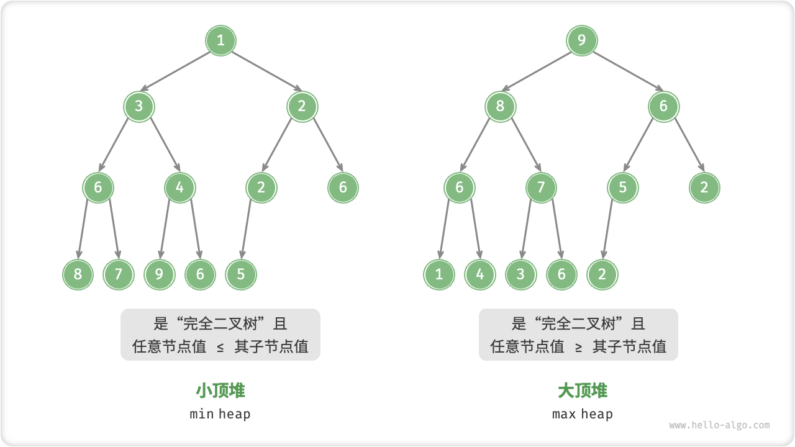
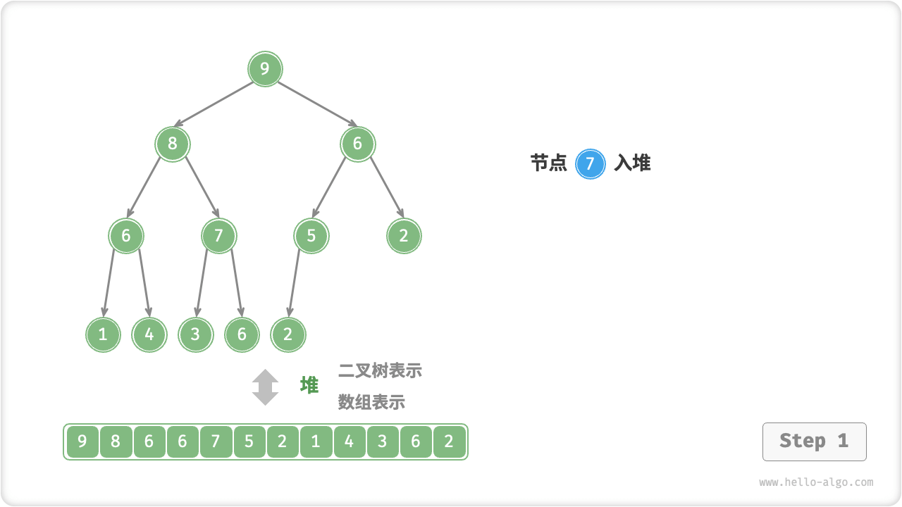
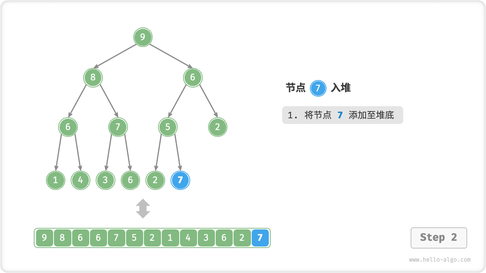
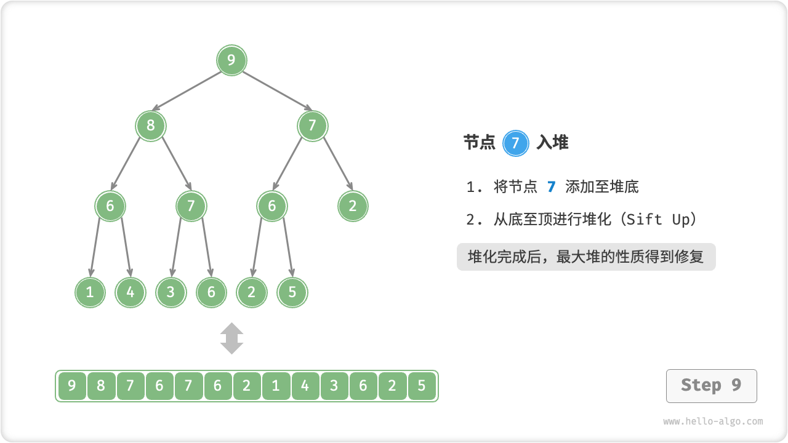
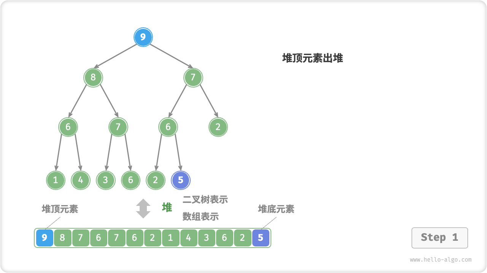
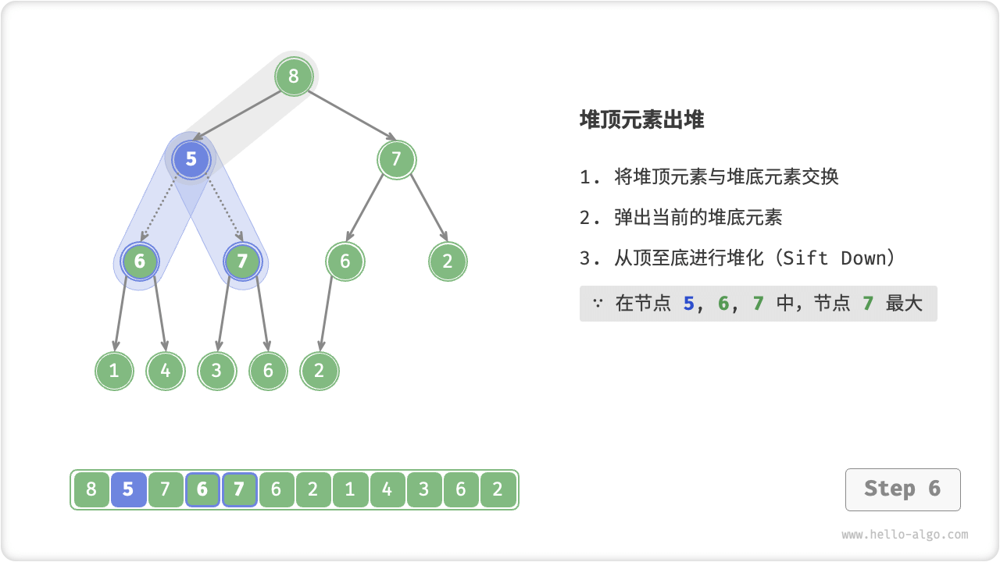
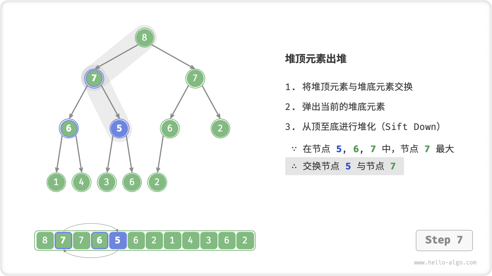
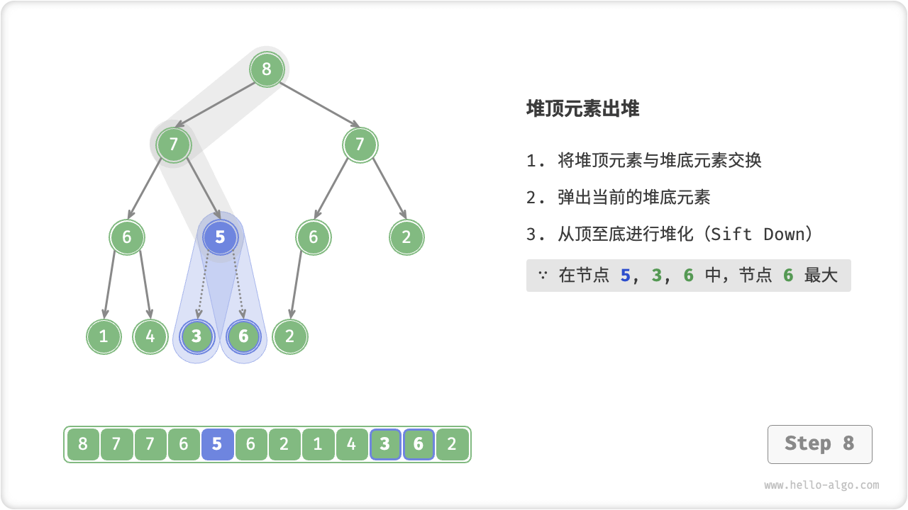

# Heap

A "heap heap" is a complete binary tree that satisfies certain conditions and can be categorized into two types as shown in the figure below.

- "max heap max heap": the value of any node $\geq$ the value of its children.
- "min heap": the value of any node $\leq$ the value of its children.



Heaps, as a special case of complete binary trees, have the following properties.

- The bottom node is filled to the left, and the nodes in the other levels are filled.
- We refer to the root node of a binary tree as the "top of the heap" and the rightmost node at the bottom as the "bottom of the heap".
- For max heaps (min heaps), the value of the top element of the heap (i.e., the root node) is the largest (smallest), respectively.

## Common Heap Operations

It should be noted that many programming languages provide a "priority queue priority queue", which is an abstract data structure defined as a queue with a priority ordering.

In fact, **the heap is often used to implement a priority queue, and the max heap is equivalent to the priority queue** where the elements go out of the queue in descending order. From a usage point of view, we can consider "priority queue" and "heap" as equivalent data structures. Therefore, this book does not make a special distinction between the two, the unified use of "heap" to name.

The common operations of the heap are shown in the table below, and the method names need to be determined by the programming language.

<p align="center"> Table <id> &nbsp; Efficiency of heap operations </p

| method name | description                                                                                            | time complexity |
| ----------- | ------------------------------------------------------------------------------------------------------ | --------------- |
| push()      | element into heap                                                                                      | $O(\log n)$     |
| pop()       | top element of heap out of heap                                                                        | $O(\log n)$     |  |
| peek()      | Access the top element of the heap (largest / smallest value for large / small top heap, respectively) | $O(1)$          |
| size()      | Get the number of elements in the heap                                                                 | $O(1)$          |
| isEmpty()   | Determine if heap is empty                                                                             | $O(1)$          |

In practice, we can directly use the heap class (or priority queue class) provided by the programming language.

!!! tip

    Similar to the sorting algorithms "smallest-to-largest" and "largest-to-smallest", we can modify the Comparator to convert between a min heap and a big heap. "max heap" by modifying the Comparator.

=== "Python"

    ```python title="heap.py"
    # Initialize the min heap.
    min_heap, flag = [], 1
    # Initialize the max heap
    max_heap, flag = [], -1

    # Python's heapq module implements min heaps by default.
    # Consider "taking the negative of an element" before adding it to the heap so that the size relationship is reversed, thus realizing a max heap.
    # In this example, flag = 1 corresponds to a min heap and flag = -1 corresponds to a max heap.

    # Element into the heap
    heapq.heappush(max_heap, flag * 1)
    heapq.heappush(max_heap, flag * 3)
    heapq.heappush(max_heap, flag * 2)
    heapq.heappush(max_heap, flag * 5)
    heapq.heappush(max_heap, flag * 4)

    # Get the top element of the heap
    peek: int = flag * max_heap[0] # 5

    # The top element of the heap goes out of the heap
    # Out of the heap elements will form a sequence from largest to smallest
    val = flag * heapq.heappop(max_heap) # 5
    val = flag * heapq.heappop(max_heap) # 4
    val = flag * heapq.heappop(max_heap) # 3
    val = flag * heapq.heappop(max_heap) # 2
    val = flag * heapq.heappop(max_heap) # 1

    # Get heap size
    size: int = len(max_heap)

    # Determine if the heap is empty
    is_empty: bool = not max_heap

    # Input the list and build the heap
    min_heap: list[int] = [1, 3, 2, 5, 4]
    heapq.heapify(min_heap)
    ```

=== "C++"

    ```cpp title="heap.cpp"
    /* Initialize heap */
    // Initialize the min heap.
    priority_queue<int, vector<int>, greater<int>> minHeap;
    // Initialize the max heap.
    priority_queue<int, vector<int>, less<int>> maxHeap;

    /* Element into heap */
    maxHeap.push(1);
    maxHeap.push(3);
    maxHeap.push(2);
    maxHeap.push(5);
    maxHeap.push(4);

    /* Get the top element of the heap */
    int peek = maxHeap.top(); // 5

    /* Top-of-heap element out of heap */
    // The elements out of the heap will form a sequence from largest to smallest
    maxHeap.pop(); // 5
    maxHeap.pop(); // 4
    maxHeap.pop(); // 3
    maxHeap.pop(); // 2
    maxHeap.pop(); // 1

    /* Get heap size */
    int size = maxHeap.size();

    /* Determine if the heap is empty */
    bool isEmpty = maxHeap.empty();

    /* Input list and build heap */
    vector<int> input{1, 3, 2, 5, 4};
    priority_queue<int, vector<int>, greater<int>> minHeap(input.begin(), input.end());
    ```

=== "Java"

    ```java title="heap.java"
    /* Initialize heap */
    // Initialize the min heap.
    Queue<Integer> minHeap = new PriorityQueue<>();
    // Initialize the max heap (just modify the Comparator with a lambda expression).
    Queue<Integer> maxHeap = new PriorityQueue<>((a, b) -> b - a);
   
    /* Element into heap */
    maxHeap.offer(1);
    maxHeap.offer(3);
    maxHeap.offer(2);
    maxHeap.offer(5);
    maxHeap.offer(4);
   
    /* Get the top element of the heap */
    int peek = maxHeap.peek(); // 5
   
    /* Top-of-heap element out of heap */
    // The elements out of the heap will form a sequence from largest to smallest
    peek = maxHeap.poll(); // 5
    peek = maxHeap.poll(); // 4
    peek = maxHeap.poll(); // 3
    peek = maxHeap.poll(); // 2
    peek = maxHeap.poll(); // 1
   
    /* Get heap size */
    int size = maxHeap.size();
   
    /* Determine if the heap is empty */
    boolean isEmpty = maxHeap.isEmpty();
   
    /* Input list and build heap */
    minHeap = new PriorityQueue<>(Arrays.asList(1, 3, 2, 5, 4));
    ```

=== "C#"

    ```csharp title="heap.cs"
    /* Initialize heap */
    // Initialize the min heap.
    PriorityQueue<int, int> minHeap = new();
    // Initialize the max heap (just modify the Comparator with a lambda expression).
    PriorityQueue<int, int> maxHeap = new(Comparer<int>.Create((x, y) => y - x));

    /* Element into heap */
    maxHeap.Enqueue(1, 1);
    maxHeap.Enqueue(3, 3);
    maxHeap.Enqueue(2, 2);
    maxHeap.Enqueue(5, 5);
    maxHeap.Enqueue(4, 4);

    /* Get the top element of the heap */
    int peek = maxHeap.Peek();//5

    /* Top-of-heap element out of heap */
    // The elements out of the heap will form a sequence from largest to smallest
    peek = maxHeap.Dequeue();  // 5
    peek = maxHeap.Dequeue();  // 4
    peek = maxHeap.Dequeue();  // 3
    peek = maxHeap.Dequeue();  // 2
    peek = maxHeap.Dequeue();  // 1

    /* Get heap size */
    int size = maxHeap.Count;

    /* Determine if the heap is empty */
    bool isEmpty = maxHeap.Count == 0;

    /* Input list and build heap */
    minHeap = new PriorityQueue<int, int>(new List<(int, int)> { (1, 1), (3, 3), (2, 2), (5, 5), (4, 4), });
    ```

=== "Go"

    ```go title="heap.go"
    // Integer max heaps can be built in Go by implementing heap.
    // Implementing heap.Interface requires also implementing sort.
    type intHeap []any

    // Push heap.Interface's method to push elements into the heap.
    func (h *intHeap) Push(x any) {
        // Push and Pop use the pointer receiver as an argument.
        // because they not only adjust the contents of the slice, but also modify the length of the slice.
        *h = append(*h, x.(int))
    }

    // Pop heap.Interface's method to pop the top-of-heap element.
    func (h *intHeap) Pop() any {
        // The heap elements are stored at the end.
        last := (*h)[len(*h)-1]
        *h = (*h)[:len(*h)-1]
        return last
    }

    // Methods of the Len sort.
    func (h *intHeap) Len() int {
        return len(*h)
    }

    // Methods of Less sort.
    func (h *intHeap) Less(i, j int) bool {
        // If implementing a min heap, it needs to be adjusted to less than sign
        return (*h)[i].(int) > (*h)[j].(int)
    }

    // Methods of the Swap sort.
    func (h *intHeap) Swap(i, j int) {
        (*h)[i], (*h)[j] = (*h)[j], (*h)[i]
    }

    // Top gets the top element of the heap.
    func (h *intHeap) Top() any {
        return (*h)[0]
    }

    /* Driver Code */
    func TestHeap(t *testing.T) {
        /* Initialize heap */
        // Initialize the max heap.
        maxHeap := &intHeap{}
        heap.Init(maxHeap)
        /* Element into heap */
        // Call the heap.
        heap.Push(maxHeap, 1)
        heap.Push(maxHeap, 3)
        heap.Push(maxHeap, 2)
        heap.Push(maxHeap, 4)
        heap.Push(maxHeap, 5)

        /* Get the top element of the heap */
        top := maxHeap.Top()
        fmt.Printf("The top element of the heap is %d\n", top)

        /* Top-of-heap element out of heap */
        // Call the heap.
        heap.Pop(maxHeap) // 5
        heap.Pop(maxHeap) // 4
        heap.Pop(maxHeap) // 3
        heap.Pop(maxHeap) // 2
        heap.Pop(maxHeap) // 1

        /* Get heap size */
        size := len(*maxHeap)
        fmt.Printf("The number of heap elements is %d\n", size)

        /* Determine if the heap is empty */
        isEmpty := len(*maxHeap) == 0
        fmt.Printf("Is heap empty %t\n", isEmpty)
    }
    ```

=== "Swift"

    ```swift title="heap.swift"
    // Swift does not provide a built-in Heap class.
    ```

=== "JS"

    ```javascript title="heap.js"
    // JavaScript does not provide a built-in Heap class.
    ```

=== "TS"

    ```typescript title="heap.ts"
    // TypeScript does not provide a built-in Heap class.
    ```

=== "Dart"

    ```dart title="heap.dart"
    // Dart does not provide a built-in Heap class
    ```

=== "Rust"

    ```rust title="heap.rs"
    use std::collections::BinaryHeap;
    use std::cmp::Reverse;

    /* Initialize heap */
    // Initialize the min heap.
    let mut min_heap = BinaryHeap::<Reverse<i32>>::new();
    // Initialize the max heap.
    let mut max_heap = BinaryHeap::new();

    /* Element into heap */
    max_heap.push(1);
    max_heap.push(3);
    max_heap.push(2);
    max_heap.push(5);
    max_heap.push(4);
   
    /* Get the top element of the heap */
    let peek = max_heap.peek().unwrap();  // 5

    /* Top-of-heap element out of heap */
    // The elements out of the heap will form a sequence from largest to smallest
    let peek = max_heap.pop().unwrap();   // 5
    let peek = max_heap.pop().unwrap();   // 4
    let peek = max_heap.pop().unwrap();   // 3
    let peek = max_heap.pop().unwrap();   // 2
    let peek = max_heap.pop().unwrap();   // 1

    /* Get heap size */
    let size = max_heap.len();

    /* Determine if the heap is empty */
    let is_empty = max_heap.is_empty();

    /* Input list and build heap */
    let min_heap = BinaryHeap::from(vec![Reverse(1), Reverse(3), Reverse(2), Reverse(5), Reverse(4)]);
    ```

=== "C"

    ```c title="heap.c"
    // C does not provide a built-in Heap class
    ```

=== "Zig"

    ```zig title="heap.zig"

    ```

## Heap Implementation

The following implementation is a max heap. To convert it to a min heap, simply invert all size logic judgments (e.g., replace $\geq$ with $\leq$). Interested readers can implement it by themselves.

### Heap Storage And Representation

We learned in the binary tree chapter that complete binary trees are well suited to be represented by arrays. Since a heap is exactly a complete binary tree, **we will use an array to store the heap**.

When an array is used to represent a binary tree, the elements represent the node values and the indexes represent the position of the nodes in the binary tree. **The node pointers are realized by the index mapping formula**.

As shown in the figure below, given an index $i$, its left-child node index is $2i + 1$, its right-child node index is $2i + 2$, and its parent node index is $(i - 1) / 2$ (rounded down). When the index is out of bounds, it means empty node or node does not exist.


We can encapsulate the index mapping formula into a function for easy subsequent use.

```src
[file]{my_heap}-[class]{max_heap}-[func]{parent}
```

### Accessing The Top Element Of The Heap

The top element of the heap is the root node of the binary tree, which is the first element of the list.

```src
[file]{my_heap}-[class]{max_heap}-[func]{peek}
```

### Element Into The Heap

Given the element `val` , we first add it to the bottom of the heap. After the addition, the conditions under which the heap was founded may have been broken since val may be larger than any other element in the heap. Therefore, **needs to repair each node on the path from the insertion node to the root node**, an operation known as 'heapify heapify'.

**Consider performing heapify from bottom to top starting from the entry node**. As shown in the figure below, we compare the values of the insertion node with its parent node and swap them if the insertion node is larger. This operation is then continued by repairing each node in the heap from bottom to top until it ends when the root node is crossed or when a node is encountered that does not need to be swapped.

=== "<1>"
    

=== "<2>"
    

=== "<3>"
    

=== "<4>"
    

=== "<5>"
    

=== "<6>"
    

=== "<7>"
    

=== "<8>"
    

=== "<9>"
    

Let the total number of nodes be $n$ , then the height of the tree node is $O(\log n)$ . It can be seen that the maximum number of rounds of the heapify operation is $O(\log n)$ , **and the time complexity of the element into heap operation is $O(\log n)$** .

```src
[file]{my_heap}-[class]{max_heap}-[func]{sift_up}
```

### The Top Element Of The Heap Is Out Of The Heap

The top element of the heap is the root node of the binary tree, i.e. the first element of the list. If we directly remove the first element from the list, the indexes of all nodes in the binary tree will change, which will make subsequent repair using heapify difficult. In order to minimize the changes in the indexes of the elements, we use the following procedure.

1. Swap the top element of the heap with the bottom element of the heap (i.e., swap the root node with the rightmost leaf node).
2. When the swap is complete, the bottom of the heap is removed from the list (note that since it has been swapped, it is the original top element of the heap that is actually removed).
3. Starting from the root node, **performs heapify from top to bottom**.

As shown in the figure below, **"top-to-bottom heapify" operates in the opposite direction of "bottom-to-top heapify"**we compare the value of the root node with the values of its two child nodes, and exchange the biggest We compare the value of the root node with the values of its two children, and exchange the largest child node with the root node. We then loop through this operation until we cross a leaf node or encounter a node that does not need to be exchanged.

=== "<1>"
    

=== "<2>"
    

=== "<3>"
    

=== "<4>"
    

=== "<5>"
    

=== "<6>"
    

=== "<7>"
    

=== "<8>"
    

=== "<9>"
    

=== "<10>"
    

Similar to the element-in operation, the top-of-heap element-out operation has a time complexity of $O(\log n)$ .

```src
[file]{my_heap}-[class]{max_heap}-[func]{sift_down}
```

## Common Applications Of Heaps

- **Priority Queue**: heaps are often used as the preferred data structure to implement priority queues, with time complexity of $O(\log n)$ for both in-queue and out-queue operations and $O(n)$ for queue-building operations, which are very efficient.
- **Heap sort**: given a set of data, we can build a heap with them and then keep performing element-out operations to get ordered data. However, we usually implement heap sorting using a more elegant approach, as detailed in the subsequent chapter on heap sorting.
- **Getting the largest $k$ elements**: this is a classic algorithmic problem and also a typical application, e.g., selecting the top 10 hot news as a microblogging hot search, selecting the top 10 selling products, etc.
