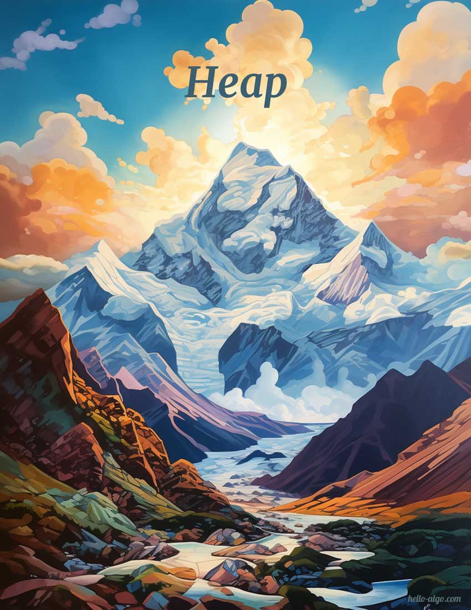

# Heap

{ width="600" }

!!! abstract

    The heaps are like the peaks of a mountain; they are layered and undulating and have different shapes.
   
    Every mountain has its height and the highest peaks are always the first to come into view.
