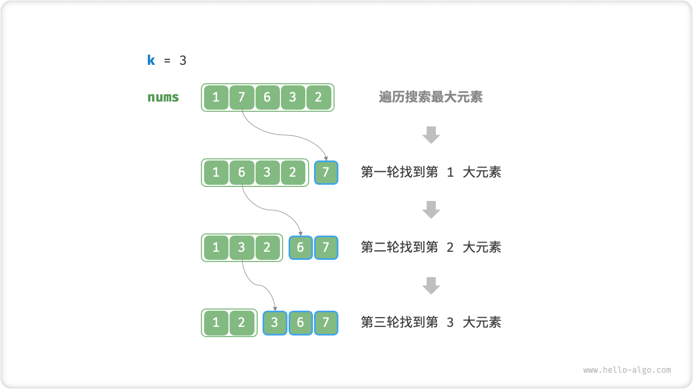
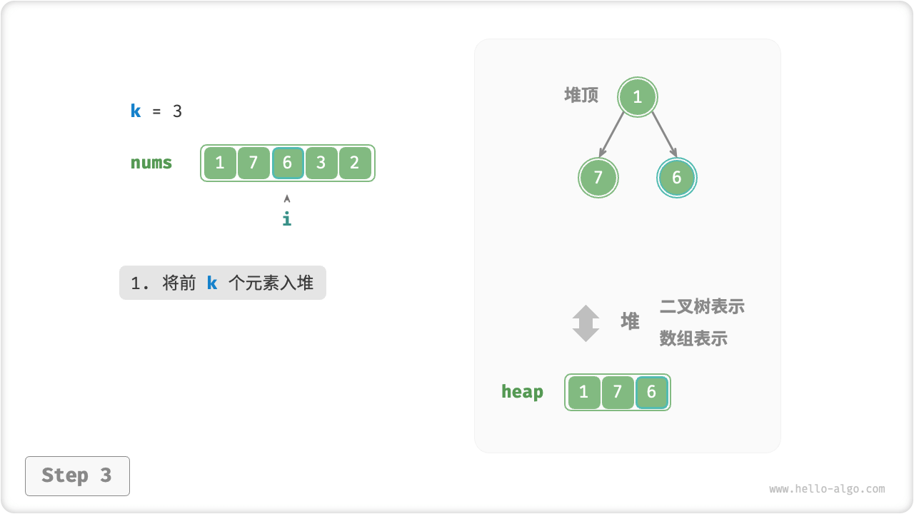
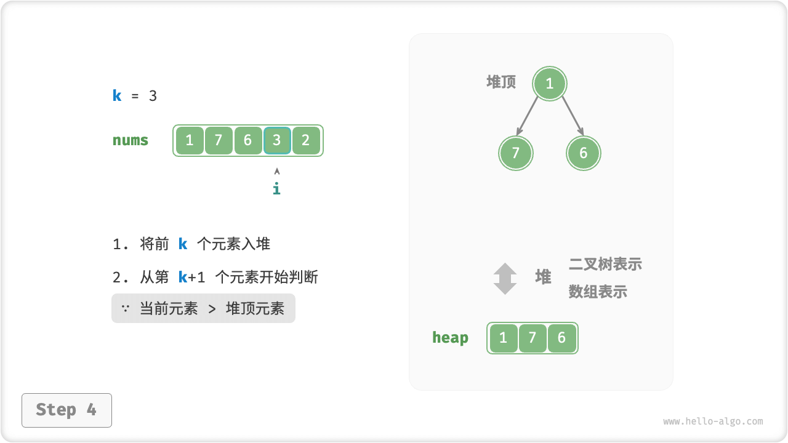
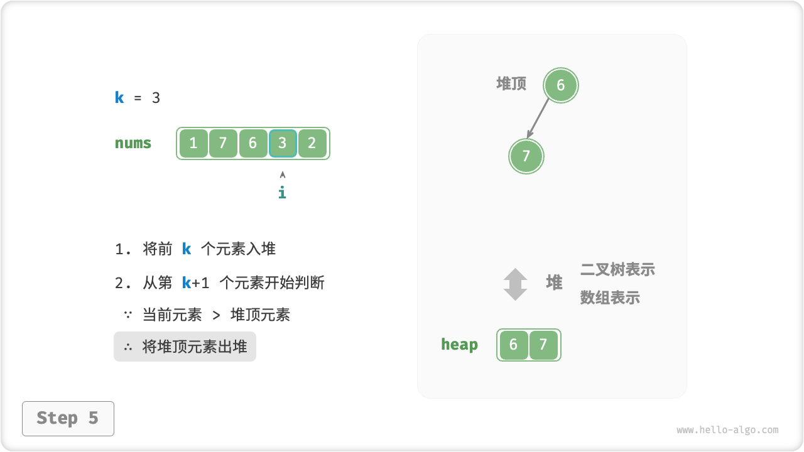
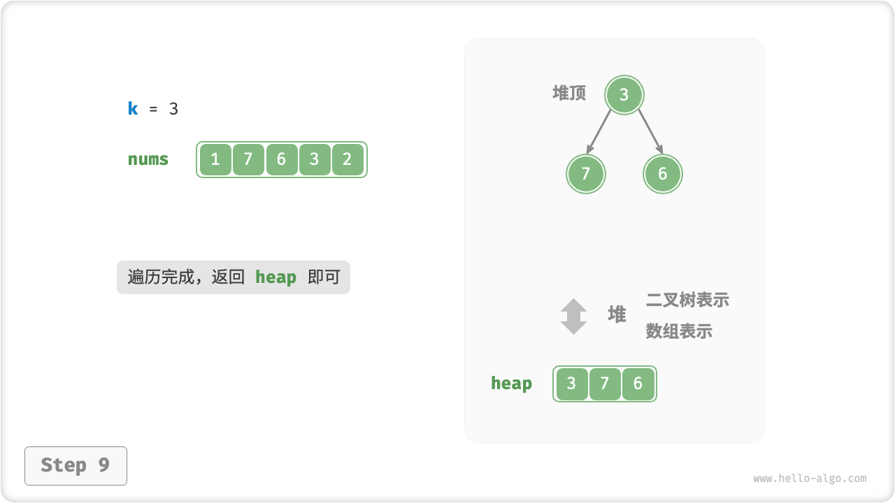

# Top-K Problem

!!! question

    Given an unordered array of length $n$ `nums` , return the first $k$ largest element in the array.

For this problem, we present two solutions that are more straightforward in their thinking, followed by the more efficient heap solution.

## Method 1: Iterate Through The Selection

We can perform the $k$ rounds of traversal shown in the figure below, extracting the $1$, $2$, $\dots$, and $k$ largest element in each round, respectively, with a time complexity of $O(nk)$ .

This method is only applicable to the case of $k \ll n$, because when $k$ is close to $n$, its time complexity tends to $O(n^2)$, which is very time-consuming.



!!! tip

    When $k = n$, we get a complete ordered sequence, which is equivalent to a "selection sort" algorithm.

## Method 2: Sorting

As shown in the figure below, we can sort the array `nums` and then return the rightmost $k$ elements with a time complexity of $O(n \log n)$ .

Obviously, this method "overshoots" the task, since we only need to find the largest $k$ element and not sort the others.


## Method 3: Heap

We can solve the Top-K problem more efficiently based on heaps, the process is shown in the figure below.

1. Initialize a min heap with the smallest top element.
2. The first $k$ elements of the array are first put into the heap in order.
3. Starting from the $k + 1$th element, if the current element is larger than the top element of the heap, then the top element of the heap is taken out of the heap and the current element is put into the heap.
4. After the traversal is complete, it is the largest $k$ element that is kept in the heap.

=== "<1>"
    

=== "<2>"
    

=== "<3>"
    

=== "<4>"
    

=== "<5>"
    

=== "<6>"
    

=== "<7>"
    

=== "<8>"
    

=== "<9>"
    

A total of $n$ rounds of heap entry and heap exit are performed, and the maximum length of the heap is $k$ , so the time complexity is $O(n \log k)$ . The method is very efficient, and the time complexity tends to $O(n)$ when $k$ is small, and does not exceed $O(n \log n)$ when $k$ is large.

In addition, this method is suitable for dynamic data streaming usage scenarios. We can continuously maintain the elements in the heap as we keep adding data, thus enabling dynamic updates of up to $k$ elements.

```src
[file]{top_k}-[class]{}-[func]{top_k_heap}
```
