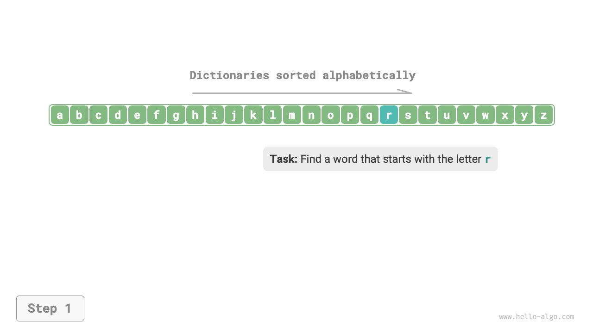
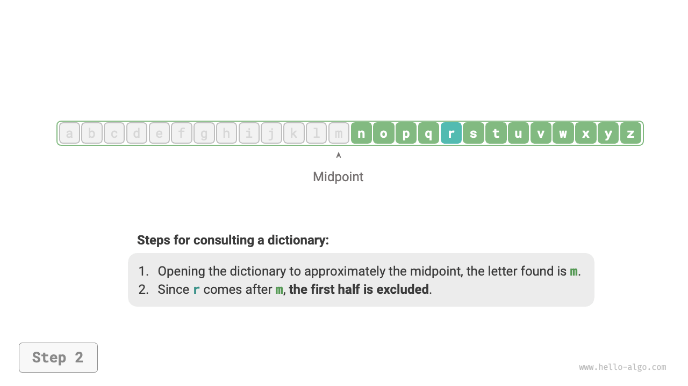
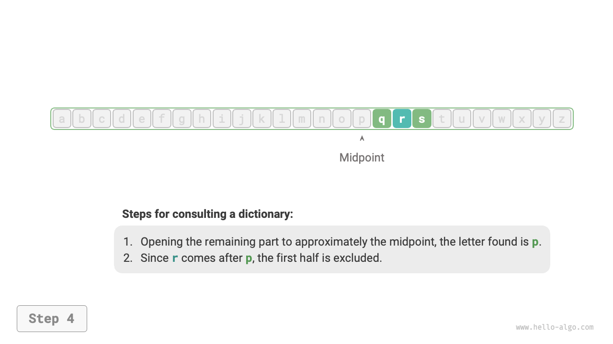
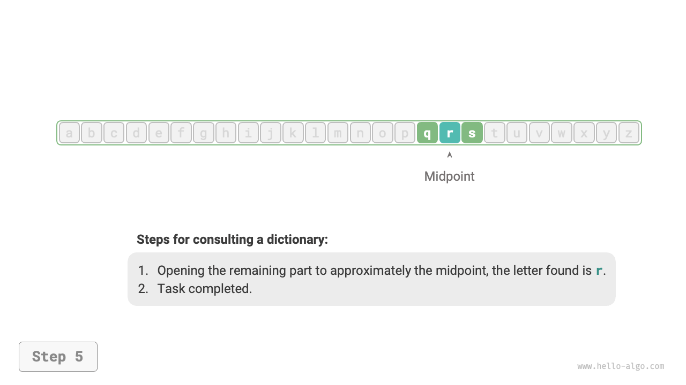
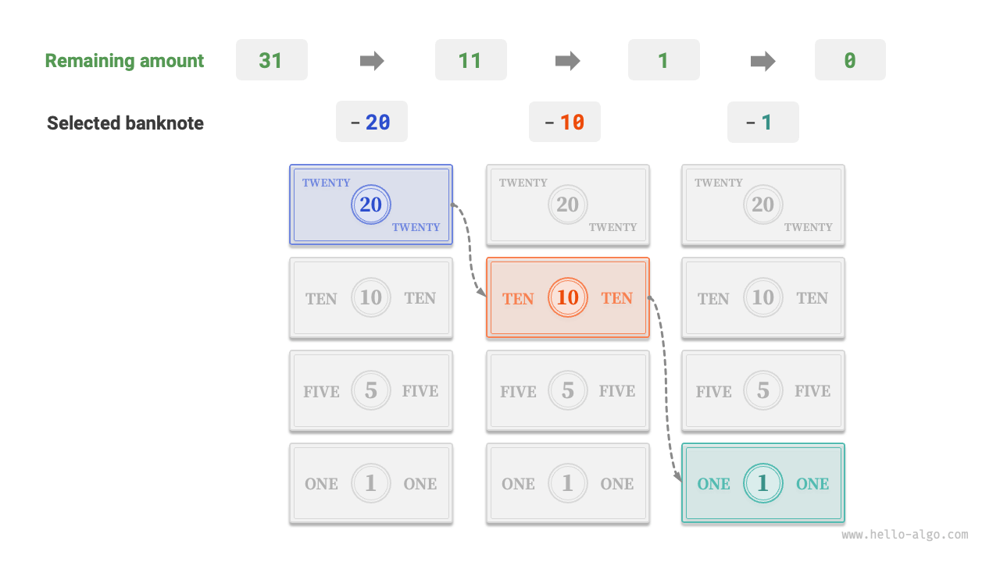

# Algorithms Are Everywhere

When we hear the word "algorithm", we naturally think of mathematics. However, many algorithms do not involve complex mathematics but rely more on basic logic, which is ubiquitous in our daily lives.

Before we formally discuss algorithms, an interesting fact is worth sharing: **you have already learned many algorithms unconsciously and have become accustomed to applying them in your daily life**. Below, I will give a few specific examples to prove this point.

**Example 1: Looking Up a Dictionary**. In an English dictionary, words are listed alphabetically. Suppose we're searching for a word that starts with the letter $r$. This is typically done in the following way:

1. Open the dictionary around its midpoint and note the first letter on that page, assuming it to be $m$.
2. Since $r$ comes after $m$ in the alphabet, we exclude the first half of the dictionary and narrow the search to the second half.
3. Iterate steps `1.` and `2.` until you find the page where the word begins with the letter $r$.

=== "<1>"
    

=== "<2>"
    

=== "<3>"
    

=== "<4>"
    

=== "<5>"
    

The skill of looking up a dictionary, essential for elementary school students, is actually the renowned binary search algorithm. Through the lens of data structures, we can view the dictionary as a sorted "array"; while from an algorithmic perspective, the series of operations in looking up a dictionary can be seen as "binary search".

**Example 2: Organizing Playing Cards**. When playing cards, we need to arrange the cards in ascending order each game, as shown in the following process.

1. Divide the playing cards into "ordered" and "unordered" parts, assuming initially that the leftmost card is already ordered.
2. Take out a card from the unordered part and insert it into the correct position in the ordered part; once completed, the leftmost two cards will be in an ordered sequence.
3. Continue the loop described in step `2.`, each iteration involving insertion of one card from the unordered segment into the ordered portion, until all cards are appropriately ordered.

The above method of organizing playing cards is essentially the "insertion sort" algorithm, which is very efficient for small datasets. Many programming languages' sorting library functions include insertion sort.

**Example 3: Making Change**. Suppose we buy goods worth $69$ yuan at a supermarket and give the cashier $100$ yuan, then the cashier needs to give us $31$ yuan in change. They would naturally complete the thought process as shown below.

1. The options are currencies smaller than $31$, including $1$, $5$, $10$, and $20$.
2. Take out the largest $20$ from the options, leaving $31 - 20 = 11$.
3. Take out the largest $10$ from the remaining options, leaving $11 - 10 = 1$.
4. Take out the largest $1$ from the remaining options, leaving $1 - 1 = 0$.
5. Complete the change-making, with the solution being $20 + 10 + 1 = 31$.

In the aforementioned steps, at each stage, we make the optimal choice (utilizing the highest denomination possible), ultimately deriving at a feasible change-making approach. From the perspective of data structures and algorithms, this approach is essentially a "greedy" algorithm.

From preparing a dish to traversing interstellar realms, virtually every problem-solving endeavor relies on algorithms. The emergence of computers enables us to store data structures in memory and write code to call CPUs and GPUs to execute algorithms. Consequently, we can transfer real-life predicaments to computers, efficiently addressing a myriad of complex issues.

!!! tip

    If concepts such as data structures, algorithms, arrays, and binary search still seem somewhat obsecure, I encourage you to continue reading. This book will gently guide you into the realm of understanding data structures and algorithms.
