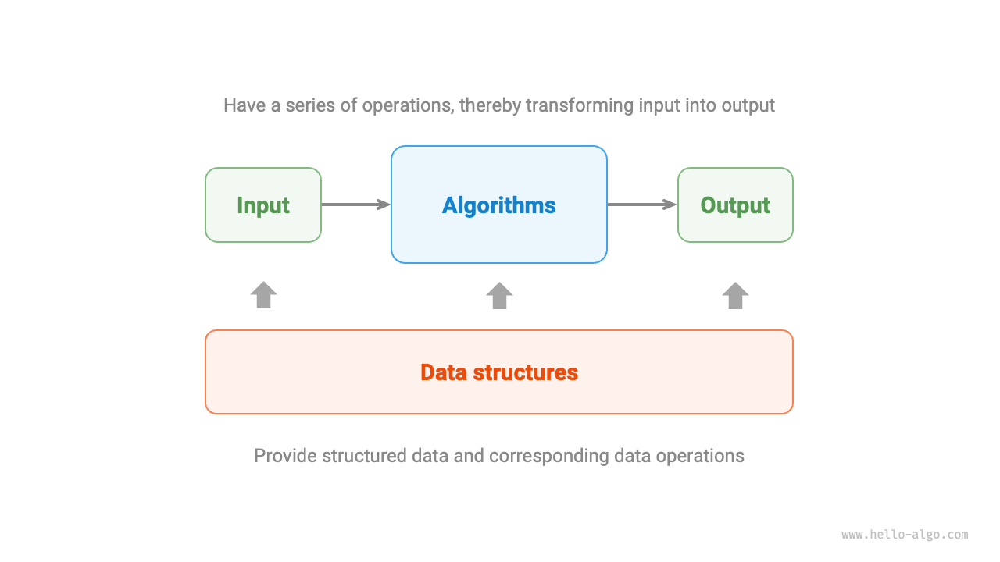

# What is Algorithms

## Algorithm Definition

An "algorithm" is a set of instructions or operational steps to solve a particular problem in a limited time, which has the following characteristics.

- Problems are well defined and contain clear definitions of inputs and outputs.
- Feasible and able to be accomplished with limited steps, time and memory space.
- Each step has a defined meaning and the output is always the same for the same inputs and operating conditions.

## Data Structure Definitions

"A data structure is a way of organizing and storing data in a computer and has the following design goals.

- Space occupation is minimized to save computer memory.
- Data manipulation is as fast as possible, covering data access, additions, deletions, updates, etc.
- Provide concise data representation and logical information in order to make the algorithm work efficiently.

**Data structure design is a process full of tradeoffs**. If you want to improve in one area, you often need to compromise in another. Two examples are given below.

- Compared to arrays, linked lists are more convenient for data addition and deletion operations, but at the expense of data access speed.
- Graphs provide richer logical information compared to linked lists, but take up more memory space.

## Relationship Between Data Structures And Algorithms

As shown in the figure below, data structure and algorithm are highly correlated and tightly integrated in the following three ways.

- Data structures are the cornerstone of algorithms. Data structures provide algorithms with structured storage of data, and methods for manipulating the data.
- Algorithms are the arena where data structures come into play. Data structures by themselves only store information about the data, and it is in combination with an algorithm that a particular problem can be solved.
- Algorithms can often be implemented based on different data structures, but the efficiency of execution can vary greatly, and choosing the right data structure is key.

Data structures and algorithms are like the building blocks shown in the figure below. A set of building blocks, in addition to containing many parts, comes with detailed assembly instructions. By following the instructions step by step, we can assemble a beautiful model of the blocks.

The detailed correspondence between the two is shown in the table below.

 Table <id> &nbsp; Analogizing Data Structures and Algorithms to Building Blocks 

| Data Structures and Algorithms | Building Blocks                                                               |
| ------------------------------ | ----------------------------------------------------------------------------- |
| Input data                     | Unassembled blocks                                                            |
| data structure                 | building block organization, including shape, size, and connections           |
| algorithms                     | a series of operational steps to put the blocks together into the target form |
| Output Data                    | Building Block Models                                                         |

It is worth stating that data structures and algorithms are independent of programming languages. Because of this, this book is able to provide implementations in multiple programming languages.

!!! tip "agreed upon acronym"

    In practice, we usually refer to "data structures and algorithms" as "algorithms". For example, the well-known LeetCode algorithm question actually examines both data structure and algorithm.
