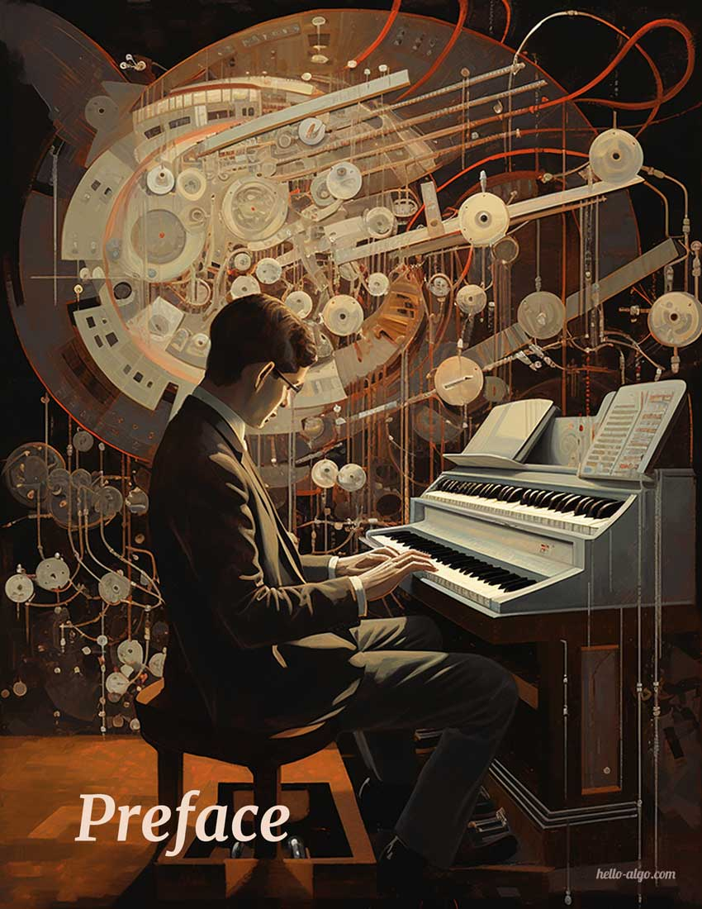

# 第 0 章 &nbsp; Preface

{ width="600" }{ class="cover-image" }

!!! abstract

    Algorithms are like a beautiful symphony, with each line of code flowing like a rhythm.
   
    May this book ring softly in your head, leaving a unique and profound melody.

## 本章内容

- [0.1 &nbsp; The Book](https://www.hello-algo.com/chapter_preface/about_the_book/)
- [0.2 &nbsp; How to Read](https://www.hello-algo.com/chapter_preface/suggestions/)
- [0.3 &nbsp; Summary](https://www.hello-algo.com/chapter_preface/summary/)
