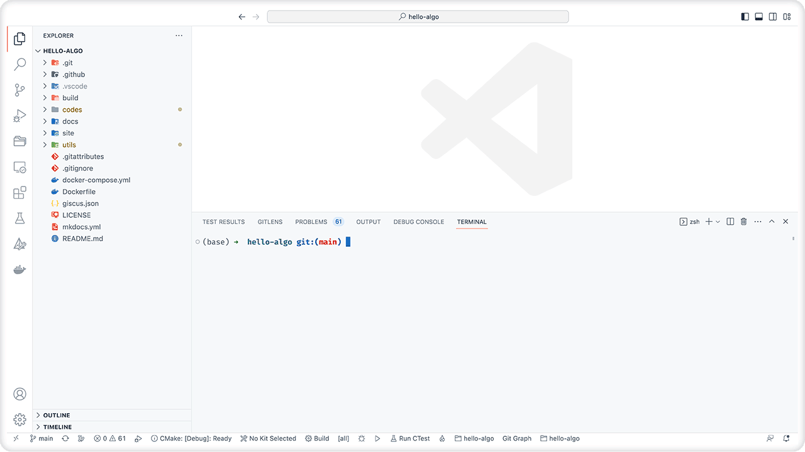
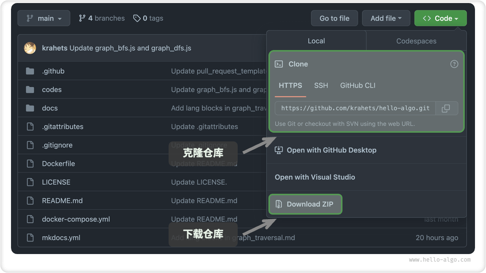
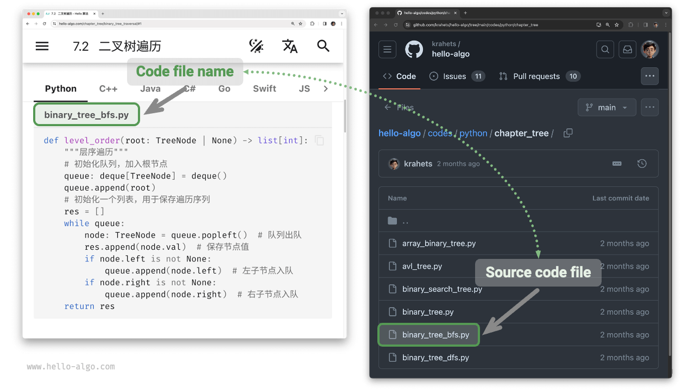
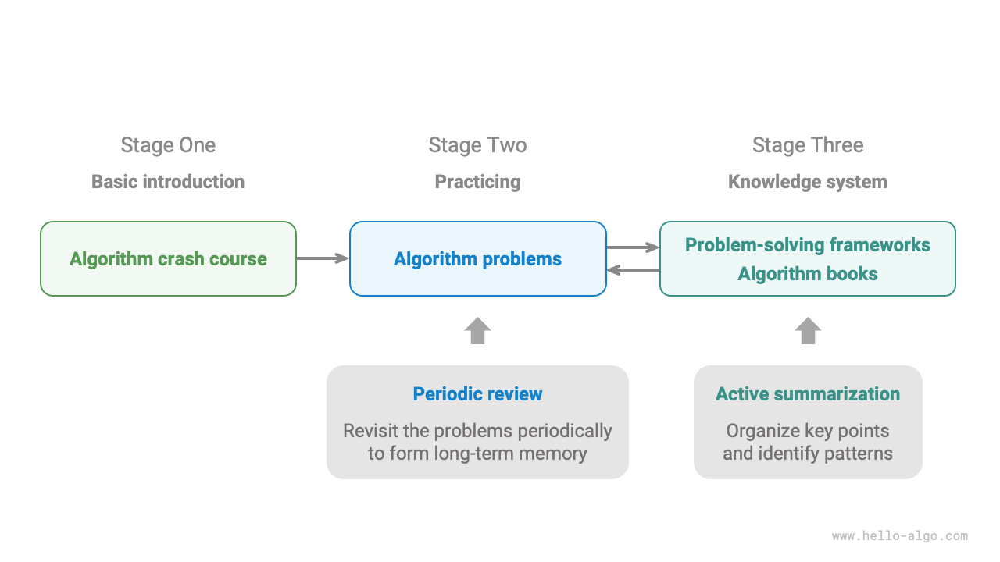

# How To Read

!!! tip

    It is recommended that you go through this section to get the best reading experience.

## Conventions Of Writing Style

- Chapters marked with an asterisk (`*``) after the title are supplementary and more challenging. If you have limited time, it is advisable to skip them.
- Key technical terms and their English equivalents are enclosed in `「 」` brackets, for example, `「array」`. It's advisable to familiarize yourself with these for better comprehension of technical texts.
- Proprietary terms and words with specific meanings are indicated with “quotation marks” to avoid ambiguity.
- **Bolded text** Indicates key content or summary statements, which deserve special attention.
- When it comes to terms that are inconsistent between programming languages, this book follows Python, for example using $\text{None}$ to mean "empty".
- This book partially abandons the specification of annotations in programming languages in exchange for a more compact layout of the content. Comments are categorized into three types: title comments, content comments, and multiline comments.

=== "Python"

    ```python title=""
    """Header comments for labeling functions, classes, test samples, etc""""
   
    # Content comments for details
   
    """
    Multiline
    comments
    """
    ```

=== "C++"

    ```cpp title=""
    /* Header comments for labeling functions, classes, test samples, etc */
   
    // Content comments for details.
   
    /**
     * Multiline
     * comments
     */
    ```

=== "Java"

    ```java title=""
    /* Header comments for labeling functions, classes, test samples, etc */
   
    // Content comments for details.
   
    /**
     * Multiline
     * comments
     */
    ```

=== "C#"

    ```csharp title=""
    /* Header comments for labeling functions, classes, test samples, etc */
   
    // Content comments for details.
   
    /**
     * Multiline
     * comments
     */
    ```

=== "Go"

    ```go title=""
    /* Header comments for labeling functions, classes, test samples, etc */
   
    // Content comments for details.
   
    /**
     * Multiline
     * comments
     */
    ```

=== "Swift"

    ```swift title=""
    /* Header comments for labeling functions, classes, test samples, etc */
   
    // Content comments for details.
   
    /**
     * Multiline
     * comments
     */
    ```

=== "JS"

    ```javascript title=""
    /* Header comments for labeling functions, classes, test samples, etc */
   
    // Content comments for details.
   
    /**
     * Multiline
     * comments
     */
    ```

=== "TS"

    ```typescript title=""
    /* Header comments for labeling functions, classes, test samples, etc */
   
    // Content comments for details.
   
    /**
     * Multiline
     * comments
     */
    ```

=== "Dart"

    ```dart title=""
    /* Header comments for labeling functions, classes, test samples, etc */
   
    // Content comments for details.
   
    /**
     * Multiline
     * comments
     */
    ```

=== "Rust"

    ```rust title=""
    /* Header comments for labeling functions, classes, test samples, etc */

    // Content comments for details.
   
    /**
     * Multiline
     * comments
     */
    ```

=== "C"

    ```c title=""
    /* Header comments for labeling functions, classes, test samples, etc */
   
    // Content comments for details.
   
    /**
     * Multiline
     * comments
     */
    ```

=== "Zig"

    ```zig title=""
    // Header comments for labeling functions, classes, test samples, etc
   
    // Content comments for details.
   
    // Multiline
    // comments
    ```

## Efficient Learning via Animated and Graphical Illustrations

Compared with text, videos and pictures have a higher density of information and are more structured, making them easier to understand. In this book, **essential and complex concepts are primarily presented through animations and illustrations**, while the text serves as an explanation and supplement to the animations and graphs.

When encountering sections in this book that include animations or graphical illustrations, as exemplified below, **please use the visual elements as the primary source and the text as a supplement. Synthesize both sources to understand the content**.


## Deepen Understanding through Code Practice

The accompanying code for this book is hosted in the [GitHub repository](https://github.com/krahets/hello-algo). As shown in the figure below, **the source code is accompanied by test samples that can be run with a single click**.

If time permits, **it is advisable to manually replicate the code examples**. For those with limited study time, at a minimum, thoroughly review and execute all code examples provided.

The process of writing code is often more rewarding than reading it. **Learning by doing is the real way to learn**.



Setting up to run the code involves three main steps.

**Step 1: Install a Local Programming Environment**. Follow the [tutorial](https://www.hello-algo.com/chapter_appendix/installation/) in the appendix for installation, or skip this step if already installed.

**Step 2: Clone or Download the Code Repository**. Visit the [GitHub Repository](https://github.com/krahets/hello-algo).

If [Git](https://git-scm.com/downloads) is installed, use the following command to clone the repository:

```shell
git clone https://github.com/krahets/hello-algo.git
```

Of course, you can also click the "Download ZIP" button at the location shown in the figure below to directly download the code as a compressed ZIP file. Then, you can simply extract it locally.



**Step 3: Run the source code**. As shown in the figure below, for the code block labeled with the file name at the top, we can find the corresponding source code file in the `codes` folder of the repository. The source code files can be executed with a single click, which will help you save unnecessary debugging time and allow you to focus on learning content.



## Growing Together In Questioning And Discussion

While reading this book, please don't skip over the points that you didn't learn. **Feel free to post your questions in the comment section**. We will be happy to answer them and can usually respond within two days.

As you can see in the figure below, each chapter has a comment section at the bottom. I hope you'll pay more attention to the comments section. On the one hand, you can learn about the problems others have encountered, which can help you identify gaps in your knowledge and inspire deeper thinking. On the other hand, we expect you to generously answer other readers' questions, share your insights, and help others improve.


## Algorithm Learning Path

Overall, we can divide the process of learning data structures and algorithms into three stages.

1. **Introduction to Algorithms**. We need to familiarize ourselves with the characteristics and usage of various data structures and learn about the principles, processes, uses, and efficiency of different algorithms.
2. **Practicing Algorithm Problems**. It is recommended to start from popular problems, such as [Sword to Offer](https://leetcode.cn/studyplan/coding-interviews/) and [LeetCode Hot 100](https://leetcode.cn/studyplan/top-100- liked/), and accumulate at least 100 questions to familiarize yourself with mainstream algorithmic problems. Forgetfulness can be a challenge when you start practicing, but rest assured that this is normal. We can follow the "Ebbinghaus Forgetting Curve" to review the questions, and usually after 3-5 rounds of repetitions, we will be able to memorize them.
3. **Building the knowledge system**. In terms of learning, we can read algorithm column articles, solution frameworks, and algorithm textbooks to continuously enrich the knowledge system. In terms of practicing, we can try advanced strategies, such as categorizing by topic, multiple solutions for a single problem,  and one solution for multiple problems, etc. Insights on these strategies can be found in various communities.

As shown in the figure below, this book mainly covers "Phase 1" and is designed to help you start Phase 2 and 3 more efficiently.


