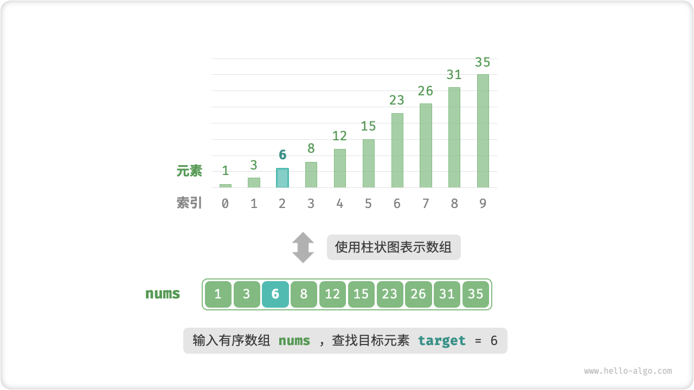
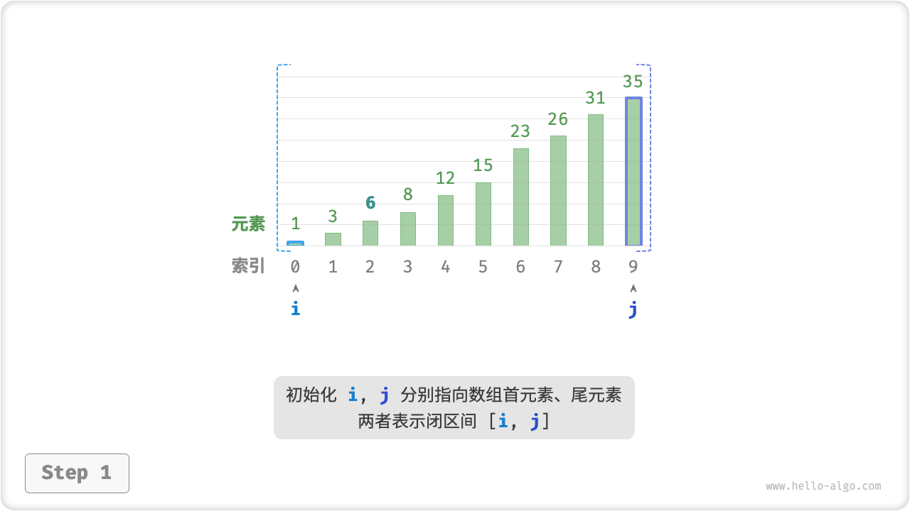
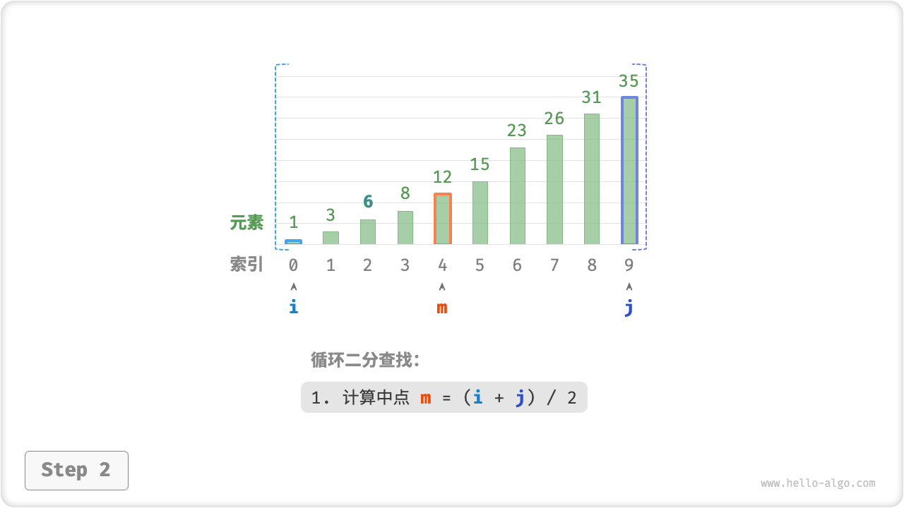
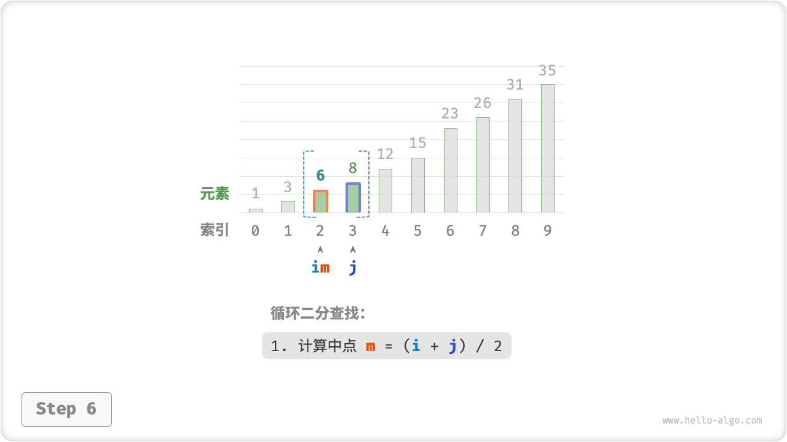

# Binary Search

"Binary search is an efficient searching algorithm based on divide and conquer strategy. It utilizes the ordered nature of data to reduce the search range by half in each round until the target element is found or the search interval is empty.

!!! question

    Given an array `nums` of length $n$ with elements in descending order, the array contains no duplicate elements. Find and return the index of the element `target` in the array. If the array does not contain the element, return $-1$.



As shown in the figure below, we first initialize pointers $i = 0$ and $j = n - 1$ , pointing to the first and last elements of the array, representing the search interval $[0, n - 1]$ . Note that the middle bracket denotes the closed interval, which contains the boundary values themselves.

Next, loop through the following two steps.

1. Calculate the midpoint index $m = \lfloor {(i + j) / 2} \rfloor$ , where $\lfloor \: \rfloor$ denotes the downward rounding operation.
2. To determine the size relationship between `nums[m]` and `target`, there are three cases.
    1. When `nums[m] < target`, it means that `target` is in the interval $[m + 1, j]$, so execute $i = m + 1$ .
    2. When `nums[m] > target` , it means that `target` is in the interval $[i, m - 1]$ , so execute $j = m - 1$ .
    3. When `nums[m] = target`, it means that `target` is found, so it returns the index $m$.

If the array does not contain the target element, the search interval is eventually reduced to empty. This returns $-1$ .

=== "<1>"
    

=== "<2>"
    

=== "<3>"
    

=== "<4>"
    

=== "<5>"
    

=== "<6>"
    

=== "<7>"
    

It is worth noting that since $i$ and $j$ are both of type `int`, **so $i + j$ may be out of the range of values of type `int`**. In order to avoid large numbers crossing the boundary, we usually use the formula $m = \lfloor {i + (j - i) / 2} \rfloor$ to calculate the midpoint.

```src
[file]{binary_search}-[class]{}-[func]{binary_search}
```

**Time complexity $O(\log n)$** : In a bisection loop, the interval is reduced by half in each round and the number of loops is $\log_2 n$ .

**Space complexity $O(1)$** : Pointers $i$ and $j$ use constant size space.

## Interval Representation

In addition to the double-closed intervals mentioned above, a common interval representation is the "left-closed-right-open" interval, defined as $[0, n)$, where the left edge contains itself and the right edge does not contain itself. In this representation, the interval $[i, j]$ is empty when $i = j$.

We can implement a binary search algorithm with the same functionality based on this representation.

```src
[file]{binary_search}-[class]{}-[func]{binary_search_lcro}
```

As shown in the figure below, the initialization, loop condition and interval reduction operations of the binary search algorithm are different in the two interval representations.

Since both the left and right edges of the "double-closed interval" representation are defined as closed intervals, the narrowing of the interval by the pointers $i$ and $j$ is also symmetric. This is less prone to errors, **so the "double-closed interval" style is generally recommended**.


## Strengths And Limitations

Binary search has better performance in both time and space.

- Binary search is time efficient. The logarithmic order has a significant time complexity advantage in large data sizes. For example, when the data size $n = 2^{20}$, linear search requires $2^{20} = 1048576$ rounds of cycles, while binary search requires only $\log_2 2^{20} = 20$ rounds of cycles.
- Binary search requires no extra space. Compared to searching algorithms that require extra space (such as hash search), binary search is more space-efficient.

However, binary search is not suitable for all cases, mainly for the following reasons.

- Binary search only works with ordered data. If the input data is unordered, it is not worthwhile to specialize in sorting in order to use binary search. This is because the time complexity of the sorting algorithm is usually $O(n \log n)$ , which is higher than both linear and binary search. For scenarios where elements are frequently inserted into specific locations to keep the array organized, the time complexity is $O(n)$ , which is also very expensive.
- Binary search is only applicable to arrays. Binary search requires jumping (non-contiguous) access to elements, and performing jumping accesses in a linked list is inefficient, so it is not suitable for application to linked lists or data structures based on linked list implementations.
- Linear lookup performs better with small data size. In linear search, only 1 judgment operation is needed in each round, while in binary search, 1 addition, 1 division, 1~3 judgment operations, 1 addition (subtraction), a total of 4~6 unit operations are needed; therefore, when the amount of data $n$ is small, linear search is faster than binary search.
