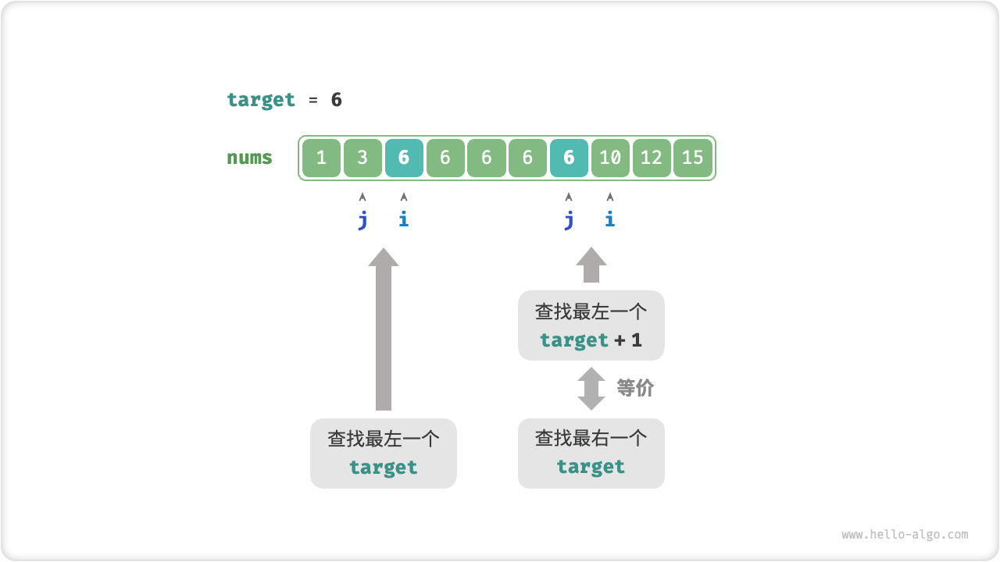
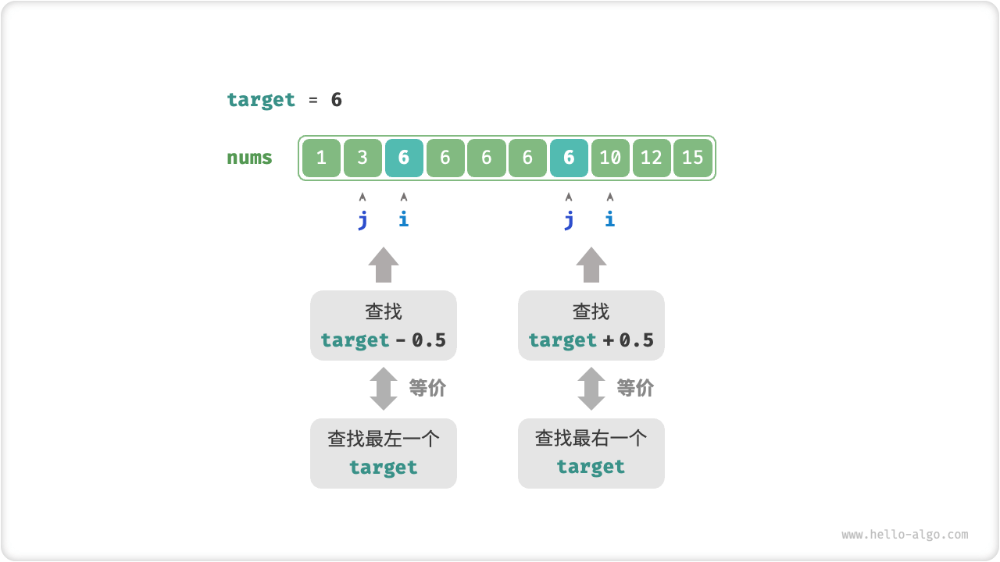

# Binary Search Edges

## Find The Left Edge

!!! question

    Given an ordered array `nums` of length $n$, the array may contain duplicate elements. Return the index of the leftmost element of the array, `target`. If the array does not contain that element, return $-1$.

Recall the binary search for the insertion point, after the search is complete $i$ points to the leftmost `target` , **so finding the insertion point is essentially finding the index of the leftmost `target`**.

Consider a function that implements finding the left edge by finding the insertion point. Note that the array may not contain `target` , a situation that could lead to either of the following two results.

- Index of the insertion point $i$ Out of bounds.
- The elements `nums[i]` and `target` are not equal.

In both cases, just return $-1$.

```src
[file]{binary_search_edge}-[class]{}-[func]{binary_search_left_edge}
```

## Find The Right Edge

So how do you find the rightmost `target`? The most direct way is to modify the code to replace the pointer shrinking operation in the case of `nums[m] == target`. Code is omitted here, interested students can implement their own.

Below we describe two more tricky methods.

### Duplicate Lookup Left Boundaries

In fact, we can use the function that finds the leftmost element to find the rightmost element by **converting Find Rightmost One `target` to Find Leftmost One `target + 1`**.

As shown in the figure below, when the search is done, the pointer $i$ points to the leftmost `target + 1` (if it exists), and $j$ points to the rightmost `target` , **so return $j$ and you're done**.



Note that the returned insertion point is $i$, so you need to subtract it by $1$ to get $j$.

```src
[file]{binary_search_edge}-[class]{}-[func]{binary_search_right_edge}
```

### Converted To A Lookup Element

We know that when the array does not contain `target`, eventually $i$ and $j$ will point to the first element that is greater than or less than `target`, respectively.

Thus, as shown in the figure below, we can construct an element that does not exist in the array for finding the left and right boundaries.

- Find the leftmost `target` : This can be converted to find `target - 0.5` and return the pointer $i$.
- Find the rightmost `target` : This can be converted to find `target + 0.5` and return the pointer $j$.



The code is omitted here, and it is worth noting the following two points.

- The given array does not contain decimals, which means we need not be concerned about how to handle the equality case.
- Because this method introduces decimals, you need to change the variable `target` in the function to a floating-point type.
