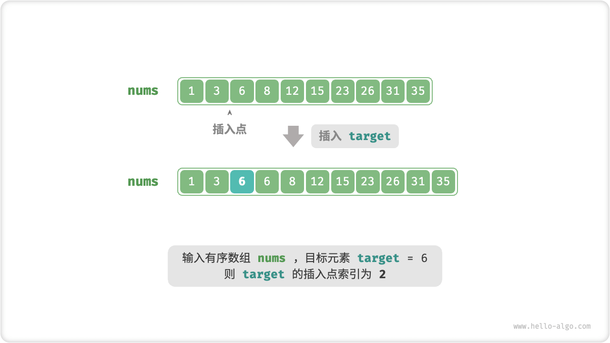
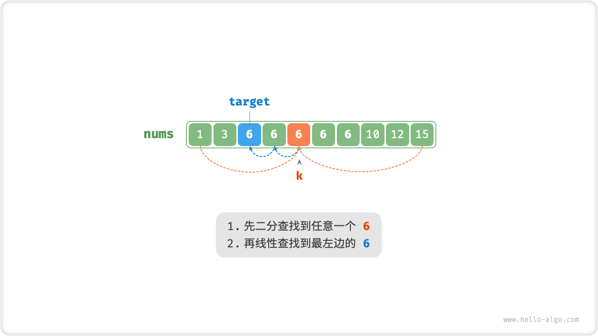
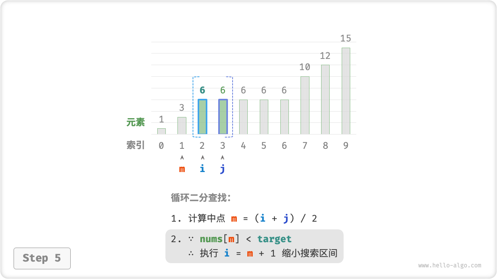
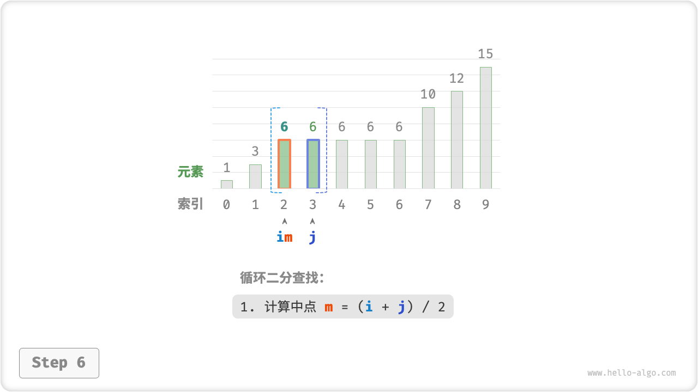
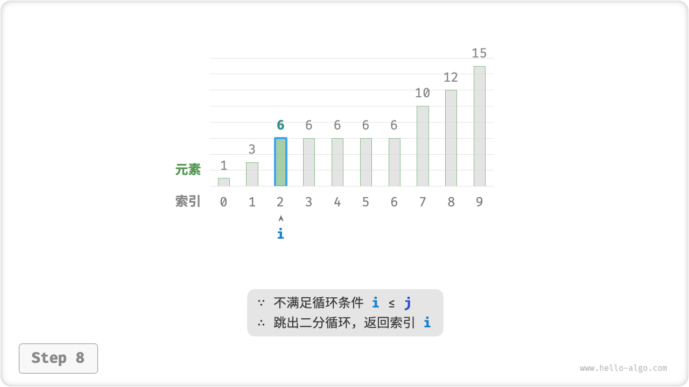

# Binary Search Insertion Point

Binary search can be used not only to search for the target element, but also has many variants of the problem, such as searching for the insertion position of the target element.

## The Case Of No Duplicate Elements

!!! question

    Given an ordered array `nums` of length $n$ and an element `target`, there are no duplicate elements in the array. Now insert `target` into the array `nums` and keep it ordered. If the element `target` already exists in the array, it is inserted to the left of it. Return the index of `target` in the array after insertion.



If you want to reuse the binary search code from the previous section, you need to answer the following two questions.

**Question 1**: When the array contains `target`, is the index of the insertion point the index of the element?

The title requires that `target` be inserted to the left of an equal element, which means that the newly inserted `target` replaces the position of the original `target`. That is, **When the array contains `target`, the index of the insertion point is the index of that `target`**.

**Question 2**: When `target` is not present in the array, which element's index is the insertion point?

Thinking further about the binary search process: when `nums[m] < target` $i$ moves, which means that the pointer $i$ is moving closer to an element greater than or equal to `target`. Similarly, pointer $j$ is always moving closer to an element less than or equal to `target`.

Therefore the bisection must end with: $i$ pointing to the first element greater than `target` and $j$ pointing to the first element less than `target`. **It is easy to conclude that when the array does not contain `target`, the insertion index is $i$** .

```src
[file]{binary_search_insertion}-[class]{}-[func]{binary_search_insertion_simple}
```

## The Presence Of Duplicate Elements

!!! question

    Building on the previous question, specify that the array may contain duplicate elements, leaving the rest unchanged.

Assuming that there are multiple `targets` in the array, a normal binary search will only return the index of one of the `targets`, **and will not be able to determine how many more `targets`**there are to the left and right of that element.

The question asks to insert the target element to the leftmost, **so we need to find the index of the leftmost one `target` in the array**. Initially, we consider implementing it by the steps shown in the figure below.

1. Perform a binary search to get the index of any `target`, denoted as $k$ .
2. Starting from index $k$, traverse linearly to the left, and return when the leftmost `target` is found.



This method is usable, but it involves a linear lookup and therefore has a time complexity of $O(n)$ . This method is inefficient when there are many duplicate `targets` in the array.

Now consider extending the binary search code. As shown in the figure below, the overall process remains unchanged, and each round first calculates the midpoint index $m$, and then determines the relationship between the size of `target` and `nums[m]`, which is categorized into the following cases.

- When `nums[m] < target` or `nums[m] > target`, it means that `target` has not been found yet, so we use ordinary binary search to narrow the interval, **so that the pointers $i$ and $j$ are closer to `target`**.
- When `nums[m] == target`, it means that the element smaller than `target` is in the interval $[i, m - 1]$, so $j = m - 1$ is used to narrow the interval, **so that the pointer $j$ is closer to the element smaller than `target`**.

When the loop finishes, $i$ points to the leftmost `target` and $j$ points to the first element that is smaller than `target`, **so index $i$ is the insertion point**.

=== "<1>"
    

=== "<2>"
    

=== "<3>"
    

=== "<4>"
    

=== "<5>"
    

=== "<6>"
    

=== "<7>"
    

=== "<8>"
    

Observe the following code and determine that the branches `nums[m] > target` and `nums[m] == target` operate the same way, so both can be merged.

Even so, we can still keep the judgment condition unfolded because its logic is clearer and more readable.

```src
[file]{binary_search_insertion}-[class]{}-[func]{binary_search_insertion}
```

!!! tip

    The code in this section is written in the "double-closed interval" style. If you are interested, you can implement the "left-closed-right-open" method by yourself.

In a nutshell, a binary search is nothing more than setting a target for pointers $i$ and $j$, which may be a specific element (e.g., `target`) or a range of elements (e.g., elements less than `target`).

In a continuous loop of bisection, the pointers $i$ and $j$ are both approaching a predefined goal. Eventually, they either succeed in finding the answer, or they cross the edge and stop.
