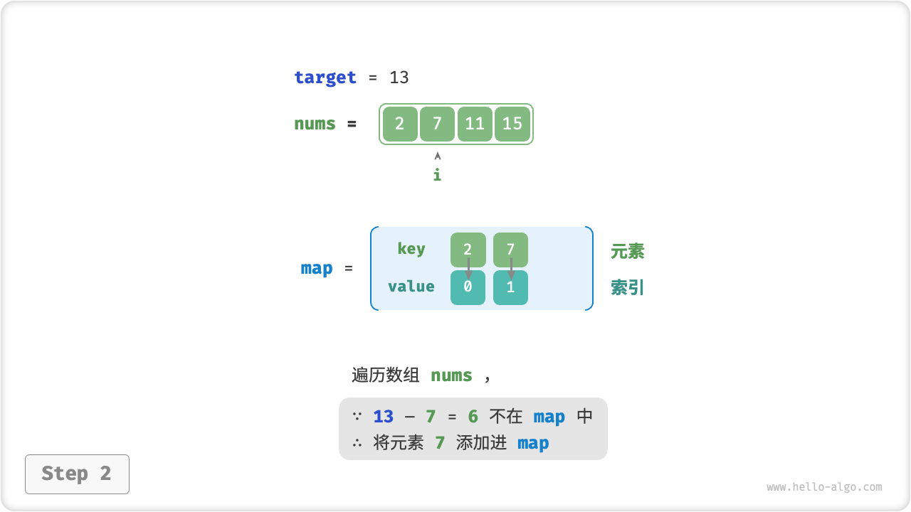
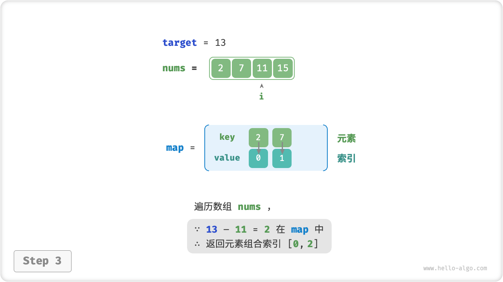

# Hash Optimization Strategies

In algorithmic problems, **we often reduce the time complexity of an algorithm by replacing a linear lookup with a hash lookup**. Let's take the help of an algorithm problem for better solution.

!!! question

    Given an array of integers `nums` and a target element `target`, search the array for two elements whose "and" is `target` and return their array indexes. It is sufficient to return any one of the solutions.

## Linear Lookups: Trading Time For Space

Consider directly traversing all possible combinations. As shown in the figure below, we open a two-level loop that determines in each round whether the sum of two integers is `target` , and if so, returns their indexes.


```src
[file]{two_sum}-[class]{}-[func]{two_sum_brute_force}
```

The time complexity of this method is $O(n^2)$ and the space complexity is $O(1)$ , which is very time-consuming in large data volume.

## Hash Lookups: Trading Space For Time

Consider with the help of a hash table where the key-value pairs are array elements and element indexes respectively. Traverse the array in a loop, performing the steps shown in the figure below each round.

1. Determine whether the number `target - nums[i]` is in the hash table, if so, return the indexes of the two elements directly.
2. Add the key-value pair `nums[i]` and the index `i` to the hash table.

=== "<1>"
    

=== "<2>"
    

=== "<3>"
    

The implementation code is shown below and requires only a single level of looping.

```src
[file]{two_sum}-[class]{}-[func]{two_sum_hash_table}
```

This method reduces the time complexity from $O(n^2)$ to $O(n)$ by hash lookup, which significantly improves the operation efficiency.

The space complexity is $O(n)$ due to the need to maintain an additional hash table. **Nevertheless, the overall space-time efficiency of this method is more balanced and therefore it is the optimal solution to this problem**.
