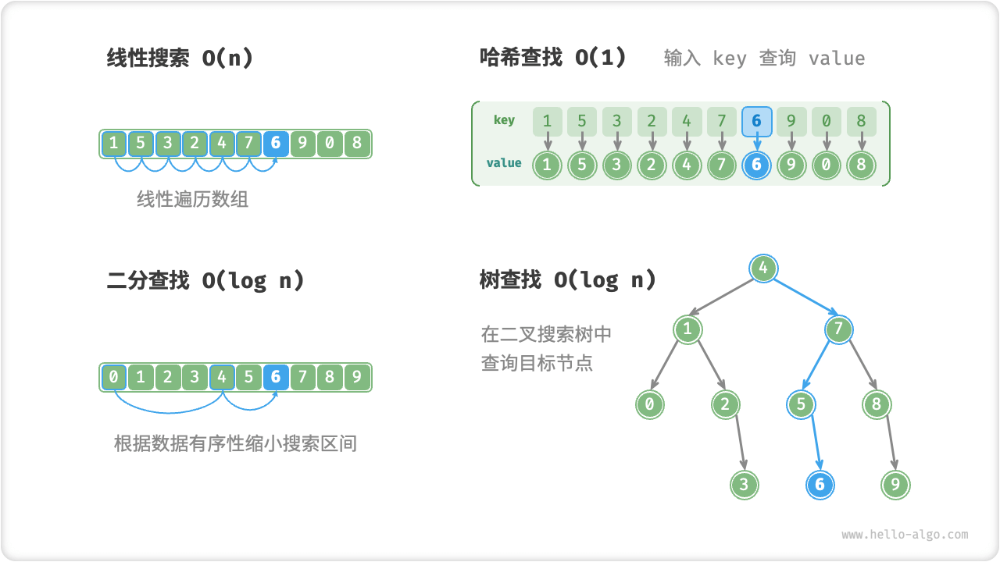

# Re-Recognition Searching Algorithm

"The searching algorithm is used to search a data structure (e.g., an array, a linked list, a tree, or a graph) for an element or a set of elements that satisfy certain conditions.

Searching algorithms can be categorized into the following two groups based on the implementation idea.

- **Locate the target element** by traversing data structures such as arrays, linked lists, tree and graph traversals.
- **Efficient elemental lookups** using data organization or a priori information contained in the data, such as binary search, hash lookup, and binary search tree lookup.

It is not difficult to realize that all these points have been introduced in previous sections, so searching algorithms are not new to us. In this section, we will revisit the searching algorithm from a more systematic perspective.

## Brute-Force Search

Brute force search locates the target element by traversing each element of the data structure.

- "Linear search" applies to linear data structures such as arrays and linked lists. It starts at one end of the data structure and accesses the elements one by one until it finds the target element or until it reaches the other end without finding the target element.
- "Breadth-first search" and "depth-first search" are two strategies for graph and tree traversal. Breadth-first search starts at the initial node and searches from level to level, visiting each node from near to far. Depth-first search starts at the initial node, follows a path to the end, then backtracks and tries other paths until the entire data structure is traversed.

The advantage of brute force search is that it is simple and generalizable, **without preprocessing the data and with the help of additional data structures**.

However, **such algorithms have a time complexity of $O(n)$** , where $n$ is the number of elements, and thus perform poorly with large amounts of data.

## Adaptive Search

Adaptive search uses data-specific properties (e.g., orderliness) to optimize the search process to locate target elements more efficiently.

- "Binary search" utilizes the ordered nature of the data to achieve efficient searching, and is only applicable to arrays.
- "Hash lookup" uses hash tables to establish a key-value pair mapping between the search data and the target data, thus realizing the query operation.
- "Tree lookup" locates a target element in a particular tree structure (e.g., a binary search tree) by quickly eliminating nodes based on comparing node values.

The advantage of this type of algorithm is its efficiency, **the time complexity can reach $O(\log n)$ or even $O(1)$** .

However, **using these algorithms often requires preprocessing of the data**. For example, binary searches require pre-sorting of arrays, hash searches and tree searches both require the use of additional data structures, and maintaining these data structures requires additional expenditure of time and space.

!!! note

    Adaptive searching algorithms are often referred to as lookup algorithms, **which are primarily concerned with the fast retrieval of target elements in a particular data structure**.

## Search Method Selection

Given a set of data of size $n$, we can search for the target element in that data using various methods such as linear search, binary search, tree search, hash search, and so on. The working of each method is shown in the figure below.

The operational efficiency and characteristics of the above methods are shown in the table below.

 Table <id> &nbsp; Finding Algorithm Efficiency Comparison 

|                             | Linear search | Binary search      | Tree search              | Hash search             |
| --------------------------- | ------------- | ------------------ | ------------------------ | ----------------------- |
| Find Elements               | $O(n)$        | $O(\log n)$        | $O(\log n)$              | $O(1)$                  |
| insert element              | $O(1)$        | $O(n)$             | $O(\log n)$              | $O(1)$ $O(1)$           |
| delete element              | $O(n)$        | $O(n)$             | $O(\log n)$              | $O(1)$                  |
| Extra Space                 | $O(1)$        | $O(1)$             | $O(n)$                   | $O(n)$                  |
| Data Preprocessing          | /             | Sort $O(n \log n)$ | Build Tree $O(n \log n)$ | Build Hash Table $O(n)$ |
| Whether the data is ordered | Unordered     | Ordered            | Ordered                  | Unordered               |

The choice of searching algorithm also depends on the volume of data, search performance requirements, frequency of data queries and updates, etc.

**Linear search**

- It is more general and does not require any data preprocessing. If we only need to query the data once, the data preprocessing of the other three methods takes longer than the linear search.
- Suitable for smaller volumes of data, in which case time complexity has less impact on efficiency.
- Suitable for scenarios where data is updated more frequently, as this method does not require any additional maintenance of the data.

**binary search**

- It is suitable for the case of large data volume and has a stable efficiency performance with a worst-case time complexity of $O(\log n)$ .
- The amount of data cannot be too large because storing arrays requires contiguous memory space.
- Not suitable for high-frequency data addition and deletion scenarios because of the overhead of maintaining an ordered array.

**hash lookup**

- It is suitable for scenarios that require high query performance with an average time complexity of $O(1)$ .
- Not suitable for scenarios that require ordered data or range lookups, as hash tables cannot maintain the orderliness of the data.
- The high dependency on hash functions and hash collision handling strategies carries a high risk of performance degradation.
- Not suitable for excessive data volumes, as hash tables require extra space to minimize conflicts and thus provide good query performance.

**Tree Finder**

- Suitable for massive data because tree nodes are stored decentralized in memory.
- Ideal for scenarios where you need to maintain ordered data or range lookups.
- During the continuous addition and removal of nodes, the binary search tree may become skewed and the time complexity deteriorates to $O(n)$ .
- If an AVL tree or a red-black tree is used, the operations can be stabilized with $O(\log n)$ efficiency, but the operation of maintaining the tree balance will add extra overhead.
