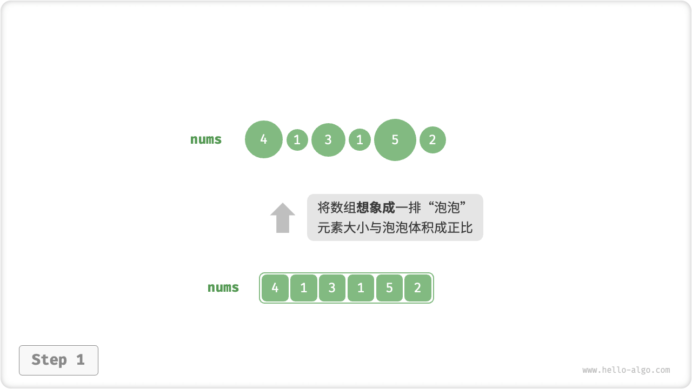
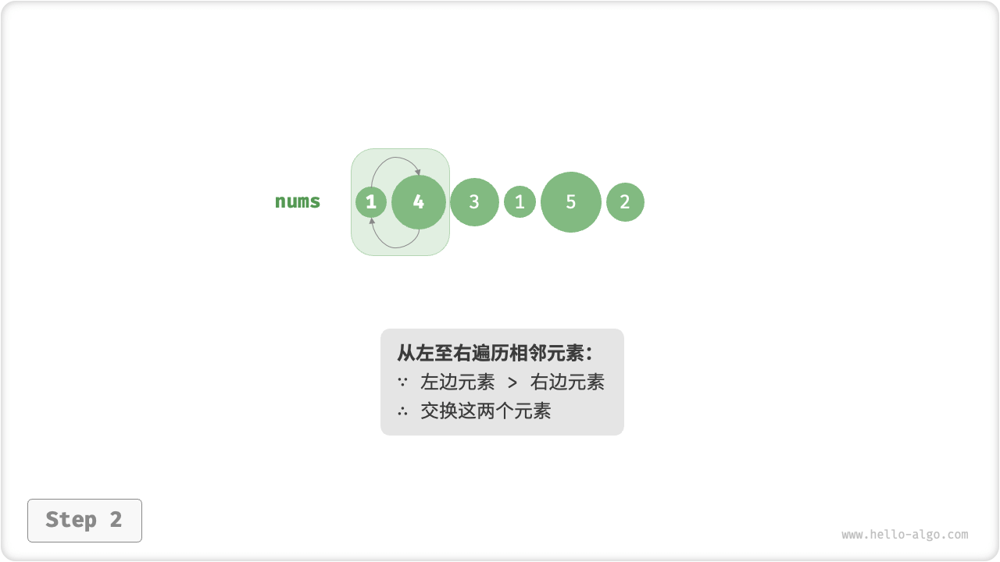
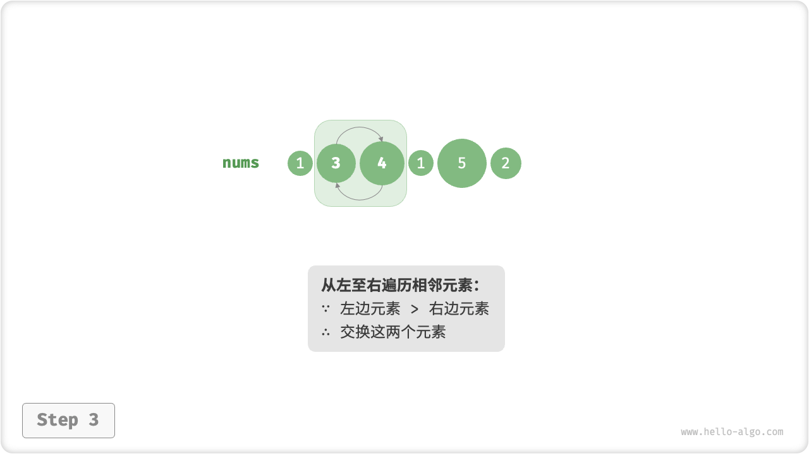
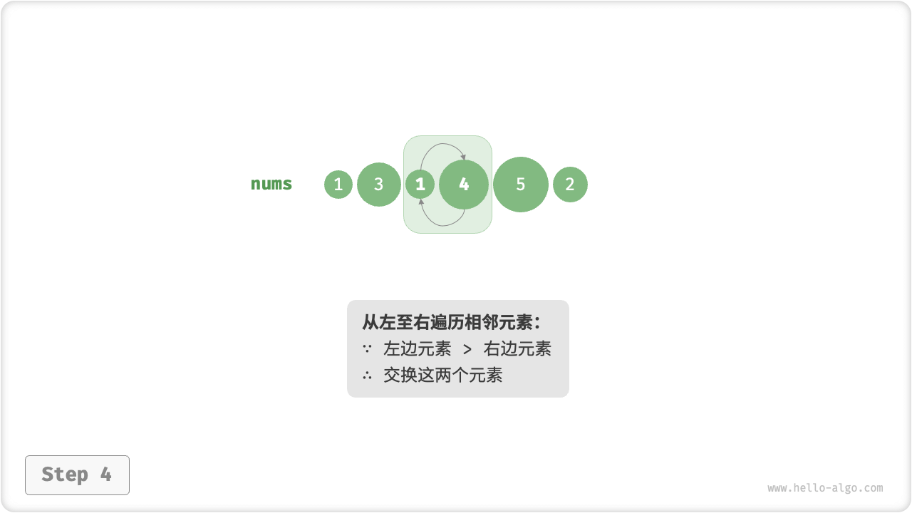
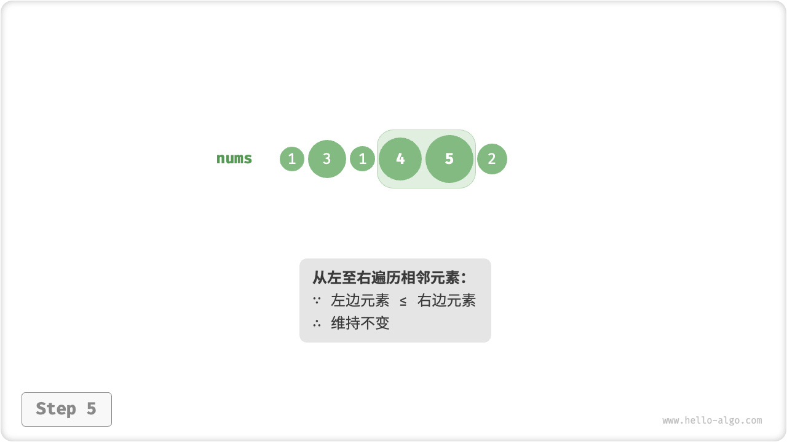
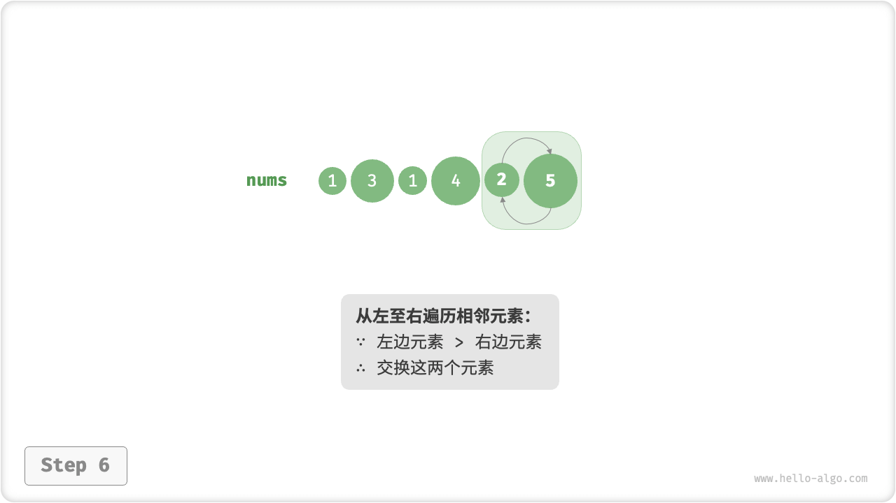

# Bubble Sort

The "bubble sort bubble sort" achieves sorting by successively comparing and exchanging neighboring elements. The process is like a bubble rising from the bottom to the top, hence the name bubble sort.

As shown in the figure below, the bubbling process can be simulated by using the element swapping operation: start traversing the array from the leftmost end to the right, compare the sizes of the neighboring elements in turn, and swap them if "left element > right element". After the traversal is complete, the largest element will be moved to the right end of the array.

=== "<1>"
    

=== "<2>"
    

=== "<3>"
    

=== "<4>"
    

=== "<5>"
    

=== "<6>"
    

=== "<7>"
    

## Algorithmic Flow

Let the length of the array be $n$ , the steps of bubble sort are shown in the figure below.

1. First, perform a "bubble" on $n$ elements, **swapping the largest element of the array to the correct position**.
2. Next, perform a "bubble" on the remaining $n - 1$ elements, **swapping the second largest element to the correct position**.
3. And so on, after $n - 1$ rounds of "bubbling", **the first $n - 1$ larger elements are swapped to the correct position**.
4. The only remaining element must be the smallest element and does not need to be sorted, so the array is sorted.


```src
[file]{bubble_sort}-[class]{}-[func]{bubble_sort}
```

## Efficiency Optimization

We have found that if no swap operation is performed during a round of bubbling, the array has been sorted and the result can be returned directly. Therefore, you can add a flag `flag` to monitor this situation and return the result as soon as it occurs.

After optimization, the worst and average time complexity of bubble sort is still $O(n^2)$; however, the best time complexity $O(n)$ can be achieved when the input array is completely ordered.

```src
[file]{bubble_sort}-[class]{}-[func]{bubble_sort_with_flag}
```

## Algorithm Properties

- **Time complexity is $O(n^2)$, Adaptive sorting**: each round of "bubbling" traverses the array with lengths $n - 1$, $n - 2$, $\dots$, $2$, $1$, and the total is $(n - 1) n / 2$. After introducing the `flag` optimization, the optimal time complexity can reach $O(n)$ .
- **Space complexity of $O(1)$, In-place sorting**: pointers $i$ and $j$ use extra space of constant size.
- **Stable ordering**: since equal elements are not exchanged when encountered in "bubbling".
