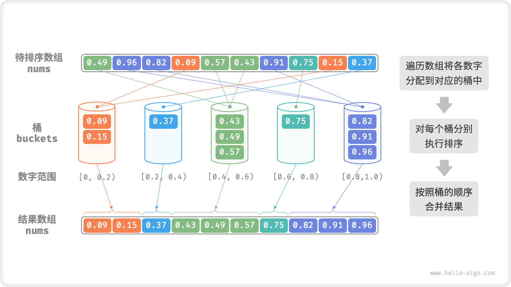
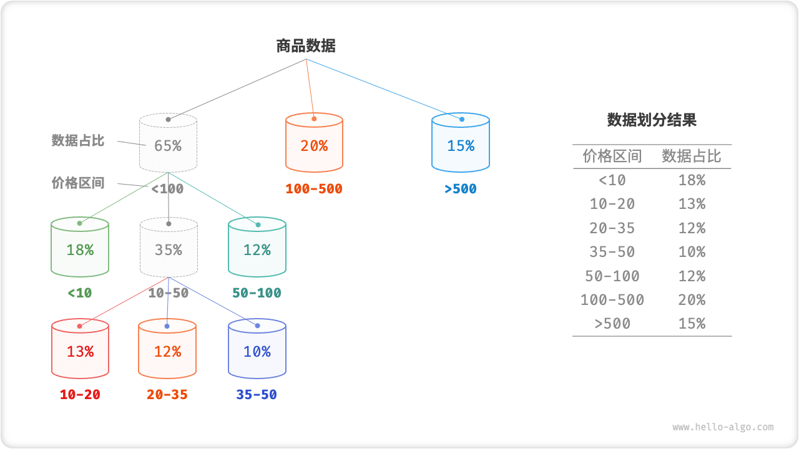
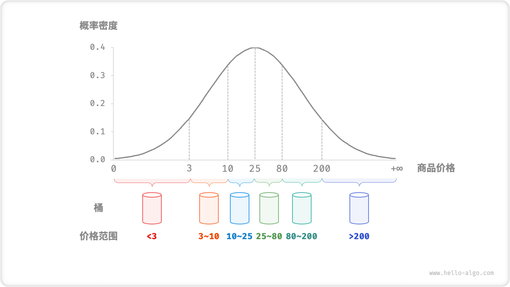

# Bucket Sort

The aforementioned sorting algorithms are "comparison-based sorting algorithms", which sort by comparing the sizes of the elements. The time complexity of these sorting algorithms cannot exceed $O(n \log n)$. Next, we will look at some non-comparison sorting algorithms, which can have time complexity up to linear order.

"Bucket sort" is a typical application of divide and conquer strategy. It distributes data evenly among buckets by setting up some buckets with size order, each bucket corresponds to a data range; then, it performs sorting inside each bucket; finally, it merges all the data according to the order of the buckets.

## Algorithmic Flow

Consider an array of length $n$ with elements of floating point numbers in the range $[0, 1)$. The flow of bucket sort is shown in the figure below.

1. Initialize $k$ buckets and assign $n$ elements to $k$ buckets.
2. Perform a separate sort for each bucket (in this article, we use the programming language's built-in sort function).
3. Merge the results in order of the buckets from smallest to largest.



```src
[file]{bucket_sort}-[class]{}-[func]{bucket_sort}
```

## Algorithm Properties

Bucket sort is suitable for processing data with large volume. For example, the input data contains 1 million elements, and due to space constraints, the system memory cannot load all the data at once. At this point, you can divide the data into 1000 buckets, then sort each bucket separately, and finally merge the results.

- **Time complexity $O(n + k)$** : Assuming that the elements are evenly distributed across the buckets, the number of elements in each bucket is $\frac{n}{k}$ . Assuming that sorting a single bucket uses $O(\frac{n}{k} \log\frac{n}{k})$ time, then sorting all buckets uses $O(n \log\frac{n}{k})$ time. **When the number of buckets $k$ is large, the time complexity tends to $O(n)$** . Merging the results requires traversing all buckets and elements, taking $O(n + k)$ time.
- **Adaptive Sorting**: in the worst case, all data is assigned to a bucket and sorting that bucket uses $O(n^2)$ time.
- **Space complexity $O(n + k)$, non-in-place sorting**: requires additional space with the help of $k$ buckets and a total of $n$ elements.
- The stability of a bucket sort depends on the stability of the sorting algorithm that sorts the elements in the bucket.

## How To Achieve Equal Distribution

The time complexity of bucket sort can theoretically reach $O(n)$ , **the key is to evenly distribute the elements into each bucket**, because the actual data is often not evenly distributed. For example, we want to evenly distribute all the products on Taobao into 10 buckets by price range, but the product prices are unevenly distributed, with very many below $100 and very few above $1000. If the price range is divided into 10 equal parts, the difference in the number of items in each bucket will be very large.

To achieve an even distribution, we can start by setting an approximate dividing line and roughly dividing the data into 3 buckets. **Afterallocation, the buckets with more commodities are then continued to be divided into 3 buckets until the number of elements in all buckets is roughly equal**.

As shown in the figure below, this method essentially creates a recursion tree, and the goal is to make the values of the leaf nodes as average as possible. Of course, it is not necessary to divide the data into 3 buckets per round, the specific division can be flexibly selected according to the data characteristics.



If we know the probability distribution of the commodity price in advance, **then we can set the price cutoff for each bucket based on the data probability distribution**. It is worth noting that the data distribution does not necessarily need to be intentionally statistical, but can also be approximated using some probability model based on the data characteristics.

As shown in the figure below, we assume that the price of the commodity follows a normal distribution so that the price interval can be set reasonably well so that the commodity can be distributed evenly across the buckets.


