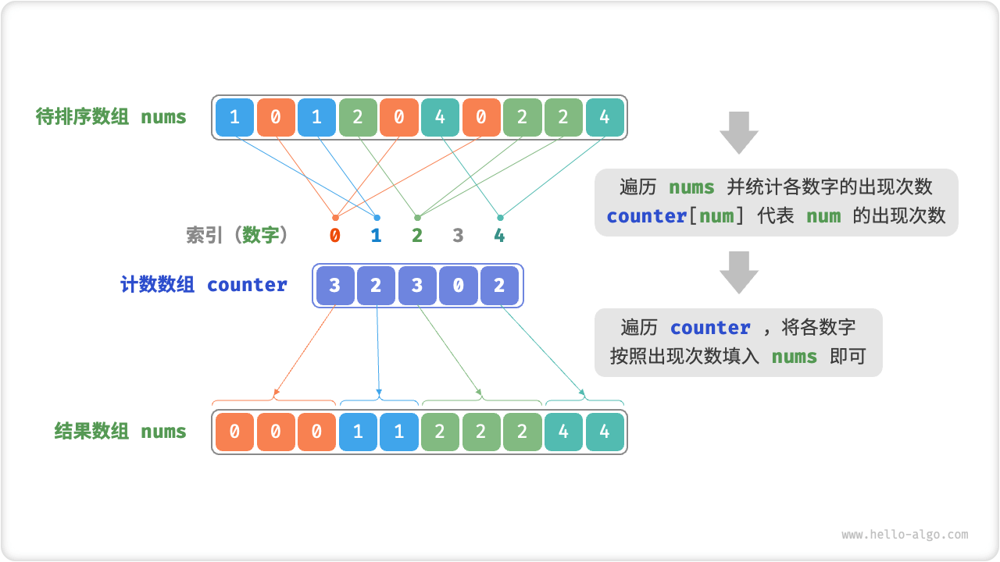
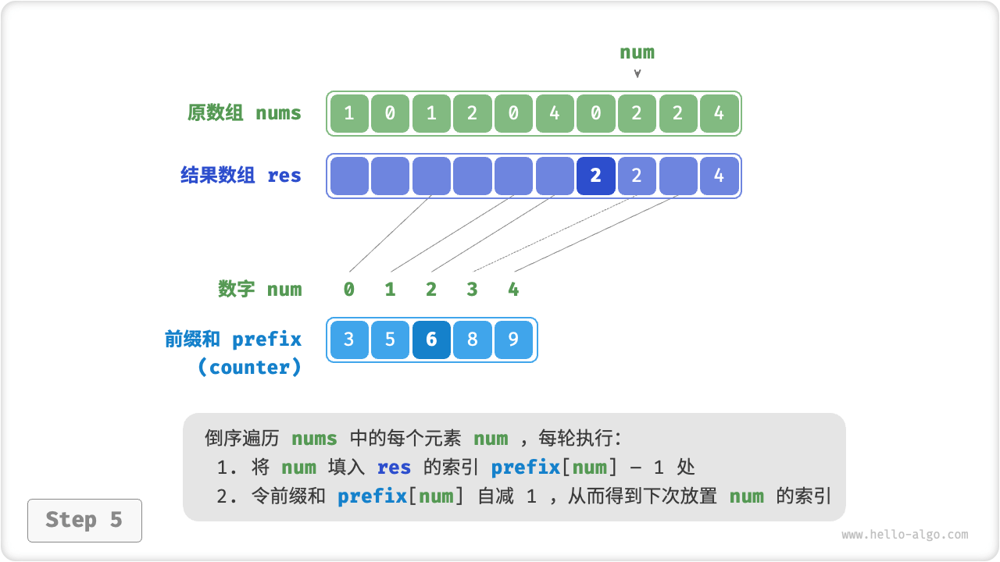
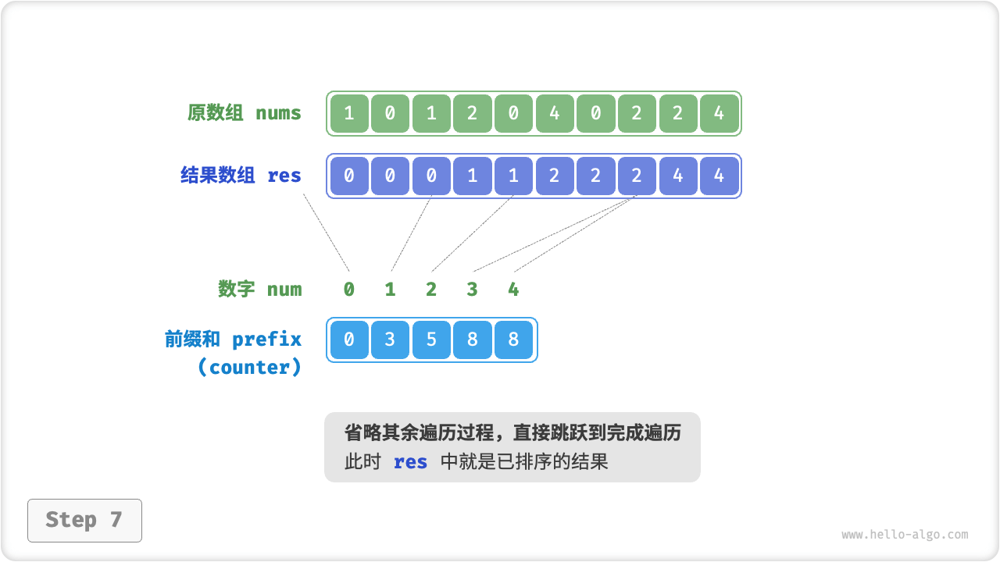
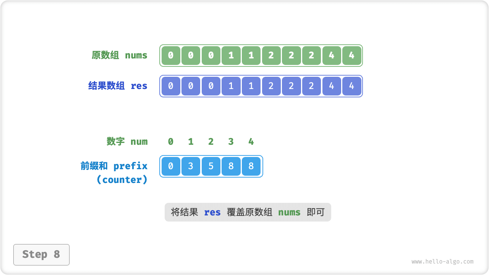

# Counting Sort

"Counting sort" implements sorting by counting the number of elements, usually applied to an array of integers.

## Simple Implementation

Let's start with a simple example. Given an array `nums` of length $n$, whose elements are all "non-negative integers", the overall process of counting sort is shown in the figure below.

1. Iterate through the array to find the largest number in the array, denoted $m$, and then create an auxiliary array `counter` of length $m + 1$.
2. **Count the number of occurrences of each number in `nums` with the help of `counter`**, where `counter[num]` corresponds to the number of occurrences of the number `num`. The counting method is very simple, just iterate over `nums` (set the current number as `num`), and increase `counter[num]` by $1$ every round.
3. **Since the individual indexes of `counter` are naturally ordered, it is equivalent to having all the numbers already sorted**. Next, we iterate through `counter` and fill in `nums` with the numbers in descending order according to their number of occurrences.



```src
[file]{counting_sort}-[class]{}-[func]{counting_sort_naive}
```

!!! note "The connection between counting sort and bucket sort."

    From a bucket sort perspective, we can think of each index of the counting array `counter` in a counting sort as a bucket, and think of the process of counting quantities as assigning individual elements to their corresponding buckets. Essentially, counting sort is a special case of bucket sort for integer data.

## Full Implementation

Careful students may find that **if the input data is an object, the above step `3.` fails**. Suppose the input data is a commodity object and we want to sort the commodities by their price (a member variable of the class) and the above algorithm can only give us the sorting algorithm for the price.

So how can we get the original data sorted? We first calculate the "prefix sum" of `counter`. As the name suggests, the prefix sum at index `i` `prefix[i]` equals the sum of the first `i` elements of the array:

$$
\text{prefix}[i] = \sum_{j=0}^i \text{counter[j]}
$$

**The prefix and has the explicit meaning that `prefix[num] - 1` represents the index of the last occurrence of the element `num` in the result array `res`**. This information is critical because it tells us where in the result array each element should appear. Next, we iterate through each element `num` of the original array `nums` in reverse order, performing the following two steps in each iteration.

1. Fill `num` into the array `res` at index `prefix[num] - 1`.
2. Decrease the prefix sum `prefix[num]` by $1$ to get the index of the next placement of `num`.

After the traversal is completed, the array `res` is the sorted result, and finally use `res` to overwrite the original array `nums`. The figure below shows the complete counting sort process.

=== "<1>"
    

=== "<2>"
    

=== "<3>"
    

=== "<4>"
    

=== "<5>"
    

=== "<6>"
    

=== "<7>"
    

=== "<8>"
    

The implementation code for counting sort is shown below.

```src
[file]{counting_sort}-[class]{}-[func]{counting_sort}
```

## Algorithm Properties

- **Time complexity $O(n + m)$** : Involves traversing `nums` and traversing `counter` , both using linear time. In general $n \gg m$ , the time complexity tends to $O(n)$ .
- **Space complexity $O(n + m)$, Non-in-place sorting**: with the help of arrays `res` and `counter` of lengths $n$ and $m$ respectively.
- **Stable Sort**: Since the order of filling `res` with elements is "right-to-left", traversing `nums` in reverse order avoids changing the relative positions of the equal elements, and thus achieves a stable sort. In fact, an orthogonal traversal of `nums` will also give the correct sorting result, but the result will be non-stable.

## Limitations

You might think that counting sorts are very clever, and that you can achieve an efficient sorting job just by counting quantities. However, the preconditions for using counting sort are relatively strict.

**The counting sort only works with non-negative integers**. If you want to use it for other types of data, you need to make sure that they can be converted to non-negative integers and that the relative size relationships between the elements cannot be changed during the conversion. For example, for an array of integers containing negative numbers, you can just add a constant to all the numbers, convert all the numbers to positive numbers, and then convert them back when the sorting is complete.

**Counting sort is suitable for cases where the data volume is large but the data range is small**. For example, in the above example $m$ cannot be too large or it will take up too much space. And when $n \ll m$, counting sort uses $O(m)$ time, which may be slower than $O(n \log n)$ sorting algorithm.
