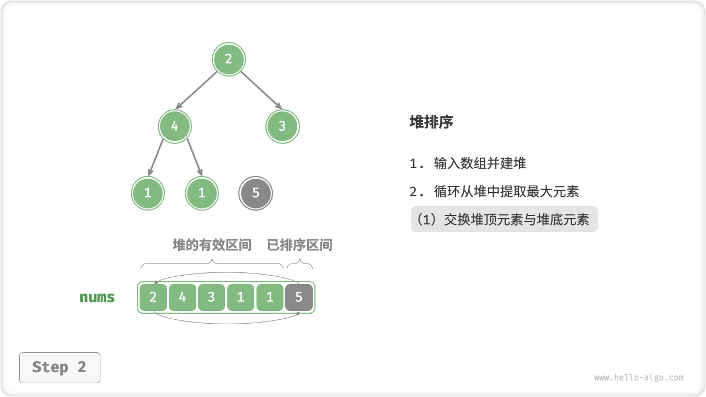
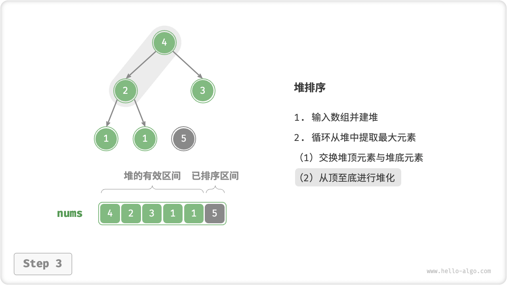
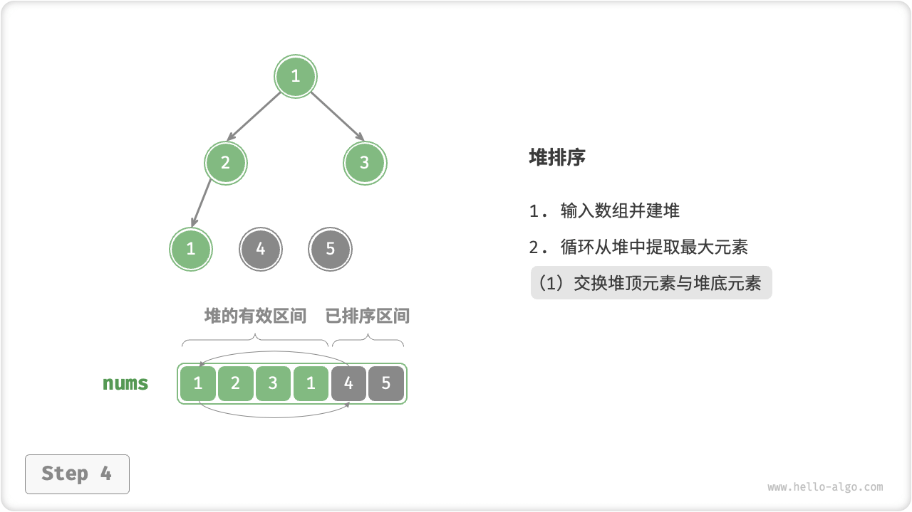
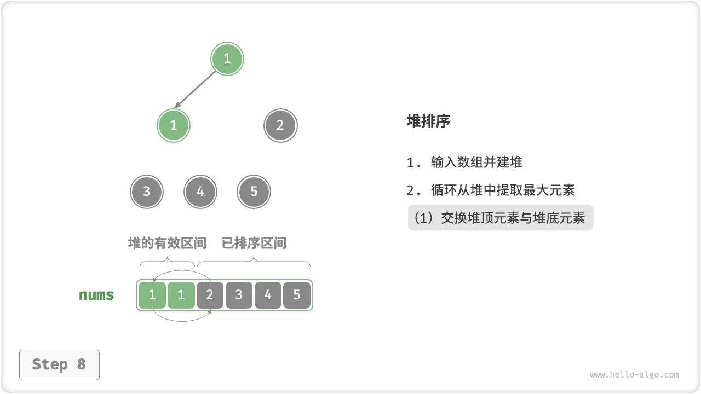
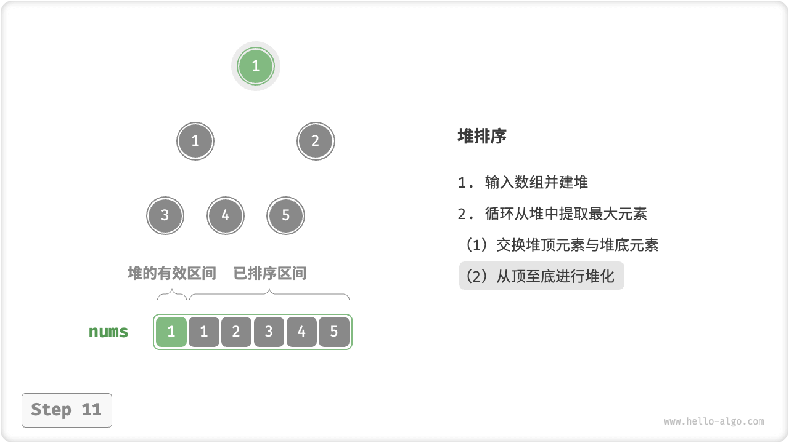
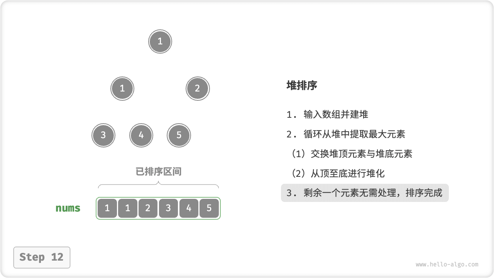

# Heap Sort

!!! tip

    Before reading this section, make sure you have completed the "Heaps" chapter.

"Heap sort is an efficient sorting algorithm based on heap data structure. We can implement heap sort by utilizing the "heap building operation" and "element out of heap operation" that we have already learned.

1. Input the array and build the min heap, when the smallest element is at the top of the heap.
2. Continuously perform the heap out operation and record the heap elements in order to get a sequence sorted from smallest to largest.

The above method works, but it requires the help of an extra array to save the popped elements, which is a waste of space. In practice, we usually use a more elegant implementation.

## Algorithmic Flow

Let the length of the array be $n$ , the flow of heap sort is shown in the figure below.

1. Enter the array and build the max heap. When finished, the largest element is at the top of the heap.
2. Swap the top element of the heap (the first element) with the bottom element of the heap (the last element). After completing the swap, the length of the heap is minus $1$ and the number of sorted elements is plus $1$.
3. Starting from the top element of the heap, the heapify operation (Sift Down) is performed from top to bottom. After completing heapify, the nature of the heap is repaired.
4. Loop through steps `2.` and `3.`. After $n - 1$ rounds, the array is sorted.

!!! tip

    In fact, the `2.` and `3.` steps are also included in the element out of heap operation, but there is just one more step to pop the element.

=== "<1>"
    

=== "<2>"
    

=== "<3>"
    

=== "<4>"
    

=== "<5>"
    

=== "<6>"
    

=== "<7>"
    

=== "<8>"
    

=== "<9>"
    

=== "<10>"
    

=== "<11>"
    

=== "<12>"
    

In the code implementation, we use the same top-to-bottom heap `sift_down()` function as in the heap chapter. It is worth noting that since the length of the heap decreases as the largest element is extracted, we need to add a length parameter $n$ to the `sift_down()` function to specify the current effective length of the heap.

```src
[file]{heap_sort}-[class]{}-[func]{heap_sort}
```

## Algorithm Properties

- **Time complexity $O(n \log n)$, non-adaptive sorting**: the heap building operation uses $O(n)$ time. The time complexity of extracting the largest element from the heap is $O(\log n)$ , with a total of $n - 1$ rounds.
- **Space complexity $O(1)$, in-place sorting**: several pointer variables use $O(1)$ space. Element swapping and heapify operations are performed on the original array.
- **Unstable ordering**: the relative positions of equal elements may change when exchanging the top element of the heap and the bottom element of the heap.
