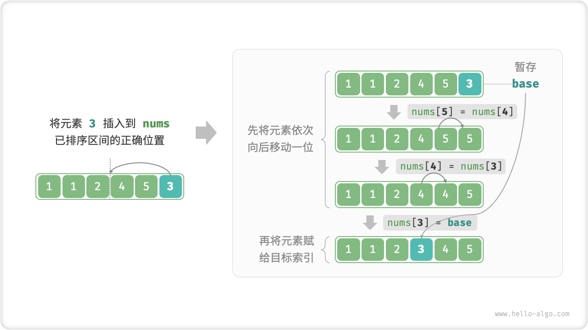

# Insertion Sort

The "insertion sort insertion sort" is a simple sorting algorithm that works very similar to the process of manually organizing a deck of cards.

Specifically, we select a baseline element in the unsorted interval, compare the size of that element with the elements in the sorted interval to its left, one by one, and insert that element into the correct position.

The figure below shows the process of inserting elements into an array. Let the base element be `base`, we need to move all the elements from the target index to `base` one place to the right, and then assign `base` to the target index.



## Algorithmic Flow

The overall flow of the insertion sort is shown in the figure below.

1. In the initial state, the 1st element of the array is already sorted.
2. After selecting the 2nd element of the array as `base` , and inserting it in the correct position, **the first 2 elements of the array are sorted**.
3. After selecting the 3rd element as `base` , and inserting it in the correct position, **the first 3 elements of the array are sorted**.
4. And so on, in the last round, the last element is selected as `base` , and after inserting it in the correct position, **all elements are sorted**.


```src
[file]{insertion_sort}-[class]{}-[func]{insertion_sort}
```

## Algorithm Properties

- **Time complexity $O(n^2)$, Adaptive sorting**: in the worst case, each insertion operation needs to loop $n - 1$, $n-2$, $\dots$, $2$, $1$ respectively, and the summation yields $(n - 1) n / 2$ , so the time complexity is $O(n^2)$ . The insertion operation terminates early when encountering ordered data. When the input array is completely ordered, insertion sort reaches the optimal time complexity $O(n)$ .
- **Space complexity $O(1)$, In-place sorting**: pointers $i$ and $j$ use extra space of constant size.
- **Stable sort**: during insertion operation, we will insert the elements to the right of the equal elements without changing their order.

## Insertion Sort Advantages

The time complexity of insertion sort is $O(n^2)$ and the time complexity of the quick sort we are about to learn is $O(n \log n)$ . Even though the time complexity of insertion sort is higher compared to quick sort, **insertion sort is usually faster when the amount of data is small**.

This conclusion is similar to the conclusion about the applicability of linear and binary search. Algorithms such as quick sorting algorithm $O(n \log n)$ are partition-based sorting algorithms, which tend to contain more unitary computational operations. While the values of $n^2$ and $n \log n$ are closer and complexity does not play a dominant role when the amount of data is small; the number of unit operations in each round plays a decisive factor.

In fact, the built-in sorting functions of many programming languages (e.g., Java) use insertion sort, along the lines of a partition-based sorting algorithm, such as quick sort, for long arrays, or direct insertion sort for short arrays.

Although the time complexity of bubble sort, selection sort and insertion sort is $O(n^2)$ , in practice, **insertion sort is used significantly more often than bubble sort and selection sort for the following main reasons**.

- The bubble sort is implemented based on element swapping and involves 3 unit operations with the help of a temporary variable; the insertion sort is implemented based on element assignment and requires only 1 unit operation. Therefore, **bubble sort usually has a higher computational overhead than insertion sort**.
- Selection sort has a time complexity of $O(n^2)$ in all cases. **Insertion sort is usually more efficient than selection sort if given a set of partially ordered data**.
- The selection sort is not stable and cannot be applied to multiple levels of sorting.
