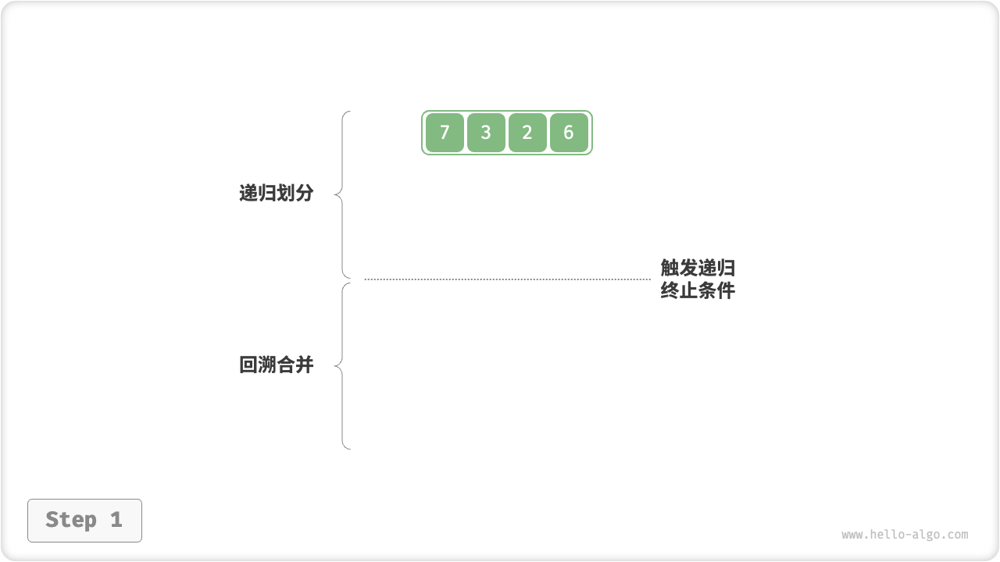
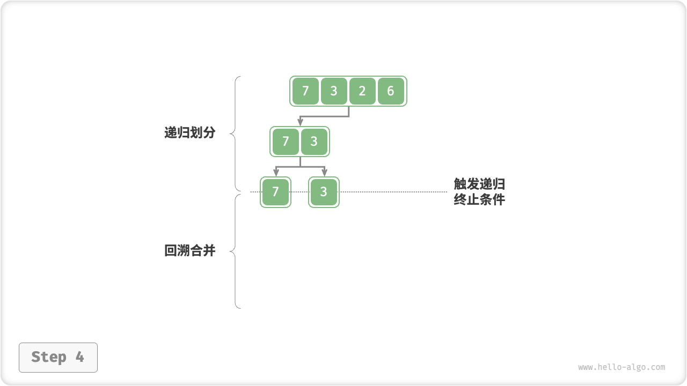
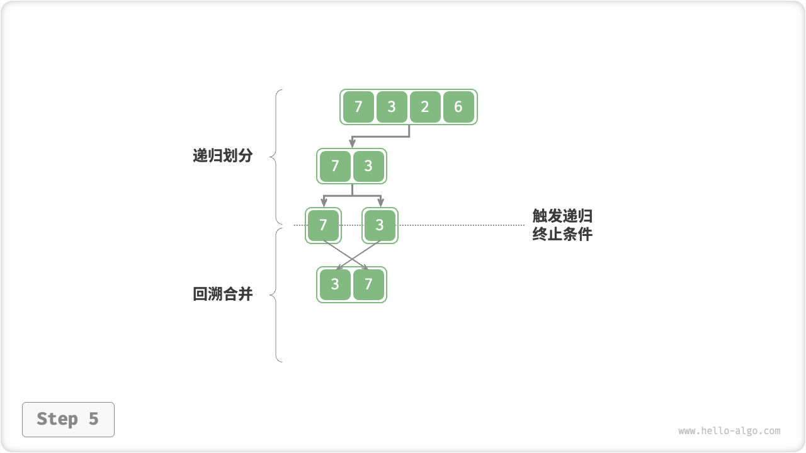
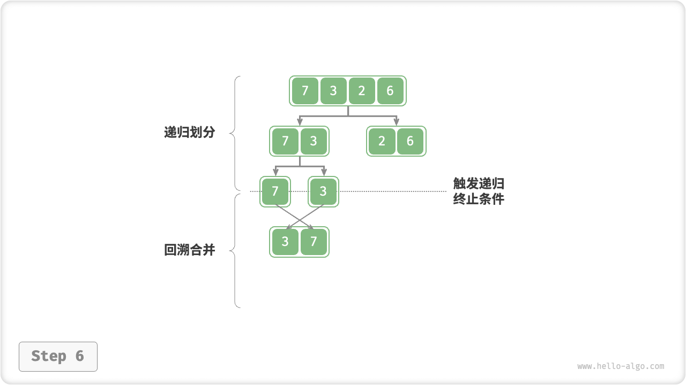
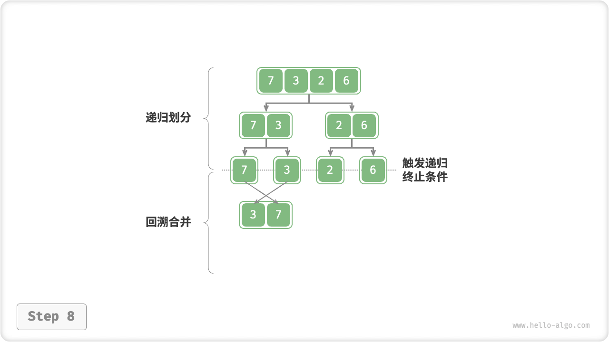
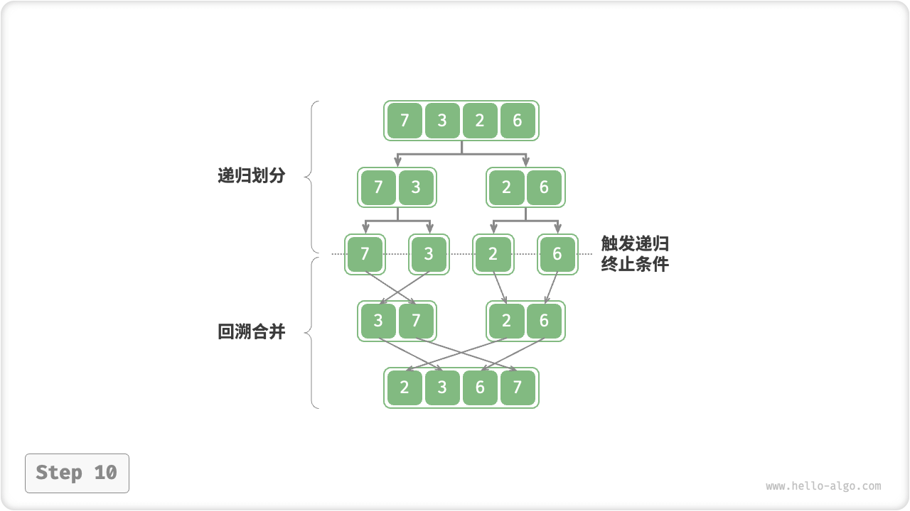

# Merge Sort

"merge sort" is a sorting algorithm based on the divide and conquer strategy, which consists of the "divide" and "merge" phases as shown in the figure below.

1. **Division Phase**: converts a sorting problem with long arrays into a sorting problem with short arrays by continuously separating the arrays from their midpoints by recursion.
2. **Merge phase**: terminate the division when the length of the subarray is 1 and start merging, continuously merging the left and right shorter ordered arrays into one longer ordered array until the end.


## Algorithmic Flow

As shown in the figure below, the "division stage" recursively slices the array into two subarrays from the midpoint from top to bottom.

1. Calculate the midpoint of the array `mid` and recursion divides the left subarray (interval `[left, mid]`) and the right subarray (interval `[mid + 1, right]`).
2. The recursion executes step `1.` until the length of the subarray interval is 1, then the recursion division is terminated.

The "merge phase" merges the left and right subarrays into an ordered array from bottom to top. Note that each subarray in the merge phase is ordered, starting with subarrays of length 1.

=== "<1>"
    

=== "<2>"
    

=== "<3>"
    

=== "<4>"
    

=== "<5>"
    

=== "<6>"
    

=== "<7>"
    

=== "<8>"
    

=== "<9>"
    

=== "<10>"
    

Observe that the recursion sort is consistent with the recursion order of the backward traversal of the binary tree.

- **Posterior order traversal**: recursion to the left-child node, then to the right-child node, and finally deal with the root node.
- **Recursion sort**: recursion on the left subarray, then recursion on the right subarray, and finally process the merge.

```src
[file]{merge_sort}-[class]{}-[func]{merge_sort}
```

It is worth noting that the interval to be merged for `nums` is `[left, right]`, while the corresponding interval for `tmp` is `[0, right - left]`.

## Algorithm Properties

- **Time complexity $O(n \log n)$, Non-adaptive sorting**: division produces a recursion tree of height $\log n$, and the total number of operations for merging at each level is $n$ , so the overall time complexity is $O(n \log n)$ .
- **Space complexity $O(n)$, non-in-place sort**: recursion depth is $\log n$, using $O(\log n)$ size stack frame space. The merge operation needs to be implemented with the help of an auxiliary array, using extra space of size $O(n)$.
- **Stable ordering**: the order of equal elements remains the same during the merge process.

## Linked List Sorting

For linked lists, merge sort has a significant advantage over other sorting algorithms, **It can optimize the space complexity of the linked list sorting task to $O(1)$** .

- **Division Phase**: The division of the linked list can be achieved by using "iteration" instead of "recursion", thus eliminating the use of stack frames for recursion.
- **Merge Phase**: In a linked list, node addition and deletion operations can be accomplished by simply changing references (pointers), so the merge phase (combining two short ordered linked lists into one long ordered linked list) does not require the creation of additional linked lists.

Specific implementation details are more complex, interested students can consult the relevant information to learn.
