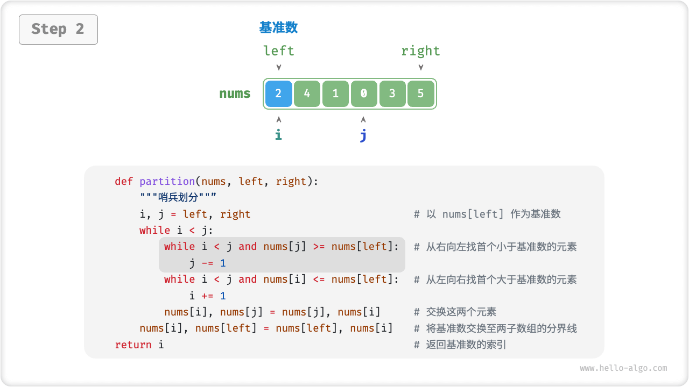
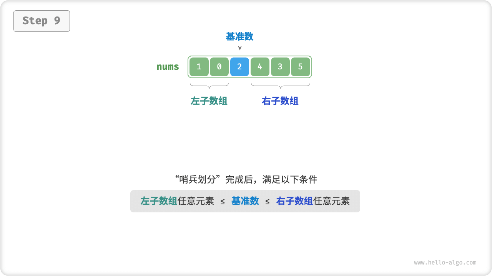
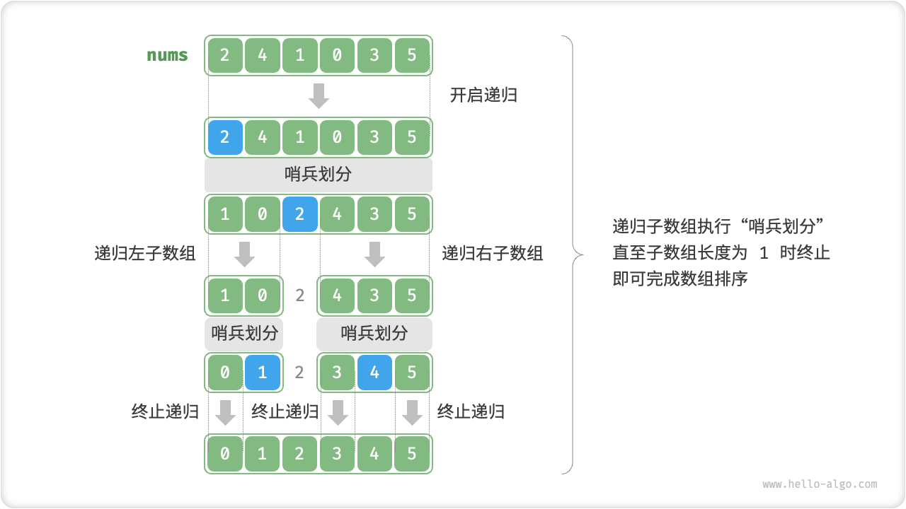

# Quick Sort

"Quick sort" is a sorting algorithm based on the divide and conquer strategy, which is efficient and widely used.

The core operation of quick sort is the "sentinel division", the goal is: selection of an element in the array as the "base number", all the elements smaller than the base number of elements moved to its left, and greater than the base number of elements moved to its right. Specifically, the process of sentinel division is shown in the figure below.

1. Select the leftmost element of the array as the reference number, and initialize two pointers `i` and `j` to point to the two ends of the array respectively.
2. Set up a loop that uses `i` (`j`) in each round to find the first element that is larger (smaller) than the baseline number, respectively, and then swaps the two elements.
3. Loop through step `2.` until `i` and `j` meet and stop, and finally swap the datums to the dividing line of the two subarrays.

=== "<1>"
    

=== "<2>"
    

=== "<3>"
    

=== "<4>"
    

=== "<5>"
    

=== "<6>"
    

=== "<7>"
    

=== "<8>"
    

=== "<9>"
    

After the sentinel division is done, the original array is divided into three parts: the left subarray, the base number, and the right subarray, and it satisfies "any element of the left subarray $\leq$ base number $\leq$ any element of the right subarray". Therefore, we only need to sort these two arrays next.

!!! note "A divide and conquer strategy for quick sort"

    The essence of sentinel division is to simplify the problem of sorting a longer array into a problem of sorting two shorter arrays.

```src
[file]{quick_sort}-[class]{quick_sort}-[func]{partition}
```

## Algorithmic Flow

The overall process of quick sort is shown in the figure below.

1. First, perform a "sentinel division" on the original array to get the unsorted left and right subarrays.
2. Then, the "sentinel division" is performed recursionally on the left and right subarrays.
3. The recursion continues until the length of the subarray reaches 1, thus completing the sorting of the entire array.



```src
[file]{quick_sort}-[class]{quick_sort}-[func]{quick_sort}
```

## Algorithm Properties

- **Time complexity $O(n \log n)$, Adaptive Sorting**: In the average case, the number of recursion levels for sentinel division is $\log n$ , the total number of loops in each level is $n$, and the overall time complexity used is $O(n \log n)$. In the worst case, each round of sentinel division operation divides the array of length $n$ into two subarrays of length $0$ and $n - 1$, at which point the number of recursion levels reaches $n$, the number of loops in each level is $n$, and the overall time used is $O(n^2)$.
- **Space complexity $O(n)$, in-place sorting**: reaches the worst recursion depth $n$ with the input array completely inverted, using $O(n)$ stack frame space. The sorting operation is performed on the original array without the help of additional arrays.
- **Unstable ordering**: in the last step of the sentinel division, the base numbers may be swapped to the right of equal elements.

## Why Is Fast Platoon Fast?

As you can see from the name, quick sort should have a certain advantage in terms of efficiency. Although the average time complexity of quick sort is the same as that of merge sort and heap sort, quick sort is usually more efficient for the following reasons.

- **Low probability of worst-case**: although the worst-case time complexity of quick sort is $O(n^2)$, which is not as stable as merge sort, in the vast majority of cases, quick sort can run at a time complexity of $O(n \log n)$.
- **Efficient use of cache**: When performing a sentinel division operation, the system can load the entire subarray into the cache, thus accessing the elements more efficiently. Algorithms such as heap sort lack this feature as they require jumping to access elements.
- Low constant factor of **complexity**: Among the above three algorithms, quick sorting has the lowest total number of comparison, assignment, and swap operations. This is similar to the reason why Insertion Sort is faster than Bubble Sort.

## Benchmark Optimization

**Quick sort may be less time efficient with certain inputs**. As an extreme example, suppose the input array is completely inverted, and since we choose the leftmost element as the base number, then after the completion of the sentinel division, the base number is exchanged to the rightmost end of the array, resulting in a left subarray length of $n - 1$ and a right subarray length of $0$ . As this recursion continues, the length of the right subarray after each round of sentinel division is $0$, the divide and conquer strategy fails, and the quick sort degenerates into a "bubble sort".

To try to avoid this situation, **we can optimize the selection strategy of the benchmark number in sentinel division**. For example, we can randomly pick an element as the benchmark number. However, if we are unlucky and pick an undesirable benchmark number every time, the efficiency is still unsatisfactory.

Note that programming languages often generate "pseudo-random numbers". If we construct a specific test case for a sequence of pseudo-random numbers, the efficiency of the quick sort may still be degraded.

For further improvement, we can select three candidate elements in the array (usually the first, last, and midpoint elements of the array), **and use the median of these three candidate elements as the base number**. In this way, the probability that the base number is "neither too small nor too large" will be greatly increased. Of course, we can also select more candidate elements to further improve the robustness of the algorithm. With this approach, the probability of time complexity degradation to $O(n^2)$ is greatly reduced.

```src
[file]{quick_sort}-[class]{quick_sort_median}-[func]{partition}
```

## Tail Recursion Optimization

**Under certain inputs, the quick sort may take up more space**. Taking a completely inverted input array as an example, since the length of the right child array after each round of sentinel division is $0$, the height of the recursion tree will reach $n - 1$, which will take up $O(n)$ size of stack frame space.

To prevent the accumulation of stack frame space, we can compare the lengths of the two subarrays after each round of sentinel sorting is completed, **recursion only on the shorter subarray**. Since the length of the shorter subarray will not exceed $n / 2$ , this approach ensures that the depth of recursion does not exceed $\log n$ , thus optimizing the worst-case space complexity to $O(\log n)$ .

```src
[file]{quick_sort}-[class]{quick_sort_tail_call}-[func]{quick_sort}
```
