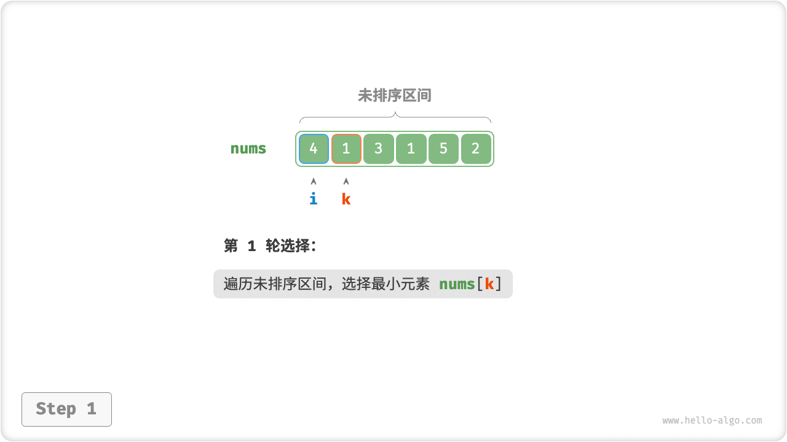
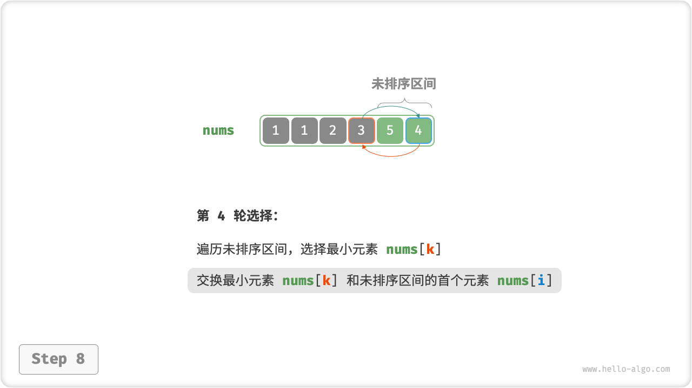
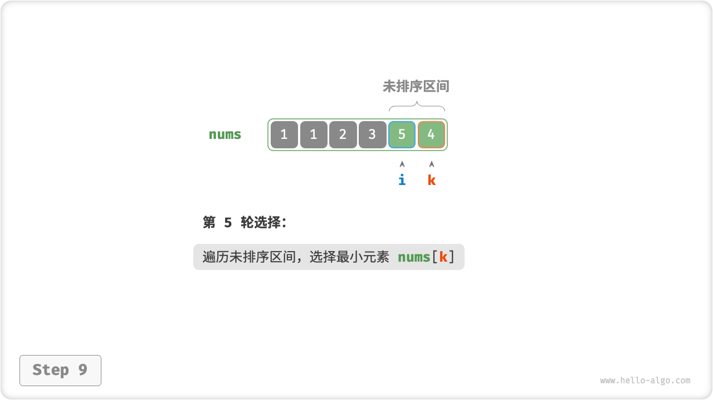
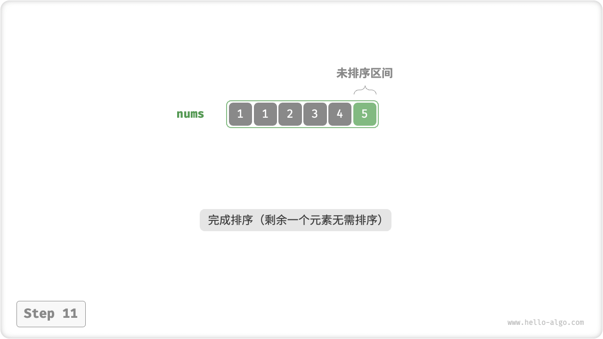

# Selection Sort

The workings of "selection sort" are straightforward: start a loop that selects the smallest element from the unsorted interval in each round and puts it at the end of the sorted interval.

Let the length of the array be $n$ , the flow of the selection sorting algorithm is shown below.

1. In the initial state, all elements are unsorted, i.e., the unsorted (indexed) interval is $[0, n-1]$ .
2. Select the smallest element in the interval $[0, n-1]$ and swap it with the element at index $0$. When finished, the first 1 element of the array is sorted.
3. Pick the smallest element in the interval $[1, n-1]$ and swap it with the element at index $1$. When finished, the first 2 elements of the array are sorted.
4. And so on. After $n - 1$ rounds of selection and swapping, the first $n - 1$ elements of the array are sorted.
5. The only remaining element must be the largest element, and no sorting is necessary, so the array is sorted.

=== "<1>"
    

=== "<2>"
    

=== "<3>"
    

=== "<4>"
    

=== "<5>"
    

=== "<6>"
    

=== "<7>"
    

=== "<8>"
    

=== "<9>"
    

=== "<10>"
    

=== "<11>"
    

In the code, we use $k$ to record the smallest element in the unsorted interval.

```src
[file]{selection_sort}-[class]{}-[func]{selection_sort}
```

## Algorithm Properties

- **Time complexity is $O(n^2)$, non-adaptive sorting**: the outer loop consists of a total of $n - 1$ rounds, the length of the unsorted interval in the first round is $n$ , and the length of the unsorted interval in the last round is $2$ , i.e., each round of the outer loop contains $n$, $n - 1$, $\dots$, $3$, $2$ rounds of inner loops, and the summation is $\frac{(n - 1)(n + 2)}{2}$ .
- **Space complexity $O(1)$, In-place sorting**: pointers $i$ and $j$ use extra space of constant size.
- **Unstable ordering**: as shown in the figure below, it is possible for an element `nums[i]` to be swapped to the right of an element equal to it, resulting in a change in the relative order of the two.


