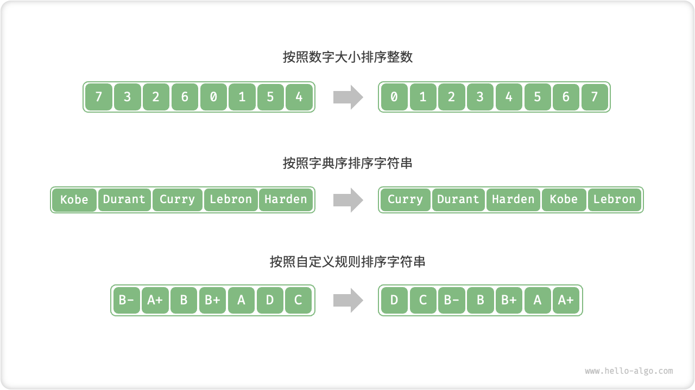

# Sorting Algorithm

"The sorting algorithm is used to arrange a set of data in a particular order. Sorting algorithms have a wide range of applications because ordered data can often be found, analyzed, and processed more efficiently.

As shown in the figure below, the data type in the sorting algorithm can be integer, floating point, character or string. The judgment rules of sorting can be set according to the demand, such as the size of the number, the order of the ASCII code of the characters or custom rules.



## Evaluation Dimensions

**Running efficiency**: we expect the time complexity of the sorting algorithm to be as low as possible and the overall number of operations to be low (i.e., the constant term in the time complexity is reduced). Running efficiency is especially important for the large data volume case.

**In-placeness**: as the name suggests, 'in-place sorting' saves memory by realizing sorting through direct operations on the original array without the help of additional auxiliary arrays. Typically, in-place sorting has fewer data handling operations and runs faster.

**Stability**: 'Stabilizing Sort' does not change the relative order of equal elements in the array after the sort is completed.

Stable sorting is necessary for multi-level sorting scenarios. Suppose we have a table storing student information, with columns 1 and 2 being name and age, respectively. In this case, 'non-stationary sorting' may lead to loss of order in the input data.

```shell
# Input data is sorted by name.
# (name, age)
  ('A', 19)
  ('B', 18)
  ('C', 21)
  ('D', 19)
  ('E', 23)

# Assuming a list is sorted by age using a non-stationary sorting algorithm.
# The relative positions of ('D', 19) and ('A', 19) in the result change.
# Loss of nature of input data sorted by name
  ('B', 18)
  ('D', 19)
  ('A', 19)
  ('C', 21)
  ('E', 23)
```

**Adaptive**: the time complexity of 'adaptive sorting' is affected by the input data, i.e., the best, worst, and average time complexities are not exactly equal.

Adaptivity needs to be evaluated on a case-by-case basis. If the worst time complexity is worse than the average time complexity, it indicates that the performance of the sorting algorithm may be deteriorated under certain data and is therefore considered a negative attribute, while if the best time complexity is better than the average time complexity, it is considered a positive attribute.

**Comparison-based or not**: "Comparison-based sorting" relies on comparison operators ($<$, $=$, $>$) to determine the relative order of the elements to sort the entire array, with a theoretically optimal time complexity of $O(n\log n)$ . Non-comparative sorting does not use comparison operators, and the time complexity can be up to $O(n)$, but its generality is relatively poor.

## Ideal Sorting Algorithm

**runs fast, in situ, stable, positively adaptive, and generalizes well**. Obviously, no sorting algorithm that combines all of these properties has been found so far. Therefore, when selecting a sorting algorithm, the decision needs to be based on the specific data characteristics and problem requirements.

Next, we will learn various sorting algorithms together and analyze the advantages and disadvantages of each sorting algorithm based on the evaluation dimensions mentioned above.
