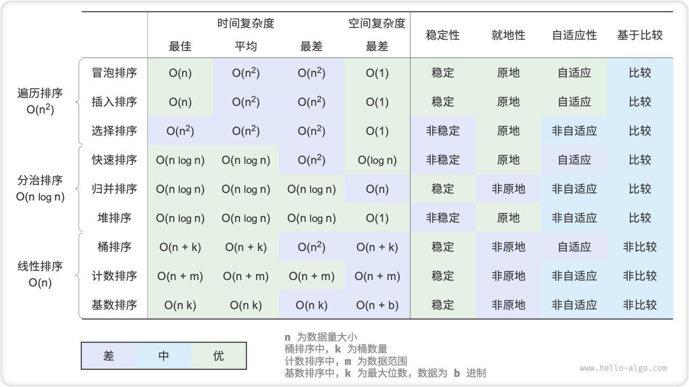

# Summary

### Highlights

- Bubble sort achieves sorting by swapping neighboring elements. By adding a flag bit for early return, we can optimize the best time complexity of bubble sort to $O(n)$ .
- Insertion sort completes the sort by inserting elements from the unsorted interval into the correct position in the sorted interval in each round. Although insertion sort has a time complexity of $O(n^2)$ , it is very popular for sorting tasks with small amounts of data due to the relatively small number of unit operations.
- Quick sort implements sorting based on the sentinel division operation. In sentinel division, it is possible to pick the worst benchmark number every time, leading to a time complexity degradation to $O(n^2)$ . Introducing median benchmarks or random benchmarks can reduce the probability of this degradation. Tail recursion methods can effectively reduce the depth of recursion and optimize the space complexity to $O(\log n)$ .
- Merge sort consists of two phases, division and conquer, which typifies the divide and conquer strategy. In merge sort, the sorted array requires the creation of auxiliary arrays with a space complexity of $O(n)$ ; however, the space complexity of a sorted linked list can be optimized to $O(1)$ .
- Bucket sorting consists of three steps: splitting the data into buckets, sorting the buckets and merging the results. It also embodies the divide and conquer strategy and is suitable for situations where the volume of data is large. The key to bucket sort is to distribute the data evenly.
- Counting sort is a special case of bucket sort that achieves sorting by counting the number of times the data appears. Counting sort is suitable for situations where the amount of data is large but the range of data is limited and requires the data to be able to be converted to positive integers.
- Radix sort sorts data by sorting bit by bit and requires that the data can be represented as a fixed number of digits.
- In general, we would like to find a sorting algorithm that has the advantages of high efficiency, stability, in situ, and positive adaptivity. However, just like other data structures and algorithms, there is no sorting algorithm that can satisfy all these conditions at the same time. In practice, we need to select a suitable sorting algorithm based on the characteristics of the data.
- The figure below compares the efficiency, stability, in-situ and adaptivity of the mainstream sorting algorithms.

### Q & A

!!! Question "Under what circumstances is sorting algorithm stability necessary?"

    In reality, it is possible that we are sorting on an attribute of an object. For example, a student has two attributes, name and height, and we would like to implement a multilevel sort /

    First, we sort by name to get `(A, 180) (B, 185) (C, 170) (D, 170)`; next, we sort by height. Since the sorting algorithm is unstable, we may get `(D, 170) (C, 170) (A, 180) (B, 185)` .

    It can be noticed that the positions of students D and C have been exchanged and the orderliness of the names has been destroyed, which we do not want.

!!! question "Can the order of "Find Right to Left" and "Find Left to Right" in Sentinel Division be exchanged?"

    No, when we use the leftmost element as the base number, we must first "find from right to left" and then "find from left to right". This conclusion is a bit counterintuitive, so let's analyze why.

    The last step of the sentinel division `partition()` is to swap `nums[left]` and `nums[i]` . After the swap is done, the elements to the left of the base number are `<=` the base number, **which requires that `nums[left] >= nums[i]` must hold before the last swap step**. Assuming that we "search from left to right" first, then if we can't find an element smaller than the base number, **we will jump out of the loop at `i == j`, and then `nums[j] == nums[i] > nums[left]`**. That is, at this point, the last step of the swap operation will swap an element larger than the baseline number to the leftmost end of the array, causing the sentinel division to fail.

    For example, given an array `[0, 0, 0, 0, 0, 1]`, if you first "find from left to right", the sentinel divides the array into `[1, 0, 0, 0, 0]`, which is incorrect.

    Thinking deeper, if we choose `nums[right]` as the base number, then it's the other way around: we have to "find from left to right" first.

!!! question "Regarding tail recursion optimization, why is it that choosing a shorter array ensures that the recursion depth does not exceed $\log n$ ?"

    The recursion depth is the number of recursion methods that are currently not returned. Each round of sentinel division we divide the original array into two subarrays. After tail recursion optimization, the maximum length of the downward recursion subarray is half the length of the original array. Assuming the worst case, which is always half the length, the final depth of recursion is $\log n$ .
   
    Recalling the original quick sort, it is possible to recursion successively through arrays of large lengths, in the worst case $n$, $n - 1$, $\dots$, $2$, $1$, with a recursion depth of $n$. The tail recursion optimization avoids this.

!!! question "Is the time complexity of quick sort $O(n^2)$ when all elements in the array are equal? How should I handle this degenerate case?"

    Yes. This situation can be considered by dividing the array into three parts by sentinel division: less than, equal to, and greater than the base number. Only the less than and greater than parts are recursed downwards. In this method, an array with all equal elements is input and only one round of sentinel division completes the sorting.

!!! question "Why is the worst time complexity of bucket sort $O(n^2)$ ?"

    In the worst case, all elements are sorted into the same bucket. If we use a $O(n^2)$ algorithm to sort these elements, the time complexity is $O(n^2)$ .
