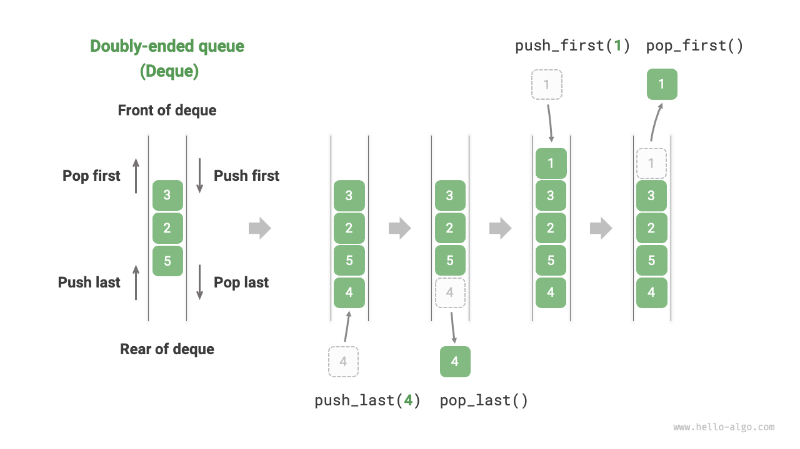
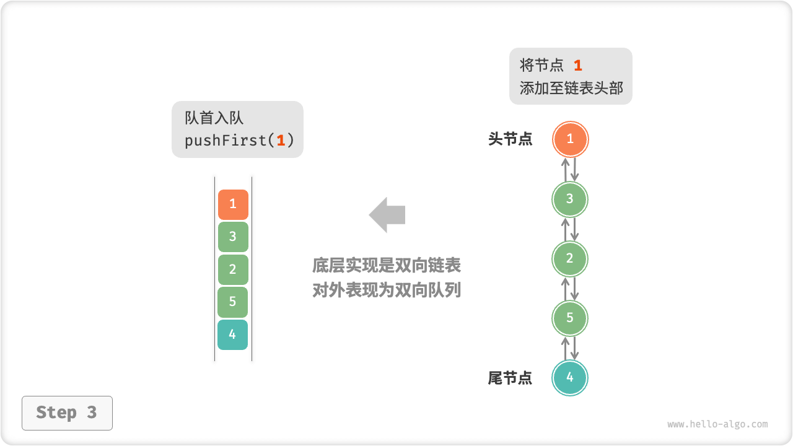
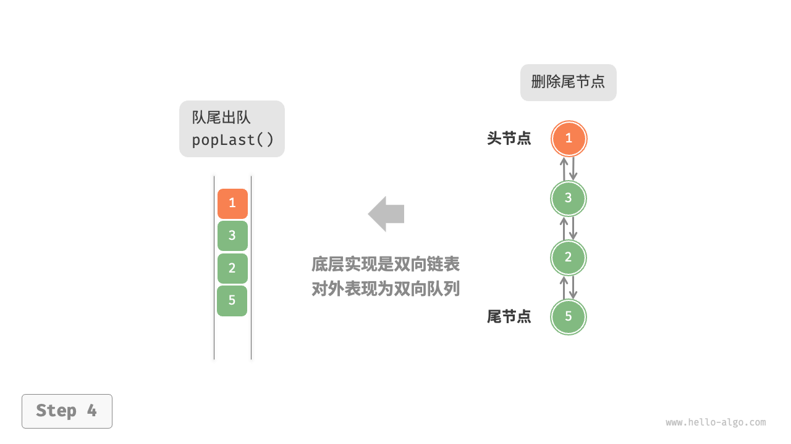
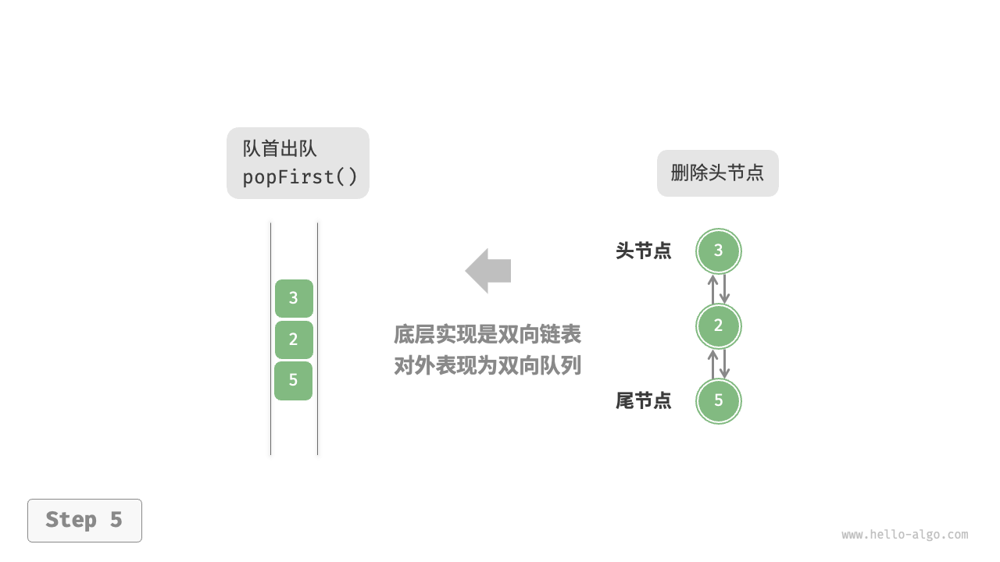
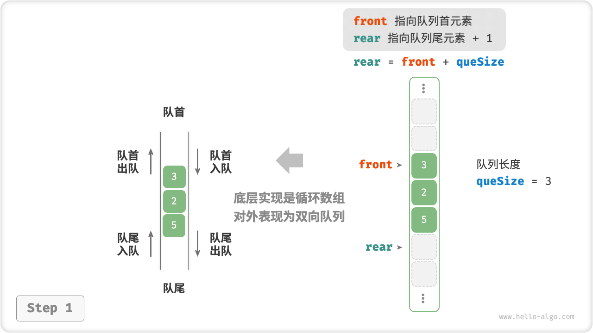
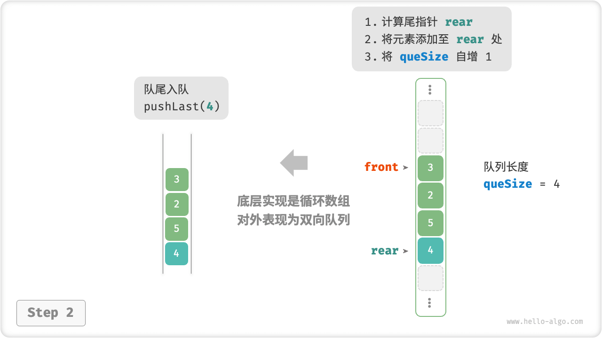
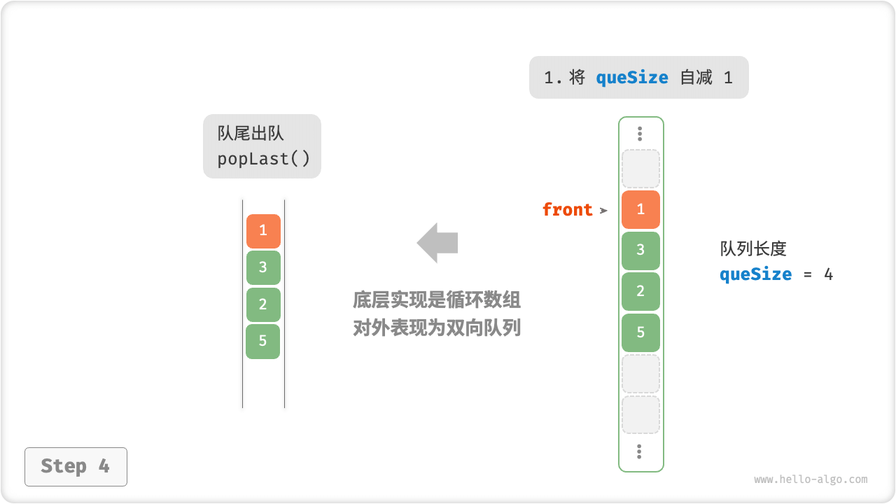
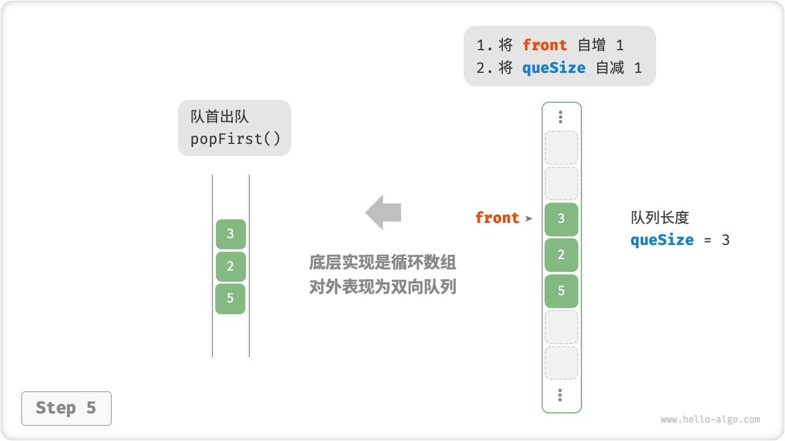

# 5.3 &nbsp; Double-Ended Queue

In a regular queue, we can only delete elements from the head or add elements to the tail. As shown in the Figure 5-7 , a "double-ended queue (deque)" offers more flexibility, allowing the addition or removal of elements at both the head and the tail.

{ class="animation-figure" }

<p align="center"> Figure 5-7 &nbsp; Operations in Double-Ended Queue </p>

## 5.3.1 &nbsp; Common Operations in Double-Ended Queue

The common operations in a double-ended queue are listed below, and the specific method names depend on the programming language used.

<p align="center"> Table 5-3 &nbsp; Efficiency of Double-Ended Queue Operations </p>

<div class="center-table" markdown>

| Method Name   | Description                 | Time Complexity |
| ------------- | --------------------------- | --------------- |
| `pushFirst()` | Add an element to the front | $O(1)$          |
| `pushLast()`  | Add an element to the rear  | $O(1)$          |
| `popFirst()`  | Remove the front element    | $O(1)$          |
| `popLast()`   | Remove the rear element     | $O(1)$          |
| `peekFirst()` | Access the front element    | $O(1)$          |
| `peekLast()`  | Access the rear element     | $O(1)$          |

</div>

Similarly, we can directly use the double-ended queue classes implemented in programming languages:

=== "Python"

    ```python title="deque.py"
    from collections import deque

    # Initialize the deque
    deque: deque[int] = deque()

    # Enqueue elements
    deque.append(2)      # Add to the rear
    deque.append(5)
    deque.append(4)
    deque.appendleft(3)  # Add to the front
    deque.appendleft(1)

    # Access elements
    front: int = deque[0]  # Front element
    rear: int = deque[-1]  # Rear element

    # Dequeue elements
    pop_front: int = deque.popleft()  # Front element dequeued
    pop_rear: int = deque.pop()       # Rear element dequeued

    # Get the length of the deque
    size: int = len(deque)

    # Check if the deque is empty
    is_empty: bool = len(deque) == 0
    ```

=== "C++"

    ```cpp title="deque.cpp"
    /* Initialize the deque */
    deque<int> deque;

    /* Enqueue elements */
    deque.push_back(2);   // Add to the rear
    deque.push_back(5);
    deque.push_back(4);
    deque.push_front(3);  // Add to the front
    deque.push_front(1);

    /* Access elements */
    int front = deque.front(); // Front element
    int back = deque.back();   // Rear element

    /* Dequeue elements */
    deque.pop_front();  // Front element dequeued
    deque.pop_back();   // Rear element dequeued

    /* Get the length of the deque */
    int size = deque.size();

    /* Check if the deque is empty */
    bool empty = deque.empty();
    ```

=== "Java"

    ```java title="deque.java"
    /* Initialize the deque */
    Deque<Integer> deque = new LinkedList<>();

    /* Enqueue elements */
    deque.offerLast(2);   // Add to the rear
    deque.offerLast(5);
    deque.offerLast(4);
    deque.offerFirst(3);  // Add to the front
    deque.offerFirst(1);

    /* Access elements */
    int peekFirst = deque.peekFirst();  // Front element
    int peekLast = deque.peekLast();    // Rear element

    /* Dequeue elements */
    int popFirst = deque.pollFirst();  // Front element dequeued
    int popLast = deque.pollLast();    // Rear element dequeued

    /* Get the length of the deque */
    int size = deque.size();

    /* Check if the deque is empty */
    boolean isEmpty = deque.isEmpty();
    ```

=== "C#"

    ```csharp title="deque.cs"
    /* Initialize the deque */
    // In C#, LinkedList is used as a deque
    LinkedList<int> deque = new();

    /* Enqueue elements */
    deque.AddLast(2);   // Add to the rear
    deque.AddLast(5);
    deque.AddLast(4);
    deque.AddFirst(3);  // Add to the front
    deque.AddFirst(1);

    /* Access elements */
    int peekFirst = deque.First.Value;  // Front element
    int peekLast = deque.Last.Value;    // Rear element

    /* Dequeue elements */
    deque.RemoveFirst();  // Front element dequeued
    deque.RemoveLast();   // Rear element dequeued

    /* Get the length of the deque */
    int size = deque.Count;

    /* Check if the deque is empty */
    bool isEmpty = deque.Count == 0;
    ```

=== "Go"

    ```go title="deque_test.go"
    /* Initialize the deque */
    // In Go, use list as a deque
    deque := list.New()

    /* Enqueue elements */
    deque.PushBack(2)      // Add to the rear
    deque.PushBack(5)
    deque.PushBack(4)
    deque.PushFront(3)     // Add to the front
    deque.PushFront(1)

    /* Access elements */
    front := deque.Front() // Front element
    rear := deque.Back()   // Rear element

    /* Dequeue elements */
    deque.Remove(front)    // Front element dequeued
    deque.Remove(rear)     // Rear element dequeued

    /* Get the length of the deque */
    size := deque.Len()

    /* Check if the deque is empty */
    isEmpty := deque.Len() == 0
    ```

=== "Swift"

    ```swift title="deque.swift"
    /* Initialize the deque */
    // Swift does not have a built-in deque class, so Array can be used as a deque
    var deque: [Int] = []

    /* Enqueue elements */
    deque.append(2) // Add to the rear
    deque.append(5)
    deque.append(4)
    deque.insert(3, at: 0) // Add to the front
    deque.insert(1, at: 0)

    /* Access elements */
    let peekFirst = deque.first! // Front element
    let peekLast = deque.last!   // Rear element

    /* Dequeue elements */
    // Using Array, popFirst has a complexity of O(n)
    let popFirst = deque.removeFirst() // Front element dequeued
    let popLast = deque.removeLast()   // Rear element dequeued

    /* Get the length of the deque */
    let size = deque.count

    /* Check if the deque is empty */
    let isEmpty = deque.isEmpty
    ```

=== "JS"

    ```javascript title="deque.js"
    /* Initialize the deque */
    // JavaScript does not have a built-in deque, so Array is used as a deque
    const deque = [];

    /* Enqueue elements */
    deque.push(2);
    deque.push(5);
    deque.push(4);
    // Note that unshift() has a time complexity of O(n) as it's an array
    deque.unshift(3);
    deque.unshift(1);

    /* Access elements */
    const peekFirst = deque[0]; // Front element
    const peekLast = deque[deque.length - 1]; // Rear element

    /* Dequeue elements */
    // Note that shift() has a time complexity of O(n) as it's an array
    const popFront = deque.shift(); // Front element dequeued
    const popBack = deque.pop();    // Rear element dequeued

    /* Get the length of the deque */
    const size = deque.length;

    /* Check if the deque is empty */
    const isEmpty = size === 0;
    ```

=== "TS"

    ```typescript title="deque.ts"
    /* Initialize the deque */
    // TypeScript does not have a built-in deque, so Array is used as a deque
    const deque: number[] = [];

    /* Enqueue elements */
    deque.push(2);
    deque.push(5);
    deque.push(4);
    // Note that unshift() has a time complexity of O(n) as it's an array
    deque.unshift(3);
    deque.unshift(1);

    /* Access elements */
    const peekFirst: number = deque[0]; // Front element
    const peekLast: number = deque[deque.length - 1]; // Rear element

    /* Dequeue elements */
    // Note that shift() has a time complexity of O(n) as it's an array
    const popFront: number = deque.shift() as number; // Front element dequeued
    const popBack: number = deque.pop() as number;    // Rear element dequeued

    /* Get the length of the deque */
    const size: number = deque.length;

    /* Check if the deque is empty */
    const isEmpty: boolean = size === 0;
    ```

=== "Dart"

    ```dart title="deque.dart"
    /* Initialize the deque */
    // In Dart, Queue is defined as a deque
    Queue<int> deque = Queue<int>();

    /* Enqueue elements */
    deque.addLast(2);  // Add to the rear
    deque.addLast(5);
    deque.addLast(4);
    deque.addFirst(3); // Add to the front
    deque.addFirst(1);

    /* Access elements */
    int peekFirst = deque.first; // Front element
    int peekLast = deque.last;   // Rear element

    /* Dequeue elements */
    int popFirst = deque.removeFirst(); // Front element dequeued
    int popLast = deque.removeLast();   // Rear element dequeued

    /* Get the length of the deque */
    int size = deque.length;

    /* Check if the deque is empty */
    bool isEmpty = deque.isEmpty;
    ```

=== "Rust"

    ```rust title="deque.rs"
    /* Initialize the deque */
    let mut deque: VecDeque<u32> = VecDeque::new();

    /* Enqueue elements */
    deque.push_back(2);  // Add to the rear
    deque.push_back(5);
    deque.push_back(4);
    deque.push_front(3); // Add to the front
    deque.push_front(1);

    /* Access elements */
    if let Some(front) = deque.front() { // Front element
    }
    if let Some(rear) = deque.back() {   // Rear element
    }

    /* Dequeue elements */
    if let Some(pop_front) = deque.pop_front() { // Front element dequeued
    }
    if let Some(pop_rear) = deque.pop_back() {   // Rear element dequeued
    }

    /* Get the length of the deque */
    let size = deque.len();

    /* Check if the deque is empty */
    let is_empty = deque.is_empty();
    ```

=== "C"

    ```c title="deque.c"
    // C does not provide a built-in deque
    ```

=== "Zig"

    ```zig title="deque.zig"

    ```

??? pythontutor "Code Visualization"

    <div style="height: 549px; width: 100%;"><iframe class="pythontutor-iframe" src="https://pythontutor.com/iframe-embed.html#code=from%20collections%20import%20deque%0A%0A%22%22%22Driver%20Code%22%22%22%0Aif%20__name__%20%3D%3D%20%22__main__%22%3A%0A%20%20%20%20%23%20%E5%88%9D%E5%A7%8B%E5%8C%96%E5%8F%8C%E5%90%91%E9%98%9F%E5%88%97%0A%20%20%20%20deq%20%3D%20deque%28%29%0A%0A%20%20%20%20%23%20%E5%85%83%E7%B4%A0%E5%85%A5%E9%98%9F%0A%20%20%20%20deq.append%282%29%20%20%23%20%E6%B7%BB%E5%8A%A0%E8%87%B3%E9%98%9F%E5%B0%BE%0A%20%20%20%20deq.append%285%29%0A%20%20%20%20deq.append%284%29%0A%20%20%20%20deq.appendleft%283%29%20%20%23%20%E6%B7%BB%E5%8A%A0%E8%87%B3%E9%98%9F%E9%A6%96%0A%20%20%20%20deq.appendleft%281%29%0A%20%20%20%20print%28%22%E5%8F%8C%E5%90%91%E9%98%9F%E5%88%97%20deque%20%3D%22,%20deq%29%0A%0A%20%20%20%20%23%20%E8%AE%BF%E9%97%AE%E5%85%83%E7%B4%A0%0A%20%20%20%20front%20%3D%20deq%5B0%5D%20%20%23%20%E9%98%9F%E9%A6%96%E5%85%83%E7%B4%A0%0A%20%20%20%20print%28%22%E9%98%9F%E9%A6%96%E5%85%83%E7%B4%A0%20front%20%3D%22,%20front%29%0A%20%20%20%20rear%20%3D%20deq%5B-1%5D%20%20%23%20%E9%98%9F%E5%B0%BE%E5%85%83%E7%B4%A0%0A%20%20%20%20print%28%22%E9%98%9F%E5%B0%BE%E5%85%83%E7%B4%A0%20rear%20%3D%22,%20rear%29%0A%0A%20%20%20%20%23%20%E5%85%83%E7%B4%A0%E5%87%BA%E9%98%9F%0A%20%20%20%20pop_front%20%3D%20deq.popleft%28%29%20%20%23%20%E9%98%9F%E9%A6%96%E5%85%83%E7%B4%A0%E5%87%BA%E9%98%9F%0A%20%20%20%20print%28%22%E9%98%9F%E9%A6%96%E5%87%BA%E9%98%9F%E5%85%83%E7%B4%A0%20%20pop_front%20%3D%22,%20pop_front%29%0A%20%20%20%20print%28%22%E9%98%9F%E9%A6%96%E5%87%BA%E9%98%9F%E5%90%8E%20deque%20%3D%22,%20deq%29%0A%20%20%20%20pop_rear%20%3D%20deq.pop%28%29%20%20%23%20%E9%98%9F%E5%B0%BE%E5%85%83%E7%B4%A0%E5%87%BA%E9%98%9F%0A%20%20%20%20print%28%22%E9%98%9F%E5%B0%BE%E5%87%BA%E9%98%9F%E5%85%83%E7%B4%A0%20%20pop_rear%20%3D%22,%20pop_rear%29%0A%20%20%20%20print%28%22%E9%98%9F%E5%B0%BE%E5%87%BA%E9%98%9F%E5%90%8E%20deque%20%3D%22,%20deq%29%0A%0A%20%20%20%20%23%20%E8%8E%B7%E5%8F%96%E5%8F%8C%E5%90%91%E9%98%9F%E5%88%97%E7%9A%84%E9%95%BF%E5%BA%A6%0A%20%20%20%20size%20%3D%20len%28deq%29%0A%20%20%20%20print%28%22%E5%8F%8C%E5%90%91%E9%98%9F%E5%88%97%E9%95%BF%E5%BA%A6%20size%20%3D%22,%20size%29%0A%0A%20%20%20%20%23%20%E5%88%A4%E6%96%AD%E5%8F%8C%E5%90%91%E9%98%9F%E5%88%97%E6%98%AF%E5%90%A6%E4%B8%BA%E7%A9%BA%0A%20%20%20%20is_empty%20%3D%20len%28deq%29%20%3D%3D%200%0A%20%20%20%20print%28%22%E5%8F%8C%E5%90%91%E9%98%9F%E5%88%97%E6%98%AF%E5%90%A6%E4%B8%BA%E7%A9%BA%20%3D%22,%20is_empty%29&codeDivHeight=472&codeDivWidth=350&cumulative=false&curInstr=3&heapPrimitives=nevernest&origin=opt-frontend.js&py=311&rawInputLstJSON=%5B%5D&textReferences=false"> </iframe></div>
    <div style="margin-top: 5px;"><a href="https://pythontutor.com/iframe-embed.html#code=from%20collections%20import%20deque%0A%0A%22%22%22Driver%20Code%22%22%22%0Aif%20__name__%20%3D%3D%20%22__main__%22%3A%0A%20%20%20%20%23%20%E5%88%9D%E5%A7%8B%E5%8C%96%E5%8F%8C%E5%90%91%E9%98%9F%E5%88%97%0A%20%20%20%20deq%20%3D%20deque%28%29%0A%0A%20%20%20%20%23%20%E5%85%83%E7%B4%A0%E5%85%A5%E9%98%9F%0A%20%20%20%20deq.append%282%29%20%20%23%20%E6%B7%BB%E5%8A%A0%E8%87%B3%E9%98%9F%E5%B0%BE%0A%20%20%20%20deq.append%285%29%0A%20%20%20%20deq.append%284%29%0A%20%20%20%20deq.appendleft%283%29%20%20%23%20%E6%B7%BB%E5%8A%A0%E8%87%B3%E9%98%9F%E9%A6%96%0A%20%20%20%20deq.appendleft%281%29%0A%20%20%20%20print%28%22%E5%8F%8C%E5%90%91%E9%98%9F%E5%88%97%20deque%20%3D%22,%20deq%29%0A%0A%20%20%20%20%23%20%E8%AE%BF%E9%97%AE%E5%85%83%E7%B4%A0%0A%20%20%20%20front%20%3D%20deq%5B0%5D%20%20%23%20%E9%98%9F%E9%A6%96%E5%85%83%E7%B4%A0%0A%20%20%20%20print%28%22%E9%98%9F%E9%A6%96%E5%85%83%E7%B4%A0%20front%20%3D%22,%20front%29%0A%20%20%20%20rear%20%3D%20deq%5B-1%5D%20%20%23%20%E9%98%9F%E5%B0%BE%E5%85%83%E7%B4%A0%0A%20%20%20%20print%28%22%E9%98%9F%E5%B0%BE%E5%85%83%E7%B4%A0%20rear%20%3D%22,%20rear%29%0A%0A%20%20%20%20%23%20%E5%85%83%E7%B4%A0%E5%87%BA%E9%98%9F%0A%20%20%20%20pop_front%20%3D%20deq.popleft%28%29%20%20%23%20%E9%98%9F%E9%A6%96%E5%85%83%E7%B4%A0%E5%87%BA%E9%98%9F%0A%20%20%20%20print%28%22%E9%98%9F%E9%A6%96%E5%87%BA%E9%98%9F%E5%85%83%E7%B4%A0%20%20pop_front%20%3D%22,%20pop_front%29%0A%20%20%20%20print%28%22%E9%98%9F%E9%A6%96%E5%87%BA%E9%98%9F%E5%90%8E%20deque%20%3D%22,%20deq%29%0A%20%20%20%20pop_rear%20%3D%20deq.pop%28%29%20%20%23%20%E9%98%9F%E5%B0%BE%E5%85%83%E7%B4%A0%E5%87%BA%E9%98%9F%0A%20%20%20%20print%28%22%E9%98%9F%E5%B0%BE%E5%87%BA%E9%98%9F%E5%85%83%E7%B4%A0%20%20pop_rear%20%3D%22,%20pop_rear%29%0A%20%20%20%20print%28%22%E9%98%9F%E5%B0%BE%E5%87%BA%E9%98%9F%E5%90%8E%20deque%20%3D%22,%20deq%29%0A%0A%20%20%20%20%23%20%E8%8E%B7%E5%8F%96%E5%8F%8C%E5%90%91%E9%98%9F%E5%88%97%E7%9A%84%E9%95%BF%E5%BA%A6%0A%20%20%20%20size%20%3D%20len%28deq%29%0A%20%20%20%20print%28%22%E5%8F%8C%E5%90%91%E9%98%9F%E5%88%97%E9%95%BF%E5%BA%A6%20size%20%3D%22,%20size%29%0A%0A%20%20%20%20%23%20%E5%88%A4%E6%96%AD%E5%8F%8C%E5%90%91%E9%98%9F%E5%88%97%E6%98%AF%E5%90%A6%E4%B8%BA%E7%A9%BA%0A%20%20%20%20is_empty%20%3D%20len%28deq%29%20%3D%3D%200%0A%20%20%20%20print%28%22%E5%8F%8C%E5%90%91%E9%98%9F%E5%88%97%E6%98%AF%E5%90%A6%E4%B8%BA%E7%A9%BA%20%3D%22,%20is_empty%29&codeDivHeight=800&codeDivWidth=600&cumulative=false&curInstr=3&heapPrimitives=nevernest&origin=opt-frontend.js&py=311&rawInputLstJSON=%5B%5D&textReferences=false" target="_blank" rel="noopener noreferrer">Full Screen ></a></div>

## 5.3.2 &nbsp; Implementing a Double-Ended Queue *

The implementation of a double-ended queue is similar to that of a regular queue, with the choice of either linked lists or arrays as the underlying data structure.

### 1. &nbsp; Implementation Based on Doubly Linked List

Recall from the previous section that we used a regular singly linked list to implement a queue, as it conveniently allows for deleting the head node (corresponding to dequeue operation) and adding new nodes after the tail node (corresponding to enqueue operation).

For a double-ended queue, both the head and the tail can perform enqueue and dequeue operations. In other words, a double-ended queue needs to implement another symmetric direction of operations. For this, we use a "doubly linked list" as the underlying data structure of the double-ended queue.

As shown in the Figure 5-8 , we treat the head and tail nodes of the doubly linked list as the front and rear of the double-ended queue, respectively, and implement the functionality to add and remove nodes at both ends.

=== "LinkedListDeque"
    { class="animation-figure" }

=== "pushLast()"
    { class="animation-figure" }

=== "pushFirst()"
    { class="animation-figure" }

=== "popLast()"
    { class="animation-figure" }

=== "popFirst()"
    { class="animation-figure" }

<p align="center"> Figure 5-8 &nbsp; Implementing Double-Ended Queue with Doubly Linked List for Enqueue and Dequeue Operations </p>

The implementation code is as follows:

=== "Python"

    ```python title="linkedlist_deque.py"
    class ListNode:
        """双向链表节点"""

        def __init__(self, val: int):
            """构造方法"""
            self.val: int = val
            self.next: ListNode | None = None  # 后继节点引用
            self.prev: ListNode | None = None  # 前驱节点引用

    class LinkedListDeque:
        """基于双向链表实现的双向队列"""

        def __init__(self):
            """构造方法"""
            self._front: ListNode | None = None  # 头节点 front
            self._rear: ListNode | None = None  # 尾节点 rear
            self._size: int = 0  # 双向队列的长度

        def size(self) -> int:
            """获取双向队列的长度"""
            return self._size

        def is_empty(self) -> bool:
            """判断双向队列是否为空"""
            return self.size() == 0

        def push(self, num: int, is_front: bool):
            """入队操作"""
            node = ListNode(num)
            # 若链表为空，则令 front 和 rear 都指向 node
            if self.is_empty():
                self._front = self._rear = node
            # 队首入队操作
            elif is_front:
                # 将 node 添加至链表头部
                self._front.prev = node
                node.next = self._front
                self._front = node  # 更新头节点
            # 队尾入队操作
            else:
                # 将 node 添加至链表尾部
                self._rear.next = node
                node.prev = self._rear
                self._rear = node  # 更新尾节点
            self._size += 1  # 更新队列长度

        def push_first(self, num: int):
            """队首入队"""
            self.push(num, True)

        def push_last(self, num: int):
            """队尾入队"""
            self.push(num, False)

        def pop(self, is_front: bool) -> int:
            """出队操作"""
            if self.is_empty():
                raise IndexError("双向队列为空")
            # 队首出队操作
            if is_front:
                val: int = self._front.val  # 暂存头节点值
                # 删除头节点
                fnext: ListNode | None = self._front.next
                if fnext != None:
                    fnext.prev = None
                    self._front.next = None
                self._front = fnext  # 更新头节点
            # 队尾出队操作
            else:
                val: int = self._rear.val  # 暂存尾节点值
                # 删除尾节点
                rprev: ListNode | None = self._rear.prev
                if rprev != None:
                    rprev.next = None
                    self._rear.prev = None
                self._rear = rprev  # 更新尾节点
            self._size -= 1  # 更新队列长度
            return val

        def pop_first(self) -> int:
            """队首出队"""
            return self.pop(True)

        def pop_last(self) -> int:
            """队尾出队"""
            return self.pop(False)

        def peek_first(self) -> int:
            """访问队首元素"""
            if self.is_empty():
                raise IndexError("双向队列为空")
            return self._front.val

        def peek_last(self) -> int:
            """访问队尾元素"""
            if self.is_empty():
                raise IndexError("双向队列为空")
            return self._rear.val

        def to_array(self) -> list[int]:
            """返回数组用于打印"""
            node = self._front
            res = [0] * self.size()
            for i in range(self.size()):
                res[i] = node.val
                node = node.next
            return res
    ```

=== "C++"

    ```cpp title="linkedlist_deque.cpp"
    /* 双向链表节点 */
    struct DoublyListNode {
        int val;              // 节点值
        DoublyListNode *next; // 后继节点指针
        DoublyListNode *prev; // 前驱节点指针
        DoublyListNode(int val) : val(val), prev(nullptr), next(nullptr) {
        }
    };

    /* 基于双向链表实现的双向队列 */
    class LinkedListDeque {
      private:
        DoublyListNode *front, *rear; // 头节点 front ，尾节点 rear
        int queSize = 0;              // 双向队列的长度

      public:
        /* 构造方法 */
        LinkedListDeque() : front(nullptr), rear(nullptr) {
        }

        /* 析构方法 */
        ~LinkedListDeque() {
            // 遍历链表删除节点，释放内存
            DoublyListNode *pre, *cur = front;
            while (cur != nullptr) {
                pre = cur;
                cur = cur->next;
                delete pre;
            }
        }

        /* 获取双向队列的长度 */
        int size() {
            return queSize;
        }

        /* 判断双向队列是否为空 */
        bool isEmpty() {
            return size() == 0;
        }

        /* 入队操作 */
        void push(int num, bool isFront) {
            DoublyListNode *node = new DoublyListNode(num);
            // 若链表为空，则令 front 和 rear 都指向 node
            if (isEmpty())
                front = rear = node;
            // 队首入队操作
            else if (isFront) {
                // 将 node 添加至链表头部
                front->prev = node;
                node->next = front;
                front = node; // 更新头节点
            // 队尾入队操作
            } else {
                // 将 node 添加至链表尾部
                rear->next = node;
                node->prev = rear;
                rear = node; // 更新尾节点
            }
            queSize++; // 更新队列长度
        }

        /* 队首入队 */
        void pushFirst(int num) {
            push(num, true);
        }

        /* 队尾入队 */
        void pushLast(int num) {
            push(num, false);
        }

        /* 出队操作 */
        int pop(bool isFront) {
            if (isEmpty())
                throw out_of_range("队列为空");
            int val;
            // 队首出队操作
            if (isFront) {
                val = front->val; // 暂存头节点值
                // 删除头节点
                DoublyListNode *fNext = front->next;
                if (fNext != nullptr) {
                    fNext->prev = nullptr;
                    front->next = nullptr;
                }
                delete front;
                front = fNext; // 更新头节点
            // 队尾出队操作
            } else {
                val = rear->val; // 暂存尾节点值
                // 删除尾节点
                DoublyListNode *rPrev = rear->prev;
                if (rPrev != nullptr) {
                    rPrev->next = nullptr;
                    rear->prev = nullptr;
                }
                delete rear;
                rear = rPrev; // 更新尾节点
            }
            queSize--; // 更新队列长度
            return val;
        }

        /* 队首出队 */
        int popFirst() {
            return pop(true);
        }

        /* 队尾出队 */
        int popLast() {
            return pop(false);
        }

        /* 访问队首元素 */
        int peekFirst() {
            if (isEmpty())
                throw out_of_range("双向队列为空");
            return front->val;
        }

        /* 访问队尾元素 */
        int peekLast() {
            if (isEmpty())
                throw out_of_range("双向队列为空");
            return rear->val;
        }

        /* 返回数组用于打印 */
        vector<int> toVector() {
            DoublyListNode *node = front;
            vector<int> res(size());
            for (int i = 0; i < res.size(); i++) {
                res[i] = node->val;
                node = node->next;
            }
            return res;
        }
    };
    ```

=== "Java"

    ```java title="linkedlist_deque.java"
    /* 双向链表节点 */
    class ListNode {
        int val; // 节点值
        ListNode next; // 后继节点引用
        ListNode prev; // 前驱节点引用

        ListNode(int val) {
            this.val = val;
            prev = next = null;
        }
    }

    /* 基于双向链表实现的双向队列 */
    class LinkedListDeque {
        private ListNode front, rear; // 头节点 front ，尾节点 rear
        private int queSize = 0; // 双向队列的长度

        public LinkedListDeque() {
            front = rear = null;
        }

        /* 获取双向队列的长度 */
        public int size() {
            return queSize;
        }

        /* 判断双向队列是否为空 */
        public boolean isEmpty() {
            return size() == 0;
        }

        /* 入队操作 */
        private void push(int num, boolean isFront) {
            ListNode node = new ListNode(num);
            // 若链表为空，则令 front 和 rear 都指向 node
            if (isEmpty())
                front = rear = node;
            // 队首入队操作
            else if (isFront) {
                // 将 node 添加至链表头部
                front.prev = node;
                node.next = front;
                front = node; // 更新头节点
            // 队尾入队操作
            } else {
                // 将 node 添加至链表尾部
                rear.next = node;
                node.prev = rear;
                rear = node; // 更新尾节点
            }
            queSize++; // 更新队列长度
        }

        /* 队首入队 */
        public void pushFirst(int num) {
            push(num, true);
        }

        /* 队尾入队 */
        public void pushLast(int num) {
            push(num, false);
        }

        /* 出队操作 */
        private int pop(boolean isFront) {
            if (isEmpty())
                throw new IndexOutOfBoundsException();
            int val;
            // 队首出队操作
            if (isFront) {
                val = front.val; // 暂存头节点值
                // 删除头节点
                ListNode fNext = front.next;
                if (fNext != null) {
                    fNext.prev = null;
                    front.next = null;
                }
                front = fNext; // 更新头节点
            // 队尾出队操作
            } else {
                val = rear.val; // 暂存尾节点值
                // 删除尾节点
                ListNode rPrev = rear.prev;
                if (rPrev != null) {
                    rPrev.next = null;
                    rear.prev = null;
                }
                rear = rPrev; // 更新尾节点
            }
            queSize--; // 更新队列长度
            return val;
        }

        /* 队首出队 */
        public int popFirst() {
            return pop(true);
        }

        /* 队尾出队 */
        public int popLast() {
            return pop(false);
        }

        /* 访问队首元素 */
        public int peekFirst() {
            if (isEmpty())
                throw new IndexOutOfBoundsException();
            return front.val;
        }

        /* 访问队尾元素 */
        public int peekLast() {
            if (isEmpty())
                throw new IndexOutOfBoundsException();
            return rear.val;
        }

        /* 返回数组用于打印 */
        public int[] toArray() {
            ListNode node = front;
            int[] res = new int[size()];
            for (int i = 0; i < res.length; i++) {
                res[i] = node.val;
                node = node.next;
            }
            return res;
        }
    }
    ```

=== "C#"

    ```csharp title="linkedlist_deque.cs"
    /* 双向链表节点 */
    class ListNode(int val) {
        public int val = val;       // 节点值
        public ListNode? next = null; // 后继节点引用
        public ListNode? prev = null; // 前驱节点引用
    }

    /* 基于双向链表实现的双向队列 */
    class LinkedListDeque {
        ListNode? front, rear; // 头节点 front, 尾节点 rear
        int queSize = 0;      // 双向队列的长度

        public LinkedListDeque() {
            front = null;
            rear = null;
        }

        /* 获取双向队列的长度 */
        public int Size() {
            return queSize;
        }

        /* 判断双向队列是否为空 */
        public bool IsEmpty() {
            return Size() == 0;
        }

        /* 入队操作 */
        void Push(int num, bool isFront) {
            ListNode node = new(num);
            // 若链表为空，则令 front 和 rear 都指向 node
            if (IsEmpty()) {
                front = node;
                rear = node;
            }
            // 队首入队操作
            else if (isFront) {
                // 将 node 添加至链表头部
                front!.prev = node;
                node.next = front;
                front = node; // 更新头节点                           
            }
            // 队尾入队操作
            else {
                // 将 node 添加至链表尾部
                rear!.next = node;
                node.prev = rear;
                rear = node;  // 更新尾节点
            }

            queSize++; // 更新队列长度
        }

        /* 队首入队 */
        public void PushFirst(int num) {
            Push(num, true);
        }

        /* 队尾入队 */
        public void PushLast(int num) {
            Push(num, false);
        }

        /* 出队操作 */
        int? Pop(bool isFront) {
            if (IsEmpty())
                throw new Exception();
            int? val;
            // 队首出队操作
            if (isFront) {
                val = front?.val; // 暂存头节点值
                // 删除头节点
                ListNode? fNext = front?.next;
                if (fNext != null) {
                    fNext.prev = null;
                    front!.next = null;
                }
                front = fNext;   // 更新头节点
            }
            // 队尾出队操作
            else {
                val = rear?.val;  // 暂存尾节点值
                // 删除尾节点
                ListNode? rPrev = rear?.prev;
                if (rPrev != null) {
                    rPrev.next = null;
                    rear!.prev = null;
                }
                rear = rPrev;    // 更新尾节点
            }

            queSize--; // 更新队列长度
            return val;
        }

        /* 队首出队 */
        public int? PopFirst() {
            return Pop(true);
        }

        /* 队尾出队 */
        public int? PopLast() {
            return Pop(false);
        }

        /* 访问队首元素 */
        public int? PeekFirst() {
            if (IsEmpty())
                throw new Exception();
            return front?.val;
        }

        /* 访问队尾元素 */
        public int? PeekLast() {
            if (IsEmpty())
                throw new Exception();
            return rear?.val;
        }

        /* 返回数组用于打印 */
        public int?[] ToArray() {
            ListNode? node = front;
            int?[] res = new int?[Size()];
            for (int i = 0; i < res.Length; i++) {
                res[i] = node?.val;
                node = node?.next;
            }

            return res;
        }
    }
    ```

=== "Go"

    ```go title="linkedlist_deque.go"
    /* 基于双向链表实现的双向队列 */
    type linkedListDeque struct {
        // 使用内置包 list
        data *list.List
    }

    /* 初始化双端队列 */
    func newLinkedListDeque() *linkedListDeque {
        return &linkedListDeque{
            data: list.New(),
        }
    }

    /* 队首元素入队 */
    func (s *linkedListDeque) pushFirst(value any) {
        s.data.PushFront(value)
    }

    /* 队尾元素入队 */
    func (s *linkedListDeque) pushLast(value any) {
        s.data.PushBack(value)
    }

    /* 队首元素出队 */
    func (s *linkedListDeque) popFirst() any {
        if s.isEmpty() {
            return nil
        }
        e := s.data.Front()
        s.data.Remove(e)
        return e.Value
    }

    /* 队尾元素出队 */
    func (s *linkedListDeque) popLast() any {
        if s.isEmpty() {
            return nil
        }
        e := s.data.Back()
        s.data.Remove(e)
        return e.Value
    }

    /* 访问队首元素 */
    func (s *linkedListDeque) peekFirst() any {
        if s.isEmpty() {
            return nil
        }
        e := s.data.Front()
        return e.Value
    }

    /* 访问队尾元素 */
    func (s *linkedListDeque) peekLast() any {
        if s.isEmpty() {
            return nil
        }
        e := s.data.Back()
        return e.Value
    }

    /* 获取队列的长度 */
    func (s *linkedListDeque) size() int {
        return s.data.Len()
    }

    /* 判断队列是否为空 */
    func (s *linkedListDeque) isEmpty() bool {
        return s.data.Len() == 0
    }

    /* 获取 List 用于打印 */
    func (s *linkedListDeque) toList() *list.List {
        return s.data
    }
    ```

=== "Swift"

    ```swift title="linkedlist_deque.swift"
    /* 双向链表节点 */
    class ListNode {
        var val: Int // 节点值
        var next: ListNode? // 后继节点引用
        weak var prev: ListNode? // 前驱节点引用

        init(val: Int) {
            self.val = val
        }
    }

    /* 基于双向链表实现的双向队列 */
    class LinkedListDeque {
        private var front: ListNode? // 头节点 front
        private var rear: ListNode? // 尾节点 rear
        private var queSize: Int // 双向队列的长度

        init() {
            queSize = 0
        }

        /* 获取双向队列的长度 */
        func size() -> Int {
            queSize
        }

        /* 判断双向队列是否为空 */
        func isEmpty() -> Bool {
            size() == 0
        }

        /* 入队操作 */
        private func push(num: Int, isFront: Bool) {
            let node = ListNode(val: num)
            // 若链表为空，则令 front 和 rear 都指向 node
            if isEmpty() {
                front = node
                rear = node
            }
            // 队首入队操作
            else if isFront {
                // 将 node 添加至链表头部
                front?.prev = node
                node.next = front
                front = node // 更新头节点
            }
            // 队尾入队操作
            else {
                // 将 node 添加至链表尾部
                rear?.next = node
                node.prev = rear
                rear = node // 更新尾节点
            }
            queSize += 1 // 更新队列长度
        }

        /* 队首入队 */
        func pushFirst(num: Int) {
            push(num: num, isFront: true)
        }

        /* 队尾入队 */
        func pushLast(num: Int) {
            push(num: num, isFront: false)
        }

        /* 出队操作 */
        private func pop(isFront: Bool) -> Int {
            if isEmpty() {
                fatalError("双向队列为空")
            }
            let val: Int
            // 队首出队操作
            if isFront {
                val = front!.val // 暂存头节点值
                // 删除头节点
                let fNext = front?.next
                if fNext != nil {
                    fNext?.prev = nil
                    front?.next = nil
                }
                front = fNext // 更新头节点
            }
            // 队尾出队操作
            else {
                val = rear!.val // 暂存尾节点值
                // 删除尾节点
                let rPrev = rear?.prev
                if rPrev != nil {
                    rPrev?.next = nil
                    rear?.prev = nil
                }
                rear = rPrev // 更新尾节点
            }
            queSize -= 1 // 更新队列长度
            return val
        }

        /* 队首出队 */
        func popFirst() -> Int {
            pop(isFront: true)
        }

        /* 队尾出队 */
        func popLast() -> Int {
            pop(isFront: false)
        }

        /* 访问队首元素 */
        func peekFirst() -> Int? {
            isEmpty() ? nil : front?.val
        }

        /* 访问队尾元素 */
        func peekLast() -> Int? {
            isEmpty() ? nil : rear?.val
        }

        /* 返回数组用于打印 */
        func toArray() -> [Int] {
            var node = front
            var res = Array(repeating: 0, count: size())
            for i in res.indices {
                res[i] = node!.val
                node = node?.next
            }
            return res
        }
    }
    ```

=== "JS"

    ```javascript title="linkedlist_deque.js"
    /* 双向链表节点 */
    class ListNode {
        prev; // 前驱节点引用 (指针)
        next; // 后继节点引用 (指针)
        val; // 节点值

        constructor(val) {
            this.val = val;
            this.next = null;
            this.prev = null;
        }
    }

    /* 基于双向链表实现的双向队列 */
    class LinkedListDeque {
        #front; // 头节点 front
        #rear; // 尾节点 rear
        #queSize; // 双向队列的长度

        constructor() {
            this.#front = null;
            this.#rear = null;
            this.#queSize = 0;
        }

        /* 队尾入队操作 */
        pushLast(val) {
            const node = new ListNode(val);
            // 若链表为空，则令 front 和 rear 都指向 node
            if (this.#queSize === 0) {
                this.#front = node;
                this.#rear = node;
            } else {
                // 将 node 添加至链表尾部
                this.#rear.next = node;
                node.prev = this.#rear;
                this.#rear = node; // 更新尾节点
            }
            this.#queSize++;
        }

        /* 队首入队操作 */
        pushFirst(val) {
            const node = new ListNode(val);
            // 若链表为空，则令 front 和 rear 都指向 node
            if (this.#queSize === 0) {
                this.#front = node;
                this.#rear = node;
            } else {
                // 将 node 添加至链表头部
                this.#front.prev = node;
                node.next = this.#front;
                this.#front = node; // 更新头节点
            }
            this.#queSize++;
        }

        /* 队尾出队操作 */
        popLast() {
            if (this.#queSize === 0) {
                return null;
            }
            const value = this.#rear.val; // 存储尾节点值
            // 删除尾节点
            let temp = this.#rear.prev;
            if (temp !== null) {
                temp.next = null;
                this.#rear.prev = null;
            }
            this.#rear = temp; // 更新尾节点
            this.#queSize--;
            return value;
        }

        /* 队首出队操作 */
        popFirst() {
            if (this.#queSize === 0) {
                return null;
            }
            const value = this.#front.val; // 存储尾节点值
            // 删除头节点
            let temp = this.#front.next;
            if (temp !== null) {
                temp.prev = null;
                this.#front.next = null;
            }
            this.#front = temp; // 更新头节点
            this.#queSize--;
            return value;
        }

        /* 访问队尾元素 */
        peekLast() {
            return this.#queSize === 0 ? null : this.#rear.val;
        }

        /* 访问队首元素 */
        peekFirst() {
            return this.#queSize === 0 ? null : this.#front.val;
        }

        /* 获取双向队列的长度 */
        size() {
            return this.#queSize;
        }

        /* 判断双向队列是否为空 */
        isEmpty() {
            return this.#queSize === 0;
        }

        /* 打印双向队列 */
        print() {
            const arr = [];
            let temp = this.#front;
            while (temp !== null) {
                arr.push(temp.val);
                temp = temp.next;
            }
            console.log('[' + arr.join(', ') + ']');
        }
    }
    ```

=== "TS"

    ```typescript title="linkedlist_deque.ts"
    /* 双向链表节点 */
    class ListNode {
        prev: ListNode; // 前驱节点引用 (指针)
        next: ListNode; // 后继节点引用 (指针)
        val: number; // 节点值

        constructor(val: number) {
            this.val = val;
            this.next = null;
            this.prev = null;
        }
    }

    /* 基于双向链表实现的双向队列 */
    class LinkedListDeque {
        private front: ListNode; // 头节点 front
        private rear: ListNode; // 尾节点 rear
        private queSize: number; // 双向队列的长度

        constructor() {
            this.front = null;
            this.rear = null;
            this.queSize = 0;
        }

        /* 队尾入队操作 */
        pushLast(val: number): void {
            const node: ListNode = new ListNode(val);
            // 若链表为空，则令 front 和 rear 都指向 node
            if (this.queSize === 0) {
                this.front = node;
                this.rear = node;
            } else {
                // 将 node 添加至链表尾部
                this.rear.next = node;
                node.prev = this.rear;
                this.rear = node; // 更新尾节点
            }
            this.queSize++;
        }

        /* 队首入队操作 */
        pushFirst(val: number): void {
            const node: ListNode = new ListNode(val);
            // 若链表为空，则令 front 和 rear 都指向 node
            if (this.queSize === 0) {
                this.front = node;
                this.rear = node;
            } else {
                // 将 node 添加至链表头部
                this.front.prev = node;
                node.next = this.front;
                this.front = node; // 更新头节点
            }
            this.queSize++;
        }

        /* 队尾出队操作 */
        popLast(): number {
            if (this.queSize === 0) {
                return null;
            }
            const value: number = this.rear.val; // 存储尾节点值
            // 删除尾节点
            let temp: ListNode = this.rear.prev;
            if (temp !== null) {
                temp.next = null;
                this.rear.prev = null;
            }
            this.rear = temp; // 更新尾节点
            this.queSize--;
            return value;
        }

        /* 队首出队操作 */
        popFirst(): number {
            if (this.queSize === 0) {
                return null;
            }
            const value: number = this.front.val; // 存储尾节点值
            // 删除头节点
            let temp: ListNode = this.front.next;
            if (temp !== null) {
                temp.prev = null;
                this.front.next = null;
            }
            this.front = temp; // 更新头节点
            this.queSize--;
            return value;
        }

        /* 访问队尾元素 */
        peekLast(): number {
            return this.queSize === 0 ? null : this.rear.val;
        }

        /* 访问队首元素 */
        peekFirst(): number {
            return this.queSize === 0 ? null : this.front.val;
        }

        /* 获取双向队列的长度 */
        size(): number {
            return this.queSize;
        }

        /* 判断双向队列是否为空 */
        isEmpty(): boolean {
            return this.queSize === 0;
        }

        /* 打印双向队列 */
        print(): void {
            const arr: number[] = [];
            let temp: ListNode = this.front;
            while (temp !== null) {
                arr.push(temp.val);
                temp = temp.next;
            }
            console.log('[' + arr.join(', ') + ']');
        }
    }
    ```

=== "Dart"

    ```dart title="linkedlist_deque.dart"
    /* 双向链表节点 */
    class ListNode {
      int val; // 节点值
      ListNode? next; // 后继节点引用
      ListNode? prev; // 前驱节点引用

      ListNode(this.val, {this.next, this.prev});
    }

    /* 基于双向链表实现的双向对列 */
    class LinkedListDeque {
      late ListNode? _front; // 头节点 _front
      late ListNode? _rear; // 尾节点 _rear
      int _queSize = 0; // 双向队列的长度

      LinkedListDeque() {
        this._front = null;
        this._rear = null;
      }

      /* 获取双向队列长度 */
      int size() {
        return this._queSize;
      }

      /* 判断双向队列是否为空 */
      bool isEmpty() {
        return size() == 0;
      }

      /* 入队操作 */
      void push(int _num, bool isFront) {
        final ListNode node = ListNode(_num);
        if (isEmpty()) {
          // 若链表为空，则令 _front 和 _rear 都指向 node
          _front = _rear = node;
        } else if (isFront) {
          // 队首入队操作
          // 将 node 添加至链表头部
          _front!.prev = node;
          node.next = _front;
          _front = node; // 更新头节点
        } else {
          // 队尾入队操作
          // 将 node 添加至链表尾部
          _rear!.next = node;
          node.prev = _rear;
          _rear = node; // 更新尾节点
        }
        _queSize++; // 更新队列长度
      }

      /* 队首入队 */
      void pushFirst(int _num) {
        push(_num, true);
      }

      /* 队尾入队 */
      void pushLast(int _num) {
        push(_num, false);
      }

      /* 出队操作 */
      int? pop(bool isFront) {
        // 若队列为空，直接返回 null
        if (isEmpty()) {
          return null;
        }
        final int val;
        if (isFront) {
          // 队首出队操作
          val = _front!.val; // 暂存头节点值
          // 删除头节点
          ListNode? fNext = _front!.next;
          if (fNext != null) {
            fNext.prev = null;
            _front!.next = null;
          }
          _front = fNext; // 更新头节点
        } else {
          // 队尾出队操作
          val = _rear!.val; // 暂存尾节点值
          // 删除尾节点
          ListNode? rPrev = _rear!.prev;
          if (rPrev != null) {
            rPrev.next = null;
            _rear!.prev = null;
          }
          _rear = rPrev; // 更新尾节点
        }
        _queSize--; // 更新队列长度
        return val;
      }

      /* 队首出队 */
      int? popFirst() {
        return pop(true);
      }

      /* 队尾出队 */
      int? popLast() {
        return pop(false);
      }

      /* 访问队首元素 */
      int? peekFirst() {
        return _front?.val;
      }

      /* 访问队尾元素 */
      int? peekLast() {
        return _rear?.val;
      }

      /* 返回数组用于打印 */
      List<int> toArray() {
        ListNode? node = _front;
        final List<int> res = [];
        for (int i = 0; i < _queSize; i++) {
          res.add(node!.val);
          node = node.next;
        }
        return res;
      }
    }
    ```

=== "Rust"

    ```rust title="linkedlist_deque.rs"
    /* 双向链表节点 */
    pub struct ListNode<T> {
        pub val: T,                                 // 节点值
        pub next: Option<Rc<RefCell<ListNode<T>>>>, // 后继节点指针
        pub prev: Option<Rc<RefCell<ListNode<T>>>>, // 前驱节点指针
    }

    impl<T> ListNode<T> {
        pub fn new(val: T) -> Rc<RefCell<ListNode<T>>> {
            Rc::new(RefCell::new(ListNode {
                val,
                next: None,
                prev: None,
            }))
        }
    }

    /* 基于双向链表实现的双向队列 */
    #[allow(dead_code)]
    pub struct LinkedListDeque<T> {
        front: Option<Rc<RefCell<ListNode<T>>>>,    // 头节点 front
        rear: Option<Rc<RefCell<ListNode<T>>>>,     // 尾节点 rear 
        que_size: usize,                            // 双向队列的长度
    }

    impl<T: Copy> LinkedListDeque<T> {
        pub fn new() -> Self {
            Self {
                front: None,
                rear: None,
                que_size: 0, 
            }
        }

        /* 获取双向队列的长度 */
        pub fn size(&self) -> usize {
            return self.que_size;
        }

        /* 判断双向队列是否为空 */
        pub fn is_empty(&self) -> bool {
            return self.size() == 0;
        }

        /* 入队操作 */
        pub fn push(&mut self, num: T, is_front: bool) {
            let node = ListNode::new(num);
            // 队首入队操作
            if is_front {
                match self.front.take() {
                    // 若链表为空，则令 front 和 rear 都指向 node
                    None => {
                        self.rear = Some(node.clone());
                        self.front = Some(node);
                    }
                    // 将 node 添加至链表头部
                    Some(old_front) => {
                        old_front.borrow_mut().prev = Some(node.clone());
                        node.borrow_mut().next = Some(old_front);
                        self.front = Some(node); // 更新头节点
                    }
                }
            } 
            // 队尾入队操作
            else {
                match self.rear.take() {
                    // 若链表为空，则令 front 和 rear 都指向 node
                    None => {
                        self.front = Some(node.clone());
                        self.rear = Some(node);
                    }
                    // 将 node 添加至链表尾部
                    Some(old_rear) => {
                        old_rear.borrow_mut().next = Some(node.clone());
                        node.borrow_mut().prev = Some(old_rear);
                        self.rear = Some(node); // 更新尾节点
                    }
                }
            }
            self.que_size += 1; // 更新队列长度
        }

        /* 队首入队 */
        pub fn push_first(&mut self, num: T) {
            self.push(num, true);
        }

        /* 队尾入队 */
        pub fn push_last(&mut self, num: T) {
            self.push(num, false);
        }

        /* 出队操作 */
        pub fn pop(&mut self, is_front: bool) -> Option<T> {
            // 若队列为空，直接返回 None
            if self.is_empty() { 
                return None 
            };
            // 队首出队操作
            if is_front {
                self.front.take().map(|old_front| {
                    match old_front.borrow_mut().next.take() {
                        Some(new_front) => {
                            new_front.borrow_mut().prev.take();
                            self.front = Some(new_front);   // 更新头节点
                        }
                        None => {
                            self.rear.take();
                        }
                    }
                    self.que_size -= 1; // 更新队列长度
                    Rc::try_unwrap(old_front).ok().unwrap().into_inner().val
                })
            
            } 
            // 队尾出队操作
            else {
                self.rear.take().map(|old_rear| {
                    match old_rear.borrow_mut().prev.take() {
                        Some(new_rear) => {
                            new_rear.borrow_mut().next.take();
                            self.rear = Some(new_rear);     // 更新尾节点
                        }
                        None => {
                            self.front.take();
                        }
                    }
                    self.que_size -= 1; // 更新队列长度
                    Rc::try_unwrap(old_rear).ok().unwrap().into_inner().val
                })
            }
        }

        /* 队首出队 */
        pub fn pop_first(&mut self) -> Option<T> {
            return self.pop(true);
        }

        /* 队尾出队 */
        pub fn pop_last(&mut self) -> Option<T> {
            return self.pop(false);
        }

        /* 访问队首元素 */
        pub fn peek_first(&self) -> Option<&Rc<RefCell<ListNode<T>>>> {
            self.front.as_ref()
        }

        /* 访问队尾元素 */
        pub fn peek_last(&self) -> Option<&Rc<RefCell<ListNode<T>>>> {
            self.rear.as_ref()
        }

        /* 返回数组用于打印 */
        pub fn to_array(&self, head: Option<&Rc<RefCell<ListNode<T>>>>) -> Vec<T> {
            if let Some(node) = head {
                let mut nums = self.to_array(node.borrow().next.as_ref());
                nums.insert(0, node.borrow().val);
                return nums;
            }
            return Vec::new();
        }
    }
    ```

=== "C"

    ```c title="linkedlist_deque.c"
    /* 双向链表节点 */
    typedef struct DoublyListNode {
        int val;                     // 节点值
        struct DoublyListNode *next; // 后继节点
        struct DoublyListNode *prev; // 前驱节点
    } DoublyListNode;

    /* 构造函数 */
    DoublyListNode *newDoublyListNode(int num) {
        DoublyListNode *new = (DoublyListNode *)malloc(sizeof(DoublyListNode));
        new->val = num;
        new->next = NULL;
        new->prev = NULL;
        return new;
    }

    /* 析构函数 */
    void delDoublyListNode(DoublyListNode *node) {
        free(node);
    }

    /* 基于双向链表实现的双向队列 */
    typedef struct {
        DoublyListNode *front, *rear; // 头节点 front ，尾节点 rear
        int queSize;                  // 双向队列的长度
    } LinkedListDeque;

    /* 构造函数 */
    LinkedListDeque *newLinkedListDeque() {
        LinkedListDeque *deque = (LinkedListDeque *)malloc(sizeof(LinkedListDeque));
        deque->front = NULL;
        deque->rear = NULL;
        deque->queSize = 0;
        return deque;
    }

    /* 析构函数 */
    void delLinkedListdeque(LinkedListDeque *deque) {
        // 释放所有节点
        for (int i = 0; i < deque->queSize && deque->front != NULL; i++) {
            DoublyListNode *tmp = deque->front;
            deque->front = deque->front->next;
            free(tmp);
        }
        // 释放 deque 结构体
        free(deque);
    }

    /* 获取队列的长度 */
    int size(LinkedListDeque *deque) {
        return deque->queSize;
    }

    /* 判断队列是否为空 */
    bool empty(LinkedListDeque *deque) {
        return (size(deque) == 0);
    }

    /* 入队 */
    void push(LinkedListDeque *deque, int num, bool isFront) {
        DoublyListNode *node = newDoublyListNode(num);
        // 若链表为空，则令 front 和 rear 都指向node
        if (empty(deque)) {
            deque->front = deque->rear = node;
        }
        // 队首入队操作
        else if (isFront) {
            // 将 node 添加至链表头部
            deque->front->prev = node;
            node->next = deque->front;
            deque->front = node; // 更新头节点
        }
        // 队尾入队操作
        else {
            // 将 node 添加至链表尾部
            deque->rear->next = node;
            node->prev = deque->rear;
            deque->rear = node;
        }
        deque->queSize++; // 更新队列长度
    }

    /* 队首入队 */
    void pushFirst(LinkedListDeque *deque, int num) {
        push(deque, num, true);
    }

    /* 队尾入队 */
    void pushLast(LinkedListDeque *deque, int num) {
        push(deque, num, false);
    }

    /* 访问队首元素 */
    int peekFirst(LinkedListDeque *deque) {
        assert(size(deque) && deque->front);
        return deque->front->val;
    }

    /* 访问队尾元素 */
    int peekLast(LinkedListDeque *deque) {
        assert(size(deque) && deque->rear);
        return deque->rear->val;
    }

    /* 出队 */
    int pop(LinkedListDeque *deque, bool isFront) {
        if (empty(deque))
            return -1;
        int val;
        // 队首出队操作
        if (isFront) {
            val = peekFirst(deque); // 暂存头节点值
            DoublyListNode *fNext = deque->front->next;
            if (fNext) {
                fNext->prev = NULL;
                deque->front->next = NULL;
                delDoublyListNode(deque->front);
            }
            deque->front = fNext; // 更新头节点
        }
        // 队尾出队操作
        else {
            val = peekLast(deque); // 暂存尾节点值
            DoublyListNode *rPrev = deque->rear->prev;
            if (rPrev) {
                rPrev->next = NULL;
                deque->rear->prev = NULL;
                delDoublyListNode(deque->rear);
            }
            deque->rear = rPrev; // 更新尾节点
        }
        deque->queSize--; // 更新队列长度
        return val;
    }

    /* 队首出队 */
    int popFirst(LinkedListDeque *deque) {
        return pop(deque, true);
    }

    /* 队尾出队 */
    int popLast(LinkedListDeque *deque) {
        return pop(deque, false);
    }

    /* 打印队列 */
    void printLinkedListDeque(LinkedListDeque *deque) {
        int *arr = malloc(sizeof(int) * deque->queSize);
        // 拷贝链表中的数据到数组
        int i;
        DoublyListNode *node;
        for (i = 0, node = deque->front; i < deque->queSize; i++) {
            arr[i] = node->val;
            node = node->next;
        }
        printArray(arr, deque->queSize);
        free(arr);
    }
    ```

=== "Zig"

    ```zig title="linkedlist_deque.zig"
    // 双向链表节点
    fn ListNode(comptime T: type) type {
        return struct {
            const Self = @This();
            
            val: T = undefined,     // 节点值
            next: ?*Self = null,    // 后继节点指针
            prev: ?*Self = null,    // 前驱节点指针

            // Initialize a list node with specific value
            pub fn init(self: *Self, x: i32) void {
                self.val = x;
                self.next = null;
                self.prev = null;
            }
        };
    }

    // 基于双向链表实现的双向队列
    fn LinkedListDeque(comptime T: type) type {
        return struct {
            const Self = @This();

            front: ?*ListNode(T) = null,                    // 头节点 front
            rear: ?*ListNode(T) = null,                     // 尾节点 rear
            que_size: usize = 0,                             // 双向队列的长度
            mem_arena: ?std.heap.ArenaAllocator = null,
            mem_allocator: std.mem.Allocator = undefined,   // 内存分配器

            // 构造函数（分配内存+初始化队列）
            pub fn init(self: *Self, allocator: std.mem.Allocator) !void {
                if (self.mem_arena == null) {
                    self.mem_arena = std.heap.ArenaAllocator.init(allocator);
                    self.mem_allocator = self.mem_arena.?.allocator();
                }
                self.front = null;
                self.rear = null;
                self.que_size = 0;
            }

            // 析构函数（释放内存）
            pub fn deinit(self: *Self) void {
                if (self.mem_arena == null) return;
                self.mem_arena.?.deinit();
            }

            // 获取双向队列的长度
            pub fn size(self: *Self) usize {
                return self.que_size;
            }

            // 判断双向队列是否为空
            pub fn isEmpty(self: *Self) bool {
                return self.size() == 0;
            }

            // 入队操作
            pub fn push(self: *Self, num: T, is_front: bool) !void {
                var node = try self.mem_allocator.create(ListNode(T));
                node.init(num);
                // 若链表为空，则令 front 和 rear 都指向 node
                if (self.isEmpty()) {
                    self.front = node;
                    self.rear = node;
                // 队首入队操作
                } else if (is_front) {
                    // 将 node 添加至链表头部
                    self.front.?.prev = node;
                    node.next = self.front;
                    self.front = node;  // 更新头节点
                // 队尾入队操作
                } else {
                    // 将 node 添加至链表尾部
                    self.rear.?.next = node;
                    node.prev = self.rear;
                    self.rear = node;   // 更新尾节点
                }
                self.que_size += 1;      // 更新队列长度
            } 

            // 队首入队
            pub fn pushFirst(self: *Self, num: T) !void {
                try self.push(num, true);
            } 

            // 队尾入队
            pub fn pushLast(self: *Self, num: T) !void {
                try self.push(num, false);
            } 
            
            // 出队操作
            pub fn pop(self: *Self, is_front: bool) T {
                if (self.isEmpty()) @panic("双向队列为空");
                var val: T = undefined;
                // 队首出队操作
                if (is_front) {
                    val = self.front.?.val;     // 暂存头节点值
                    // 删除头节点
                    var fNext = self.front.?.next;
                    if (fNext != null) {
                        fNext.?.prev = null;
                        self.front.?.next = null;
                    }
                    self.front = fNext;         // 更新头节点
                // 队尾出队操作
                } else {
                    val = self.rear.?.val;      // 暂存尾节点值
                    // 删除尾节点
                    var rPrev = self.rear.?.prev;
                    if (rPrev != null) {
                        rPrev.?.next = null;
                        self.rear.?.prev = null;
                    }
                    self.rear = rPrev;          // 更新尾节点
                }
                self.que_size -= 1;              // 更新队列长度
                return val;
            } 

            // 队首出队
            pub fn popFirst(self: *Self) T {
                return self.pop(true);
            } 

            // 队尾出队
            pub fn popLast(self: *Self) T {
                return self.pop(false);
            } 

            // 访问队首元素
            pub fn peekFirst(self: *Self) T {
                if (self.isEmpty()) @panic("双向队列为空");
                return self.front.?.val;
            }  

            // 访问队尾元素
            pub fn peekLast(self: *Self) T {
                if (self.isEmpty()) @panic("双向队列为空");
                return self.rear.?.val;
            }

            // 返回数组用于打印
            pub fn toArray(self: *Self) ![]T {
                var node = self.front;
                var res = try self.mem_allocator.alloc(T, self.size());
                @memset(res, @as(T, 0));
                var i: usize = 0;
                while (i < res.len) : (i += 1) {
                    res[i] = node.?.val;
                    node = node.?.next;
                }
                return res;
            }
        };
    }
    ```

### 2. &nbsp; Implementation Based on Array

As shown in the Figure 5-9 , similar to implementing a queue with an array, we can also use a circular array to implement a double-ended queue.

=== "ArrayDeque"
    { class="animation-figure" }

=== "pushLast()"
    { class="animation-figure" }

=== "pushFirst()"
    { class="animation-figure" }

=== "popLast()"
    { class="animation-figure" }

=== "popFirst()"
    { class="animation-figure" }

<p align="center"> Figure 5-9 &nbsp; Implementing Double-Ended Queue with Array for Enqueue and Dequeue Operations </p>

The implementation only needs to add methods for "front enqueue" and "rear dequeue":

```src
[file]{array_deque}-[func]{}
```

## 5.3.3 &nbsp; Applications of Double-Ended Queue

The double-ended queue combines the logic of both stacks and queues, **thus it can implement all the application scenarios of these two, while offering greater flexibility**.

We know that the "undo" feature in software is typically implemented using a stack: the system `pushes` each change operation onto the stack, and then `pops` to implement undoing. However, considering the limitations of system resources, software often restricts the number of undo steps (for example, only allowing the last 50 steps). When the length of the stack exceeds 50, the software needs to perform a deletion operation at the bottom of the stack (the front of the queue). **But a regular stack cannot perform this function, which is where a double-ended queue becomes necessary**. Note that the core logic of "undo" still follows the Last-In-First-Out principle of a stack, but a double-ended queue can more flexibly implement some additional logic.
