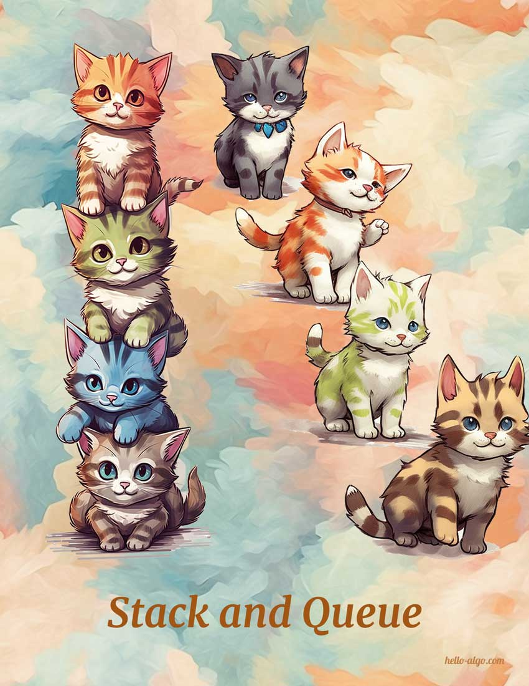

# Stack and Queue

!!! abstract

    Stacks are like stacking cats, while queues are like cats lining up.
    
    They respectively represent the logical relationships of Last-In-First-Out (LIFO) and First-In-First-Out (FIFO).
