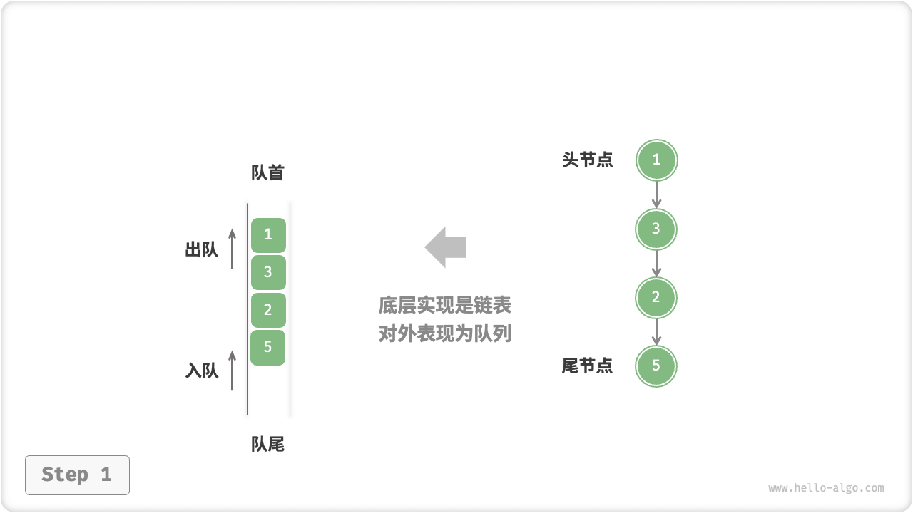
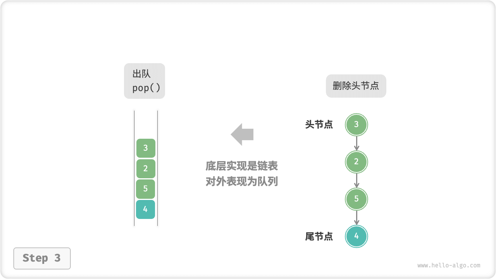
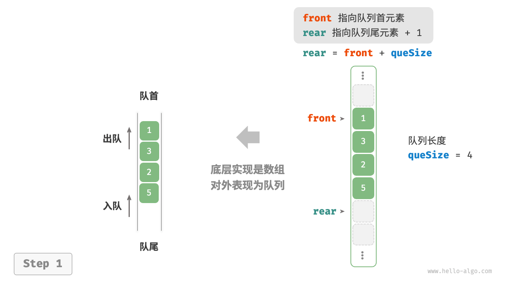
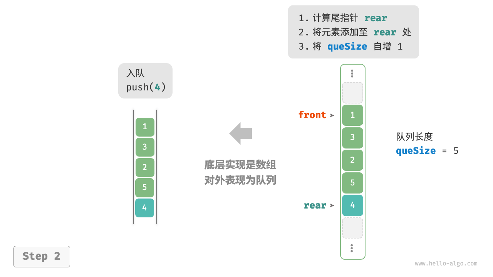

# Queue

A "queue" is a linear data structure that follows the first-in-first-out rule. As the name suggests, a queue simulates the phenomenon of queuing, where newcomers keep joining the tail end of the queue and those at the head of the queue leave one by one.

As shown in the figure below, we will call the head of the queue "head", the tail is called "tail", the operation of adding elements to the tail is called "queue", the operation of deleting elements from the head of the queue is called "queue". called "out of the queue".


## Queue Common Operations

The common operations of queues are shown in the table below. Note that method names may vary from one programming language to another. We use the same method names as stack here.

<p align="center"> Table <id> &nbsp; Efficiency of Queue Operations </p>

| method name | description                                                   | time complexity |
| ----------- | ------------------------------------------------------------- | --------------- |
| push()      | Element in queue, i.e. adding element to the end of the queue | $O(1)$          |
| pop()       | queue head element out                                        | $O(1)$          |
| peek()      | access the first element of the queue                         | $O(1)$          |

We can just use the queue class that is readily available in the programming language.

=== "Python"

    ```python title="queue.py"
    # Initialize the queue
    # In Python, we generally think of the double-ended queue class, deque, as a queue.
    # Although queue.Queue() is a pure queue class, it's not very usable, so it's not recommended.
    que: deque[int] = collections.deque()
   
    # Elements in the queue
    que.append(1)
    que.append(3)
    que.append(2)
    que.append(5)
    que.append(4)
   
    # Access to the first element of the queue
    front: int = que[0];
   
    # Element out of line
    pop: int = que.popleft()
   
    # Get the length of the queue
    size: int = len(que)
   
    # Determine if the queue is empty
    is_empty: bool = len(que) == 0
    ```

=== "C++"

    ```cpp title="queue.cpp"
    /* Initialize Queue */
    queue<int> queue;
   
    /* Element in queue */
    queue.push(1);
    queue.push(3);
    queue.push(2);
    queue.push(5);
    queue.push(4);
   
    /* Access to the first element of the queue */
    int front = queue.front();
   
    /* Element out of line */
    queue.pop();
   
    /* Get the length of the queue */
    int size = queue.size();
   
    /* Determine if the queue is empty */
    bool empty = queue.empty();
    ```

=== "Java"

    ```java title="queue.java"
    /* Initialize Queue */
    Queue<Integer> queue = new LinkedList<>();
   
    /* Element in queue */
    queue.offer(1);
    queue.offer(3);
    queue.offer(2);
    queue.offer(5);
    queue.offer(4);
   
    /* Access to the first element of the queue */
    int peek = queue.peek();
   
    /* Element out of line */
    int pop = queue.poll();
   
    /* Get the length of the queue */
    int size = queue.size();
   
    /* Determine if the queue is empty */
    boolean isEmpty = queue.isEmpty();
    ```

=== "C#"

    ```csharp title="queue.cs"
    /* Initialize Queue */
    Queue<int> queue = new();
   
    /* Element in queue */
    queue.Enqueue(1);
    queue.Enqueue(3);
    queue.Enqueue(2);
    queue.Enqueue(5);
    queue.Enqueue(4);
   
    /* Access to the first element of the queue */
    int peek = queue.Peek();
   
    /* Element out of line */
    int pop = queue.Dequeue();
   
    /* Get the length of the queue */
    int size = queue.Count;
   
    /* Determine if the queue is empty */
    bool isEmpty = queue.Count == 0;
    ```

=== "Go"

    ```go title="queue_test.go"
    /* Initialize Queue */
    // In Go, use lists as queues.
    queue := list.New()
   
    /* Element in queue */
    queue.PushBack(1)
    queue.PushBack(3)
    queue.PushBack(2)
    queue.PushBack(5)
    queue.PushBack(4)
   
    /* Access to the first element of the queue */
    peek := queue.Front()
   
    /* Element out of line */
    pop := queue.Front()
    queue.Remove(pop)
   
    /* Get the length of the queue */
    size := queue.Len()
   
    /* Determine if the queue is empty */
    isEmpty := queue.Len() == 0
    ```

=== "Swift"

    ```swift title="queue.swift"
    /* Initialize Queue */
    // Swift doesn't have a built-in queue class, so you can use Array as a queue.
    var queue: [Int] = []
   
    /* Element in queue */
    queue.append(1)
    queue.append(3)
    queue.append(2)
    queue.append(5)
    queue.append(4)
   
    /* Access to the first element of the queue */
    let peek = queue.first!
   
    /* Element out of line */
    // The complexity of removeFirst is O(n) because it's an array.
    let pool = queue.removeFirst()
   
    /* Get the length of the queue */
    let size = queue.count
   
    /* Determine if the queue is empty */
    let isEmpty = queue.isEmpty
    ```

=== "JS"

    ```javascript title="queue.js"
    /* Initialize Queue */
    // JavaScript doesn't have a built-in queue, you can use Array as a queue.
    const queue = [];
   
    /* Element in queue */
    queue.push(1);
    queue.push(3);
    queue.push(2);
    queue.push(5);
    queue.push(4);
   
    /* Access to the first element of the queue */
    const peek = queue[0];
   
    /* Element out of line */
    // The underlying level is an array, so the time complexity of the shift() method is O(n)
    const pop = queue.shift();
   
    /* Get the length of the queue */
    const size = queue.length;
   
    /* Determine if the queue is empty */
    const empty = queue.length === 0;
    ```

=== "TS"

    ```typescript title="queue.ts"
    /* Initialize Queue */
    // TypeScript doesn't have a built-in queue; you can use Array as a queue.
    const queue: number[] = [];
   
    /* Element in queue */
    queue.push(1);
    queue.push(3);
    queue.push(2);
    queue.push(5);
    queue.push(4);
   
    /* Access to the first element of the queue */
    const peek = queue[0];
   
    /* Element out of line */
    // The underlying level is an array, so the time complexity of the shift() method is O(n)
    const pop = queue.shift();
   
    /* Get the length of the queue */
    const size = queue.length;
   
    /* Determine if the queue is empty */
    const empty = queue.length === 0;
    ```

=== "Dart"

    ```dart title="queue.dart"
    /* Initialize Queue */
    // In Dart, the queue class Qeque is a double-ended queue and can also be used as a queue
    Queue<int> queue = Queue();

    /* Element in queue */
    queue.add(1);
    queue.add(3);
    queue.add(2);
    queue.add(5);
    queue.add(4);

    /* Access to the first element of the queue */
    int peek = queue.first;

    /* Element out of line */
    int pop = queue.removeFirst();

    /* Get the length of the queue */
    int size = queue.length;

    /* Determine if the queue is empty */
    bool isEmpty = queue.isEmpty;
    ```

=== "Rust"

    ```rust title="queue.rs"
    /* Initialize double-ended queue */
    // Use a double-ended queue as a regular queue in Rust
    let mut deque: VecDeque<u32> = VecDeque::new();

    /* Element in queue */
    deque.push_back(1);
    deque.push_back(3);
    deque.push_back(2);
    deque.push_back(5);
    deque.push_back(4);

    /* Access to the first element of the queue */
    if let Some(front) = deque.front() {
    }

    /* Element out of line */
    if let Some(pop) = deque.pop_front() {
    }

    /* Get the length of the queue */
    let size = deque.len();

    /* Determine if the queue is empty */
    let is_empty = deque.is_empty();
    ```

=== "C"

    ```c title="queue.c"
    // C does not provide a built-in queue
    ```

=== "Zig"

    ```zig title="queue.zig"

    ```

## Queue Implementation

To implement a queue, we need a data structure that can add elements at one end and remove elements at the other. Therefore, both linked lists and arrays can be used to implement queues.

### A Linked List Based Implementation

As shown in the figure below, we can consider the "head node" and "tail node" of the linked list as the "head" and "tail" respectively. "The tail node can only add nodes and the head node can only delete nodes.

=== "LinkedListQueue"
    

=== "push()"
    

=== "pop()"
    

Here is the code to implement a queue with a linked list.

```src
[file]{linkedlist_queue}-[class]{linked_list_queue}-[func]{}
```

### An Array-Based Implementation

Since the time complexity of deleting the first element of an array is $O(n)$ , this can lead to less efficient out-of-queue operations. However, we can avoid this problem by using the following clever approach.

We can use a variable `front` to point to the index of the element at the head of the queue, and maintain a variable `size` to record the length of the queue. Define `rear = front + size` and this formula calculates `rear` to point to the next position after the end element of the queue.

Based on this design, **the valid interval of the elements contained in the array is `[front, rear - 1]`**, and the various operations are implemented as shown in the figure below.

- Queue entry operation: assign the input element at the `rear` index and increase `size` by 1.
- Operation: Simply increase `front` by 1 and decrease `size` by 1.

It can be seen that both the queue-in and queue-out operations need to be performed only once, and both have a time complexity of $O(1)$ .

=== "ArrayQueue"
    

=== "push()"
    

=== "pop()"
    

You may notice a problem: `front` and `rear` are both moving to the right as they keep moving in and out of the array, **and when they reach the end of the array, they can't move any further**. To solve this problem, we can think of the array as a "circular array" with the first and last arrays connected.

For circular arrays, we need to have `front` or `rear` return to the head of the array when it crosses the end of the array to continue traversing. This periodicity can be achieved by the "remainder operation", as shown in the following code.

```src
[file]{array_queue}-[class]{array_queue}-[func]{}
```

The above implementation of the queue still has the limitation that its length is immutable. However, this problem is not difficult to solve, we can replace the array with a dynamic array, thus introducing an expansion mechanism. Interested students can try to implement their own.

The conclusions of the comparison of the two implementations are consistent with the stack and will not be repeated here.

## Typical Applications Of Queues

- **Taobao Orders**. After a shopper places an order, the order will be added to the queue, and the system will then process the orders in the queue sequentially according to the order. During the double eleven period, a huge number of orders will be generated in a short period of time, and high concurrency becomes a problem that engineers need to focus on.
- **All kinds of to-do lists**. Any scenario that requires "first-come-first-served" functionality, such as a task queue for a printer, a queue for a restaurant, and so on. Queues can be used in these scenarios to efficiently maintain processing order.
