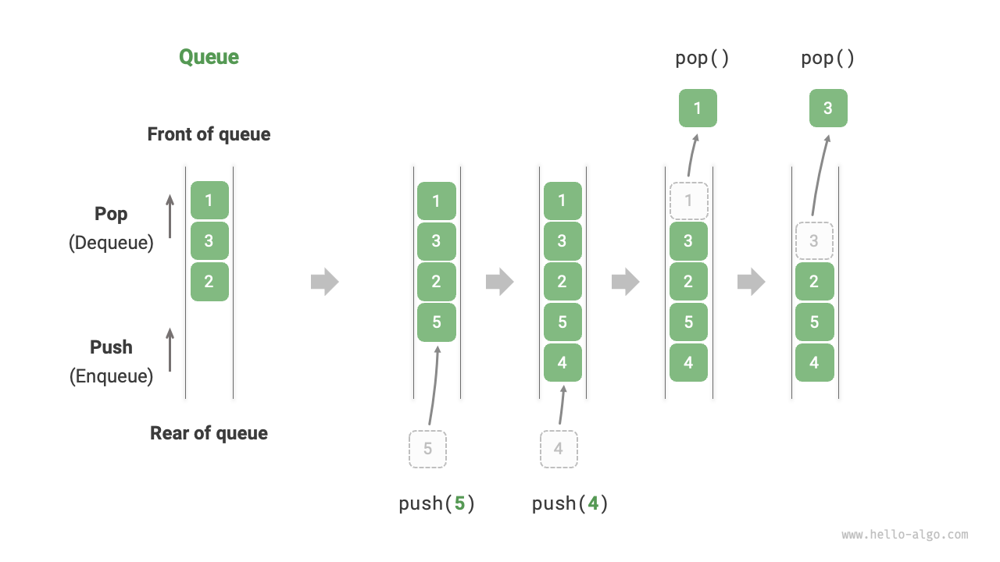
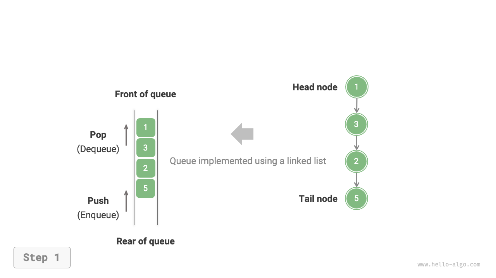
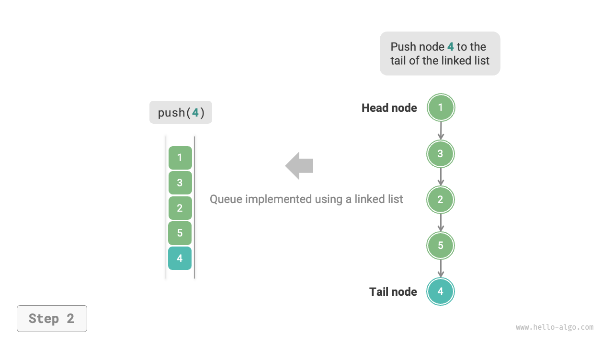
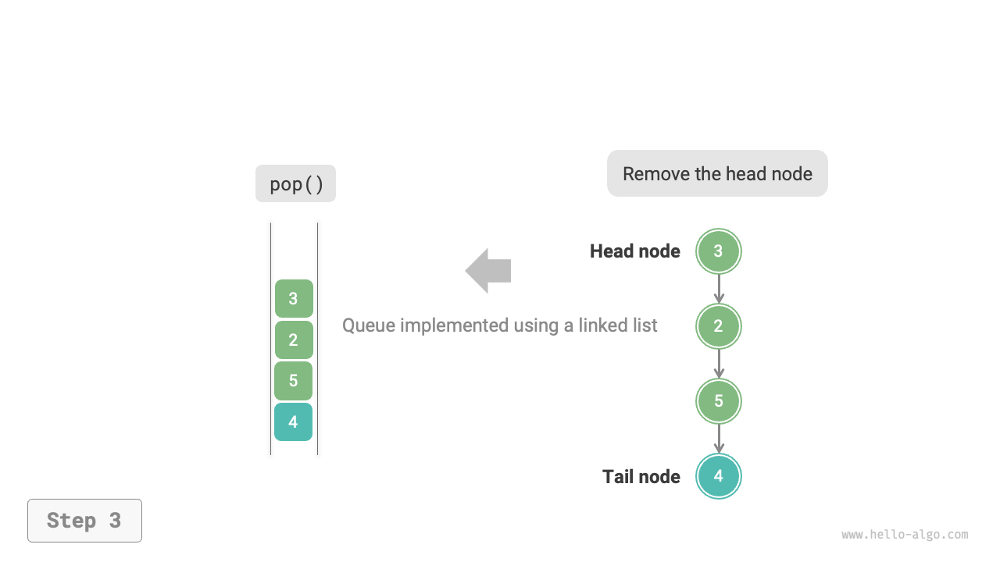
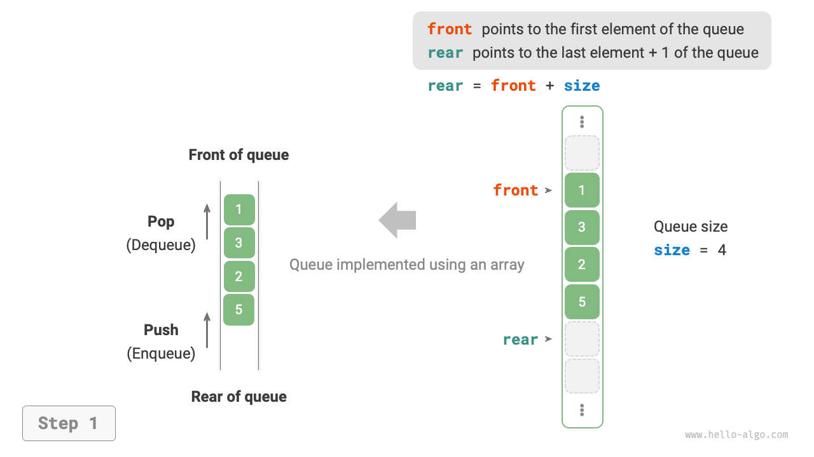
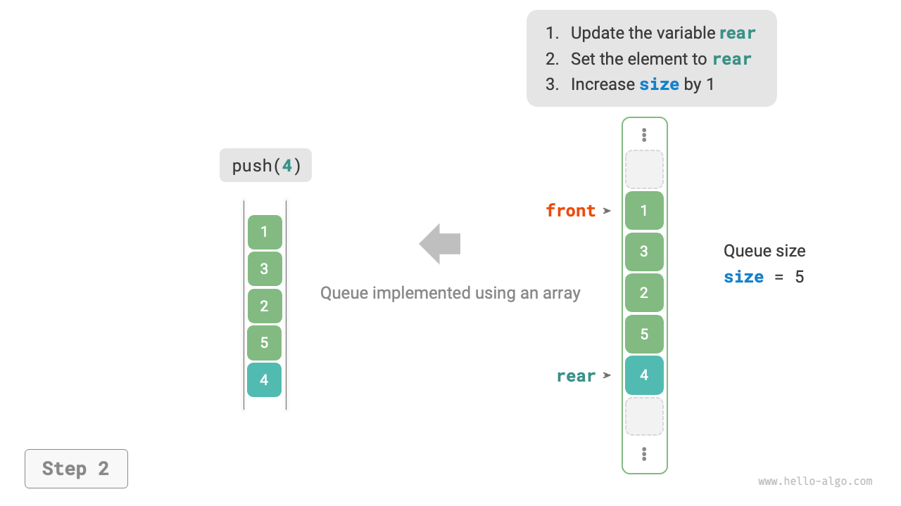
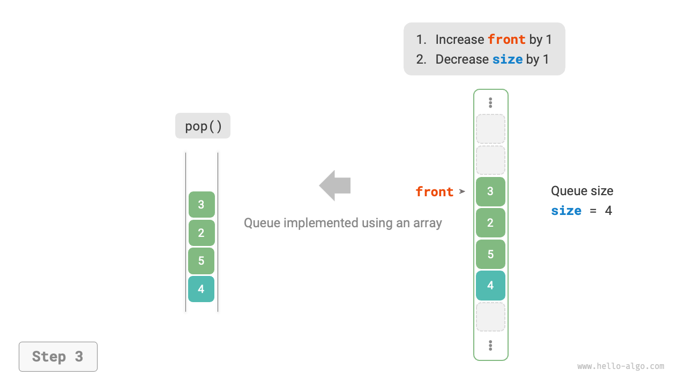

# 5.2 &nbsp; Queue

"Queue" is a linear data structure that follows the First-In-First-Out (FIFO) rule. As the name suggests, a queue simulates the phenomenon of lining up, where newcomers join the queue at the rear, and the person at the front leaves the queue first.

As shown in the Figure 5-4 , we call the front of the queue the "head" and the back the "tail." The operation of adding elements to the rear of the queue is termed "enqueue," and the operation of removing elements from the front is termed "dequeue."

{ class="animation-figure" }

<p align="center"> Figure 5-4 &nbsp; Queue's First-In-First-Out Rule </p>

## 5.2.1 &nbsp; Common Operations on Queue

The common operations on a queue are shown in the Table 5-2 . Note that method names may vary across different programming languages. Here, we use the same naming convention as that used for stacks.

<p align="center"> Table 5-2 &nbsp; Efficiency of Queue Operations </p>

<div class="center-table" markdown>

| Method Name | Description                            | Time Complexity |
| ----------- | -------------------------------------- | --------------- |
| `push()`    | Enqueue an element, add it to the tail | $O(1)$          |
| `pop()`     | Dequeue the head element               | $O(1)$          |
| `peek()`    | Access the head element                | $O(1)$          |

</div>

We can directly use the ready-made queue classes in programming languages:

=== "Python"

    ```python title="queue.py"
    from collections import deque

    # Initialize the queue
    # In Python, we generally use the deque class as a queue
    # Although queue.Queue() is a pure queue class, it's not very user-friendly, so it's not recommended
    que: deque[int] = deque()

    # Enqueue elements
    que.append(1)
    que.append(3)
    que.append(2)
    que.append(5)
    que.append(4)

    # Access the first element
    front: int = que[0]

    # Dequeue an element
    pop: int = que.popleft()

    # Get the length of the queue
    size: int = len(que)

    # Check if the queue is empty
    is_empty: bool = len(que) == 0
    ```

=== "C++"

    ```cpp title="queue.cpp"
    /* Initialize the queue */
    queue<int> queue;

    /* Enqueue elements */
    queue.push(1);
    queue.push(3);
    queue.push(2);
    queue.push(5);
    queue.push(4);

    /* Access the first element*/
    int front = queue.front();

    /* Dequeue an element */
    queue.pop();

    /* Get the length of the queue */
    int size = queue.size();

    /* Check if the queue is empty */
    bool empty = queue.empty();
    ```

=== "Java"

    ```java title="queue.java"
    /* Initialize the queue */
    Queue<Integer> queue = new LinkedList<>();

    /* Enqueue elements */
    queue.offer(1);
    queue.offer(3);
    queue.offer(2);
    queue.offer(5);
    queue.offer(4);

    /* Access the first element */
    int peek = queue.peek();

    /* Dequeue an element */
    int pop = queue.poll();

    /* Get the length of the queue */
    int size = queue.size();

    /* Check if the queue is empty */
    boolean isEmpty = queue.isEmpty();
    ```

=== "C#"

    ```csharp title="queue.cs"
    /* Initialize the queue */
    Queue<int> queue = new();

    /* Enqueue elements */
    queue.Enqueue(1);
    queue.Enqueue(3);
    queue.Enqueue(2);
    queue.Enqueue(5);
    queue.Enqueue(4);

    /* Access the first element */
    int peek = queue.Peek();

    /* Dequeue an element */
    int pop = queue.Dequeue();

    /* Get the length of the queue */
    int size = queue.Count;

    /* Check if the queue is empty */
    bool isEmpty = queue.Count == 0;
    ```

=== "Go"

    ```go title="queue_test.go"
    /* Initialize the queue */
    // In Go, use list as a queue
    queue := list.New()

    /* Enqueue elements */
    queue.PushBack(1)
    queue.PushBack(3)
    queue.PushBack(2)
    queue.PushBack(5)
    queue.PushBack(4)

    /* Access the first element */
    peek := queue.Front()

    /* Dequeue an element */
    pop := queue.Front()
    queue.Remove(pop)

    /* Get the length of the queue */
    size := queue.Len()

    /* Check if the queue is empty */
    isEmpty := queue.Len() == 0
    ```

=== "Swift"

    ```swift title="queue.swift"
    /* Initialize the queue */
    // Swift does not have a built-in queue class, so Array can be used as a queue
    var queue: [Int] = []

    /* Enqueue elements */
    queue.append(1)
    queue.append(3)
    queue.append(2)
    queue.append(5)
    queue.append(4)

    /* Access the first element */
    let peek = queue.first!

    /* Dequeue an element */
    // Since it's an array, removeFirst has a complexity of O(n)
    let pool = queue.removeFirst()

    /* Get the length of the queue */
    let size = queue.count

    /* Check if the queue is empty */
    let isEmpty = queue.isEmpty
    ```

=== "JS"

    ```javascript title="queue.js"
    /* Initialize the queue */
    // JavaScript does not have a built-in queue, so Array can be used as a queue
    const queue = [];

    /* Enqueue elements */
    queue.push(1);
    queue.push(3);
    queue.push(2);
    queue.push(5);
    queue.push(4);

    /* Access the first element */
    const peek = queue[0];

    /* Dequeue an element */
    // Since the underlying structure is an array, shift() method has a time complexity of O(n)
    const pop = queue.shift();

    /* Get the length of the queue */
    const size = queue.length;

    /* Check if the queue is empty */
    const empty = queue.length === 0;
    ```

=== "TS"

    ```typescript title="queue.ts"
    /* Initialize the queue */
    // TypeScript does not have a built-in queue, so Array can be used as a queue 
    const queue: number[] = [];

    /* Enqueue elements */
    queue.push(1);
    queue.push(3);
    queue.push(2);
    queue.push(5);
    queue.push(4);

    /* Access the first element */
    const peek = queue[0];

    /* Dequeue an element */
    // Since the underlying structure is an array, shift() method has a time complexity of O(n)
    const pop = queue.shift();

    /* Get the length of the queue */
    const size = queue.length;

    /* Check if the queue is empty */
    const empty = queue.length === 0;
    ```

=== "Dart"

    ```dart title="queue.dart"
    /* Initialize the queue */
    // In Dart, the Queue class is a double-ended queue but can be used as a queue
    Queue<int> queue = Queue();

    /* Enqueue elements */
    queue.add(1);
    queue.add(3);
    queue.add(2);
    queue.add(5);
    queue.add(4);

    /* Access the first element */
    int peek = queue.first;

    /* Dequeue an element */
    int pop = queue.removeFirst();

    /* Get the length of the queue */
    int size = queue.length;

    /* Check if the queue is empty */
    bool isEmpty = queue.isEmpty;
    ```

=== "Rust"

    ```rust title="queue.rs"
    /* Initialize the double-ended queue */
    // In Rust, use a double-ended queue as a regular queue
    let mut deque: VecDeque<u32> = VecDeque::new();

    /* Enqueue elements */
    deque.push_back(1);
    deque.push_back(3);
    deque.push_back(2);
    deque.push_back(5);
    deque.push_back(4);

    /* Access the first element */
    if let Some(front) = deque.front() {
    }

    /* Dequeue an element */
    if let Some(pop) = deque.pop_front() {
    }

    /* Get the length of the queue */
    let size = deque.len();

    /* Check if the queue is empty */
    let is_empty = deque.is_empty();
    ```

=== "C"

    ```c title="queue.c"
    // C does not provide a built-in queue
    ```

=== "Zig"

    ```zig title="queue.zig"

    ```

??? pythontutor "Code Visualization"

    <div style="height: 549px; width: 100%;"><iframe class="pythontutor-iframe" src="https://pythontutor.com/iframe-embed.html#code=from%20collections%20import%20deque%0A%0A%22%22%22Driver%20Code%22%22%22%0Aif%20__name__%20%3D%3D%20%22__main__%22%3A%0A%20%20%20%20%23%20%E5%88%9D%E5%A7%8B%E5%8C%96%E9%98%9F%E5%88%97%0A%20%20%20%20%23%20%E5%9C%A8%20Python%20%E4%B8%AD%EF%BC%8C%E6%88%91%E4%BB%AC%E4%B8%80%E8%88%AC%E5%B0%86%E5%8F%8C%E5%90%91%E9%98%9F%E5%88%97%E7%B1%BB%20deque%20%E7%9C%8B%E4%BD%9C%E9%98%9F%E5%88%97%E4%BD%BF%E7%94%A8%0A%20%20%20%20%23%20%E8%99%BD%E7%84%B6%20queue.Queue%28%29%20%E6%98%AF%E7%BA%AF%E6%AD%A3%E7%9A%84%E9%98%9F%E5%88%97%E7%B1%BB%EF%BC%8C%E4%BD%86%E4%B8%8D%E5%A4%AA%E5%A5%BD%E7%94%A8%0A%20%20%20%20que%20%3D%20deque%28%29%0A%0A%20%20%20%20%23%20%E5%85%83%E7%B4%A0%E5%85%A5%E9%98%9F%0A%20%20%20%20que.append%281%29%0A%20%20%20%20que.append%283%29%0A%20%20%20%20que.append%282%29%0A%20%20%20%20que.append%285%29%0A%20%20%20%20que.append%284%29%0A%20%20%20%20print%28%22%E9%98%9F%E5%88%97%20que%20%3D%22,%20que%29%0A%0A%20%20%20%20%23%20%E8%AE%BF%E9%97%AE%E9%98%9F%E9%A6%96%E5%85%83%E7%B4%A0%0A%20%20%20%20front%20%3D%20que%5B0%5D%0A%20%20%20%20print%28%22%E9%98%9F%E9%A6%96%E5%85%83%E7%B4%A0%20front%20%3D%22,%20front%29%0A%0A%20%20%20%20%23%20%E5%85%83%E7%B4%A0%E5%87%BA%E9%98%9F%0A%20%20%20%20pop%20%3D%20que.popleft%28%29%0A%20%20%20%20print%28%22%E5%87%BA%E9%98%9F%E5%85%83%E7%B4%A0%20pop%20%3D%22,%20pop%29%0A%20%20%20%20print%28%22%E5%87%BA%E9%98%9F%E5%90%8E%20que%20%3D%22,%20que%29%0A%0A%20%20%20%20%23%20%E8%8E%B7%E5%8F%96%E9%98%9F%E5%88%97%E7%9A%84%E9%95%BF%E5%BA%A6%0A%20%20%20%20size%20%3D%20len%28que%29%0A%20%20%20%20print%28%22%E9%98%9F%E5%88%97%E9%95%BF%E5%BA%A6%20size%20%3D%22,%20size%29%0A%0A%20%20%20%20%23%20%E5%88%A4%E6%96%AD%E9%98%9F%E5%88%97%E6%98%AF%E5%90%A6%E4%B8%BA%E7%A9%BA%0A%20%20%20%20is_empty%20%3D%20len%28que%29%20%3D%3D%200%0A%20%20%20%20print%28%22%E9%98%9F%E5%88%97%E6%98%AF%E5%90%A6%E4%B8%BA%E7%A9%BA%20%3D%22,%20is_empty%29&codeDivHeight=472&codeDivWidth=350&cumulative=false&curInstr=3&heapPrimitives=nevernest&origin=opt-frontend.js&py=311&rawInputLstJSON=%5B%5D&textReferences=false"> </iframe></div>
    <div style="margin-top: 5px;"><a href="https://pythontutor.com/iframe-embed.html#code=from%20collections%20import%20deque%0A%0A%22%22%22Driver%20Code%22%22%22%0Aif%20__name__%20%3D%3D%20%22__main__%22%3A%0A%20%20%20%20%23%20%E5%88%9D%E5%A7%8B%E5%8C%96%E9%98%9F%E5%88%97%0A%20%20%20%20%23%20%E5%9C%A8%20Python%20%E4%B8%AD%EF%BC%8C%E6%88%91%E4%BB%AC%E4%B8%80%E8%88%AC%E5%B0%86%E5%8F%8C%E5%90%91%E9%98%9F%E5%88%97%E7%B1%BB%20deque%20%E7%9C%8B%E4%BD%9C%E9%98%9F%E5%88%97%E4%BD%BF%E7%94%A8%0A%20%20%20%20%23%20%E8%99%BD%E7%84%B6%20queue.Queue%28%29%20%E6%98%AF%E7%BA%AF%E6%AD%A3%E7%9A%84%E9%98%9F%E5%88%97%E7%B1%BB%EF%BC%8C%E4%BD%86%E4%B8%8D%E5%A4%AA%E5%A5%BD%E7%94%A8%0A%20%20%20%20que%20%3D%20deque%28%29%0A%0A%20%20%20%20%23%20%E5%85%83%E7%B4%A0%E5%85%A5%E9%98%9F%0A%20%20%20%20que.append%281%29%0A%20%20%20%20que.append%283%29%0A%20%20%20%20que.append%282%29%0A%20%20%20%20que.append%285%29%0A%20%20%20%20que.append%284%29%0A%20%20%20%20print%28%22%E9%98%9F%E5%88%97%20que%20%3D%22,%20que%29%0A%0A%20%20%20%20%23%20%E8%AE%BF%E9%97%AE%E9%98%9F%E9%A6%96%E5%85%83%E7%B4%A0%0A%20%20%20%20front%20%3D%20que%5B0%5D%0A%20%20%20%20print%28%22%E9%98%9F%E9%A6%96%E5%85%83%E7%B4%A0%20front%20%3D%22,%20front%29%0A%0A%20%20%20%20%23%20%E5%85%83%E7%B4%A0%E5%87%BA%E9%98%9F%0A%20%20%20%20pop%20%3D%20que.popleft%28%29%0A%20%20%20%20print%28%22%E5%87%BA%E9%98%9F%E5%85%83%E7%B4%A0%20pop%20%3D%22,%20pop%29%0A%20%20%20%20print%28%22%E5%87%BA%E9%98%9F%E5%90%8E%20que%20%3D%22,%20que%29%0A%0A%20%20%20%20%23%20%E8%8E%B7%E5%8F%96%E9%98%9F%E5%88%97%E7%9A%84%E9%95%BF%E5%BA%A6%0A%20%20%20%20size%20%3D%20len%28que%29%0A%20%20%20%20print%28%22%E9%98%9F%E5%88%97%E9%95%BF%E5%BA%A6%20size%20%3D%22,%20size%29%0A%0A%20%20%20%20%23%20%E5%88%A4%E6%96%AD%E9%98%9F%E5%88%97%E6%98%AF%E5%90%A6%E4%B8%BA%E7%A9%BA%0A%20%20%20%20is_empty%20%3D%20len%28que%29%20%3D%3D%200%0A%20%20%20%20print%28%22%E9%98%9F%E5%88%97%E6%98%AF%E5%90%A6%E4%B8%BA%E7%A9%BA%20%3D%22,%20is_empty%29&codeDivHeight=800&codeDivWidth=600&cumulative=false&curInstr=3&heapPrimitives=nevernest&origin=opt-frontend.js&py=311&rawInputLstJSON=%5B%5D&textReferences=false" target="_blank" rel="noopener noreferrer">Full Screen ></a></div>

## 5.2.2 &nbsp; Implementing a Queue

To implement a queue, we need a data structure that allows adding elements at one end and removing them at the other. Both linked lists and arrays meet this requirement.

### 1. &nbsp; Implementation Based on a Linked List

As shown in the Figure 5-5 , we can consider the "head node" and "tail node" of a linked list as the "front" and "rear" of the queue, respectively. It is stipulated that nodes can only be added at the rear and removed at the front.

=== "LinkedListQueue"
    { class="animation-figure" }

=== "push()"
    { class="animation-figure" }

=== "pop()"
    { class="animation-figure" }

<p align="center"> Figure 5-5 &nbsp; Implementing Queue with Linked List for Enqueue and Dequeue Operations </p>

Below is the code for implementing a queue using a linked list:

=== "Python"

    ```python title="linkedlist_queue.py"
    class LinkedListQueue:
        """基于链表实现的队列"""

        def __init__(self):
            """构造方法"""
            self._front: ListNode | None = None  # 头节点 front
            self._rear: ListNode | None = None  # 尾节点 rear
            self._size: int = 0

        def size(self) -> int:
            """获取队列的长度"""
            return self._size

        def is_empty(self) -> bool:
            """判断队列是否为空"""
            return not self._front

        def push(self, num: int):
            """入队"""
            # 在尾节点后添加 num
            node = ListNode(num)
            # 如果队列为空，则令头、尾节点都指向该节点
            if self._front is None:
                self._front = node
                self._rear = node
            # 如果队列不为空，则将该节点添加到尾节点后
            else:
                self._rear.next = node
                self._rear = node
            self._size += 1

        def pop(self) -> int:
            """出队"""
            num = self.peek()
            # 删除头节点
            self._front = self._front.next
            self._size -= 1
            return num

        def peek(self) -> int:
            """访问队首元素"""
            if self.is_empty():
                raise IndexError("队列为空")
            return self._front.val

        def to_list(self) -> list[int]:
            """转化为列表用于打印"""
            queue = []
            temp = self._front
            while temp:
                queue.append(temp.val)
                temp = temp.next
            return queue
    ```

=== "C++"

    ```cpp title="linkedlist_queue.cpp"
    /* 基于链表实现的队列 */
    class LinkedListQueue {
      private:
        ListNode *front, *rear; // 头节点 front ，尾节点 rear
        int queSize;

      public:
        LinkedListQueue() {
            front = nullptr;
            rear = nullptr;
            queSize = 0;
        }

        ~LinkedListQueue() {
            // 遍历链表删除节点，释放内存
            freeMemoryLinkedList(front);
        }

        /* 获取队列的长度 */
        int size() {
            return queSize;
        }

        /* 判断队列是否为空 */
        bool isEmpty() {
            return queSize == 0;
        }

        /* 入队 */
        void push(int num) {
            // 在尾节点后添加 num
            ListNode *node = new ListNode(num);
            // 如果队列为空，则令头、尾节点都指向该节点
            if (front == nullptr) {
                front = node;
                rear = node;
            }
            // 如果队列不为空，则将该节点添加到尾节点后
            else {
                rear->next = node;
                rear = node;
            }
            queSize++;
        }

        /* 出队 */
        int pop() {
            int num = peek();
            // 删除头节点
            ListNode *tmp = front;
            front = front->next;
            // 释放内存
            delete tmp;
            queSize--;
            return num;
        }

        /* 访问队首元素 */
        int peek() {
            if (size() == 0)
                throw out_of_range("队列为空");
            return front->val;
        }

        /* 将链表转化为 Vector 并返回 */
        vector<int> toVector() {
            ListNode *node = front;
            vector<int> res(size());
            for (int i = 0; i < res.size(); i++) {
                res[i] = node->val;
                node = node->next;
            }
            return res;
        }
    };
    ```

=== "Java"

    ```java title="linkedlist_queue.java"
    /* 基于链表实现的队列 */
    class LinkedListQueue {
        private ListNode front, rear; // 头节点 front ，尾节点 rear
        private int queSize = 0;

        public LinkedListQueue() {
            front = null;
            rear = null;
        }

        /* 获取队列的长度 */
        public int size() {
            return queSize;
        }

        /* 判断队列是否为空 */
        public boolean isEmpty() {
            return size() == 0;
        }

        /* 入队 */
        public void push(int num) {
            // 在尾节点后添加 num
            ListNode node = new ListNode(num);
            // 如果队列为空，则令头、尾节点都指向该节点
            if (front == null) {
                front = node;
                rear = node;
            // 如果队列不为空，则将该节点添加到尾节点后
            } else {
                rear.next = node;
                rear = node;
            }
            queSize++;
        }

        /* 出队 */
        public int pop() {
            int num = peek();
            // 删除头节点
            front = front.next;
            queSize--;
            return num;
        }

        /* 访问队首元素 */
        public int peek() {
            if (isEmpty())
                throw new IndexOutOfBoundsException();
            return front.val;
        }

        /* 将链表转化为 Array 并返回 */
        public int[] toArray() {
            ListNode node = front;
            int[] res = new int[size()];
            for (int i = 0; i < res.length; i++) {
                res[i] = node.val;
                node = node.next;
            }
            return res;
        }
    }
    ```

=== "C#"

    ```csharp title="linkedlist_queue.cs"
    /* 基于链表实现的队列 */
    class LinkedListQueue {
        ListNode? front, rear;  // 头节点 front ，尾节点 rear 
        int queSize = 0;

        public LinkedListQueue() {
            front = null;
            rear = null;
        }

        /* 获取队列的长度 */
        public int Size() {
            return queSize;
        }

        /* 判断队列是否为空 */
        public bool IsEmpty() {
            return Size() == 0;
        }

        /* 入队 */
        public void Push(int num) {
            // 在尾节点后添加 num
            ListNode node = new(num);
            // 如果队列为空，则令头、尾节点都指向该节点
            if (front == null) {
                front = node;
                rear = node;
                // 如果队列不为空，则将该节点添加到尾节点后
            } else if (rear != null) {
                rear.next = node;
                rear = node;
            }
            queSize++;
        }

        /* 出队 */
        public int Pop() {
            int num = Peek();
            // 删除头节点
            front = front?.next;
            queSize--;
            return num;
        }

        /* 访问队首元素 */
        public int Peek() {
            if (IsEmpty())
                throw new Exception();
            return front!.val;
        }

        /* 将链表转化为 Array 并返回 */
        public int[] ToArray() {
            if (front == null)
                return [];

            ListNode? node = front;
            int[] res = new int[Size()];
            for (int i = 0; i < res.Length; i++) {
                res[i] = node!.val;
                node = node.next;
            }
            return res;
        }
    }
    ```

=== "Go"

    ```go title="linkedlist_queue.go"
    /* 基于链表实现的队列 */
    type linkedListQueue struct {
        // 使用内置包 list 来实现队列
        data *list.List
    }

    /* 初始化队列 */
    func newLinkedListQueue() *linkedListQueue {
        return &linkedListQueue{
            data: list.New(),
        }
    }

    /* 入队 */
    func (s *linkedListQueue) push(value any) {
        s.data.PushBack(value)
    }

    /* 出队 */
    func (s *linkedListQueue) pop() any {
        if s.isEmpty() {
            return nil
        }
        e := s.data.Front()
        s.data.Remove(e)
        return e.Value
    }

    /* 访问队首元素 */
    func (s *linkedListQueue) peek() any {
        if s.isEmpty() {
            return nil
        }
        e := s.data.Front()
        return e.Value
    }

    /* 获取队列的长度 */
    func (s *linkedListQueue) size() int {
        return s.data.Len()
    }

    /* 判断队列是否为空 */
    func (s *linkedListQueue) isEmpty() bool {
        return s.data.Len() == 0
    }

    /* 获取 List 用于打印 */
    func (s *linkedListQueue) toList() *list.List {
        return s.data
    }
    ```

=== "Swift"

    ```swift title="linkedlist_queue.swift"
    /* 基于链表实现的队列 */
    class LinkedListQueue {
        private var front: ListNode? // 头节点
        private var rear: ListNode? // 尾节点
        private var _size = 0

        init() {}

        /* 获取队列的长度 */
        func size() -> Int {
            _size
        }

        /* 判断队列是否为空 */
        func isEmpty() -> Bool {
            size() == 0
        }

        /* 入队 */
        func push(num: Int) {
            // 在尾节点后添加 num
            let node = ListNode(x: num)
            // 如果队列为空，则令头、尾节点都指向该节点
            if front == nil {
                front = node
                rear = node
            }
            // 如果队列不为空，则将该节点添加到尾节点后
            else {
                rear?.next = node
                rear = node
            }
            _size += 1
        }

        /* 出队 */
        @discardableResult
        func pop() -> Int {
            let num = peek()
            // 删除头节点
            front = front?.next
            _size -= 1
            return num
        }

        /* 访问队首元素 */
        func peek() -> Int {
            if isEmpty() {
                fatalError("队列为空")
            }
            return front!.val
        }

        /* 将链表转化为 Array 并返回 */
        func toArray() -> [Int] {
            var node = front
            var res = Array(repeating: 0, count: size())
            for i in res.indices {
                res[i] = node!.val
                node = node?.next
            }
            return res
        }
    }
    ```

=== "JS"

    ```javascript title="linkedlist_queue.js"
    /* 基于链表实现的队列 */
    class LinkedListQueue {
        #front; // 头节点 #front
        #rear; // 尾节点 #rear
        #queSize = 0;

        constructor() {
            this.#front = null;
            this.#rear = null;
        }

        /* 获取队列的长度 */
        get size() {
            return this.#queSize;
        }

        /* 判断队列是否为空 */
        isEmpty() {
            return this.size === 0;
        }

        /* 入队 */
        push(num) {
            // 在尾节点后添加 num
            const node = new ListNode(num);
            // 如果队列为空，则令头、尾节点都指向该节点
            if (!this.#front) {
                this.#front = node;
                this.#rear = node;
                // 如果队列不为空，则将该节点添加到尾节点后
            } else {
                this.#rear.next = node;
                this.#rear = node;
            }
            this.#queSize++;
        }

        /* 出队 */
        pop() {
            const num = this.peek();
            // 删除头节点
            this.#front = this.#front.next;
            this.#queSize--;
            return num;
        }

        /* 访问队首元素 */
        peek() {
            if (this.size === 0) throw new Error('队列为空');
            return this.#front.val;
        }

        /* 将链表转化为 Array 并返回 */
        toArray() {
            let node = this.#front;
            const res = new Array(this.size);
            for (let i = 0; i < res.length; i++) {
                res[i] = node.val;
                node = node.next;
            }
            return res;
        }
    }
    ```

=== "TS"

    ```typescript title="linkedlist_queue.ts"
    /* 基于链表实现的队列 */
    class LinkedListQueue {
        private front: ListNode | null; // 头节点 front
        private rear: ListNode | null; // 尾节点 rear
        private queSize: number = 0;

        constructor() {
            this.front = null;
            this.rear = null;
        }

        /* 获取队列的长度 */
        get size(): number {
            return this.queSize;
        }

        /* 判断队列是否为空 */
        isEmpty(): boolean {
            return this.size === 0;
        }

        /* 入队 */
        push(num: number): void {
            // 在尾节点后添加 num
            const node = new ListNode(num);
            // 如果队列为空，则令头、尾节点都指向该节点
            if (!this.front) {
                this.front = node;
                this.rear = node;
                // 如果队列不为空，则将该节点添加到尾节点后
            } else {
                this.rear!.next = node;
                this.rear = node;
            }
            this.queSize++;
        }

        /* 出队 */
        pop(): number {
            const num = this.peek();
            if (!this.front) throw new Error('队列为空');
            // 删除头节点
            this.front = this.front.next;
            this.queSize--;
            return num;
        }

        /* 访问队首元素 */
        peek(): number {
            if (this.size === 0) throw new Error('队列为空');
            return this.front!.val;
        }

        /* 将链表转化为 Array 并返回 */
        toArray(): number[] {
            let node = this.front;
            const res = new Array<number>(this.size);
            for (let i = 0; i < res.length; i++) {
                res[i] = node!.val;
                node = node!.next;
            }
            return res;
        }
    }
    ```

=== "Dart"

    ```dart title="linkedlist_queue.dart"
    /* 基于链表实现的队列 */
    class LinkedListQueue {
      ListNode? _front; // 头节点 _front
      ListNode? _rear; // 尾节点 _rear
      int _queSize = 0; // 队列长度

      LinkedListQueue() {
        _front = null;
        _rear = null;
      }

      /* 获取队列的长度 */
      int size() {
        return _queSize;
      }

      /* 判断队列是否为空 */
      bool isEmpty() {
        return _queSize == 0;
      }

      /* 入队 */
      void push(int _num) {
        // 在尾节点后添加 _num
        final node = ListNode(_num);
        // 如果队列为空，则令头、尾节点都指向该节点
        if (_front == null) {
          _front = node;
          _rear = node;
        } else {
          // 如果队列不为空，则将该节点添加到尾节点后
          _rear!.next = node;
          _rear = node;
        }
        _queSize++;
      }

      /* 出队 */
      int pop() {
        final int _num = peek();
        // 删除头节点
        _front = _front!.next;
        _queSize--;
        return _num;
      }

      /* 访问队首元素 */
      int peek() {
        if (_queSize == 0) {
          throw Exception('队列为空');
        }
        return _front!.val;
      }

      /* 将链表转化为 Array 并返回 */
      List<int> toArray() {
        ListNode? node = _front;
        final List<int> queue = [];
        while (node != null) {
          queue.add(node.val);
          node = node.next;
        }
        return queue;
      }
    }
    ```

=== "Rust"

    ```rust title="linkedlist_queue.rs"
    /* 基于链表实现的队列 */
    #[allow(dead_code)]
    pub struct LinkedListQueue<T> {
        front: Option<Rc<RefCell<ListNode<T>>>>, // 头节点 front
        rear: Option<Rc<RefCell<ListNode<T>>>>,  // 尾节点 rear
        que_size: usize,                         // 队列的长度
    }

    impl<T: Copy> LinkedListQueue<T> {
        pub fn new() -> Self {
            Self {
                front: None,
                rear: None,
                que_size: 0,
            }
        }

        /* 获取队列的长度 */
        pub fn size(&self) -> usize {
            return self.que_size;
        }

        /* 判断队列是否为空 */
        pub fn is_empty(&self) -> bool {
            return self.size() == 0;
        }

        /* 入队 */
        pub fn push(&mut self, num: T) {
            // 在尾节点后添加 num
            let new_rear = ListNode::new(num);
            match self.rear.take() {
                // 如果队列不为空，则将该节点添加到尾节点后
                Some(old_rear) => {
                    old_rear.borrow_mut().next = Some(new_rear.clone());
                    self.rear = Some(new_rear);
                }
                // 如果队列为空，则令头、尾节点都指向该节点
                None => {
                    self.front = Some(new_rear.clone());
                    self.rear = Some(new_rear);
                }
            }
            self.que_size += 1;
        }

        /* 出队 */
        pub fn pop(&mut self) -> Option<T> {
            self.front.take().map(|old_front| {
                match old_front.borrow_mut().next.take() {
                    Some(new_front) => {
                        self.front = Some(new_front);
                    }
                    None => {
                        self.rear.take();
                    }
                }
                self.que_size -= 1;
                Rc::try_unwrap(old_front).ok().unwrap().into_inner().val
            })
        }

        /* 访问队首元素 */
        pub fn peek(&self) -> Option<&Rc<RefCell<ListNode<T>>>> {
            self.front.as_ref()
        }

        /* 将链表转化为 Array 并返回 */
        pub fn to_array(&self, head: Option<&Rc<RefCell<ListNode<T>>>>) -> Vec<T> {
            if let Some(node) = head {
                let mut nums = self.to_array(node.borrow().next.as_ref());
                nums.insert(0, node.borrow().val);
                return nums;
            }
            return Vec::new();
        }
    }
    ```

=== "C"

    ```c title="linkedlist_queue.c"
    /* 基于链表实现的队列 */
    typedef struct {
        ListNode *front, *rear;
        int queSize;
    } LinkedListQueue;

    /* 构造函数 */
    LinkedListQueue *newLinkedListQueue() {
        LinkedListQueue *queue = (LinkedListQueue *)malloc(sizeof(LinkedListQueue));
        queue->front = NULL;
        queue->rear = NULL;
        queue->queSize = 0;
        return queue;
    }

    /* 析构函数 */
    void delLinkedListQueue(LinkedListQueue *queue) {
        // 释放所有节点
        while (queue->front != NULL) {
            ListNode *tmp = queue->front;
            queue->front = queue->front->next;
            free(tmp);
        }
        // 释放 queue 结构体
        free(queue);
    }

    /* 获取队列的长度 */
    int size(LinkedListQueue *queue) {
        return queue->queSize;
    }

    /* 判断队列是否为空 */
    bool empty(LinkedListQueue *queue) {
        return (size(queue) == 0);
    }

    /* 入队 */
    void push(LinkedListQueue *queue, int num) {
        // 尾节点处添加 node
        ListNode *node = newListNode(num);
        // 如果队列为空，则令头、尾节点都指向该节点
        if (queue->front == NULL) {
            queue->front = node;
            queue->rear = node;
        }
        // 如果队列不为空，则将该节点添加到尾节点后
        else {
            queue->rear->next = node;
            queue->rear = node;
        }
        queue->queSize++;
    }

    /* 访问队首元素 */
    int peek(LinkedListQueue *queue) {
        assert(size(queue) && queue->front);
        return queue->front->val;
    }

    /* 出队 */
    int pop(LinkedListQueue *queue) {
        int num = peek(queue);
        ListNode *tmp = queue->front;
        queue->front = queue->front->next;
        free(tmp);
        queue->queSize--;
        return num;
    }

    /* 打印队列 */
    void printLinkedListQueue(LinkedListQueue *queue) {
        int *arr = malloc(sizeof(int) * queue->queSize);
        // 拷贝链表中的数据到数组
        int i;
        ListNode *node;
        for (i = 0, node = queue->front; i < queue->queSize; i++) {
            arr[i] = node->val;
            node = node->next;
        }
        printArray(arr, queue->queSize);
        free(arr);
    }
    ```

=== "Zig"

    ```zig title="linkedlist_queue.zig"
    // 基于链表实现的队列
    fn LinkedListQueue(comptime T: type) type {
        return struct {
            const Self = @This();

            front: ?*inc.ListNode(T) = null,                // 头节点 front
            rear: ?*inc.ListNode(T) = null,                 // 尾节点 rear
            que_size: usize = 0,                            // 队列的长度
            mem_arena: ?std.heap.ArenaAllocator = null,
            mem_allocator: std.mem.Allocator = undefined,   // 内存分配器

            // 构造函数（分配内存+初始化队列）
            pub fn init(self: *Self, allocator: std.mem.Allocator) !void {
                if (self.mem_arena == null) {
                    self.mem_arena = std.heap.ArenaAllocator.init(allocator);
                    self.mem_allocator = self.mem_arena.?.allocator();
                }
                self.front = null;
                self.rear = null;
                self.que_size = 0;
            }

            // 析构函数（释放内存）
            pub fn deinit(self: *Self) void {
                if (self.mem_arena == null) return;
                self.mem_arena.?.deinit();
            }

            // 获取队列的长度
            pub fn size(self: *Self) usize {
                return self.que_size;
            }

            // 判断队列是否为空
            pub fn isEmpty(self: *Self) bool {
                return self.size() == 0;
            }

            // 访问队首元素
            pub fn peek(self: *Self) T {
                if (self.size() == 0) @panic("队列为空");
                return self.front.?.val;
            }  

            // 入队
            pub fn push(self: *Self, num: T) !void {
                // 在尾节点后添加 num
                var node = try self.mem_allocator.create(inc.ListNode(T));
                node.init(num);
                // 如果队列为空，则令头、尾节点都指向该节点
                if (self.front == null) {
                    self.front = node;
                    self.rear = node;
                // 如果队列不为空，则将该节点添加到尾节点后
                } else {
                    self.rear.?.next = node;
                    self.rear = node;
                }
                self.que_size += 1;
            } 

            // 出队
            pub fn pop(self: *Self) T {
                var num = self.peek();
                // 删除头节点
                self.front = self.front.?.next;
                self.que_size -= 1;
                return num;
            } 

            // 将链表转换为数组
            pub fn toArray(self: *Self) ![]T {
                var node = self.front;
                var res = try self.mem_allocator.alloc(T, self.size());
                @memset(res, @as(T, 0));
                var i: usize = 0;
                while (i < res.len) : (i += 1) {
                    res[i] = node.?.val;
                    node = node.?.next;
                }
                return res;
            }
        };
    }
    ```

??? pythontutor "Code Visualization"

    <div style="height: 549px; width: 100%;"><iframe class="pythontutor-iframe" src="https://pythontutor.com/iframe-embed.html#code=class%20ListNode%3A%0A%20%20%20%20%22%22%22%E9%93%BE%E8%A1%A8%E8%8A%82%E7%82%B9%E7%B1%BB%22%22%22%0A%20%20%20%20def%20__init__%28self,%20val%3A%20int%29%3A%0A%20%20%20%20%20%20%20%20self.val%3A%20int%20%3D%20val%20%20%23%20%E8%8A%82%E7%82%B9%E5%80%BC%0A%20%20%20%20%20%20%20%20self.next%3A%20ListNode%20%7C%20None%20%3D%20None%20%20%23%20%E5%90%8E%E7%BB%A7%E8%8A%82%E7%82%B9%E5%BC%95%E7%94%A8%0A%0A%0Aclass%20LinkedListQueue%3A%0A%20%20%20%20%22%22%22%E5%9F%BA%E4%BA%8E%E9%93%BE%E8%A1%A8%E5%AE%9E%E7%8E%B0%E7%9A%84%E9%98%9F%E5%88%97%22%22%22%0A%0A%20%20%20%20def%20__init__%28self%29%3A%0A%20%20%20%20%20%20%20%20%22%22%22%E6%9E%84%E9%80%A0%E6%96%B9%E6%B3%95%22%22%22%0A%20%20%20%20%20%20%20%20self._front%3A%20ListNode%20%7C%20None%20%3D%20None%20%20%23%20%E5%A4%B4%E8%8A%82%E7%82%B9%20front%0A%20%20%20%20%20%20%20%20self._rear%3A%20ListNode%20%7C%20None%20%3D%20None%20%20%23%20%E5%B0%BE%E8%8A%82%E7%82%B9%20rear%0A%20%20%20%20%20%20%20%20self._size%3A%20int%20%3D%200%0A%0A%20%20%20%20def%20size%28self%29%20-%3E%20int%3A%0A%20%20%20%20%20%20%20%20%22%22%22%E8%8E%B7%E5%8F%96%E9%98%9F%E5%88%97%E7%9A%84%E9%95%BF%E5%BA%A6%22%22%22%0A%20%20%20%20%20%20%20%20return%20self._size%0A%0A%20%20%20%20def%20is_empty%28self%29%20-%3E%20bool%3A%0A%20%20%20%20%20%20%20%20%22%22%22%E5%88%A4%E6%96%AD%E9%98%9F%E5%88%97%E6%98%AF%E5%90%A6%E4%B8%BA%E7%A9%BA%22%22%22%0A%20%20%20%20%20%20%20%20return%20not%20self._front%0A%0A%20%20%20%20def%20push%28self,%20num%3A%20int%29%3A%0A%20%20%20%20%20%20%20%20%22%22%22%E5%85%A5%E9%98%9F%22%22%22%0A%20%20%20%20%20%20%20%20%23%20%E5%9C%A8%E5%B0%BE%E8%8A%82%E7%82%B9%E5%90%8E%E6%B7%BB%E5%8A%A0%20num%0A%20%20%20%20%20%20%20%20node%20%3D%20ListNode%28num%29%0A%20%20%20%20%20%20%20%20%23%20%E5%A6%82%E6%9E%9C%E9%98%9F%E5%88%97%E4%B8%BA%E7%A9%BA%EF%BC%8C%E5%88%99%E4%BB%A4%E5%A4%B4%E3%80%81%E5%B0%BE%E8%8A%82%E7%82%B9%E9%83%BD%E6%8C%87%E5%90%91%E8%AF%A5%E8%8A%82%E7%82%B9%0A%20%20%20%20%20%20%20%20if%20self._front%20is%20None%3A%0A%20%20%20%20%20%20%20%20%20%20%20%20self._front%20%3D%20node%0A%20%20%20%20%20%20%20%20%20%20%20%20self._rear%20%3D%20node%0A%20%20%20%20%20%20%20%20%23%20%E5%A6%82%E6%9E%9C%E9%98%9F%E5%88%97%E4%B8%8D%E4%B8%BA%E7%A9%BA%EF%BC%8C%E5%88%99%E5%B0%86%E8%AF%A5%E8%8A%82%E7%82%B9%E6%B7%BB%E5%8A%A0%E5%88%B0%E5%B0%BE%E8%8A%82%E7%82%B9%E5%90%8E%0A%20%20%20%20%20%20%20%20else%3A%0A%20%20%20%20%20%20%20%20%20%20%20%20self._rear.next%20%3D%20node%0A%20%20%20%20%20%20%20%20%20%20%20%20self._rear%20%3D%20node%0A%20%20%20%20%20%20%20%20self._size%20%2B%3D%201%0A%0A%20%20%20%20def%20pop%28self%29%20-%3E%20int%3A%0A%20%20%20%20%20%20%20%20%22%22%22%E5%87%BA%E9%98%9F%22%22%22%0A%20%20%20%20%20%20%20%20num%20%3D%20self.peek%28%29%0A%20%20%20%20%20%20%20%20%23%20%E5%88%A0%E9%99%A4%E5%A4%B4%E8%8A%82%E7%82%B9%0A%20%20%20%20%20%20%20%20self._front%20%3D%20self._front.next%0A%20%20%20%20%20%20%20%20self._size%20-%3D%201%0A%20%20%20%20%20%20%20%20return%20num%0A%0A%20%20%20%20def%20peek%28self%29%20-%3E%20int%3A%0A%20%20%20%20%20%20%20%20%22%22%22%E8%AE%BF%E9%97%AE%E9%98%9F%E9%A6%96%E5%85%83%E7%B4%A0%22%22%22%0A%20%20%20%20%20%20%20%20if%20self.is_empty%28%29%3A%0A%20%20%20%20%20%20%20%20%20%20%20%20raise%20IndexError%28%22%E9%98%9F%E5%88%97%E4%B8%BA%E7%A9%BA%22%29%0A%20%20%20%20%20%20%20%20return%20self._front.val%0A%0A%20%20%20%20def%20to_list%28self%29%20-%3E%20list%5Bint%5D%3A%0A%20%20%20%20%20%20%20%20%22%22%22%E8%BD%AC%E5%8C%96%E4%B8%BA%E5%88%97%E8%A1%A8%E7%94%A8%E4%BA%8E%E6%89%93%E5%8D%B0%22%22%22%0A%20%20%20%20%20%20%20%20queue%20%3D%20%5B%5D%0A%20%20%20%20%20%20%20%20temp%20%3D%20self._front%0A%20%20%20%20%20%20%20%20while%20temp%3A%0A%20%20%20%20%20%20%20%20%20%20%20%20queue.append%28temp.val%29%0A%20%20%20%20%20%20%20%20%20%20%20%20temp%20%3D%20temp.next%0A%20%20%20%20%20%20%20%20return%20queue%0A%0A%0A%22%22%22Driver%20Code%22%22%22%0Aif%20__name__%20%3D%3D%20%22__main__%22%3A%0A%20%20%20%20%23%20%E5%88%9D%E5%A7%8B%E5%8C%96%E9%98%9F%E5%88%97%0A%20%20%20%20queue%20%3D%20LinkedListQueue%28%29%0A%0A%20%20%20%20%23%20%E5%85%83%E7%B4%A0%E5%85%A5%E9%98%9F%0A%20%20%20%20queue.push%281%29%0A%20%20%20%20queue.push%283%29%0A%20%20%20%20queue.push%282%29%0A%20%20%20%20queue.push%285%29%0A%20%20%20%20queue.push%284%29%0A%20%20%20%20print%28%22%E9%98%9F%E5%88%97%20queue%20%3D%22,%20queue.to_list%28%29%29%0A%0A%20%20%20%20%23%20%E8%AE%BF%E9%97%AE%E9%98%9F%E9%A6%96%E5%85%83%E7%B4%A0%0A%20%20%20%20peek%20%3D%20queue.peek%28%29%0A%20%20%20%20print%28%22%E9%98%9F%E9%A6%96%E5%85%83%E7%B4%A0%20front%20%3D%22,%20peek%29%0A%0A%20%20%20%20%23%20%E5%85%83%E7%B4%A0%E5%87%BA%E9%98%9F%0A%20%20%20%20pop_front%20%3D%20queue.pop%28%29%0A%20%20%20%20print%28%22%E5%87%BA%E9%98%9F%E5%85%83%E7%B4%A0%20pop%20%3D%22,%20pop_front%29%0A%20%20%20%20print%28%22%E5%87%BA%E9%98%9F%E5%90%8E%20queue%20%3D%22,%20queue.to_list%28%29%29%0A%0A%20%20%20%20%23%20%E8%8E%B7%E5%8F%96%E9%98%9F%E5%88%97%E7%9A%84%E9%95%BF%E5%BA%A6%0A%20%20%20%20size%20%3D%20queue.size%28%29%0A%20%20%20%20print%28%22%E9%98%9F%E5%88%97%E9%95%BF%E5%BA%A6%20size%20%3D%22,%20size%29%0A%0A%20%20%20%20%23%20%E5%88%A4%E6%96%AD%E9%98%9F%E5%88%97%E6%98%AF%E5%90%A6%E4%B8%BA%E7%A9%BA%0A%20%20%20%20is_empty%20%3D%20queue.is_empty%28%29%0A%20%20%20%20print%28%22%E9%98%9F%E5%88%97%E6%98%AF%E5%90%A6%E4%B8%BA%E7%A9%BA%20%3D%22,%20is_empty%29&codeDivHeight=472&codeDivWidth=350&cumulative=false&curInstr=4&heapPrimitives=nevernest&origin=opt-frontend.js&py=311&rawInputLstJSON=%5B%5D&textReferences=false"> </iframe></div>
    <div style="margin-top: 5px;"><a href="https://pythontutor.com/iframe-embed.html#code=class%20ListNode%3A%0A%20%20%20%20%22%22%22%E9%93%BE%E8%A1%A8%E8%8A%82%E7%82%B9%E7%B1%BB%22%22%22%0A%20%20%20%20def%20__init__%28self,%20val%3A%20int%29%3A%0A%20%20%20%20%20%20%20%20self.val%3A%20int%20%3D%20val%20%20%23%20%E8%8A%82%E7%82%B9%E5%80%BC%0A%20%20%20%20%20%20%20%20self.next%3A%20ListNode%20%7C%20None%20%3D%20None%20%20%23%20%E5%90%8E%E7%BB%A7%E8%8A%82%E7%82%B9%E5%BC%95%E7%94%A8%0A%0A%0Aclass%20LinkedListQueue%3A%0A%20%20%20%20%22%22%22%E5%9F%BA%E4%BA%8E%E9%93%BE%E8%A1%A8%E5%AE%9E%E7%8E%B0%E7%9A%84%E9%98%9F%E5%88%97%22%22%22%0A%0A%20%20%20%20def%20__init__%28self%29%3A%0A%20%20%20%20%20%20%20%20%22%22%22%E6%9E%84%E9%80%A0%E6%96%B9%E6%B3%95%22%22%22%0A%20%20%20%20%20%20%20%20self._front%3A%20ListNode%20%7C%20None%20%3D%20None%20%20%23%20%E5%A4%B4%E8%8A%82%E7%82%B9%20front%0A%20%20%20%20%20%20%20%20self._rear%3A%20ListNode%20%7C%20None%20%3D%20None%20%20%23%20%E5%B0%BE%E8%8A%82%E7%82%B9%20rear%0A%20%20%20%20%20%20%20%20self._size%3A%20int%20%3D%200%0A%0A%20%20%20%20def%20size%28self%29%20-%3E%20int%3A%0A%20%20%20%20%20%20%20%20%22%22%22%E8%8E%B7%E5%8F%96%E9%98%9F%E5%88%97%E7%9A%84%E9%95%BF%E5%BA%A6%22%22%22%0A%20%20%20%20%20%20%20%20return%20self._size%0A%0A%20%20%20%20def%20is_empty%28self%29%20-%3E%20bool%3A%0A%20%20%20%20%20%20%20%20%22%22%22%E5%88%A4%E6%96%AD%E9%98%9F%E5%88%97%E6%98%AF%E5%90%A6%E4%B8%BA%E7%A9%BA%22%22%22%0A%20%20%20%20%20%20%20%20return%20not%20self._front%0A%0A%20%20%20%20def%20push%28self,%20num%3A%20int%29%3A%0A%20%20%20%20%20%20%20%20%22%22%22%E5%85%A5%E9%98%9F%22%22%22%0A%20%20%20%20%20%20%20%20%23%20%E5%9C%A8%E5%B0%BE%E8%8A%82%E7%82%B9%E5%90%8E%E6%B7%BB%E5%8A%A0%20num%0A%20%20%20%20%20%20%20%20node%20%3D%20ListNode%28num%29%0A%20%20%20%20%20%20%20%20%23%20%E5%A6%82%E6%9E%9C%E9%98%9F%E5%88%97%E4%B8%BA%E7%A9%BA%EF%BC%8C%E5%88%99%E4%BB%A4%E5%A4%B4%E3%80%81%E5%B0%BE%E8%8A%82%E7%82%B9%E9%83%BD%E6%8C%87%E5%90%91%E8%AF%A5%E8%8A%82%E7%82%B9%0A%20%20%20%20%20%20%20%20if%20self._front%20is%20None%3A%0A%20%20%20%20%20%20%20%20%20%20%20%20self._front%20%3D%20node%0A%20%20%20%20%20%20%20%20%20%20%20%20self._rear%20%3D%20node%0A%20%20%20%20%20%20%20%20%23%20%E5%A6%82%E6%9E%9C%E9%98%9F%E5%88%97%E4%B8%8D%E4%B8%BA%E7%A9%BA%EF%BC%8C%E5%88%99%E5%B0%86%E8%AF%A5%E8%8A%82%E7%82%B9%E6%B7%BB%E5%8A%A0%E5%88%B0%E5%B0%BE%E8%8A%82%E7%82%B9%E5%90%8E%0A%20%20%20%20%20%20%20%20else%3A%0A%20%20%20%20%20%20%20%20%20%20%20%20self._rear.next%20%3D%20node%0A%20%20%20%20%20%20%20%20%20%20%20%20self._rear%20%3D%20node%0A%20%20%20%20%20%20%20%20self._size%20%2B%3D%201%0A%0A%20%20%20%20def%20pop%28self%29%20-%3E%20int%3A%0A%20%20%20%20%20%20%20%20%22%22%22%E5%87%BA%E9%98%9F%22%22%22%0A%20%20%20%20%20%20%20%20num%20%3D%20self.peek%28%29%0A%20%20%20%20%20%20%20%20%23%20%E5%88%A0%E9%99%A4%E5%A4%B4%E8%8A%82%E7%82%B9%0A%20%20%20%20%20%20%20%20self._front%20%3D%20self._front.next%0A%20%20%20%20%20%20%20%20self._size%20-%3D%201%0A%20%20%20%20%20%20%20%20return%20num%0A%0A%20%20%20%20def%20peek%28self%29%20-%3E%20int%3A%0A%20%20%20%20%20%20%20%20%22%22%22%E8%AE%BF%E9%97%AE%E9%98%9F%E9%A6%96%E5%85%83%E7%B4%A0%22%22%22%0A%20%20%20%20%20%20%20%20if%20self.is_empty%28%29%3A%0A%20%20%20%20%20%20%20%20%20%20%20%20raise%20IndexError%28%22%E9%98%9F%E5%88%97%E4%B8%BA%E7%A9%BA%22%29%0A%20%20%20%20%20%20%20%20return%20self._front.val%0A%0A%20%20%20%20def%20to_list%28self%29%20-%3E%20list%5Bint%5D%3A%0A%20%20%20%20%20%20%20%20%22%22%22%E8%BD%AC%E5%8C%96%E4%B8%BA%E5%88%97%E8%A1%A8%E7%94%A8%E4%BA%8E%E6%89%93%E5%8D%B0%22%22%22%0A%20%20%20%20%20%20%20%20queue%20%3D%20%5B%5D%0A%20%20%20%20%20%20%20%20temp%20%3D%20self._front%0A%20%20%20%20%20%20%20%20while%20temp%3A%0A%20%20%20%20%20%20%20%20%20%20%20%20queue.append%28temp.val%29%0A%20%20%20%20%20%20%20%20%20%20%20%20temp%20%3D%20temp.next%0A%20%20%20%20%20%20%20%20return%20queue%0A%0A%0A%22%22%22Driver%20Code%22%22%22%0Aif%20__name__%20%3D%3D%20%22__main__%22%3A%0A%20%20%20%20%23%20%E5%88%9D%E5%A7%8B%E5%8C%96%E9%98%9F%E5%88%97%0A%20%20%20%20queue%20%3D%20LinkedListQueue%28%29%0A%0A%20%20%20%20%23%20%E5%85%83%E7%B4%A0%E5%85%A5%E9%98%9F%0A%20%20%20%20queue.push%281%29%0A%20%20%20%20queue.push%283%29%0A%20%20%20%20queue.push%282%29%0A%20%20%20%20queue.push%285%29%0A%20%20%20%20queue.push%284%29%0A%20%20%20%20print%28%22%E9%98%9F%E5%88%97%20queue%20%3D%22,%20queue.to_list%28%29%29%0A%0A%20%20%20%20%23%20%E8%AE%BF%E9%97%AE%E9%98%9F%E9%A6%96%E5%85%83%E7%B4%A0%0A%20%20%20%20peek%20%3D%20queue.peek%28%29%0A%20%20%20%20print%28%22%E9%98%9F%E9%A6%96%E5%85%83%E7%B4%A0%20front%20%3D%22,%20peek%29%0A%0A%20%20%20%20%23%20%E5%85%83%E7%B4%A0%E5%87%BA%E9%98%9F%0A%20%20%20%20pop_front%20%3D%20queue.pop%28%29%0A%20%20%20%20print%28%22%E5%87%BA%E9%98%9F%E5%85%83%E7%B4%A0%20pop%20%3D%22,%20pop_front%29%0A%20%20%20%20print%28%22%E5%87%BA%E9%98%9F%E5%90%8E%20queue%20%3D%22,%20queue.to_list%28%29%29%0A%0A%20%20%20%20%23%20%E8%8E%B7%E5%8F%96%E9%98%9F%E5%88%97%E7%9A%84%E9%95%BF%E5%BA%A6%0A%20%20%20%20size%20%3D%20queue.size%28%29%0A%20%20%20%20print%28%22%E9%98%9F%E5%88%97%E9%95%BF%E5%BA%A6%20size%20%3D%22,%20size%29%0A%0A%20%20%20%20%23%20%E5%88%A4%E6%96%AD%E9%98%9F%E5%88%97%E6%98%AF%E5%90%A6%E4%B8%BA%E7%A9%BA%0A%20%20%20%20is_empty%20%3D%20queue.is_empty%28%29%0A%20%20%20%20print%28%22%E9%98%9F%E5%88%97%E6%98%AF%E5%90%A6%E4%B8%BA%E7%A9%BA%20%3D%22,%20is_empty%29&codeDivHeight=800&codeDivWidth=600&cumulative=false&curInstr=4&heapPrimitives=nevernest&origin=opt-frontend.js&py=311&rawInputLstJSON=%5B%5D&textReferences=false" target="_blank" rel="noopener noreferrer">Full Screen ></a></div>

### 2. &nbsp; Implementation Based on an Array

Deleting the first element in an array has a time complexity of $O(n)$, which would make the dequeue operation inefficient. However, this problem can be cleverly avoided as follows.

We use a variable `front` to indicate the index of the front element and maintain a variable `size` to record the queue's length. Define `rear = front + size`, which points to the position immediately following the tail element.

With this design, **the effective interval of elements in the array is `[front, rear - 1]`**. The implementation methods for various operations are shown in the Figure 5-6 .

- Enqueue operation: Assign the input element to the `rear` index and increase `size` by 1.
- Dequeue operation: Simply increase `front` by 1 and decrease `size` by 1.

Both enqueue and dequeue operations only require a single operation, each with a time complexity of $O(1)$.

=== "ArrayQueue"
    { class="animation-figure" }

=== "push()"
    { class="animation-figure" }

=== "pop()"
    { class="animation-figure" }

<p align="center"> Figure 5-6 &nbsp; Implementing Queue with Array for Enqueue and Dequeue Operations </p>

You might notice a problem: as enqueue and dequeue operations are continuously performed, both `front` and `rear` move to the right and **will eventually reach the end of the array and can't move further**. To resolve this, we can treat the array as a "circular array" where connecting the end of the array back to its beginning.

In a circular array, `front` or `rear` needs to loop back to the start of the array upon reaching the end. This cyclical pattern can be achieved with a "modulo operation" as shown in the code below:

=== "Python"

    ```python title="array_queue.py"
    class ArrayQueue:
        """基于环形数组实现的队列"""

        def __init__(self, size: int):
            """构造方法"""
            self._nums: list[int] = [0] * size  # 用于存储队列元素的数组
            self._front: int = 0  # 队首指针，指向队首元素
            self._size: int = 0  # 队列长度

        def capacity(self) -> int:
            """获取队列的容量"""
            return len(self._nums)

        def size(self) -> int:
            """获取队列的长度"""
            return self._size

        def is_empty(self) -> bool:
            """判断队列是否为空"""
            return self._size == 0

        def push(self, num: int):
            """入队"""
            if self._size == self.capacity():
                raise IndexError("队列已满")
            # 计算队尾指针，指向队尾索引 + 1
            # 通过取余操作实现 rear 越过数组尾部后回到头部
            rear: int = (self._front + self._size) % self.capacity()
            # 将 num 添加至队尾
            self._nums[rear] = num
            self._size += 1

        def pop(self) -> int:
            """出队"""
            num: int = self.peek()
            # 队首指针向后移动一位，若越过尾部，则返回到数组头部
            self._front = (self._front + 1) % self.capacity()
            self._size -= 1
            return num

        def peek(self) -> int:
            """访问队首元素"""
            if self.is_empty():
                raise IndexError("队列为空")
            return self._nums[self._front]

        def to_list(self) -> list[int]:
            """返回列表用于打印"""
            res = [0] * self.size()
            j: int = self._front
            for i in range(self.size()):
                res[i] = self._nums[(j % self.capacity())]
                j += 1
            return res
    ```

=== "C++"

    ```cpp title="array_queue.cpp"
    /* 基于环形数组实现的队列 */
    class ArrayQueue {
      private:
        int *nums;       // 用于存储队列元素的数组
        int front;       // 队首指针，指向队首元素
        int queSize;     // 队列长度
        int queCapacity; // 队列容量

      public:
        ArrayQueue(int capacity) {
            // 初始化数组
            nums = new int[capacity];
            queCapacity = capacity;
            front = queSize = 0;
        }

        ~ArrayQueue() {
            delete[] nums;
        }

        /* 获取队列的容量 */
        int capacity() {
            return queCapacity;
        }

        /* 获取队列的长度 */
        int size() {
            return queSize;
        }

        /* 判断队列是否为空 */
        bool isEmpty() {
            return size() == 0;
        }

        /* 入队 */
        void push(int num) {
            if (queSize == queCapacity) {
                cout << "队列已满" << endl;
                return;
            }
            // 计算队尾指针，指向队尾索引 + 1
            // 通过取余操作实现 rear 越过数组尾部后回到头部
            int rear = (front + queSize) % queCapacity;
            // 将 num 添加至队尾
            nums[rear] = num;
            queSize++;
        }

        /* 出队 */
        int pop() {
            int num = peek();
            // 队首指针向后移动一位，若越过尾部，则返回到数组头部
            front = (front + 1) % queCapacity;
            queSize--;
            return num;
        }

        /* 访问队首元素 */
        int peek() {
            if (isEmpty())
                throw out_of_range("队列为空");
            return nums[front];
        }

        /* 将数组转化为 Vector 并返回 */
        vector<int> toVector() {
            // 仅转换有效长度范围内的列表元素
            vector<int> arr(queSize);
            for (int i = 0, j = front; i < queSize; i++, j++) {
                arr[i] = nums[j % queCapacity];
            }
            return arr;
        }
    };
    ```

=== "Java"

    ```java title="array_queue.java"
    /* 基于环形数组实现的队列 */
    class ArrayQueue {
        private int[] nums; // 用于存储队列元素的数组
        private int front; // 队首指针，指向队首元素
        private int queSize; // 队列长度

        public ArrayQueue(int capacity) {
            nums = new int[capacity];
            front = queSize = 0;
        }

        /* 获取队列的容量 */
        public int capacity() {
            return nums.length;
        }

        /* 获取队列的长度 */
        public int size() {
            return queSize;
        }

        /* 判断队列是否为空 */
        public boolean isEmpty() {
            return queSize == 0;
        }

        /* 入队 */
        public void push(int num) {
            if (queSize == capacity()) {
                System.out.println("队列已满");
                return;
            }
            // 计算队尾指针，指向队尾索引 + 1
            // 通过取余操作实现 rear 越过数组尾部后回到头部
            int rear = (front + queSize) % capacity();
            // 将 num 添加至队尾
            nums[rear] = num;
            queSize++;
        }

        /* 出队 */
        public int pop() {
            int num = peek();
            // 队首指针向后移动一位，若越过尾部，则返回到数组头部
            front = (front + 1) % capacity();
            queSize--;
            return num;
        }

        /* 访问队首元素 */
        public int peek() {
            if (isEmpty())
                throw new IndexOutOfBoundsException();
            return nums[front];
        }

        /* 返回数组 */
        public int[] toArray() {
            // 仅转换有效长度范围内的列表元素
            int[] res = new int[queSize];
            for (int i = 0, j = front; i < queSize; i++, j++) {
                res[i] = nums[j % capacity()];
            }
            return res;
        }
    }
    ```

=== "C#"

    ```csharp title="array_queue.cs"
    /* 基于环形数组实现的队列 */
    class ArrayQueue {
        int[] nums;  // 用于存储队列元素的数组
        int front;   // 队首指针，指向队首元素
        int queSize; // 队列长度

        public ArrayQueue(int capacity) {
            nums = new int[capacity];
            front = queSize = 0;
        }

        /* 获取队列的容量 */
        int Capacity() {
            return nums.Length;
        }

        /* 获取队列的长度 */
        public int Size() {
            return queSize;
        }

        /* 判断队列是否为空 */
        public bool IsEmpty() {
            return queSize == 0;
        }

        /* 入队 */
        public void Push(int num) {
            if (queSize == Capacity()) {
                Console.WriteLine("队列已满");
                return;
            }
            // 计算队尾指针，指向队尾索引 + 1
            // 通过取余操作实现 rear 越过数组尾部后回到头部
            int rear = (front + queSize) % Capacity();
            // 将 num 添加至队尾
            nums[rear] = num;
            queSize++;
        }

        /* 出队 */
        public int Pop() {
            int num = Peek();
            // 队首指针向后移动一位，若越过尾部，则返回到数组头部
            front = (front + 1) % Capacity();
            queSize--;
            return num;
        }

        /* 访问队首元素 */
        public int Peek() {
            if (IsEmpty())
                throw new Exception();
            return nums[front];
        }

        /* 返回数组 */
        public int[] ToArray() {
            // 仅转换有效长度范围内的列表元素
            int[] res = new int[queSize];
            for (int i = 0, j = front; i < queSize; i++, j++) {
                res[i] = nums[j % this.Capacity()];
            }
            return res;
        }
    }
    ```

=== "Go"

    ```go title="array_queue.go"
    /* 基于环形数组实现的队列 */
    type arrayQueue struct {
        nums        []int // 用于存储队列元素的数组
        front       int   // 队首指针，指向队首元素
        queSize     int   // 队列长度
        queCapacity int   // 队列容量（即最大容纳元素数量）
    }

    /* 初始化队列 */
    func newArrayQueue(queCapacity int) *arrayQueue {
        return &arrayQueue{
            nums:        make([]int, queCapacity),
            queCapacity: queCapacity,
            front:       0,
            queSize:     0,
        }
    }

    /* 获取队列的长度 */
    func (q *arrayQueue) size() int {
        return q.queSize
    }

    /* 判断队列是否为空 */
    func (q *arrayQueue) isEmpty() bool {
        return q.queSize == 0
    }

    /* 入队 */
    func (q *arrayQueue) push(num int) {
        // 当 rear == queCapacity 表示队列已满
        if q.queSize == q.queCapacity {
            return
        }
        // 计算队尾指针，指向队尾索引 + 1
        // 通过取余操作实现 rear 越过数组尾部后回到头部
        rear := (q.front + q.queSize) % q.queCapacity
        // 将 num 添加至队尾
        q.nums[rear] = num
        q.queSize++
    }

    /* 出队 */
    func (q *arrayQueue) pop() any {
        num := q.peek()
        // 队首指针向后移动一位，若越过尾部，则返回到数组头部
        q.front = (q.front + 1) % q.queCapacity
        q.queSize--
        return num
    }

    /* 访问队首元素 */
    func (q *arrayQueue) peek() any {
        if q.isEmpty() {
            return nil
        }
        return q.nums[q.front]
    }

    /* 获取 Slice 用于打印 */
    func (q *arrayQueue) toSlice() []int {
        rear := (q.front + q.queSize)
        if rear >= q.queCapacity {
            rear %= q.queCapacity
            return append(q.nums[q.front:], q.nums[:rear]...)
        }
        return q.nums[q.front:rear]
    }
    ```

=== "Swift"

    ```swift title="array_queue.swift"
    /* 基于环形数组实现的队列 */
    class ArrayQueue {
        private var nums: [Int] // 用于存储队列元素的数组
        private var front = 0 // 队首指针，指向队首元素
        private var queSize = 0 // 队列长度

        init(capacity: Int) {
            // 初始化数组
            nums = Array(repeating: 0, count: capacity)
        }

        /* 获取队列的容量 */
        func capacity() -> Int {
            nums.count
        }

        /* 获取队列的长度 */
        func size() -> Int {
            queSize
        }

        /* 判断队列是否为空 */
        func isEmpty() -> Bool {
            queSize == 0
        }

        /* 入队 */
        func push(num: Int) {
            if size() == capacity() {
                print("队列已满")
                return
            }
            // 计算队尾指针，指向队尾索引 + 1
            // 通过取余操作实现 rear 越过数组尾部后回到头部
            let rear = (front + queSize) % capacity()
            // 将 num 添加至队尾
            nums[rear] = num
            queSize += 1
        }

        /* 出队 */
        @discardableResult
        func pop() -> Int {
            let num = peek()
            // 队首指针向后移动一位，若越过尾部，则返回到数组头部
            front = (front + 1) % capacity()
            queSize -= 1
            return num
        }

        /* 访问队首元素 */
        func peek() -> Int {
            if isEmpty() {
                fatalError("队列为空")
            }
            return nums[front]
        }

        /* 返回数组 */
        func toArray() -> [Int] {
            // 仅转换有效长度范围内的列表元素
            var res = Array(repeating: 0, count: queSize)
            for (i, j) in sequence(first: (0, front), next: { $0 < self.queSize - 1 ? ($0 + 1, $1 + 1) : nil }) {
                res[i] = nums[j % capacity()]
            }
            return res
        }
    }
    ```

=== "JS"

    ```javascript title="array_queue.js"
    /* 基于环形数组实现的队列 */
    class ArrayQueue {
        #nums; // 用于存储队列元素的数组
        #front = 0; // 队首指针，指向队首元素
        #queSize = 0; // 队列长度

        constructor(capacity) {
            this.#nums = new Array(capacity);
        }

        /* 获取队列的容量 */
        get capacity() {
            return this.#nums.length;
        }

        /* 获取队列的长度 */
        get size() {
            return this.#queSize;
        }

        /* 判断队列是否为空 */
        isEmpty() {
            return this.#queSize === 0;
        }

        /* 入队 */
        push(num) {
            if (this.size === this.capacity) {
                console.log('队列已满');
                return;
            }
            // 计算队尾指针，指向队尾索引 + 1
            // 通过取余操作实现 rear 越过数组尾部后回到头部
            const rear = (this.#front + this.size) % this.capacity;
            // 将 num 添加至队尾
            this.#nums[rear] = num;
            this.#queSize++;
        }

        /* 出队 */
        pop() {
            const num = this.peek();
            // 队首指针向后移动一位，若越过尾部，则返回到数组头部
            this.#front = (this.#front + 1) % this.capacity;
            this.#queSize--;
            return num;
        }

        /* 访问队首元素 */
        peek() {
            if (this.isEmpty()) throw new Error('队列为空');
            return this.#nums[this.#front];
        }

        /* 返回 Array */
        toArray() {
            // 仅转换有效长度范围内的列表元素
            const arr = new Array(this.size);
            for (let i = 0, j = this.#front; i < this.size; i++, j++) {
                arr[i] = this.#nums[j % this.capacity];
            }
            return arr;
        }
    }
    ```

=== "TS"

    ```typescript title="array_queue.ts"
    /* 基于环形数组实现的队列 */
    class ArrayQueue {
        private nums: number[]; // 用于存储队列元素的数组
        private front: number; // 队首指针，指向队首元素
        private queSize: number; // 队列长度

        constructor(capacity: number) {
            this.nums = new Array(capacity);
            this.front = this.queSize = 0;
        }

        /* 获取队列的容量 */
        get capacity(): number {
            return this.nums.length;
        }

        /* 获取队列的长度 */
        get size(): number {
            return this.queSize;
        }

        /* 判断队列是否为空 */
        isEmpty(): boolean {
            return this.queSize === 0;
        }

        /* 入队 */
        push(num: number): void {
            if (this.size === this.capacity) {
                console.log('队列已满');
                return;
            }
            // 计算队尾指针，指向队尾索引 + 1
            // 通过取余操作实现 rear 越过数组尾部后回到头部
            const rear = (this.front + this.queSize) % this.capacity;
            // 将 num 添加至队尾
            this.nums[rear] = num;
            this.queSize++;
        }

        /* 出队 */
        pop(): number {
            const num = this.peek();
            // 队首指针向后移动一位，若越过尾部，则返回到数组头部
            this.front = (this.front + 1) % this.capacity;
            this.queSize--;
            return num;
        }

        /* 访问队首元素 */
        peek(): number {
            if (this.isEmpty()) throw new Error('队列为空');
            return this.nums[this.front];
        }

        /* 返回 Array */
        toArray(): number[] {
            // 仅转换有效长度范围内的列表元素
            const arr = new Array(this.size);
            for (let i = 0, j = this.front; i < this.size; i++, j++) {
                arr[i] = this.nums[j % this.capacity];
            }
            return arr;
        }
    }
    ```

=== "Dart"

    ```dart title="array_queue.dart"
    /* 基于环形数组实现的队列 */
    class ArrayQueue {
      late List<int> _nums; // 用于储存队列元素的数组
      late int _front; // 队首指针，指向队首元素
      late int _queSize; // 队列长度

      ArrayQueue(int capacity) {
        _nums = List.filled(capacity, 0);
        _front = _queSize = 0;
      }

      /* 获取队列的容量 */
      int capaCity() {
        return _nums.length;
      }

      /* 获取队列的长度 */
      int size() {
        return _queSize;
      }

      /* 判断队列是否为空 */
      bool isEmpty() {
        return _queSize == 0;
      }

      /* 入队 */
      void push(int _num) {
        if (_queSize == capaCity()) {
          throw Exception("队列已满");
        }
        // 计算队尾指针，指向队尾索引 + 1
        // 通过取余操作实现 rear 越过数组尾部后回到头部
        int rear = (_front + _queSize) % capaCity();
        // 将 _num 添加至队尾
        _nums[rear] = _num;
        _queSize++;
      }

      /* 出队 */
      int pop() {
        int _num = peek();
        // 队首指针向后移动一位，若越过尾部，则返回到数组头部
        _front = (_front + 1) % capaCity();
        _queSize--;
        return _num;
      }

      /* 访问队首元素 */
      int peek() {
        if (isEmpty()) {
          throw Exception("队列为空");
        }
        return _nums[_front];
      }

      /* 返回 Array */
      List<int> toArray() {
        // 仅转换有效长度范围内的列表元素
        final List<int> res = List.filled(_queSize, 0);
        for (int i = 0, j = _front; i < _queSize; i++, j++) {
          res[i] = _nums[j % capaCity()];
        }
        return res;
      }
    }
    ```

=== "Rust"

    ```rust title="array_queue.rs"
    /* 基于环形数组实现的队列 */
    struct ArrayQueue {
        nums: Vec<i32>,    // 用于存储队列元素的数组
        front: i32,        // 队首指针，指向队首元素
        que_size: i32,     // 队列长度
        que_capacity: i32, // 队列容量
    }

    impl ArrayQueue {
        /* 构造方法 */
        fn new(capacity: i32) -> ArrayQueue {
            ArrayQueue {
                nums: vec![0; capacity as usize],
                front: 0,
                que_size: 0,
                que_capacity: capacity,
            }
        }

        /* 获取队列的容量 */
        fn capacity(&self) -> i32 {
            self.que_capacity
        }

        /* 获取队列的长度 */
        fn size(&self) -> i32 {
            self.que_size
        }

        /* 判断队列是否为空 */
        fn is_empty(&self) -> bool {
            self.que_size == 0
        }

        /* 入队 */
        fn push(&mut self, num: i32) {
            if self.que_size == self.capacity() {
                println!("队列已满");
                return;
            }
            // 计算队尾指针，指向队尾索引 + 1
            // 通过取余操作实现 rear 越过数组尾部后回到头部
            let rear = (self.front + self.que_size) % self.que_capacity;
            // 将 num 添加至队尾
            self.nums[rear as usize] = num;
            self.que_size += 1;
        }

        /* 出队 */
        fn pop(&mut self) -> i32 {
            let num = self.peek();
            // 队首指针向后移动一位，若越过尾部，则返回到数组头部
            self.front = (self.front + 1) % self.que_capacity;
            self.que_size -= 1;
            num
        }

        /* 访问队首元素 */
        fn peek(&self) -> i32 {
            if self.is_empty() {
                panic!("index out of bounds");
            }
            self.nums[self.front as usize]
        }

        /* 返回数组 */
        fn to_vector(&self) -> Vec<i32> {
            let cap = self.que_capacity;
            let mut j = self.front;
            let mut arr = vec![0; self.que_size as usize];
            for i in 0..self.que_size {
                arr[i as usize] = self.nums[(j % cap) as usize];
                j += 1;
            }
            arr
        }
    }
    ```

=== "C"

    ```c title="array_queue.c"
    /* 基于环形数组实现的队列 */
    typedef struct {
        int *nums;       // 用于存储队列元素的数组
        int front;       // 队首指针，指向队首元素
        int queSize;     // 尾指针，指向队尾 + 1
        int queCapacity; // 队列容量
    } ArrayQueue;

    /* 构造函数 */
    ArrayQueue *newArrayQueue(int capacity) {
        ArrayQueue *queue = (ArrayQueue *)malloc(sizeof(ArrayQueue));
        // 初始化数组
        queue->queCapacity = capacity;
        queue->nums = (int *)malloc(sizeof(int) * queue->queCapacity);
        queue->front = queue->queSize = 0;
        return queue;
    }

    /* 析构函数 */
    void delArrayQueue(ArrayQueue *queue) {
        free(queue->nums);
        free(queue);
    }

    /* 获取队列的容量 */
    int capacity(ArrayQueue *queue) {
        return queue->queCapacity;
    }

    /* 获取队列的长度 */
    int size(ArrayQueue *queue) {
        return queue->queSize;
    }

    /* 判断队列是否为空 */
    bool empty(ArrayQueue *queue) {
        return queue->queSize == 0;
    }

    /* 访问队首元素 */
    int peek(ArrayQueue *queue) {
        assert(size(queue) != 0);
        return queue->nums[queue->front];
    }

    /* 入队 */
    void push(ArrayQueue *queue, int num) {
        if (size(queue) == capacity(queue)) {
            printf("队列已满\r\n");
            return;
        }
        // 计算队尾指针，指向队尾索引 + 1
        // 通过取余操作实现 rear 越过数组尾部后回到头部
        int rear = (queue->front + queue->queSize) % queue->queCapacity;
        // 将 num 添加至队尾
        queue->nums[rear] = num;
        queue->queSize++;
    }

    /* 出队 */
    int pop(ArrayQueue *queue) {
        int num = peek(queue);
        // 队首指针向后移动一位，若越过尾部，则返回到数组头部
        queue->front = (queue->front + 1) % queue->queCapacity;
        queue->queSize--;
        return num;
    }
    ```

=== "Zig"

    ```zig title="array_queue.zig"
    // 基于环形数组实现的队列
    fn ArrayQueue(comptime T: type) type {
        return struct {
            const Self = @This();

            nums: []T = undefined,                          // 用于存储队列元素的数组     
            cap: usize = 0,                                 // 队列容量
            front: usize = 0,                               // 队首指针，指向队首元素
            queSize: usize = 0,                             // 尾指针，指向队尾 + 1
            mem_arena: ?std.heap.ArenaAllocator = null,
            mem_allocator: std.mem.Allocator = undefined,   // 内存分配器

            // 构造函数（分配内存+初始化数组）
            pub fn init(self: *Self, allocator: std.mem.Allocator, cap: usize) !void {
                if (self.mem_arena == null) {
                    self.mem_arena = std.heap.ArenaAllocator.init(allocator);
                    self.mem_allocator = self.mem_arena.?.allocator();
                }
                self.cap = cap;
                self.nums = try self.mem_allocator.alloc(T, self.cap);
                @memset(self.nums, @as(T, 0));
            }
            
            // 析构函数（释放内存）
            pub fn deinit(self: *Self) void {
                if (self.mem_arena == null) return;
                self.mem_arena.?.deinit();
            }

            // 获取队列的容量
            pub fn capacity(self: *Self) usize {
                return self.cap;
            }

            // 获取队列的长度
            pub fn size(self: *Self) usize {
                return self.queSize;
            }

            // 判断队列是否为空
            pub fn isEmpty(self: *Self) bool {
                return self.queSize == 0;
            }

            // 入队
            pub fn push(self: *Self, num: T) !void {
                if (self.size() == self.capacity()) {
                    std.debug.print("队列已满\n", .{});
                    return;
                }
                // 计算队尾指针，指向队尾索引 + 1
                // 通过取余操作实现 rear 越过数组尾部后回到头部
                var rear = (self.front + self.queSize) % self.capacity();
                // 在尾节点后添加 num
                self.nums[rear] = num;
                self.queSize += 1;
            } 

            // 出队
            pub fn pop(self: *Self) T {
                var num = self.peek();
                // 队首指针向后移动一位，若越过尾部，则返回到数组头部
                self.front = (self.front + 1) % self.capacity();
                self.queSize -= 1;
                return num;
            } 

            // 访问队首元素
            pub fn peek(self: *Self) T {
                if (self.isEmpty()) @panic("队列为空");
                return self.nums[self.front];
            } 

            // 返回数组
            pub fn toArray(self: *Self) ![]T {
                // 仅转换有效长度范围内的列表元素
                var res = try self.mem_allocator.alloc(T, self.size());
                @memset(res, @as(T, 0));
                var i: usize = 0;
                var j: usize = self.front;
                while (i < self.size()) : ({ i += 1; j += 1; }) {
                    res[i] = self.nums[j % self.capacity()];
                }
                return res;
            }
        };
    }
    ```

??? pythontutor "Code Visualization"

    <div style="height: 549px; width: 100%;"><iframe class="pythontutor-iframe" src="https://pythontutor.com/iframe-embed.html#code=class%20ArrayQueue%3A%0A%20%20%20%20%22%22%22%E5%9F%BA%E4%BA%8E%E7%8E%AF%E5%BD%A2%E6%95%B0%E7%BB%84%E5%AE%9E%E7%8E%B0%E7%9A%84%E9%98%9F%E5%88%97%22%22%22%0A%0A%20%20%20%20def%20__init__%28self,%20size%3A%20int%29%3A%0A%20%20%20%20%20%20%20%20%22%22%22%E6%9E%84%E9%80%A0%E6%96%B9%E6%B3%95%22%22%22%0A%20%20%20%20%20%20%20%20self._nums%3A%20list%5Bint%5D%20%3D%20%5B0%5D%20*%20size%20%20%23%20%E7%94%A8%E4%BA%8E%E5%AD%98%E5%82%A8%E9%98%9F%E5%88%97%E5%85%83%E7%B4%A0%E7%9A%84%E6%95%B0%E7%BB%84%0A%20%20%20%20%20%20%20%20self._front%3A%20int%20%3D%200%20%20%23%20%E9%98%9F%E9%A6%96%E6%8C%87%E9%92%88%EF%BC%8C%E6%8C%87%E5%90%91%E9%98%9F%E9%A6%96%E5%85%83%E7%B4%A0%0A%20%20%20%20%20%20%20%20self._size%3A%20int%20%3D%200%20%20%23%20%E9%98%9F%E5%88%97%E9%95%BF%E5%BA%A6%0A%0A%20%20%20%20def%20capacity%28self%29%20-%3E%20int%3A%0A%20%20%20%20%20%20%20%20%22%22%22%E8%8E%B7%E5%8F%96%E9%98%9F%E5%88%97%E7%9A%84%E5%AE%B9%E9%87%8F%22%22%22%0A%20%20%20%20%20%20%20%20return%20len%28self._nums%29%0A%0A%20%20%20%20def%20size%28self%29%20-%3E%20int%3A%0A%20%20%20%20%20%20%20%20%22%22%22%E8%8E%B7%E5%8F%96%E9%98%9F%E5%88%97%E7%9A%84%E9%95%BF%E5%BA%A6%22%22%22%0A%20%20%20%20%20%20%20%20return%20self._size%0A%0A%20%20%20%20def%20is_empty%28self%29%20-%3E%20bool%3A%0A%20%20%20%20%20%20%20%20%22%22%22%E5%88%A4%E6%96%AD%E9%98%9F%E5%88%97%E6%98%AF%E5%90%A6%E4%B8%BA%E7%A9%BA%22%22%22%0A%20%20%20%20%20%20%20%20return%20self._size%20%3D%3D%200%0A%0A%20%20%20%20def%20push%28self,%20num%3A%20int%29%3A%0A%20%20%20%20%20%20%20%20%22%22%22%E5%85%A5%E9%98%9F%22%22%22%0A%20%20%20%20%20%20%20%20if%20self._size%20%3D%3D%20self.capacity%28%29%3A%0A%20%20%20%20%20%20%20%20%20%20%20%20raise%20IndexError%28%22%E9%98%9F%E5%88%97%E5%B7%B2%E6%BB%A1%22%29%0A%20%20%20%20%20%20%20%20%23%20%E8%AE%A1%E7%AE%97%E9%98%9F%E5%B0%BE%E6%8C%87%E9%92%88%EF%BC%8C%E6%8C%87%E5%90%91%E9%98%9F%E5%B0%BE%E7%B4%A2%E5%BC%95%20%2B%201%0A%20%20%20%20%20%20%20%20%23%20%E9%80%9A%E8%BF%87%E5%8F%96%E4%BD%99%E6%93%8D%E4%BD%9C%E5%AE%9E%E7%8E%B0%20rear%20%E8%B6%8A%E8%BF%87%E6%95%B0%E7%BB%84%E5%B0%BE%E9%83%A8%E5%90%8E%E5%9B%9E%E5%88%B0%E5%A4%B4%E9%83%A8%0A%20%20%20%20%20%20%20%20rear%3A%20int%20%3D%20%28self._front%20%2B%20self._size%29%20%25%20self.capacity%28%29%0A%20%20%20%20%20%20%20%20%23%20%E5%B0%86%20num%20%E6%B7%BB%E5%8A%A0%E8%87%B3%E9%98%9F%E5%B0%BE%0A%20%20%20%20%20%20%20%20self._nums%5Brear%5D%20%3D%20num%0A%20%20%20%20%20%20%20%20self._size%20%2B%3D%201%0A%0A%20%20%20%20def%20pop%28self%29%20-%3E%20int%3A%0A%20%20%20%20%20%20%20%20%22%22%22%E5%87%BA%E9%98%9F%22%22%22%0A%20%20%20%20%20%20%20%20num%3A%20int%20%3D%20self.peek%28%29%0A%20%20%20%20%20%20%20%20%23%20%E9%98%9F%E9%A6%96%E6%8C%87%E9%92%88%E5%90%91%E5%90%8E%E7%A7%BB%E5%8A%A8%E4%B8%80%E4%BD%8D%EF%BC%8C%E8%8B%A5%E8%B6%8A%E8%BF%87%E5%B0%BE%E9%83%A8%EF%BC%8C%E5%88%99%E8%BF%94%E5%9B%9E%E5%88%B0%E6%95%B0%E7%BB%84%E5%A4%B4%E9%83%A8%0A%20%20%20%20%20%20%20%20self._front%20%3D%20%28self._front%20%2B%201%29%20%25%20self.capacity%28%29%0A%20%20%20%20%20%20%20%20self._size%20-%3D%201%0A%20%20%20%20%20%20%20%20return%20num%0A%0A%20%20%20%20def%20peek%28self%29%20-%3E%20int%3A%0A%20%20%20%20%20%20%20%20%22%22%22%E8%AE%BF%E9%97%AE%E9%98%9F%E9%A6%96%E5%85%83%E7%B4%A0%22%22%22%0A%20%20%20%20%20%20%20%20if%20self.is_empty%28%29%3A%0A%20%20%20%20%20%20%20%20%20%20%20%20raise%20IndexError%28%22%E9%98%9F%E5%88%97%E4%B8%BA%E7%A9%BA%22%29%0A%20%20%20%20%20%20%20%20return%20self._nums%5Bself._front%5D%0A%0A%20%20%20%20def%20to_list%28self%29%20-%3E%20list%5Bint%5D%3A%0A%20%20%20%20%20%20%20%20%22%22%22%E8%BF%94%E5%9B%9E%E5%88%97%E8%A1%A8%E7%94%A8%E4%BA%8E%E6%89%93%E5%8D%B0%22%22%22%0A%20%20%20%20%20%20%20%20res%20%3D%20%5B0%5D%20*%20self.size%28%29%0A%20%20%20%20%20%20%20%20j%3A%20int%20%3D%20self._front%0A%20%20%20%20%20%20%20%20for%20i%20in%20range%28self.size%28%29%29%3A%0A%20%20%20%20%20%20%20%20%20%20%20%20res%5Bi%5D%20%3D%20self._nums%5B%28j%20%25%20self.capacity%28%29%29%5D%0A%20%20%20%20%20%20%20%20%20%20%20%20j%20%2B%3D%201%0A%20%20%20%20%20%20%20%20return%20res%0A%0A%0A%22%22%22Driver%20Code%22%22%22%0Aif%20__name__%20%3D%3D%20%22__main__%22%3A%0A%20%20%20%20%23%20%E5%88%9D%E5%A7%8B%E5%8C%96%E9%98%9F%E5%88%97%0A%20%20%20%20queue%20%3D%20ArrayQueue%2810%29%0A%0A%20%20%20%20%23%20%E5%85%83%E7%B4%A0%E5%85%A5%E9%98%9F%0A%20%20%20%20queue.push%281%29%0A%20%20%20%20queue.push%283%29%0A%20%20%20%20queue.push%282%29%0A%20%20%20%20queue.push%285%29%0A%20%20%20%20queue.push%284%29%0A%0A%20%20%20%20%23%20%E8%AE%BF%E9%97%AE%E9%98%9F%E9%A6%96%E5%85%83%E7%B4%A0%0A%20%20%20%20peek%20%3D%20queue.peek%28%29%0A%20%20%20%20print%28%22%E9%98%9F%E9%A6%96%E5%85%83%E7%B4%A0%20peek%20%3D%22,%20peek%29%0A%0A%20%20%20%20%23%20%E5%85%83%E7%B4%A0%E5%87%BA%E9%98%9F%0A%20%20%20%20pop%20%3D%20queue.pop%28%29%0A%20%20%20%20print%28%22%E5%87%BA%E9%98%9F%E5%85%83%E7%B4%A0%20pop%20%3D%22,%20pop%29%0A%0A%20%20%20%20%23%20%E8%8E%B7%E5%8F%96%E9%98%9F%E5%88%97%E7%9A%84%E9%95%BF%E5%BA%A6%0A%20%20%20%20size%20%3D%20queue.size%28%29%0A%20%20%20%20print%28%22%E9%98%9F%E5%88%97%E9%95%BF%E5%BA%A6%20size%20%3D%22,%20size%29%0A%0A%20%20%20%20%23%20%E5%88%A4%E6%96%AD%E9%98%9F%E5%88%97%E6%98%AF%E5%90%A6%E4%B8%BA%E7%A9%BA%0A%20%20%20%20is_empty%20%3D%20queue.is_empty%28%29%0A%20%20%20%20print%28%22%E9%98%9F%E5%88%97%E6%98%AF%E5%90%A6%E4%B8%BA%E7%A9%BA%20%3D%22,%20is_empty%29&codeDivHeight=472&codeDivWidth=350&cumulative=false&curInstr=3&heapPrimitives=nevernest&origin=opt-frontend.js&py=311&rawInputLstJSON=%5B%5D&textReferences=false"> </iframe></div>
    <div style="margin-top: 5px;"><a href="https://pythontutor.com/iframe-embed.html#code=class%20ArrayQueue%3A%0A%20%20%20%20%22%22%22%E5%9F%BA%E4%BA%8E%E7%8E%AF%E5%BD%A2%E6%95%B0%E7%BB%84%E5%AE%9E%E7%8E%B0%E7%9A%84%E9%98%9F%E5%88%97%22%22%22%0A%0A%20%20%20%20def%20__init__%28self,%20size%3A%20int%29%3A%0A%20%20%20%20%20%20%20%20%22%22%22%E6%9E%84%E9%80%A0%E6%96%B9%E6%B3%95%22%22%22%0A%20%20%20%20%20%20%20%20self._nums%3A%20list%5Bint%5D%20%3D%20%5B0%5D%20*%20size%20%20%23%20%E7%94%A8%E4%BA%8E%E5%AD%98%E5%82%A8%E9%98%9F%E5%88%97%E5%85%83%E7%B4%A0%E7%9A%84%E6%95%B0%E7%BB%84%0A%20%20%20%20%20%20%20%20self._front%3A%20int%20%3D%200%20%20%23%20%E9%98%9F%E9%A6%96%E6%8C%87%E9%92%88%EF%BC%8C%E6%8C%87%E5%90%91%E9%98%9F%E9%A6%96%E5%85%83%E7%B4%A0%0A%20%20%20%20%20%20%20%20self._size%3A%20int%20%3D%200%20%20%23%20%E9%98%9F%E5%88%97%E9%95%BF%E5%BA%A6%0A%0A%20%20%20%20def%20capacity%28self%29%20-%3E%20int%3A%0A%20%20%20%20%20%20%20%20%22%22%22%E8%8E%B7%E5%8F%96%E9%98%9F%E5%88%97%E7%9A%84%E5%AE%B9%E9%87%8F%22%22%22%0A%20%20%20%20%20%20%20%20return%20len%28self._nums%29%0A%0A%20%20%20%20def%20size%28self%29%20-%3E%20int%3A%0A%20%20%20%20%20%20%20%20%22%22%22%E8%8E%B7%E5%8F%96%E9%98%9F%E5%88%97%E7%9A%84%E9%95%BF%E5%BA%A6%22%22%22%0A%20%20%20%20%20%20%20%20return%20self._size%0A%0A%20%20%20%20def%20is_empty%28self%29%20-%3E%20bool%3A%0A%20%20%20%20%20%20%20%20%22%22%22%E5%88%A4%E6%96%AD%E9%98%9F%E5%88%97%E6%98%AF%E5%90%A6%E4%B8%BA%E7%A9%BA%22%22%22%0A%20%20%20%20%20%20%20%20return%20self._size%20%3D%3D%200%0A%0A%20%20%20%20def%20push%28self,%20num%3A%20int%29%3A%0A%20%20%20%20%20%20%20%20%22%22%22%E5%85%A5%E9%98%9F%22%22%22%0A%20%20%20%20%20%20%20%20if%20self._size%20%3D%3D%20self.capacity%28%29%3A%0A%20%20%20%20%20%20%20%20%20%20%20%20raise%20IndexError%28%22%E9%98%9F%E5%88%97%E5%B7%B2%E6%BB%A1%22%29%0A%20%20%20%20%20%20%20%20%23%20%E8%AE%A1%E7%AE%97%E9%98%9F%E5%B0%BE%E6%8C%87%E9%92%88%EF%BC%8C%E6%8C%87%E5%90%91%E9%98%9F%E5%B0%BE%E7%B4%A2%E5%BC%95%20%2B%201%0A%20%20%20%20%20%20%20%20%23%20%E9%80%9A%E8%BF%87%E5%8F%96%E4%BD%99%E6%93%8D%E4%BD%9C%E5%AE%9E%E7%8E%B0%20rear%20%E8%B6%8A%E8%BF%87%E6%95%B0%E7%BB%84%E5%B0%BE%E9%83%A8%E5%90%8E%E5%9B%9E%E5%88%B0%E5%A4%B4%E9%83%A8%0A%20%20%20%20%20%20%20%20rear%3A%20int%20%3D%20%28self._front%20%2B%20self._size%29%20%25%20self.capacity%28%29%0A%20%20%20%20%20%20%20%20%23%20%E5%B0%86%20num%20%E6%B7%BB%E5%8A%A0%E8%87%B3%E9%98%9F%E5%B0%BE%0A%20%20%20%20%20%20%20%20self._nums%5Brear%5D%20%3D%20num%0A%20%20%20%20%20%20%20%20self._size%20%2B%3D%201%0A%0A%20%20%20%20def%20pop%28self%29%20-%3E%20int%3A%0A%20%20%20%20%20%20%20%20%22%22%22%E5%87%BA%E9%98%9F%22%22%22%0A%20%20%20%20%20%20%20%20num%3A%20int%20%3D%20self.peek%28%29%0A%20%20%20%20%20%20%20%20%23%20%E9%98%9F%E9%A6%96%E6%8C%87%E9%92%88%E5%90%91%E5%90%8E%E7%A7%BB%E5%8A%A8%E4%B8%80%E4%BD%8D%EF%BC%8C%E8%8B%A5%E8%B6%8A%E8%BF%87%E5%B0%BE%E9%83%A8%EF%BC%8C%E5%88%99%E8%BF%94%E5%9B%9E%E5%88%B0%E6%95%B0%E7%BB%84%E5%A4%B4%E9%83%A8%0A%20%20%20%20%20%20%20%20self._front%20%3D%20%28self._front%20%2B%201%29%20%25%20self.capacity%28%29%0A%20%20%20%20%20%20%20%20self._size%20-%3D%201%0A%20%20%20%20%20%20%20%20return%20num%0A%0A%20%20%20%20def%20peek%28self%29%20-%3E%20int%3A%0A%20%20%20%20%20%20%20%20%22%22%22%E8%AE%BF%E9%97%AE%E9%98%9F%E9%A6%96%E5%85%83%E7%B4%A0%22%22%22%0A%20%20%20%20%20%20%20%20if%20self.is_empty%28%29%3A%0A%20%20%20%20%20%20%20%20%20%20%20%20raise%20IndexError%28%22%E9%98%9F%E5%88%97%E4%B8%BA%E7%A9%BA%22%29%0A%20%20%20%20%20%20%20%20return%20self._nums%5Bself._front%5D%0A%0A%20%20%20%20def%20to_list%28self%29%20-%3E%20list%5Bint%5D%3A%0A%20%20%20%20%20%20%20%20%22%22%22%E8%BF%94%E5%9B%9E%E5%88%97%E8%A1%A8%E7%94%A8%E4%BA%8E%E6%89%93%E5%8D%B0%22%22%22%0A%20%20%20%20%20%20%20%20res%20%3D%20%5B0%5D%20*%20self.size%28%29%0A%20%20%20%20%20%20%20%20j%3A%20int%20%3D%20self._front%0A%20%20%20%20%20%20%20%20for%20i%20in%20range%28self.size%28%29%29%3A%0A%20%20%20%20%20%20%20%20%20%20%20%20res%5Bi%5D%20%3D%20self._nums%5B%28j%20%25%20self.capacity%28%29%29%5D%0A%20%20%20%20%20%20%20%20%20%20%20%20j%20%2B%3D%201%0A%20%20%20%20%20%20%20%20return%20res%0A%0A%0A%22%22%22Driver%20Code%22%22%22%0Aif%20__name__%20%3D%3D%20%22__main__%22%3A%0A%20%20%20%20%23%20%E5%88%9D%E5%A7%8B%E5%8C%96%E9%98%9F%E5%88%97%0A%20%20%20%20queue%20%3D%20ArrayQueue%2810%29%0A%0A%20%20%20%20%23%20%E5%85%83%E7%B4%A0%E5%85%A5%E9%98%9F%0A%20%20%20%20queue.push%281%29%0A%20%20%20%20queue.push%283%29%0A%20%20%20%20queue.push%282%29%0A%20%20%20%20queue.push%285%29%0A%20%20%20%20queue.push%284%29%0A%0A%20%20%20%20%23%20%E8%AE%BF%E9%97%AE%E9%98%9F%E9%A6%96%E5%85%83%E7%B4%A0%0A%20%20%20%20peek%20%3D%20queue.peek%28%29%0A%20%20%20%20print%28%22%E9%98%9F%E9%A6%96%E5%85%83%E7%B4%A0%20peek%20%3D%22,%20peek%29%0A%0A%20%20%20%20%23%20%E5%85%83%E7%B4%A0%E5%87%BA%E9%98%9F%0A%20%20%20%20pop%20%3D%20queue.pop%28%29%0A%20%20%20%20print%28%22%E5%87%BA%E9%98%9F%E5%85%83%E7%B4%A0%20pop%20%3D%22,%20pop%29%0A%0A%20%20%20%20%23%20%E8%8E%B7%E5%8F%96%E9%98%9F%E5%88%97%E7%9A%84%E9%95%BF%E5%BA%A6%0A%20%20%20%20size%20%3D%20queue.size%28%29%0A%20%20%20%20print%28%22%E9%98%9F%E5%88%97%E9%95%BF%E5%BA%A6%20size%20%3D%22,%20size%29%0A%0A%20%20%20%20%23%20%E5%88%A4%E6%96%AD%E9%98%9F%E5%88%97%E6%98%AF%E5%90%A6%E4%B8%BA%E7%A9%BA%0A%20%20%20%20is_empty%20%3D%20queue.is_empty%28%29%0A%20%20%20%20print%28%22%E9%98%9F%E5%88%97%E6%98%AF%E5%90%A6%E4%B8%BA%E7%A9%BA%20%3D%22,%20is_empty%29&codeDivHeight=800&codeDivWidth=600&cumulative=false&curInstr=3&heapPrimitives=nevernest&origin=opt-frontend.js&py=311&rawInputLstJSON=%5B%5D&textReferences=false" target="_blank" rel="noopener noreferrer">Full Screen ></a></div>

The above implementation of the queue still has its limitations: its length is fixed. However, this issue is not difficult to resolve. We can replace the array with a dynamic array that can expand itself if needed. Interested readers can try to implement this themselves.

The comparison of the two implementations is consistent with that of the stack and is not repeated here.

## 5.2.3 &nbsp; Typical Applications of Queue

- **Amazon Orders**. After shoppers place orders, these orders join a queue, and the system processes them in order. During events like Singles' Day, a massive number of orders are generated in a short time, making high concurrency a key challenge for engineers.
- **Various To-Do Lists**. Any scenario requiring a "first-come, first-served" functionality, such as a printer's task queue or a restaurant's food delivery queue, can effectively maintain the order of processing with a queue.
