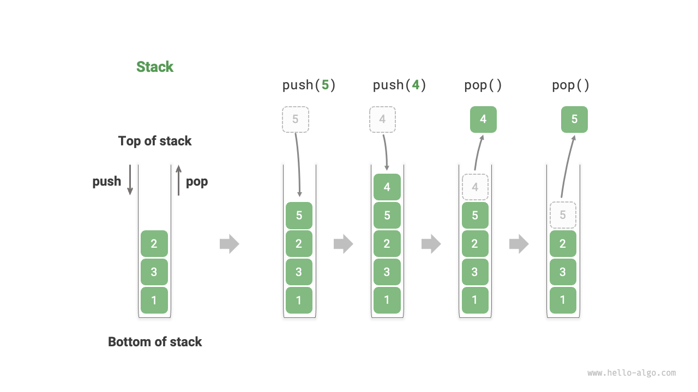

# 5.1 &nbsp; Stack

"Stack" is a linear data structure that follows the principle of Last-In-First-Out (LIFO).

We can compare a stack to a pile of plates on a table. To access the bottom plate, one must remove the plates on top. If we replace the plates with various types of elements (such as integers, characters, objects, etc.), we obtain the data structure known as a stack.

As shown in the following figure, we refer to the top of the pile of elements as the "top of the stack" and the bottom as the "bottom of the stack." The operation of adding elements to the top of the stack is called "push," and the operation of removing the top element is called "pop."

{ class="animation-figure" }

<p align="center"> Figure 5-1 &nbsp; Stack's Last-In-First-Out Rule </p>

## 5.1.1 &nbsp; Common Operations on Stack

The common operations on a stack are shown in the Table 5-1 . The specific method names depend on the programming language used. Here, we use `push()`, `pop()`, and `peek()` as examples.

<p align="center"> Table 5-1 &nbsp; Efficiency of Stack Operations </p>

<div class="center-table" markdown>

| Method   | Description                                     | Time Complexity |
| -------- | ----------------------------------------------- | --------------- |
| `push()` | Push an element onto the stack (add to the top) | $O(1)$          |
| `pop()`  | Pop the top element from the stack              | $O(1)$          |
| `peek()` | Access the top element of the stack             | $O(1)$          |

</div>

Typically, we can directly use the stack class built into the programming language. However, some languages may not specifically provide a stack class. In these cases, we can use the language's "array" or "linked list" as a stack and ignore operations that are not related to stack logic in the program.

=== "Python"

    ```python title="stack.py"
    # Initialize the stack
    # Python does not have a built-in stack class, so a list can be used as a stack
    stack: list[int] = []

    # Push elements onto the stack
    stack.append(1)
    stack.append(3)
    stack.append(2)
    stack.append(5)
    stack.append(4)

    # Access the top element of the stack
    peek: int = stack[-1]

    # Pop an element from the stack
    pop: int = stack.pop()

    # Get the length of the stack
    size: int = len(stack)

    # Check if the stack is empty
    is_empty: bool = len(stack) == 0
    ```

=== "C++"

    ```cpp title="stack.cpp"
    /* Initialize the stack */
    stack<int> stack;

    /* Push elements onto the stack */
    stack.push(1);
    stack.push(3);
    stack.push(2);
    stack.push(5);
    stack.push(4);

    /* Access the top element of the stack */
    int top = stack.top();

    /* Pop an element from the stack */
    stack.pop(); // No return value

    /* Get the length of the stack */
    int size = stack.size();

    /* Check if the stack is empty */
    bool empty = stack.empty();
    ```

=== "Java"

    ```java title="stack.java"
    /* Initialize the stack */
    Stack<Integer> stack = new Stack<>();

    /* Push elements onto the stack */
    stack.push(1);
    stack.push(3);
    stack.push(2);
    stack.push(5);
    stack.push(4);

    /* Access the top element of the stack */
    int peek = stack.peek();

    /* Pop an element from the stack */
    int pop = stack.pop();

    /* Get the length of the stack */
    int size = stack.size();

    /* Check if the stack is empty */
    boolean isEmpty = stack.isEmpty();
    ```

=== "C#"

    ```csharp title="stack.cs"
    /* Initialize the stack */
    Stack<int> stack = new();

    /* Push elements onto the stack */
    stack.Push(1);
    stack.Push(3);
    stack.Push(2);
    stack.Push(5);
    stack.Push(4);

    /* Access the top element of the stack */
    int peek = stack.Peek();

    /* Pop an element from the stack */
    int pop = stack.Pop();

    /* Get the length of the stack */
    int size = stack.Count;

    /* Check if the stack is empty */
    bool isEmpty = stack.Count == 0;
    ```

=== "Go"

    ```go title="stack_test.go"
    /* Initialize the stack */
    // In Go, it is recommended to use a Slice as a stack
    var stack []int

    /* Push elements onto the stack */
    stack = append(stack, 1)
    stack = append(stack, 3)
    stack = append(stack, 2)
    stack = append(stack, 5)
    stack = append(stack, 4)

    /* Access the top element of the stack */
    peek := stack[len(stack)-1]

    /* Pop an element from the stack */
    pop := stack[len(stack)-1]
    stack = stack[:len(stack)-1]

    /* Get the length of the stack */
    size := len(stack)

    /* Check if the stack is empty */
    isEmpty := len(stack) == 0
    ```

=== "Swift"

    ```swift title="stack.swift"
    /* Initialize the stack */
    // Swift does not have a built-in stack class, so Array can be used as a stack
    var stack: [Int] = []

    /* Push elements onto the stack */
    stack.append(1)
    stack.append(3)
    stack.append(2)
    stack.append(5)
    stack.append(4)

    /* Access the top element of the stack */
    let peek = stack.last!

    /* Pop an element from the stack */
    let pop = stack.removeLast()

    /* Get the length of the stack */
    let size = stack.count

    /* Check if the stack is empty */
    let isEmpty = stack.isEmpty
    ```

=== "JS"

    ```javascript title="stack.js"
    /* Initialize the stack */
    // JavaScript does not have a built-in stack class, so Array can be used as a stack
    const stack = [];

    /* Push elements onto the stack */
    stack.push(1);
    stack.push(3);
    stack.push(2);
    stack.push(5);
    stack.push(4);

    /* Access the top element of the stack */
    const peek = stack[stack.length-1];

    /* Pop an element from the stack */
    const pop = stack.pop();

    /* Get the length of the stack */
    const size = stack.length;

    /* Check if the stack is empty */
    const is_empty = stack.length === 0;
    ```

=== "TS"

    ```typescript title="stack.ts"
    /* Initialize the stack */
    // TypeScript does not have a built-in stack class, so Array can be used as a stack
    const stack: number[] = [];

    /* Push elements onto the stack */
    stack.push(1);
    stack.push(3);
    stack.push(2);
    stack.push(5);
    stack.push(4);

    /* Access the top element of the stack */
    const peek = stack[stack.length - 1];

    /* Pop an element from the stack */
    const pop = stack.pop();

    /* Get the length of the stack */
    const size = stack.length;

    /* Check if the stack is empty */
    const is_empty = stack.length === 0;
    ```

=== "Dart"

    ```dart title="stack.dart"
    /* Initialize the stack */
    // Dart does not have a built-in stack class, so List can be used as a stack
    List<int> stack = [];

    /* Push elements onto the stack */
    stack.add(1);
    stack.add(3);
    stack.add(2);
    stack.add(5);
    stack.add(4);

    /* Access the top element of the stack */
    int peek = stack.last;

    /* Pop an element from the stack */
    int pop = stack.removeLast();

    /* Get the length of the stack */
    int size = stack.length;

    /* Check if the stack is empty */
    bool isEmpty = stack.isEmpty;
    ```

=== "Rust"

    ```rust title="stack.rs"
    /* Initialize the stack */
    // Use Vec as a stack
    let mut stack: Vec<i32> = Vec::new();

    /* Push elements onto the stack */
    stack.push(1);
    stack.push(3);
    stack.push(2);
    stack.push(5);
    stack.push(4);

    /* Access the top element of the stack */
    let top = stack.last().unwrap();

    /* Pop an element from the stack */
    let pop = stack.pop().unwrap();

    /* Get the length of the stack */
    let size = stack.len();

    /* Check if the stack is empty */
    let is_empty = stack.is_empty();
    ```

=== "C"

    ```c title="stack.c"
    // C does not provide a built-in stack
    ```

=== "Zig"

    ```zig title="stack.zig"

    ```

??? pythontutor "Code Visualization"

    <div style="height: 549px; width: 100%;"><iframe class="pythontutor-iframe" src="https://pythontutor.com/iframe-embed.html#code=%22%22%22Driver%20Code%22%22%22%0Aif%20__name__%20%3D%3D%20%22__main__%22%3A%0A%20%20%20%20%23%20%E5%88%9D%E5%A7%8B%E5%8C%96%E6%A0%88%0A%20%20%20%20%23%20Python%20%E6%B2%A1%E6%9C%89%E5%86%85%E7%BD%AE%E7%9A%84%E6%A0%88%E7%B1%BB%EF%BC%8C%E5%8F%AF%E4%BB%A5%E6%8A%8A%20list%20%E5%BD%93%E4%BD%9C%E6%A0%88%E6%9D%A5%E4%BD%BF%E7%94%A8%0A%20%20%20%20stack%20%3D%20%5B%5D%0A%0A%20%20%20%20%23%20%E5%85%83%E7%B4%A0%E5%85%A5%E6%A0%88%0A%20%20%20%20stack.append%281%29%0A%20%20%20%20stack.append%283%29%0A%20%20%20%20stack.append%282%29%0A%20%20%20%20stack.append%285%29%0A%20%20%20%20stack.append%284%29%0A%20%20%20%20print%28%22%E6%A0%88%20stack%20%3D%22,%20stack%29%0A%0A%20%20%20%20%23%20%E8%AE%BF%E9%97%AE%E6%A0%88%E9%A1%B6%E5%85%83%E7%B4%A0%0A%20%20%20%20peek%20%3D%20stack%5B-1%5D%0A%20%20%20%20print%28%22%E6%A0%88%E9%A1%B6%E5%85%83%E7%B4%A0%20peek%20%3D%22,%20peek%29%0A%0A%20%20%20%20%23%20%E5%85%83%E7%B4%A0%E5%87%BA%E6%A0%88%0A%20%20%20%20pop%20%3D%20stack.pop%28%29%0A%20%20%20%20print%28%22%E5%87%BA%E6%A0%88%E5%85%83%E7%B4%A0%20pop%20%3D%22,%20pop%29%0A%20%20%20%20print%28%22%E5%87%BA%E6%A0%88%E5%90%8E%20stack%20%3D%22,%20stack%29%0A%0A%20%20%20%20%23%20%E8%8E%B7%E5%8F%96%E6%A0%88%E7%9A%84%E9%95%BF%E5%BA%A6%0A%20%20%20%20size%20%3D%20len%28stack%29%0A%20%20%20%20print%28%22%E6%A0%88%E7%9A%84%E9%95%BF%E5%BA%A6%20size%20%3D%22,%20size%29%0A%0A%20%20%20%20%23%20%E5%88%A4%E6%96%AD%E6%98%AF%E5%90%A6%E4%B8%BA%E7%A9%BA%0A%20%20%20%20is_empty%20%3D%20len%28stack%29%20%3D%3D%200%0A%20%20%20%20print%28%22%E6%A0%88%E6%98%AF%E5%90%A6%E4%B8%BA%E7%A9%BA%20%3D%22,%20is_empty%29&codeDivHeight=472&codeDivWidth=350&cumulative=false&curInstr=2&heapPrimitives=nevernest&origin=opt-frontend.js&py=311&rawInputLstJSON=%5B%5D&textReferences=false"> </iframe></div>
    <div style="margin-top: 5px;"><a href="https://pythontutor.com/iframe-embed.html#code=%22%22%22Driver%20Code%22%22%22%0Aif%20__name__%20%3D%3D%20%22__main__%22%3A%0A%20%20%20%20%23%20%E5%88%9D%E5%A7%8B%E5%8C%96%E6%A0%88%0A%20%20%20%20%23%20Python%20%E6%B2%A1%E6%9C%89%E5%86%85%E7%BD%AE%E7%9A%84%E6%A0%88%E7%B1%BB%EF%BC%8C%E5%8F%AF%E4%BB%A5%E6%8A%8A%20list%20%E5%BD%93%E4%BD%9C%E6%A0%88%E6%9D%A5%E4%BD%BF%E7%94%A8%0A%20%20%20%20stack%20%3D%20%5B%5D%0A%0A%20%20%20%20%23%20%E5%85%83%E7%B4%A0%E5%85%A5%E6%A0%88%0A%20%20%20%20stack.append%281%29%0A%20%20%20%20stack.append%283%29%0A%20%20%20%20stack.append%282%29%0A%20%20%20%20stack.append%285%29%0A%20%20%20%20stack.append%284%29%0A%20%20%20%20print%28%22%E6%A0%88%20stack%20%3D%22,%20stack%29%0A%0A%20%20%20%20%23%20%E8%AE%BF%E9%97%AE%E6%A0%88%E9%A1%B6%E5%85%83%E7%B4%A0%0A%20%20%20%20peek%20%3D%20stack%5B-1%5D%0A%20%20%20%20print%28%22%E6%A0%88%E9%A1%B6%E5%85%83%E7%B4%A0%20peek%20%3D%22,%20peek%29%0A%0A%20%20%20%20%23%20%E5%85%83%E7%B4%A0%E5%87%BA%E6%A0%88%0A%20%20%20%20pop%20%3D%20stack.pop%28%29%0A%20%20%20%20print%28%22%E5%87%BA%E6%A0%88%E5%85%83%E7%B4%A0%20pop%20%3D%22,%20pop%29%0A%20%20%20%20print%28%22%E5%87%BA%E6%A0%88%E5%90%8E%20stack%20%3D%22,%20stack%29%0A%0A%20%20%20%20%23%20%E8%8E%B7%E5%8F%96%E6%A0%88%E7%9A%84%E9%95%BF%E5%BA%A6%0A%20%20%20%20size%20%3D%20len%28stack%29%0A%20%20%20%20print%28%22%E6%A0%88%E7%9A%84%E9%95%BF%E5%BA%A6%20size%20%3D%22,%20size%29%0A%0A%20%20%20%20%23%20%E5%88%A4%E6%96%AD%E6%98%AF%E5%90%A6%E4%B8%BA%E7%A9%BA%0A%20%20%20%20is_empty%20%3D%20len%28stack%29%20%3D%3D%200%0A%20%20%20%20print%28%22%E6%A0%88%E6%98%AF%E5%90%A6%E4%B8%BA%E7%A9%BA%20%3D%22,%20is_empty%29&codeDivHeight=800&codeDivWidth=600&cumulative=false&curInstr=2&heapPrimitives=nevernest&origin=opt-frontend.js&py=311&rawInputLstJSON=%5B%5D&textReferences=false" target="_blank" rel="noopener noreferrer">Full Screen ></a></div>

## 5.1.2 &nbsp; Implementing a Stack

To understand the mechanics of a stack more deeply, let's try implementing a stack class ourselves.

A stack follows the principle of Last-In-First-Out, which means we can only add or remove elements at the top of the stack. However, both arrays and linked lists allow adding and removing elements at any position, **therefore a stack can be seen as a restricted array or linked list**. In other words, we can "mask" some unrelated operations of arrays or linked lists to make their logic conform to the characteristics of a stack.

### 1. &nbsp; Implementation Based on Linked List

When implementing a stack using a linked list, we can consider the head node of the list as the top of the stack and the tail node as the bottom of the stack.

As shown in the Figure 5-2 , for the push operation, we simply insert elements at the head of the linked list. This method of node insertion is known as "head insertion." For the pop operation, we just need to remove the head node from the list.

=== "LinkedListStack"
    { class="animation-figure" }

=== "push()"
    { class="animation-figure" }

=== "pop()"
    { class="animation-figure" }

<p align="center"> Figure 5-2 &nbsp; Implementing Stack with Linked List for Push and Pop Operations </p>

Below is an example code for implementing a stack based on a linked list:

=== "Python"

    ```python title="linkedlist_stack.py"
    class LinkedListStack:
        """基于链表实现的栈"""

        def __init__(self):
            """构造方法"""
            self._peek: ListNode | None = None
            self._size: int = 0

        def size(self) -> int:
            """获取栈的长度"""
            return self._size

        def is_empty(self) -> bool:
            """判断栈是否为空"""
            return not self._peek

        def push(self, val: int):
            """入栈"""
            node = ListNode(val)
            node.next = self._peek
            self._peek = node
            self._size += 1

        def pop(self) -> int:
            """出栈"""
            num = self.peek()
            self._peek = self._peek.next
            self._size -= 1
            return num

        def peek(self) -> int:
            """访问栈顶元素"""
            if self.is_empty():
                raise IndexError("栈为空")
            return self._peek.val

        def to_list(self) -> list[int]:
            """转化为列表用于打印"""
            arr = []
            node = self._peek
            while node:
                arr.append(node.val)
                node = node.next
            arr.reverse()
            return arr
    ```

=== "C++"

    ```cpp title="linkedlist_stack.cpp"
    /* 基于链表实现的栈 */
    class LinkedListStack {
      private:
        ListNode *stackTop; // 将头节点作为栈顶
        int stkSize;        // 栈的长度

      public:
        LinkedListStack() {
            stackTop = nullptr;
            stkSize = 0;
        }

        ~LinkedListStack() {
            // 遍历链表删除节点，释放内存
            freeMemoryLinkedList(stackTop);
        }

        /* 获取栈的长度 */
        int size() {
            return stkSize;
        }

        /* 判断栈是否为空 */
        bool isEmpty() {
            return size() == 0;
        }

        /* 入栈 */
        void push(int num) {
            ListNode *node = new ListNode(num);
            node->next = stackTop;
            stackTop = node;
            stkSize++;
        }

        /* 出栈 */
        int pop() {
            int num = top();
            ListNode *tmp = stackTop;
            stackTop = stackTop->next;
            // 释放内存
            delete tmp;
            stkSize--;
            return num;
        }

        /* 访问栈顶元素 */
        int top() {
            if (isEmpty())
                throw out_of_range("栈为空");
            return stackTop->val;
        }

        /* 将 List 转化为 Array 并返回 */
        vector<int> toVector() {
            ListNode *node = stackTop;
            vector<int> res(size());
            for (int i = res.size() - 1; i >= 0; i--) {
                res[i] = node->val;
                node = node->next;
            }
            return res;
        }
    };
    ```

=== "Java"

    ```java title="linkedlist_stack.java"
    /* 基于链表实现的栈 */
    class LinkedListStack {
        private ListNode stackPeek; // 将头节点作为栈顶
        private int stkSize = 0; // 栈的长度

        public LinkedListStack() {
            stackPeek = null;
        }

        /* 获取栈的长度 */
        public int size() {
            return stkSize;
        }

        /* 判断栈是否为空 */
        public boolean isEmpty() {
            return size() == 0;
        }

        /* 入栈 */
        public void push(int num) {
            ListNode node = new ListNode(num);
            node.next = stackPeek;
            stackPeek = node;
            stkSize++;
        }

        /* 出栈 */
        public int pop() {
            int num = peek();
            stackPeek = stackPeek.next;
            stkSize--;
            return num;
        }

        /* 访问栈顶元素 */
        public int peek() {
            if (isEmpty())
                throw new IndexOutOfBoundsException();
            return stackPeek.val;
        }

        /* 将 List 转化为 Array 并返回 */
        public int[] toArray() {
            ListNode node = stackPeek;
            int[] res = new int[size()];
            for (int i = res.length - 1; i >= 0; i--) {
                res[i] = node.val;
                node = node.next;
            }
            return res;
        }
    }
    ```

=== "C#"

    ```csharp title="linkedlist_stack.cs"
    /* 基于链表实现的栈 */
    class LinkedListStack {
        ListNode? stackPeek;  // 将头节点作为栈顶
        int stkSize = 0;   // 栈的长度

        public LinkedListStack() {
            stackPeek = null;
        }

        /* 获取栈的长度 */
        public int Size() {
            return stkSize;
        }

        /* 判断栈是否为空 */
        public bool IsEmpty() {
            return Size() == 0;
        }

        /* 入栈 */
        public void Push(int num) {
            ListNode node = new(num) {
                next = stackPeek
            };
            stackPeek = node;
            stkSize++;
        }

        /* 出栈 */
        public int Pop() {
            int num = Peek();
            stackPeek = stackPeek!.next;
            stkSize--;
            return num;
        }

        /* 访问栈顶元素 */
        public int Peek() {
            if (IsEmpty())
                throw new Exception();
            return stackPeek!.val;
        }

        /* 将 List 转化为 Array 并返回 */
        public int[] ToArray() {
            if (stackPeek == null)
                return [];

            ListNode? node = stackPeek;
            int[] res = new int[Size()];
            for (int i = res.Length - 1; i >= 0; i--) {
                res[i] = node!.val;
                node = node.next;
            }
            return res;
        }
    }
    ```

=== "Go"

    ```go title="linkedlist_stack.go"
    /* 基于链表实现的栈 */
    type linkedListStack struct {
        // 使用内置包 list 来实现栈
        data *list.List
    }

    /* 初始化栈 */
    func newLinkedListStack() *linkedListStack {
        return &linkedListStack{
            data: list.New(),
        }
    }

    /* 入栈 */
    func (s *linkedListStack) push(value int) {
        s.data.PushBack(value)
    }

    /* 出栈 */
    func (s *linkedListStack) pop() any {
        if s.isEmpty() {
            return nil
        }
        e := s.data.Back()
        s.data.Remove(e)
        return e.Value
    }

    /* 访问栈顶元素 */
    func (s *linkedListStack) peek() any {
        if s.isEmpty() {
            return nil
        }
        e := s.data.Back()
        return e.Value
    }

    /* 获取栈的长度 */
    func (s *linkedListStack) size() int {
        return s.data.Len()
    }

    /* 判断栈是否为空 */
    func (s *linkedListStack) isEmpty() bool {
        return s.data.Len() == 0
    }

    /* 获取 List 用于打印 */
    func (s *linkedListStack) toList() *list.List {
        return s.data
    }
    ```

=== "Swift"

    ```swift title="linkedlist_stack.swift"
    /* 基于链表实现的栈 */
    class LinkedListStack {
        private var _peek: ListNode? // 将头节点作为栈顶
        private var _size = 0 // 栈的长度

        init() {}

        /* 获取栈的长度 */
        func size() -> Int {
            _size
        }

        /* 判断栈是否为空 */
        func isEmpty() -> Bool {
            size() == 0
        }

        /* 入栈 */
        func push(num: Int) {
            let node = ListNode(x: num)
            node.next = _peek
            _peek = node
            _size += 1
        }

        /* 出栈 */
        @discardableResult
        func pop() -> Int {
            let num = peek()
            _peek = _peek?.next
            _size -= 1
            return num
        }

        /* 访问栈顶元素 */
        func peek() -> Int {
            if isEmpty() {
                fatalError("栈为空")
            }
            return _peek!.val
        }

        /* 将 List 转化为 Array 并返回 */
        func toArray() -> [Int] {
            var node = _peek
            var res = Array(repeating: 0, count: _size)
            for i in sequence(first: res.count - 1, next: { $0 >= 0 + 1 ? $0 - 1 : nil }) {
                res[i] = node!.val
                node = node?.next
            }
            return res
        }
    }
    ```

=== "JS"

    ```javascript title="linkedlist_stack.js"
    /* 基于链表实现的栈 */
    class LinkedListStack {
        #stackPeek; // 将头节点作为栈顶
        #stkSize = 0; // 栈的长度

        constructor() {
            this.#stackPeek = null;
        }

        /* 获取栈的长度 */
        get size() {
            return this.#stkSize;
        }

        /* 判断栈是否为空 */
        isEmpty() {
            return this.size === 0;
        }

        /* 入栈 */
        push(num) {
            const node = new ListNode(num);
            node.next = this.#stackPeek;
            this.#stackPeek = node;
            this.#stkSize++;
        }

        /* 出栈 */
        pop() {
            const num = this.peek();
            this.#stackPeek = this.#stackPeek.next;
            this.#stkSize--;
            return num;
        }

        /* 访问栈顶元素 */
        peek() {
            if (!this.#stackPeek) throw new Error('栈为空');
            return this.#stackPeek.val;
        }

        /* 将链表转化为 Array 并返回 */
        toArray() {
            let node = this.#stackPeek;
            const res = new Array(this.size);
            for (let i = res.length - 1; i >= 0; i--) {
                res[i] = node.val;
                node = node.next;
            }
            return res;
        }
    }
    ```

=== "TS"

    ```typescript title="linkedlist_stack.ts"
    /* 基于链表实现的栈 */
    class LinkedListStack {
        private stackPeek: ListNode | null; // 将头节点作为栈顶
        private stkSize: number = 0; // 栈的长度

        constructor() {
            this.stackPeek = null;
        }

        /* 获取栈的长度 */
        get size(): number {
            return this.stkSize;
        }

        /* 判断栈是否为空 */
        isEmpty(): boolean {
            return this.size === 0;
        }

        /* 入栈 */
        push(num: number): void {
            const node = new ListNode(num);
            node.next = this.stackPeek;
            this.stackPeek = node;
            this.stkSize++;
        }

        /* 出栈 */
        pop(): number {
            const num = this.peek();
            if (!this.stackPeek) throw new Error('栈为空');
            this.stackPeek = this.stackPeek.next;
            this.stkSize--;
            return num;
        }

        /* 访问栈顶元素 */
        peek(): number {
            if (!this.stackPeek) throw new Error('栈为空');
            return this.stackPeek.val;
        }

        /* 将链表转化为 Array 并返回 */
        toArray(): number[] {
            let node = this.stackPeek;
            const res = new Array<number>(this.size);
            for (let i = res.length - 1; i >= 0; i--) {
                res[i] = node!.val;
                node = node!.next;
            }
            return res;
        }
    }
    ```

=== "Dart"

    ```dart title="linkedlist_stack.dart"
    /* 基于链表类实现的栈 */
    class LinkedListStack {
      ListNode? _stackPeek; // 将头节点作为栈顶
      int _stkSize = 0; // 栈的长度

      LinkedListStack() {
        _stackPeek = null;
      }

      /* 获取栈的长度 */
      int size() {
        return _stkSize;
      }

      /* 判断栈是否为空 */
      bool isEmpty() {
        return _stkSize == 0;
      }

      /* 入栈 */
      void push(int _num) {
        final ListNode node = ListNode(_num);
        node.next = _stackPeek;
        _stackPeek = node;
        _stkSize++;
      }

      /* 出栈 */
      int pop() {
        final int _num = peek();
        _stackPeek = _stackPeek!.next;
        _stkSize--;
        return _num;
      }

      /* 访问栈顶元素 */
      int peek() {
        if (_stackPeek == null) {
          throw Exception("栈为空");
        }
        return _stackPeek!.val;
      }

      /* 将链表转化为 List 并返回 */
      List<int> toList() {
        ListNode? node = _stackPeek;
        List<int> list = [];
        while (node != null) {
          list.add(node.val);
          node = node.next;
        }
        list = list.reversed.toList();
        return list;
      }
    }
    ```

=== "Rust"

    ```rust title="linkedlist_stack.rs"
    /* 基于链表实现的栈 */
    #[allow(dead_code)]
    pub struct LinkedListStack<T> {
        stack_peek: Option<Rc<RefCell<ListNode<T>>>>,   // 将头节点作为栈顶
        stk_size: usize,                                // 栈的长度
    }

    impl<T: Copy> LinkedListStack<T> {
        pub fn new() -> Self {
            Self {
                stack_peek: None,
                stk_size: 0,
            }
        }

        /* 获取栈的长度 */
        pub fn size(&self) -> usize {
            return self.stk_size;
        }

        /* 判断栈是否为空 */
        pub fn is_empty(&self) -> bool {
            return self.size() == 0;
        }

        /* 入栈 */
        pub fn push(&mut self, num: T) {
            let node = ListNode::new(num);
            node.borrow_mut().next = self.stack_peek.take();
            self.stack_peek = Some(node);
            self.stk_size += 1;
        }

        /* 出栈 */
        pub fn pop(&mut self) -> Option<T> {
            self.stack_peek.take().map(|old_head| {
                match old_head.borrow_mut().next.take() {
                    Some(new_head) => {
                        self.stack_peek = Some(new_head);
                    }
                    None => {
                        self.stack_peek = None;
                    }
                }
                self.stk_size -= 1;
                Rc::try_unwrap(old_head).ok().unwrap().into_inner().val
            })
        }

        /* 访问栈顶元素 */
        pub fn peek(&self) -> Option<&Rc<RefCell<ListNode<T>>>> {
            self.stack_peek.as_ref()
        }

        /* 将 List 转化为 Array 并返回 */
        pub fn to_array(&self, head: Option<&Rc<RefCell<ListNode<T>>>>) -> Vec<T> {
            if let Some(node) = head {
                let mut nums = self.to_array(node.borrow().next.as_ref());
                nums.push(node.borrow().val);
                return nums;
            }
            return Vec::new();
        }
    }
    ```

=== "C"

    ```c title="linkedlist_stack.c"
    /* 基于链表实现的栈 */
    typedef struct {
        ListNode *top; // 将头节点作为栈顶
        int size;      // 栈的长度
    } LinkedListStack;

    /* 构造函数 */
    LinkedListStack *newLinkedListStack() {
        LinkedListStack *s = malloc(sizeof(LinkedListStack));
        s->top = NULL;
        s->size = 0;
        return s;
    }

    /* 析构函数 */
    void delLinkedListStack(LinkedListStack *s) {
        while (s->top) {
            ListNode *n = s->top->next;
            free(s->top);
            s->top = n;
        }
        free(s);
    }

    /* 获取栈的长度 */
    int size(LinkedListStack *s) {
        return s->size;
    }

    /* 判断栈是否为空 */
    bool isEmpty(LinkedListStack *s) {
        return size(s) == 0;
    }

    /* 入栈 */
    void push(LinkedListStack *s, int num) {
        ListNode *node = (ListNode *)malloc(sizeof(ListNode));
        node->next = s->top; // 更新新加节点指针域
        node->val = num;     // 更新新加节点数据域
        s->top = node;       // 更新栈顶
        s->size++;           // 更新栈大小
    }

    /* 访问栈顶元素 */
    int peek(LinkedListStack *s) {
        if (s->size == 0) {
            printf("栈为空\n");
            return INT_MAX;
        }
        return s->top->val;
    }

    /* 出栈 */
    int pop(LinkedListStack *s) {
        int val = peek(s);
        ListNode *tmp = s->top;
        s->top = s->top->next;
        // 释放内存
        free(tmp);
        s->size--;
        return val;
    }
    ```

=== "Zig"

    ```zig title="linkedlist_stack.zig"
    // 基于链表实现的栈
    fn LinkedListStack(comptime T: type) type {
        return struct {
            const Self = @This();

            stack_top: ?*inc.ListNode(T) = null,             // 将头节点作为栈顶
            stk_size: usize = 0,                             // 栈的长度
            mem_arena: ?std.heap.ArenaAllocator = null,
            mem_allocator: std.mem.Allocator = undefined,    // 内存分配器

            // 构造函数（分配内存+初始化栈）
            pub fn init(self: *Self, allocator: std.mem.Allocator) !void {
                if (self.mem_arena == null) {
                    self.mem_arena = std.heap.ArenaAllocator.init(allocator);
                    self.mem_allocator = self.mem_arena.?.allocator();
                }
                self.stack_top = null;
                self.stk_size = 0;
            }

            // 析构函数（释放内存）
            pub fn deinit(self: *Self) void {
                if (self.mem_arena == null) return;
                self.mem_arena.?.deinit();
            }

            // 获取栈的长度
            pub fn size(self: *Self) usize {
                return self.stk_size;
            }

            // 判断栈是否为空
            pub fn isEmpty(self: *Self) bool {
                return self.size() == 0;
            }

            // 访问栈顶元素
            pub fn peek(self: *Self) T {
                if (self.size() == 0) @panic("栈为空");
                return self.stack_top.?.val;
            }  

            // 入栈
            pub fn push(self: *Self, num: T) !void {
                var node = try self.mem_allocator.create(inc.ListNode(T));
                node.init(num);
                node.next = self.stack_top;
                self.stack_top = node;
                self.stk_size += 1;
            } 

            // 出栈
            pub fn pop(self: *Self) T {
                var num = self.peek();
                self.stack_top = self.stack_top.?.next;
                self.stk_size -= 1;
                return num;
            } 

            // 将栈转换为数组
            pub fn toArray(self: *Self) ![]T {
                var node = self.stack_top;
                var res = try self.mem_allocator.alloc(T, self.size());
                @memset(res, @as(T, 0));
                var i: usize = 0;
                while (i < res.len) : (i += 1) {
                    res[res.len - i - 1] = node.?.val;
                    node = node.?.next;
                }
                return res;
            }
        };
    }
    ```

??? pythontutor "Code Visualization"

    <div style="height: 549px; width: 100%;"><iframe class="pythontutor-iframe" src="https://pythontutor.com/iframe-embed.html#code=class%20ListNode%3A%0A%20%20%20%20%22%22%22%E9%93%BE%E8%A1%A8%E8%8A%82%E7%82%B9%E7%B1%BB%22%22%22%0A%20%20%20%20def%20__init__%28self,%20val%3A%20int%29%3A%0A%20%20%20%20%20%20%20%20self.val%3A%20int%20%3D%20val%20%20%23%20%E8%8A%82%E7%82%B9%E5%80%BC%0A%20%20%20%20%20%20%20%20self.next%3A%20ListNode%20%7C%20None%20%3D%20None%20%20%23%20%E5%90%8E%E7%BB%A7%E8%8A%82%E7%82%B9%E5%BC%95%E7%94%A8%0A%0A%0Aclass%20LinkedListStack%3A%0A%20%20%20%20%22%22%22%E5%9F%BA%E4%BA%8E%E9%93%BE%E8%A1%A8%E5%AE%9E%E7%8E%B0%E7%9A%84%E6%A0%88%22%22%22%0A%0A%20%20%20%20def%20__init__%28self%29%3A%0A%20%20%20%20%20%20%20%20%22%22%22%E6%9E%84%E9%80%A0%E6%96%B9%E6%B3%95%22%22%22%0A%20%20%20%20%20%20%20%20self._peek%3A%20ListNode%20%7C%20None%20%3D%20None%0A%20%20%20%20%20%20%20%20self._size%3A%20int%20%3D%200%0A%0A%20%20%20%20def%20size%28self%29%20-%3E%20int%3A%0A%20%20%20%20%20%20%20%20%22%22%22%E8%8E%B7%E5%8F%96%E6%A0%88%E7%9A%84%E9%95%BF%E5%BA%A6%22%22%22%0A%20%20%20%20%20%20%20%20return%20self._size%0A%0A%20%20%20%20def%20is_empty%28self%29%20-%3E%20bool%3A%0A%20%20%20%20%20%20%20%20%22%22%22%E5%88%A4%E6%96%AD%E6%A0%88%E6%98%AF%E5%90%A6%E4%B8%BA%E7%A9%BA%22%22%22%0A%20%20%20%20%20%20%20%20return%20not%20self._peek%0A%0A%20%20%20%20def%20push%28self,%20val%3A%20int%29%3A%0A%20%20%20%20%20%20%20%20%22%22%22%E5%85%A5%E6%A0%88%22%22%22%0A%20%20%20%20%20%20%20%20node%20%3D%20ListNode%28val%29%0A%20%20%20%20%20%20%20%20node.next%20%3D%20self._peek%0A%20%20%20%20%20%20%20%20self._peek%20%3D%20node%0A%20%20%20%20%20%20%20%20self._size%20%2B%3D%201%0A%0A%20%20%20%20def%20pop%28self%29%20-%3E%20int%3A%0A%20%20%20%20%20%20%20%20%22%22%22%E5%87%BA%E6%A0%88%22%22%22%0A%20%20%20%20%20%20%20%20num%20%3D%20self.peek%28%29%0A%20%20%20%20%20%20%20%20self._peek%20%3D%20self._peek.next%0A%20%20%20%20%20%20%20%20self._size%20-%3D%201%0A%20%20%20%20%20%20%20%20return%20num%0A%0A%20%20%20%20def%20peek%28self%29%20-%3E%20int%3A%0A%20%20%20%20%20%20%20%20%22%22%22%E8%AE%BF%E9%97%AE%E6%A0%88%E9%A1%B6%E5%85%83%E7%B4%A0%22%22%22%0A%20%20%20%20%20%20%20%20if%20self.is_empty%28%29%3A%0A%20%20%20%20%20%20%20%20%20%20%20%20raise%20IndexError%28%22%E6%A0%88%E4%B8%BA%E7%A9%BA%22%29%0A%20%20%20%20%20%20%20%20return%20self._peek.val%0A%0A%20%20%20%20def%20to_list%28self%29%20-%3E%20list%5Bint%5D%3A%0A%20%20%20%20%20%20%20%20%22%22%22%E8%BD%AC%E5%8C%96%E4%B8%BA%E5%88%97%E8%A1%A8%E7%94%A8%E4%BA%8E%E6%89%93%E5%8D%B0%22%22%22%0A%20%20%20%20%20%20%20%20arr%20%3D%20%5B%5D%0A%20%20%20%20%20%20%20%20node%20%3D%20self._peek%0A%20%20%20%20%20%20%20%20while%20node%3A%0A%20%20%20%20%20%20%20%20%20%20%20%20arr.append%28node.val%29%0A%20%20%20%20%20%20%20%20%20%20%20%20node%20%3D%20node.next%0A%20%20%20%20%20%20%20%20arr.reverse%28%29%0A%20%20%20%20%20%20%20%20return%20arr%0A%0A%0A%22%22%22Driver%20Code%22%22%22%0Aif%20__name__%20%3D%3D%20%22__main__%22%3A%0A%20%20%20%20%23%20%E5%88%9D%E5%A7%8B%E5%8C%96%E6%A0%88%0A%20%20%20%20stack%20%3D%20LinkedListStack%28%29%0A%0A%20%20%20%20%23%20%E5%85%83%E7%B4%A0%E5%85%A5%E6%A0%88%0A%20%20%20%20stack.push%281%29%0A%20%20%20%20stack.push%283%29%0A%20%20%20%20stack.push%282%29%0A%20%20%20%20stack.push%285%29%0A%20%20%20%20stack.push%284%29%0A%20%20%20%20print%28%22%E6%A0%88%20stack%20%3D%22,%20stack.to_list%28%29%29%0A%0A%20%20%20%20%23%20%E8%AE%BF%E9%97%AE%E6%A0%88%E9%A1%B6%E5%85%83%E7%B4%A0%0A%20%20%20%20peek%20%3D%20stack.peek%28%29%0A%20%20%20%20print%28%22%E6%A0%88%E9%A1%B6%E5%85%83%E7%B4%A0%20peek%20%3D%22,%20peek%29%0A%0A%20%20%20%20%23%20%E5%85%83%E7%B4%A0%E5%87%BA%E6%A0%88%0A%20%20%20%20pop%20%3D%20stack.pop%28%29%0A%20%20%20%20print%28%22%E5%87%BA%E6%A0%88%E5%85%83%E7%B4%A0%20pop%20%3D%22,%20pop%29%0A%20%20%20%20print%28%22%E5%87%BA%E6%A0%88%E5%90%8E%20stack%20%3D%22,%20stack.to_list%28%29%29%0A%0A%20%20%20%20%23%20%E8%8E%B7%E5%8F%96%E6%A0%88%E7%9A%84%E9%95%BF%E5%BA%A6%0A%20%20%20%20size%20%3D%20stack.size%28%29%0A%20%20%20%20print%28%22%E6%A0%88%E7%9A%84%E9%95%BF%E5%BA%A6%20size%20%3D%22,%20size%29%0A%0A%20%20%20%20%23%20%E5%88%A4%E6%96%AD%E6%98%AF%E5%90%A6%E4%B8%BA%E7%A9%BA%0A%20%20%20%20is_empty%20%3D%20stack.is_empty%28%29%0A%20%20%20%20print%28%22%E6%A0%88%E6%98%AF%E5%90%A6%E4%B8%BA%E7%A9%BA%20%3D%22,%20is_empty%29&codeDivHeight=472&codeDivWidth=350&cumulative=false&curInstr=4&heapPrimitives=nevernest&origin=opt-frontend.js&py=311&rawInputLstJSON=%5B%5D&textReferences=false"> </iframe></div>
    <div style="margin-top: 5px;"><a href="https://pythontutor.com/iframe-embed.html#code=class%20ListNode%3A%0A%20%20%20%20%22%22%22%E9%93%BE%E8%A1%A8%E8%8A%82%E7%82%B9%E7%B1%BB%22%22%22%0A%20%20%20%20def%20__init__%28self,%20val%3A%20int%29%3A%0A%20%20%20%20%20%20%20%20self.val%3A%20int%20%3D%20val%20%20%23%20%E8%8A%82%E7%82%B9%E5%80%BC%0A%20%20%20%20%20%20%20%20self.next%3A%20ListNode%20%7C%20None%20%3D%20None%20%20%23%20%E5%90%8E%E7%BB%A7%E8%8A%82%E7%82%B9%E5%BC%95%E7%94%A8%0A%0A%0Aclass%20LinkedListStack%3A%0A%20%20%20%20%22%22%22%E5%9F%BA%E4%BA%8E%E9%93%BE%E8%A1%A8%E5%AE%9E%E7%8E%B0%E7%9A%84%E6%A0%88%22%22%22%0A%0A%20%20%20%20def%20__init__%28self%29%3A%0A%20%20%20%20%20%20%20%20%22%22%22%E6%9E%84%E9%80%A0%E6%96%B9%E6%B3%95%22%22%22%0A%20%20%20%20%20%20%20%20self._peek%3A%20ListNode%20%7C%20None%20%3D%20None%0A%20%20%20%20%20%20%20%20self._size%3A%20int%20%3D%200%0A%0A%20%20%20%20def%20size%28self%29%20-%3E%20int%3A%0A%20%20%20%20%20%20%20%20%22%22%22%E8%8E%B7%E5%8F%96%E6%A0%88%E7%9A%84%E9%95%BF%E5%BA%A6%22%22%22%0A%20%20%20%20%20%20%20%20return%20self._size%0A%0A%20%20%20%20def%20is_empty%28self%29%20-%3E%20bool%3A%0A%20%20%20%20%20%20%20%20%22%22%22%E5%88%A4%E6%96%AD%E6%A0%88%E6%98%AF%E5%90%A6%E4%B8%BA%E7%A9%BA%22%22%22%0A%20%20%20%20%20%20%20%20return%20not%20self._peek%0A%0A%20%20%20%20def%20push%28self,%20val%3A%20int%29%3A%0A%20%20%20%20%20%20%20%20%22%22%22%E5%85%A5%E6%A0%88%22%22%22%0A%20%20%20%20%20%20%20%20node%20%3D%20ListNode%28val%29%0A%20%20%20%20%20%20%20%20node.next%20%3D%20self._peek%0A%20%20%20%20%20%20%20%20self._peek%20%3D%20node%0A%20%20%20%20%20%20%20%20self._size%20%2B%3D%201%0A%0A%20%20%20%20def%20pop%28self%29%20-%3E%20int%3A%0A%20%20%20%20%20%20%20%20%22%22%22%E5%87%BA%E6%A0%88%22%22%22%0A%20%20%20%20%20%20%20%20num%20%3D%20self.peek%28%29%0A%20%20%20%20%20%20%20%20self._peek%20%3D%20self._peek.next%0A%20%20%20%20%20%20%20%20self._size%20-%3D%201%0A%20%20%20%20%20%20%20%20return%20num%0A%0A%20%20%20%20def%20peek%28self%29%20-%3E%20int%3A%0A%20%20%20%20%20%20%20%20%22%22%22%E8%AE%BF%E9%97%AE%E6%A0%88%E9%A1%B6%E5%85%83%E7%B4%A0%22%22%22%0A%20%20%20%20%20%20%20%20if%20self.is_empty%28%29%3A%0A%20%20%20%20%20%20%20%20%20%20%20%20raise%20IndexError%28%22%E6%A0%88%E4%B8%BA%E7%A9%BA%22%29%0A%20%20%20%20%20%20%20%20return%20self._peek.val%0A%0A%20%20%20%20def%20to_list%28self%29%20-%3E%20list%5Bint%5D%3A%0A%20%20%20%20%20%20%20%20%22%22%22%E8%BD%AC%E5%8C%96%E4%B8%BA%E5%88%97%E8%A1%A8%E7%94%A8%E4%BA%8E%E6%89%93%E5%8D%B0%22%22%22%0A%20%20%20%20%20%20%20%20arr%20%3D%20%5B%5D%0A%20%20%20%20%20%20%20%20node%20%3D%20self._peek%0A%20%20%20%20%20%20%20%20while%20node%3A%0A%20%20%20%20%20%20%20%20%20%20%20%20arr.append%28node.val%29%0A%20%20%20%20%20%20%20%20%20%20%20%20node%20%3D%20node.next%0A%20%20%20%20%20%20%20%20arr.reverse%28%29%0A%20%20%20%20%20%20%20%20return%20arr%0A%0A%0A%22%22%22Driver%20Code%22%22%22%0Aif%20__name__%20%3D%3D%20%22__main__%22%3A%0A%20%20%20%20%23%20%E5%88%9D%E5%A7%8B%E5%8C%96%E6%A0%88%0A%20%20%20%20stack%20%3D%20LinkedListStack%28%29%0A%0A%20%20%20%20%23%20%E5%85%83%E7%B4%A0%E5%85%A5%E6%A0%88%0A%20%20%20%20stack.push%281%29%0A%20%20%20%20stack.push%283%29%0A%20%20%20%20stack.push%282%29%0A%20%20%20%20stack.push%285%29%0A%20%20%20%20stack.push%284%29%0A%20%20%20%20print%28%22%E6%A0%88%20stack%20%3D%22,%20stack.to_list%28%29%29%0A%0A%20%20%20%20%23%20%E8%AE%BF%E9%97%AE%E6%A0%88%E9%A1%B6%E5%85%83%E7%B4%A0%0A%20%20%20%20peek%20%3D%20stack.peek%28%29%0A%20%20%20%20print%28%22%E6%A0%88%E9%A1%B6%E5%85%83%E7%B4%A0%20peek%20%3D%22,%20peek%29%0A%0A%20%20%20%20%23%20%E5%85%83%E7%B4%A0%E5%87%BA%E6%A0%88%0A%20%20%20%20pop%20%3D%20stack.pop%28%29%0A%20%20%20%20print%28%22%E5%87%BA%E6%A0%88%E5%85%83%E7%B4%A0%20pop%20%3D%22,%20pop%29%0A%20%20%20%20print%28%22%E5%87%BA%E6%A0%88%E5%90%8E%20stack%20%3D%22,%20stack.to_list%28%29%29%0A%0A%20%20%20%20%23%20%E8%8E%B7%E5%8F%96%E6%A0%88%E7%9A%84%E9%95%BF%E5%BA%A6%0A%20%20%20%20size%20%3D%20stack.size%28%29%0A%20%20%20%20print%28%22%E6%A0%88%E7%9A%84%E9%95%BF%E5%BA%A6%20size%20%3D%22,%20size%29%0A%0A%20%20%20%20%23%20%E5%88%A4%E6%96%AD%E6%98%AF%E5%90%A6%E4%B8%BA%E7%A9%BA%0A%20%20%20%20is_empty%20%3D%20stack.is_empty%28%29%0A%20%20%20%20print%28%22%E6%A0%88%E6%98%AF%E5%90%A6%E4%B8%BA%E7%A9%BA%20%3D%22,%20is_empty%29&codeDivHeight=800&codeDivWidth=600&cumulative=false&curInstr=4&heapPrimitives=nevernest&origin=opt-frontend.js&py=311&rawInputLstJSON=%5B%5D&textReferences=false" target="_blank" rel="noopener noreferrer">Full Screen ></a></div>

### 2. &nbsp; Implementation Based on Array

When implementing a stack using an array, we can consider the end of the array as the top of the stack. As shown in the Figure 5-3 , push and pop operations correspond to adding and removing elements at the end of the array, respectively, both with a time complexity of $O(1)$.

=== "ArrayStack"
    { class="animation-figure" }

=== "push()"
    { class="animation-figure" }

=== "pop()"
    { class="animation-figure" }

<p align="center"> Figure 5-3 &nbsp; Implementing Stack with Array for Push and Pop Operations </p>

Since the elements to be pushed onto the stack may continuously increase, we can use a dynamic array, thus avoiding the need to handle array expansion ourselves. Here is an example code:

=== "Python"

    ```python title="array_stack.py"
    class ArrayStack:
        """基于数组实现的栈"""

        def __init__(self):
            """构造方法"""
            self._stack: list[int] = []

        def size(self) -> int:
            """获取栈的长度"""
            return len(self._stack)

        def is_empty(self) -> bool:
            """判断栈是否为空"""
            return self._stack == []

        def push(self, item: int):
            """入栈"""
            self._stack.append(item)

        def pop(self) -> int:
            """出栈"""
            if self.is_empty():
                raise IndexError("栈为空")
            return self._stack.pop()

        def peek(self) -> int:
            """访问栈顶元素"""
            if self.is_empty():
                raise IndexError("栈为空")
            return self._stack[-1]

        def to_list(self) -> list[int]:
            """返回列表用于打印"""
            return self._stack
    ```

=== "C++"

    ```cpp title="array_stack.cpp"
    /* 基于数组实现的栈 */
    class ArrayStack {
      private:
        vector<int> stack;

      public:
        /* 获取栈的长度 */
        int size() {
            return stack.size();
        }

        /* 判断栈是否为空 */
        bool isEmpty() {
            return stack.size() == 0;
        }

        /* 入栈 */
        void push(int num) {
            stack.push_back(num);
        }

        /* 出栈 */
        int pop() {
            int num = top();
            stack.pop_back();
            return num;
        }

        /* 访问栈顶元素 */
        int top() {
            if (isEmpty())
                throw out_of_range("栈为空");
            return stack.back();
        }

        /* 返回 Vector */
        vector<int> toVector() {
            return stack;
        }
    };
    ```

=== "Java"

    ```java title="array_stack.java"
    /* 基于数组实现的栈 */
    class ArrayStack {
        private ArrayList<Integer> stack;

        public ArrayStack() {
            // 初始化列表（动态数组）
            stack = new ArrayList<>();
        }

        /* 获取栈的长度 */
        public int size() {
            return stack.size();
        }

        /* 判断栈是否为空 */
        public boolean isEmpty() {
            return size() == 0;
        }

        /* 入栈 */
        public void push(int num) {
            stack.add(num);
        }

        /* 出栈 */
        public int pop() {
            if (isEmpty())
                throw new IndexOutOfBoundsException();
            return stack.remove(size() - 1);
        }

        /* 访问栈顶元素 */
        public int peek() {
            if (isEmpty())
                throw new IndexOutOfBoundsException();
            return stack.get(size() - 1);
        }

        /* 将 List 转化为 Array 并返回 */
        public Object[] toArray() {
            return stack.toArray();
        }
    }
    ```

=== "C#"

    ```csharp title="array_stack.cs"
    /* 基于数组实现的栈 */
    class ArrayStack {
        List<int> stack;
        public ArrayStack() {
            // 初始化列表（动态数组）
            stack = [];
        }

        /* 获取栈的长度 */
        public int Size() {
            return stack.Count;
        }

        /* 判断栈是否为空 */
        public bool IsEmpty() {
            return Size() == 0;
        }

        /* 入栈 */
        public void Push(int num) {
            stack.Add(num);
        }

        /* 出栈 */
        public int Pop() {
            if (IsEmpty())
                throw new Exception();
            var val = Peek();
            stack.RemoveAt(Size() - 1);
            return val;
        }

        /* 访问栈顶元素 */
        public int Peek() {
            if (IsEmpty())
                throw new Exception();
            return stack[Size() - 1];
        }

        /* 将 List 转化为 Array 并返回 */
        public int[] ToArray() {
            return [.. stack];
        }
    }
    ```

=== "Go"

    ```go title="array_stack.go"
    /* 基于数组实现的栈 */
    type arrayStack struct {
        data []int // 数据
    }

    /* 初始化栈 */
    func newArrayStack() *arrayStack {
        return &arrayStack{
            // 设置栈的长度为 0，容量为 16
            data: make([]int, 0, 16),
        }
    }

    /* 栈的长度 */
    func (s *arrayStack) size() int {
        return len(s.data)
    }

    /* 栈是否为空 */
    func (s *arrayStack) isEmpty() bool {
        return s.size() == 0
    }

    /* 入栈 */
    func (s *arrayStack) push(v int) {
        // 切片会自动扩容
        s.data = append(s.data, v)
    }

    /* 出栈 */
    func (s *arrayStack) pop() any {
        val := s.peek()
        s.data = s.data[:len(s.data)-1]
        return val
    }

    /* 获取栈顶元素 */
    func (s *arrayStack) peek() any {
        if s.isEmpty() {
            return nil
        }
        val := s.data[len(s.data)-1]
        return val
    }

    /* 获取 Slice 用于打印 */
    func (s *arrayStack) toSlice() []int {
        return s.data
    }
    ```

=== "Swift"

    ```swift title="array_stack.swift"
    /* 基于数组实现的栈 */
    class ArrayStack {
        private var stack: [Int]

        init() {
            // 初始化列表（动态数组）
            stack = []
        }

        /* 获取栈的长度 */
        func size() -> Int {
            stack.count
        }

        /* 判断栈是否为空 */
        func isEmpty() -> Bool {
            stack.isEmpty
        }

        /* 入栈 */
        func push(num: Int) {
            stack.append(num)
        }

        /* 出栈 */
        @discardableResult
        func pop() -> Int {
            if isEmpty() {
                fatalError("栈为空")
            }
            return stack.removeLast()
        }

        /* 访问栈顶元素 */
        func peek() -> Int {
            if isEmpty() {
                fatalError("栈为空")
            }
            return stack.last!
        }

        /* 将 List 转化为 Array 并返回 */
        func toArray() -> [Int] {
            stack
        }
    }
    ```

=== "JS"

    ```javascript title="array_stack.js"
    /* 基于数组实现的栈 */
    class ArrayStack {
        #stack;
        constructor() {
            this.#stack = [];
        }

        /* 获取栈的长度 */
        get size() {
            return this.#stack.length;
        }

        /* 判断栈是否为空 */
        isEmpty() {
            return this.#stack.length === 0;
        }

        /* 入栈 */
        push(num) {
            this.#stack.push(num);
        }

        /* 出栈 */
        pop() {
            if (this.isEmpty()) throw new Error('栈为空');
            return this.#stack.pop();
        }

        /* 访问栈顶元素 */
        top() {
            if (this.isEmpty()) throw new Error('栈为空');
            return this.#stack[this.#stack.length - 1];
        }

        /* 返回 Array */
        toArray() {
            return this.#stack;
        }
    }
    ```

=== "TS"

    ```typescript title="array_stack.ts"
    /* 基于数组实现的栈 */
    class ArrayStack {
        private stack: number[];
        constructor() {
            this.stack = [];
        }

        /* 获取栈的长度 */
        get size(): number {
            return this.stack.length;
        }

        /* 判断栈是否为空 */
        isEmpty(): boolean {
            return this.stack.length === 0;
        }

        /* 入栈 */
        push(num: number): void {
            this.stack.push(num);
        }

        /* 出栈 */
        pop(): number | undefined {
            if (this.isEmpty()) throw new Error('栈为空');
            return this.stack.pop();
        }

        /* 访问栈顶元素 */
        top(): number | undefined {
            if (this.isEmpty()) throw new Error('栈为空');
            return this.stack[this.stack.length - 1];
        }

        /* 返回 Array */
        toArray() {
            return this.stack;
        }
    }
    ```

=== "Dart"

    ```dart title="array_stack.dart"
    /* 基于数组实现的栈 */
    class ArrayStack {
      late List<int> _stack;
      ArrayStack() {
        _stack = [];
      }

      /* 获取栈的长度 */
      int size() {
        return _stack.length;
      }

      /* 判断栈是否为空 */
      bool isEmpty() {
        return _stack.isEmpty;
      }

      /* 入栈 */
      void push(int _num) {
        _stack.add(_num);
      }

      /* 出栈 */
      int pop() {
        if (isEmpty()) {
          throw Exception("栈为空");
        }
        return _stack.removeLast();
      }

      /* 访问栈顶元素 */
      int peek() {
        if (isEmpty()) {
          throw Exception("栈为空");
        }
        return _stack.last;
      }

      /* 将栈转化为 Array 并返回 */
      List<int> toArray() => _stack;
    }
    ```

=== "Rust"

    ```rust title="array_stack.rs"
    /* 基于数组实现的栈 */
    struct ArrayStack<T> {
        stack: Vec<T>,
    }

    impl<T> ArrayStack<T> {
        /* 初始化栈 */
        fn new() -> ArrayStack<T> {
            ArrayStack::<T> { stack: Vec::<T>::new() }
        }

        /* 获取栈的长度 */
        fn size(&self) -> usize {
            self.stack.len()
        }

        /* 判断栈是否为空 */
        fn is_empty(&self) -> bool {
            self.size() == 0
        }

        /* 入栈 */
        fn push(&mut self, num: T) {
            self.stack.push(num);
        }

        /* 出栈 */
        fn pop(&mut self) -> Option<T> {
            match self.stack.pop() {
                Some(num) => Some(num),
                None => None,
            }
        }

        /* 访问栈顶元素 */
        fn peek(&self) -> Option<&T> {
            if self.is_empty() { panic!("栈为空") };
            self.stack.last()
        }

        /* 返回 &Vec */
        fn to_array(&self) -> &Vec<T> {
            &self.stack
        }
    }
    ```

=== "C"

    ```c title="array_stack.c"
    /* 基于数组实现的栈 */
    typedef struct {
        int *data;
        int size;
    } ArrayStack;

    /* 构造函数 */
    ArrayStack *newArrayStack() {
        ArrayStack *stack = malloc(sizeof(ArrayStack));
        // 初始化一个大容量，避免扩容
        stack->data = malloc(sizeof(int) * MAX_SIZE);
        stack->size = 0;
        return stack;
    }

    /* 析构函数 */
    void delArrayStack(ArrayStack *stack) {
        free(stack->data);
        free(stack);
    }

    /* 获取栈的长度 */
    int size(ArrayStack *stack) {
        return stack->size;
    }

    /* 判断栈是否为空 */
    bool isEmpty(ArrayStack *stack) {
        return stack->size == 0;
    }

    /* 入栈 */
    void push(ArrayStack *stack, int num) {
        if (stack->size == MAX_SIZE) {
            printf("栈已满\n");
            return;
        }
        stack->data[stack->size] = num;
        stack->size++;
    }

    /* 访问栈顶元素 */
    int peek(ArrayStack *stack) {
        if (stack->size == 0) {
            printf("栈为空\n");
            return INT_MAX;
        }
        return stack->data[stack->size - 1];
    }

    /* 出栈 */
    int pop(ArrayStack *stack) {
        int val = peek(stack);
        stack->size--;
        return val;
    }
    ```

=== "Zig"

    ```zig title="array_stack.zig"
    // 基于数组实现的栈
    fn ArrayStack(comptime T: type) type {
        return struct {
            const Self = @This();

            stack: ?std.ArrayList(T) = null,     

            // 构造方法（分配内存+初始化栈）
            pub fn init(self: *Self, allocator: std.mem.Allocator) void {
                if (self.stack == null) {
                    self.stack = std.ArrayList(T).init(allocator);
                }
            }

            // 析构方法（释放内存）
            pub fn deinit(self: *Self) void {
                if (self.stack == null) return;
                self.stack.?.deinit();
            }

            // 获取栈的长度
            pub fn size(self: *Self) usize {
                return self.stack.?.items.len;
            }

            // 判断栈是否为空
            pub fn isEmpty(self: *Self) bool {
                return self.size() == 0;
            }

            // 访问栈顶元素
            pub fn peek(self: *Self) T {
                if (self.isEmpty()) @panic("栈为空");
                return self.stack.?.items[self.size() - 1];
            }  

            // 入栈
            pub fn push(self: *Self, num: T) !void {
                try self.stack.?.append(num);
            } 

            // 出栈
            pub fn pop(self: *Self) T {
                var num = self.stack.?.pop();
                return num;
            } 

            // 返回 ArrayList
            pub fn toList(self: *Self) std.ArrayList(T) {
                return self.stack.?;
            }
        };
    }
    ```

??? pythontutor "Code Visualization"

    <div style="height: 549px; width: 100%;"><iframe class="pythontutor-iframe" src="https://pythontutor.com/iframe-embed.html#code=class%20ArrayStack%3A%0A%20%20%20%20%22%22%22%E5%9F%BA%E4%BA%8E%E6%95%B0%E7%BB%84%E5%AE%9E%E7%8E%B0%E7%9A%84%E6%A0%88%22%22%22%0A%0A%20%20%20%20def%20__init__%28self%29%3A%0A%20%20%20%20%20%20%20%20%22%22%22%E6%9E%84%E9%80%A0%E6%96%B9%E6%B3%95%22%22%22%0A%20%20%20%20%20%20%20%20self._stack%3A%20list%5Bint%5D%20%3D%20%5B%5D%0A%0A%20%20%20%20def%20size%28self%29%20-%3E%20int%3A%0A%20%20%20%20%20%20%20%20%22%22%22%E8%8E%B7%E5%8F%96%E6%A0%88%E7%9A%84%E9%95%BF%E5%BA%A6%22%22%22%0A%20%20%20%20%20%20%20%20return%20len%28self._stack%29%0A%0A%20%20%20%20def%20is_empty%28self%29%20-%3E%20bool%3A%0A%20%20%20%20%20%20%20%20%22%22%22%E5%88%A4%E6%96%AD%E6%A0%88%E6%98%AF%E5%90%A6%E4%B8%BA%E7%A9%BA%22%22%22%0A%20%20%20%20%20%20%20%20return%20self._stack%20%3D%3D%20%5B%5D%0A%0A%20%20%20%20def%20push%28self,%20item%3A%20int%29%3A%0A%20%20%20%20%20%20%20%20%22%22%22%E5%85%A5%E6%A0%88%22%22%22%0A%20%20%20%20%20%20%20%20self._stack.append%28item%29%0A%0A%20%20%20%20def%20pop%28self%29%20-%3E%20int%3A%0A%20%20%20%20%20%20%20%20%22%22%22%E5%87%BA%E6%A0%88%22%22%22%0A%20%20%20%20%20%20%20%20if%20self.is_empty%28%29%3A%0A%20%20%20%20%20%20%20%20%20%20%20%20raise%20IndexError%28%22%E6%A0%88%E4%B8%BA%E7%A9%BA%22%29%0A%20%20%20%20%20%20%20%20return%20self._stack.pop%28%29%0A%0A%20%20%20%20def%20peek%28self%29%20-%3E%20int%3A%0A%20%20%20%20%20%20%20%20%22%22%22%E8%AE%BF%E9%97%AE%E6%A0%88%E9%A1%B6%E5%85%83%E7%B4%A0%22%22%22%0A%20%20%20%20%20%20%20%20if%20self.is_empty%28%29%3A%0A%20%20%20%20%20%20%20%20%20%20%20%20raise%20IndexError%28%22%E6%A0%88%E4%B8%BA%E7%A9%BA%22%29%0A%20%20%20%20%20%20%20%20return%20self._stack%5B-1%5D%0A%0A%20%20%20%20def%20to_list%28self%29%20-%3E%20list%5Bint%5D%3A%0A%20%20%20%20%20%20%20%20%22%22%22%E8%BF%94%E5%9B%9E%E5%88%97%E8%A1%A8%E7%94%A8%E4%BA%8E%E6%89%93%E5%8D%B0%22%22%22%0A%20%20%20%20%20%20%20%20return%20self._stack%0A%0A%0A%22%22%22Driver%20Code%22%22%22%0Aif%20__name__%20%3D%3D%20%22__main__%22%3A%0A%20%20%20%20%23%20%E5%88%9D%E5%A7%8B%E5%8C%96%E6%A0%88%0A%20%20%20%20stack%20%3D%20ArrayStack%28%29%0A%0A%20%20%20%20%23%20%E5%85%83%E7%B4%A0%E5%85%A5%E6%A0%88%0A%20%20%20%20stack.push%281%29%0A%20%20%20%20stack.push%283%29%0A%20%20%20%20stack.push%282%29%0A%20%20%20%20stack.push%285%29%0A%20%20%20%20stack.push%284%29%0A%20%20%20%20print%28%22%E6%A0%88%20stack%20%3D%22,%20stack.to_list%28%29%29%0A%0A%20%20%20%20%23%20%E8%AE%BF%E9%97%AE%E6%A0%88%E9%A1%B6%E5%85%83%E7%B4%A0%0A%20%20%20%20peek%20%3D%20stack.peek%28%29%0A%20%20%20%20print%28%22%E6%A0%88%E9%A1%B6%E5%85%83%E7%B4%A0%20peek%20%3D%22,%20peek%29%0A%0A%20%20%20%20%23%20%E5%85%83%E7%B4%A0%E5%87%BA%E6%A0%88%0A%20%20%20%20pop%20%3D%20stack.pop%28%29%0A%20%20%20%20print%28%22%E5%87%BA%E6%A0%88%E5%85%83%E7%B4%A0%20pop%20%3D%22,%20pop%29%0A%20%20%20%20print%28%22%E5%87%BA%E6%A0%88%E5%90%8E%20stack%20%3D%22,%20stack.to_list%28%29%29%0A%0A%20%20%20%20%23%20%E8%8E%B7%E5%8F%96%E6%A0%88%E7%9A%84%E9%95%BF%E5%BA%A6%0A%20%20%20%20size%20%3D%20stack.size%28%29%0A%20%20%20%20print%28%22%E6%A0%88%E7%9A%84%E9%95%BF%E5%BA%A6%20size%20%3D%22,%20size%29%0A%0A%20%20%20%20%23%20%E5%88%A4%E6%96%AD%E6%98%AF%E5%90%A6%E4%B8%BA%E7%A9%BA%0A%20%20%20%20is_empty%20%3D%20stack.is_empty%28%29%0A%20%20%20%20print%28%22%E6%A0%88%E6%98%AF%E5%90%A6%E4%B8%BA%E7%A9%BA%20%3D%22,%20is_empty%29&codeDivHeight=472&codeDivWidth=350&cumulative=false&curInstr=3&heapPrimitives=nevernest&origin=opt-frontend.js&py=311&rawInputLstJSON=%5B%5D&textReferences=false"> </iframe></div>
    <div style="margin-top: 5px;"><a href="https://pythontutor.com/iframe-embed.html#code=class%20ArrayStack%3A%0A%20%20%20%20%22%22%22%E5%9F%BA%E4%BA%8E%E6%95%B0%E7%BB%84%E5%AE%9E%E7%8E%B0%E7%9A%84%E6%A0%88%22%22%22%0A%0A%20%20%20%20def%20__init__%28self%29%3A%0A%20%20%20%20%20%20%20%20%22%22%22%E6%9E%84%E9%80%A0%E6%96%B9%E6%B3%95%22%22%22%0A%20%20%20%20%20%20%20%20self._stack%3A%20list%5Bint%5D%20%3D%20%5B%5D%0A%0A%20%20%20%20def%20size%28self%29%20-%3E%20int%3A%0A%20%20%20%20%20%20%20%20%22%22%22%E8%8E%B7%E5%8F%96%E6%A0%88%E7%9A%84%E9%95%BF%E5%BA%A6%22%22%22%0A%20%20%20%20%20%20%20%20return%20len%28self._stack%29%0A%0A%20%20%20%20def%20is_empty%28self%29%20-%3E%20bool%3A%0A%20%20%20%20%20%20%20%20%22%22%22%E5%88%A4%E6%96%AD%E6%A0%88%E6%98%AF%E5%90%A6%E4%B8%BA%E7%A9%BA%22%22%22%0A%20%20%20%20%20%20%20%20return%20self._stack%20%3D%3D%20%5B%5D%0A%0A%20%20%20%20def%20push%28self,%20item%3A%20int%29%3A%0A%20%20%20%20%20%20%20%20%22%22%22%E5%85%A5%E6%A0%88%22%22%22%0A%20%20%20%20%20%20%20%20self._stack.append%28item%29%0A%0A%20%20%20%20def%20pop%28self%29%20-%3E%20int%3A%0A%20%20%20%20%20%20%20%20%22%22%22%E5%87%BA%E6%A0%88%22%22%22%0A%20%20%20%20%20%20%20%20if%20self.is_empty%28%29%3A%0A%20%20%20%20%20%20%20%20%20%20%20%20raise%20IndexError%28%22%E6%A0%88%E4%B8%BA%E7%A9%BA%22%29%0A%20%20%20%20%20%20%20%20return%20self._stack.pop%28%29%0A%0A%20%20%20%20def%20peek%28self%29%20-%3E%20int%3A%0A%20%20%20%20%20%20%20%20%22%22%22%E8%AE%BF%E9%97%AE%E6%A0%88%E9%A1%B6%E5%85%83%E7%B4%A0%22%22%22%0A%20%20%20%20%20%20%20%20if%20self.is_empty%28%29%3A%0A%20%20%20%20%20%20%20%20%20%20%20%20raise%20IndexError%28%22%E6%A0%88%E4%B8%BA%E7%A9%BA%22%29%0A%20%20%20%20%20%20%20%20return%20self._stack%5B-1%5D%0A%0A%20%20%20%20def%20to_list%28self%29%20-%3E%20list%5Bint%5D%3A%0A%20%20%20%20%20%20%20%20%22%22%22%E8%BF%94%E5%9B%9E%E5%88%97%E8%A1%A8%E7%94%A8%E4%BA%8E%E6%89%93%E5%8D%B0%22%22%22%0A%20%20%20%20%20%20%20%20return%20self._stack%0A%0A%0A%22%22%22Driver%20Code%22%22%22%0Aif%20__name__%20%3D%3D%20%22__main__%22%3A%0A%20%20%20%20%23%20%E5%88%9D%E5%A7%8B%E5%8C%96%E6%A0%88%0A%20%20%20%20stack%20%3D%20ArrayStack%28%29%0A%0A%20%20%20%20%23%20%E5%85%83%E7%B4%A0%E5%85%A5%E6%A0%88%0A%20%20%20%20stack.push%281%29%0A%20%20%20%20stack.push%283%29%0A%20%20%20%20stack.push%282%29%0A%20%20%20%20stack.push%285%29%0A%20%20%20%20stack.push%284%29%0A%20%20%20%20print%28%22%E6%A0%88%20stack%20%3D%22,%20stack.to_list%28%29%29%0A%0A%20%20%20%20%23%20%E8%AE%BF%E9%97%AE%E6%A0%88%E9%A1%B6%E5%85%83%E7%B4%A0%0A%20%20%20%20peek%20%3D%20stack.peek%28%29%0A%20%20%20%20print%28%22%E6%A0%88%E9%A1%B6%E5%85%83%E7%B4%A0%20peek%20%3D%22,%20peek%29%0A%0A%20%20%20%20%23%20%E5%85%83%E7%B4%A0%E5%87%BA%E6%A0%88%0A%20%20%20%20pop%20%3D%20stack.pop%28%29%0A%20%20%20%20print%28%22%E5%87%BA%E6%A0%88%E5%85%83%E7%B4%A0%20pop%20%3D%22,%20pop%29%0A%20%20%20%20print%28%22%E5%87%BA%E6%A0%88%E5%90%8E%20stack%20%3D%22,%20stack.to_list%28%29%29%0A%0A%20%20%20%20%23%20%E8%8E%B7%E5%8F%96%E6%A0%88%E7%9A%84%E9%95%BF%E5%BA%A6%0A%20%20%20%20size%20%3D%20stack.size%28%29%0A%20%20%20%20print%28%22%E6%A0%88%E7%9A%84%E9%95%BF%E5%BA%A6%20size%20%3D%22,%20size%29%0A%0A%20%20%20%20%23%20%E5%88%A4%E6%96%AD%E6%98%AF%E5%90%A6%E4%B8%BA%E7%A9%BA%0A%20%20%20%20is_empty%20%3D%20stack.is_empty%28%29%0A%20%20%20%20print%28%22%E6%A0%88%E6%98%AF%E5%90%A6%E4%B8%BA%E7%A9%BA%20%3D%22,%20is_empty%29&codeDivHeight=800&codeDivWidth=600&cumulative=false&curInstr=3&heapPrimitives=nevernest&origin=opt-frontend.js&py=311&rawInputLstJSON=%5B%5D&textReferences=false" target="_blank" rel="noopener noreferrer">Full Screen ></a></div>

## 5.1.3 &nbsp; Comparison of the Two Implementations

**Supported Operations**

Both implementations support all the operations defined in a stack. The array implementation additionally supports random access, but this is beyond the scope of a stack definition and is generally not used.

**Time Efficiency**

In the array-based implementation, both push and pop operations occur in pre-allocated continuous memory, which has good cache locality and therefore higher efficiency. However, if the push operation exceeds the array capacity, it triggers a resizing mechanism, making the time complexity of that push operation $O(n)$.

In the linked list implementation, list expansion is very flexible, and there is no efficiency decrease issue as in array expansion. However, the push operation requires initializing a node object and modifying pointers, so its efficiency is relatively lower. If the elements being pushed are already node objects, then the initialization step can be skipped, improving efficiency.

Thus, when the elements for push and pop operations are basic data types like `int` or `double`, we can draw the following conclusions:

- The array-based stack implementation's efficiency decreases during expansion, but since expansion is a low-frequency operation, its average efficiency is higher.
- The linked list-based stack implementation provides more stable efficiency performance.

**Space Efficiency**

When initializing a list, the system allocates an "initial capacity," which might exceed the actual need; moreover, the expansion mechanism usually increases capacity by a specific factor (like doubling), which may also exceed the actual need. Therefore, **the array-based stack might waste some space**.

However, since linked list nodes require extra space for storing pointers, **the space occupied by linked list nodes is relatively larger**.

In summary, we cannot simply determine which implementation is more memory-efficient. It requires analysis based on specific circumstances.

## 5.1.4 &nbsp; Typical Applications of Stack

- **Back and forward in browsers, undo and redo in software**. Every time we open a new webpage, the browser pushes the previous page onto the stack, allowing us to go back to the previous page through the back operation, which is essentially a pop operation. To support both back and forward, two stacks are needed to work together.
- **Memory management in programs**. Each time a function is called, the system adds a stack frame at the top of the stack to record the function's context information. In recursive functions, the downward recursion phase keeps pushing onto the stack, while the upward backtracking phase keeps popping from the stack.
