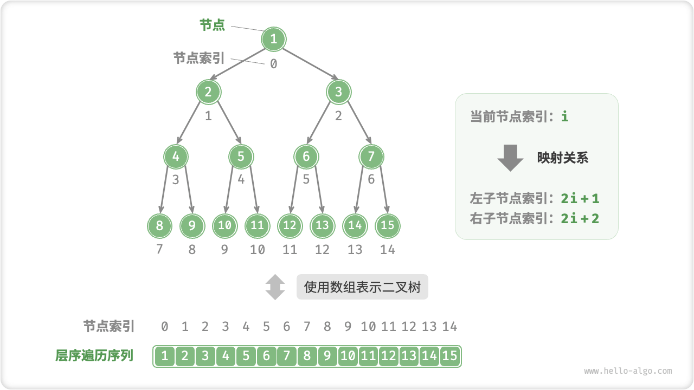
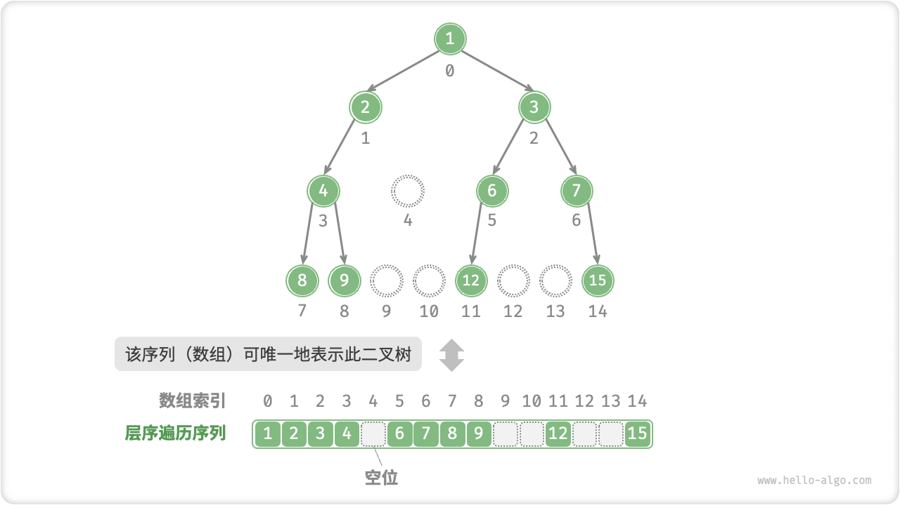
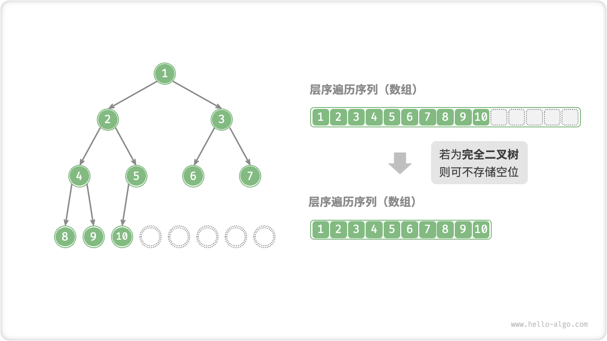

# Binary Tree Array Representation

In the linked list representation, the storage unit of a binary tree is a node `TreeNode` and the nodes are connected to each other by pointers. In the previous section, we learned the basic operations of a binary tree in a linked list representation.

So, can we represent a binary tree with an array? The answer is yes.

## Representing A Perfect Binary Tree

Let's start by analyzing a simple case. Given a perfect binary tree, we store all nodes in an array in level-order traversal order, then each node corresponds to a unique array index.

Based on the properties of level-order traversal, we can derive a "mapping formula" between the index of the parent node and the index of the child node:**If a node is indexed by $i$, then the left-child node of that node is indexed by $2i + 1$, and the right-child node is indexed by $2i + 2$**. The figure below shows the mapping between the indexes of each node.



**The role of a mapping formula is equivalent to that of a pointer** in a linked list. Given any node in an array, we can access its left (right) child node via a mapping formula.

## Denotes Any Binary Tree

A perfect binary tree is a special case where there are usually many $\text{None}$ in the middle level of the binary tree. Since the level-order traversal sequence does not contain these $\text{None}$, we cannot infer the number and distribution position of $\text{None}$ from this sequence alone. **This implies that there exist multiple binary tree structures that all conform to this level-order traversal sequence**.

As shown in the figure below, given a non-perfect binary tree, the above array representation has failed.


To solve this problem, **we can consider explicitly writing all $\text{None}$** in the level-order traversal sequence. As shown in the figure below, after this processing, the level-order traversal sequence can uniquely represent a binary tree.

=== "Python"

    ```python title=""
    # Array representation of binary trees
    # Use None for empty space
    tree = [1, 2, 3, 4, None, 6, 7, 8, 9, None, None, 12, None, None, 15]
    ```

=== "C++"

    ```cpp title=""
    /* Array representation of a binary tree */
    // Use the int maximum value INT_MAX to mark the empty bit.
    vector<int> tree = {1, 2, 3, 4, INT_MAX, 6, 7, 8, 9, INT_MAX, INT_MAX, 12, INT_MAX, INT_MAX, 15};
    ```

=== "Java"

    ```java title=""
    /* Array representation of a binary tree */
    // Using Integer, a wrapper class for int, you can use null to mark the null position.
    Integer[] tree = { 1, 2, 3, 4, null, 6, 7, 8, 9, null, null, 12, null, null, 15 };
    ```

=== "C#"

    ```csharp title=""
    /* Array representation of a binary tree */
    // With the int? nullable type, you can use null to mark the null position.
    int?[] tree = { 1, 2, 3, 4, null, 6, 7, 8, 9, null, null, 12, null, null, 15 };
    ```

=== "Go"

    ```go title=""
    /* Array representation of a binary tree */
    // With any type of slice, you can use nil to mark empty spaces.
    tree := []any{1, 2, 3, 4, nil, 6, 7, 8, 9, nil, nil, 12, nil, nil, 15}
    ```

=== "Swift"

    ```swift title=""
    /* Array representation of a binary tree */
    // With the Int? nullable type, you can use nil to mark the null position.
    let tree: [Int?] = [1, 2, 3, 4, nil, 6, 7, 8, 9, nil, nil, 12, nil, nil, 15]
    ```

=== "JS"

    ```javascript title=""
    /* Array representation of a binary tree */
    // Use null for empty space
    let tree = [1, 2, 3, 4, null, 6, 7, 8, 9, null, null, 12, null, null, 15];
    ```

=== "TS"

    ```typescript title=""
    /* Array representation of a binary tree */
    // Use null for empty space
    let tree: (number | null)[] = [1, 2, 3, 4, null, 6, 7, 8, 9, null, null, 12, null, null, 15];
    ```

=== "Dart"

    ```dart title=""
    /* Array representation of a binary tree */
    // With the int? nullable type, you can use null to mark the null position.
    List<int?> tree = [1, 2, 3, 4, null, 6, 7, 8, 9, null, null, 12, null, null, 15];
    ```

=== "Rust"

    ```rust title=""
    /* Array representation of a binary tree */
    // Use None to mark the empty space
    let tree = [Some(1), Some(2), Some(3), Some(4), None, Some(6), Some(7), Some(8), Some(9), None, None, Some(12), None, None, Some(15)];
    ```

=== "C"

    ```c title=""
    /* Array representation of a binary tree */
    // Use the int maximum value to mark empty spaces, thus requiring that the node value not be INT_MAX
    int tree[] = {1, 2, 3, 4, INT_MAX, 6, 7, 8, 9, INT_MAX, INT_MAX, 12, INT_MAX, INT_MAX, 15};
    ```

=== "Zig"

    ```zig title=""

    ```



It is worth stating that **complete binary trees are well suited to be represented using arrays**. Recall that the definition of a complete binary tree is that $\text{None}$ only occurs at the bottom and to the right, **so all $\text{None}$ must occur at the end of the level-order traversal sequence**.

This means that when using an array to represent a complete binary tree, it is convenient to omit storing all $\text{None}$. An example is given in the figure below.



The following code implements a binary tree based on an array representation and includes the following operations.

- Given a node, get its value, left (right) child node, and parent node.
- Gets the sequence of preorder traversals, middle order traversals, postorder traversals, and level-order traversals.

```src
[file]{array_binary_tree}-[class]{array_binary_tree}-[func]{}
```

## Strengths And Limitations

The array representation of a binary tree has the following main advantages.

- Arrays are stored in contiguous memory space, are cache friendly, and are faster to access and traverse.
- No need to store pointers, which is more space efficient.
- Allow random access to nodes.

However, there are some limitations to the array representation.

- Array storage requires contiguous memory space and is therefore not suitable for storing trees with excessive amounts of data.
- Adding and deleting nodes needs to be realized by array insertion and deletion operations, which is less efficient.
- When there are a large number of $\text{None}$ in the binary tree, the array contains a low proportion of node data and the space utilization is low.
