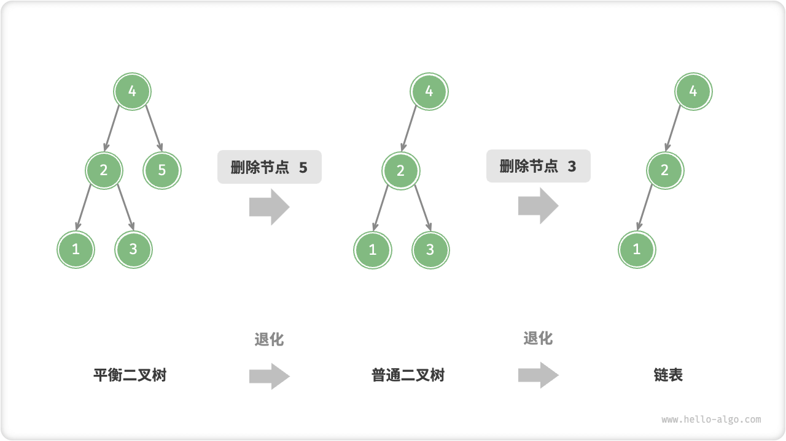
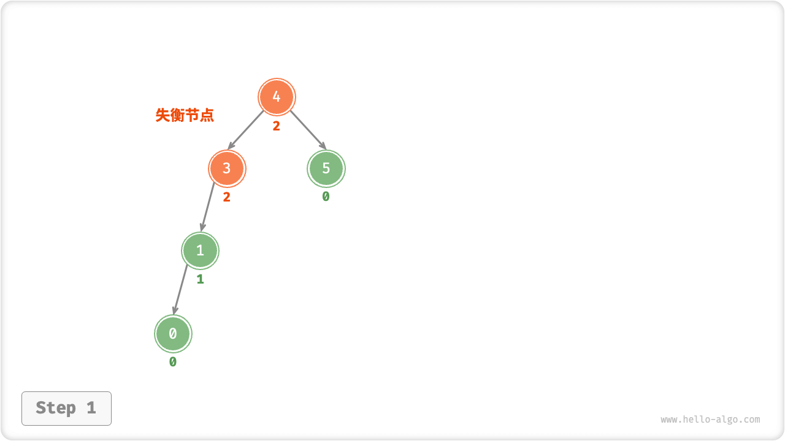
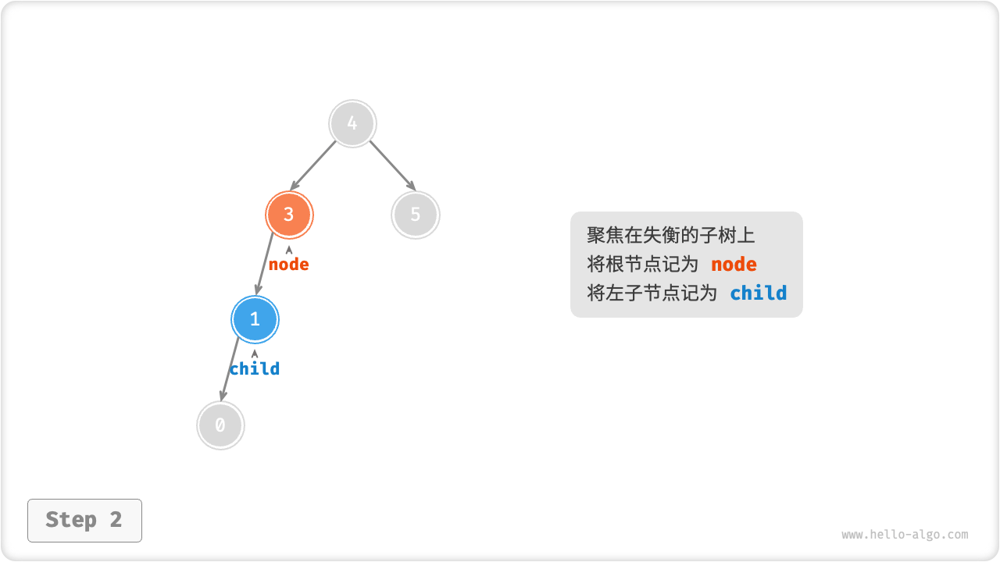
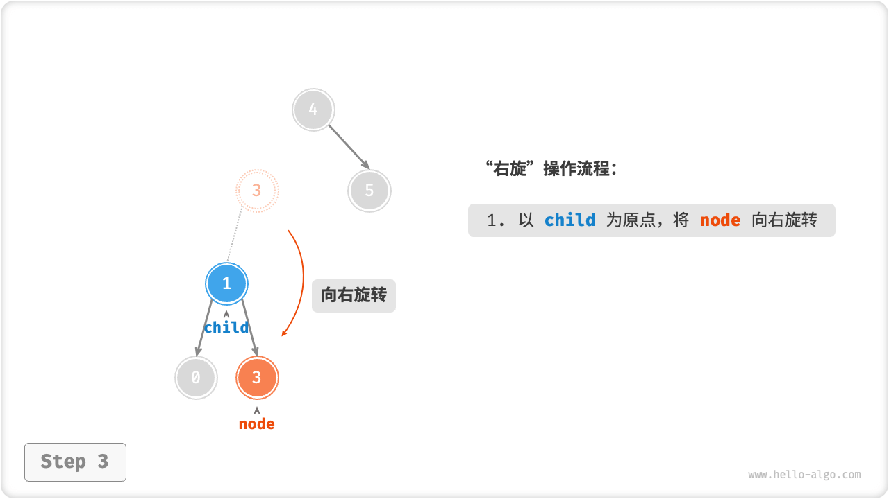
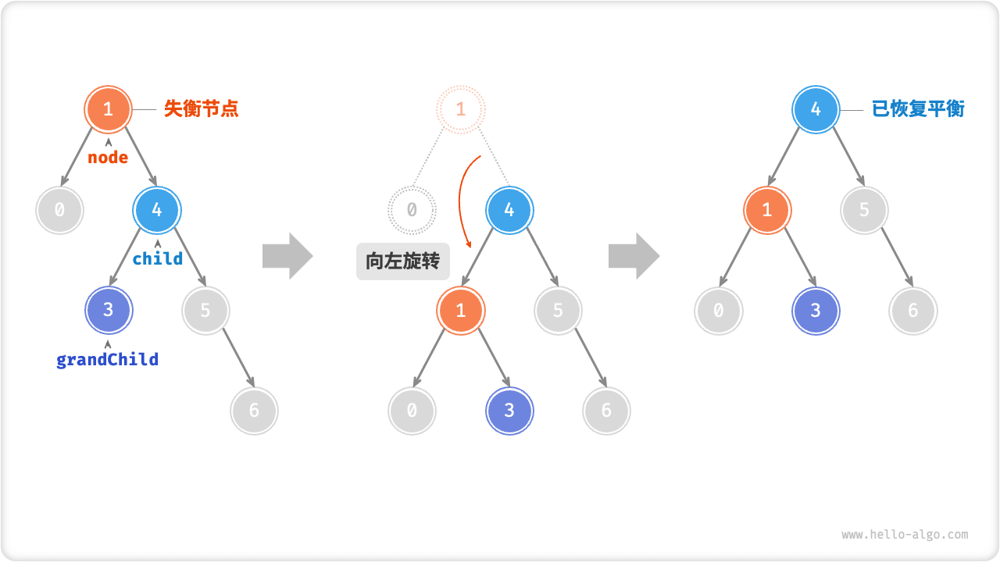

# AVL Tree *

In the binary search tree chapter, we mentioned that after multiple insertion and deletion operations, a binary search tree may degrade to a linked list. In this case, the time complexity of all operations will deteriorate from $O(\log n)$ to $O(n)$ .

As shown in the figure below, this binary search tree degenerates into a linked list after two deletion operations.



As another example, after inserting two nodes into the perfect binary tree of the figure below, the tree will be severely skewed to the left, and the time complexity of the lookup operation worsens.


G. M. Adelson-Velsky and E. M. Landis proposed the "avl tree" in their 1962 paper "An algorithm for the organization of information". In the paper, a series of operations are described in detail to ensure that the AVL tree does not degrade after nodes are continuously added and deleted, thus keeping the time complexity of various operations at the $O(\log n)$ level. In other words, in scenarios where frequent addition, deletion, checking and modification operations are required, the AVL tree can always maintain efficient data operation performance, which has good application value.

## AVL Tree Common Terminology

An avl tree is both a binary search tree and a balanced binary tree, and it satisfies all the properties of these two types of binary trees, so it is also called a "balanced binary search tree".

### Node Height

Since the operations related to the AVL tree node need to get the height of the node, we need to add the `height` variable to the node class.

=== "Python"

    ```python title=""
    class TreeNode:
        """AVL Tree Node Class""""
        def __init__(self, val: int):
            self.val: int = val                 # node value
            self.height: int = 0                # height of the node
            self.left: TreeNode | None = None   # left-child node reference
            self.right: TreeNode | None = None  # right-child node reference
    ```

=== "C++"

    ```cpp title=""
    /* AVL tree node class */
    struct TreeNode {
        int val{};          // node value
        int height = 0;     // height of the node
        TreeNode *left{};   // left-child node
        TreeNode *right{};  // right-child node
        TreeNode() = default;
        explicit TreeNode(int x) : val(x){}
    };
    ```

=== "Java"

    ```java title=""
    /* AVL tree node class */
    class TreeNode {
        public int val;        // node value
        public int height;     // height of the node
        public TreeNode left;  // left-child node
        public TreeNode right; // right-child node
        public TreeNode(int x) { val = x; }
    }
    ```

=== "C#"

    ```csharp title=""
    /* AVL tree node class */
    class TreeNode {
        public int val;          // node value
        public int height;       // height of the node
        public TreeNode? left;   // left-child node
        public TreeNode? right;  // right-child node
        public TreeNode(int x) { val = x; }
    }
    ```

=== "Go"

    ```go title=""
    /* AVL tree node structure */
    type TreeNode struct {
        Val    int       // Node value
        Height int       // The height of the node.
        Left   *TreeNode // Left-child node reference.
        Right  *TreeNode // Right-child node reference.
    }
    ```

=== "Swift"

    ```swift title=""
    /* AVL tree node class */
    class TreeNode {
        var val: Int // node value
        var height: Int // The height of the node.
        var left: TreeNode? // left-child node
        var right: TreeNode? // right-child node

        init(x: Int) {
            val = x
            height = 0
        }
    }
    ```

=== "JS"

    ```javascript title=""
    /* AVL tree node class */
    class TreeNode {
        val; // node value
        height; //node height
        left; // Pointer to the left-child node.
        right; // pointer to right-child node
        constructor(val, left, right, height) {
            this.val = val === undefined ? 0 : val;
            this.height = height === undefined ? 0 : height;
            this.left = left === undefined ? null : left;
            this.right = right === undefined ? null : right;
        }
    }
    ```

=== "TS"

    ```typescript title=""
    /* AVL tree node class */
    class TreeNode {
        val: number;            // node value
        height: number;         // height of the node
        left: TreeNode | null;  // Pointer to the left-child node.
        right: TreeNode | null; // pointer to right-child node
        constructor(val?: number, height?: number, left?: TreeNode | null, right?: TreeNode | null) {
            this.val = val === undefined ? 0 : val;
            this.height = height === undefined ? 0 : height;
            this.left = left === undefined ? null : left;
            this.right = right === undefined ? null : right;
        }
    }
    ```

=== "Dart"

    ```dart title=""
    /* AVL tree node class */
    class TreeNode {
      int val;         // node value
      int height;      // height of the node
      TreeNode? left;  // left-child node
      TreeNode? right; // right-child node
      TreeNode(this.val, [this.height = 0, this.left, this.right]);
    }
    ```

=== "Rust"

    ```rust title=""
    use std::rc::Rc;
    use std::cell::RefCell;

    /* AVL tree node structure */
    struct TreeNode {
        val: i32,                               // node value
        height: i32,                            // height of the node
        left: Option<Rc<RefCell<TreeNode>>>,    // left-child node
        right: Option<Rc<RefCell<TreeNode>>>,   // right-child node
    }

    impl TreeNode {
        /* Constructor */
        fn new(val: i32) -> Rc<RefCell<Self>> {
            Rc::new(RefCell::new(Self {
                val,
                height: 0,
                left: None,
                right: None
            }))
        }
    }
    ```

=== "C"

    ```c title=""
    /* AVL tree node structure */
    TreeNode struct TreeNode {
        int val;
        int height;
        struct TreeNode *left;
        struct TreeNode *right;
    } TreeNode;

    /* Constructors */
    TreeNode *newTreeNode(int val) {
        TreeNode *node;

        node = (TreeNode *)malloc(sizeof(TreeNode));
        node->val = val;
        node->height = 0;
        node->left = NULL;
        node->right = NULL;
        return node;
    }
    ```

=== "Zig"

    ```zig title=""

    ```

The "node height" is the distance from the node to its farthest leaf node, i.e. the number of "edges" it passes through. In particular, leaf nodes have a height of 0 and empty nodes have a height of -1. We will create two utility functions to get and update the height of the node.

```src
[file]{avl_tree}-[class]{a_v_l_tree}-[func]{update_height}
```

### Node Balance Factor

The balance factor of a node is defined as the height of the left subtree minus the height of the right subtree of the node, and the balance factor of an empty tree node is zero. We also encapsulate the function to get the balance factor of a node into a function for future use.

```src
[file]{avl_tree}-[class]{a_v_l_tree}-[func]{balance_factor}
```

!!! note

    Let the balance factor be $f$ , then the balance factor of any node of an avl tree node satisfies $-1 \le f \le 1$ .

## AVL Tree Rotation

AVL trees are characterized by the "rotate" operation, which can rebalance the balanced binary tree nodes without affecting the middle-order traversal sequence of the binary tree. In other words, **rotation operation can maintain the nature of the "binary search tree", but also can make the tree back to "balanced binary tree"**.

Nodes with absolute value of balance factor $> 1$ are called "out-of-balance nodes". Depending on the imbalance of a node, there are four types of rotation operations: right rotation, left rotation, right rotation followed by left rotation, and left rotation followed by right rotation. These rotations are described in detail below.

### Right-Handed

As shown in the figure below, the balance factor is below the node. From the bottom to the top, the first out-of-balance node in the binary tree is "node 3". We focus on the subtree rooted at this out-of-balance node, denote this node as `node` and its left-child node as `child`, and perform a "right-hand rotation". After the right-hand rotation, the subtree is balanced and still maintains the characteristics of a binary search tree.

=== "<1>"
    

=== "<2>"
    

=== "<3>"
    

=== "<4>"
    

As shown in the figure below, when the node `child` has a right-child node (notated as `grandChild`), you need to add a step to the right-child node: make `grandChild` the left-child node of `node`.


"Rotate to the right" is a figurative statement, in fact, you need to modify the node pointer to achieve, the code is shown below.

```src
[file]{avl_tree}-[class]{a_v_l_tree}-[func]{right_rotate}
```

### Levitra

Accordingly, if we consider the "mirror image" of the above imbalanced binary tree, we need to perform the "left-handed" operation shown in the figure below.


Similarly, as shown in the figure below, when the node `child` has a left-child node (denoted as `grandChild`), you need to add a step in the left-hand rotation: make `grandChild` the right-child node of `node`.



It can be observed that **the right-toration and left-rotation operations are logically mirror-symmetric, and the two imbalance cases they solve respectively are also symmetric**. Based on the symmetry, we simply replace all `left` with `right` and all `right` with `left` in the implementation code for right-handedness to obtain the implementation code for left-handedness.

```src
[file]{avl_tree}-[class]{a_v_l_tree}-[func]{left_rotate}
```

### Left Then Right

For the out-of-balance node 3 in the figure below, neither left-rotation nor right-rotation can be used to rebalance the tree node. In this case, you need to perform a "left spin" on `child` and then a "right spin" on `node`.


### First Right, Then Left

As shown in the figure below, for the mirror case of the above imbalanced binary tree, we need to perform a "right rotation" on `child` and then a "left rotation" on `node`.


### Selection Of Rotation

The four imbalance cases shown in the figure below correspond to each of the above cases, and require the use of right, left, right then left, and left then right rotation operations, respectively.


As shown in the table below, we determine which of the figure above the imbalanced node belongs to by determining the balance factor of the imbalanced node as well as the plus or minus sign of the balance factor of the child node on the higher side.

<p align="center"> Table <id> &nbsp; Selection conditions for the four rotation cases </p>

| Balance factor of imbalanced node | Balance factor of child node | Rotational method to be used |
| --------------------------------- | ---------------------------- | ---------------------------- |
| $> 1$ (i.e., left-biased tree)    | $\geq 0$                     | right-handed                 |
| $> 1$ (i.e., left-biased tree)    | $<0$                         | First left then right        |
| $< -1$ (i.e., right biased tree)  | $\leq 0$                     | left-handed                  |
| $< -1$ (i.e., right-biased tree)  | $>0$                         | first right then left        |

For ease of use, we encapsulate the rotation operation into a function. **With this function, we can rotate various imbalance cases to bring the imbalanced nodes back into balance**.

```src
[file]{avl_tree}-[class]{a_v_l_tree}-[func]{rotate}
```

## AVL Tree Common Operations

### Insert Node

The node insertion operation of an AVL tree is similar in principal to a binary search tree. The only difference is that after inserting a node in an AVL tree, a series of out-of-balance nodes may appear on the path from that node to the root node. Therefore, **we need to start from this node and perform a rotation operation from the bottom up to bring all the out-of-balance nodes back to balance**.

```src
[file]{avl_tree}-[class]{a_v_l_tree}-[func]{insert_helper}
```

### Delete Node

Similarly, based on the method of deleting nodes in a binary search tree, a rotation operation needs to be performed from the bottom to the top to bring back the balance to all the out-of-balance nodes.

```src
[file]{avl_tree}-[class]{a_v_l_tree}-[func]{remove_helper}
```

### Find The Node

The node finding operation of an avl tree is consistent with a binary search tree and will not be repeated here.

## Typical Applications Of AVL Trees

- Organize and store large data for high-frequency lookups and low-frequency additions and deletions.
- Used to build an indexing system in a database.
- Red-black trees are preferred over avl trees in many applications. This is due to the relatively relaxed balancing conditions of red-black trees, the relatively fewer rotational operations required to insert and delete nodes in a red-black tree, and the higher average efficiency of its node addition and deletion operations.
