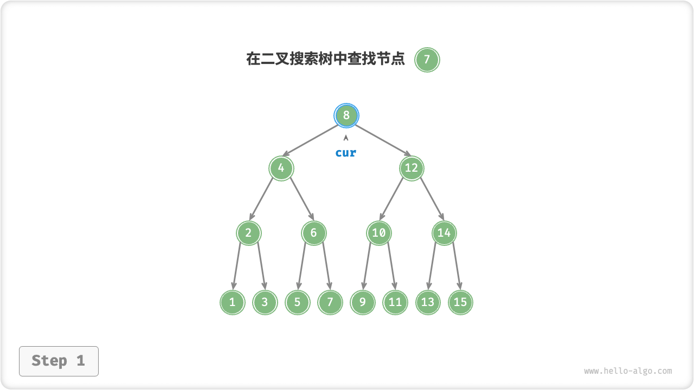
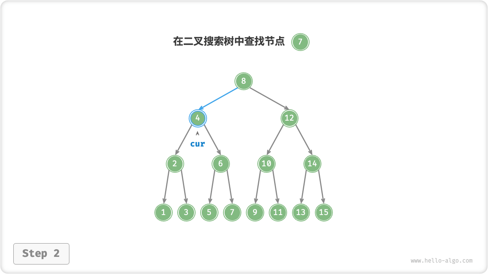
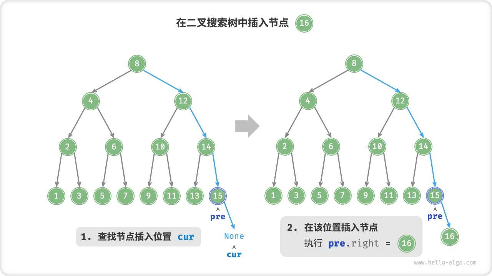
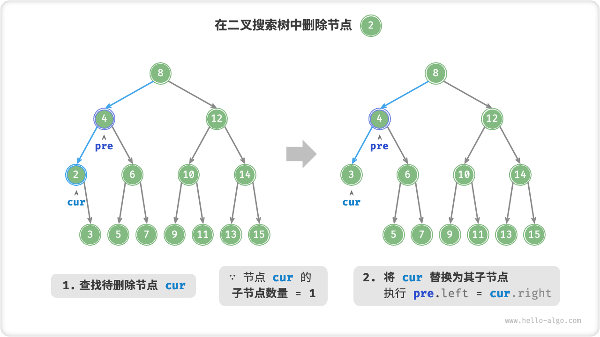
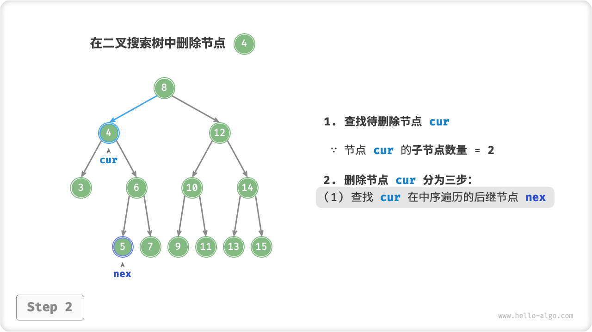
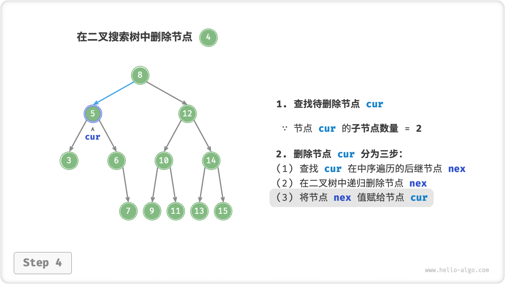
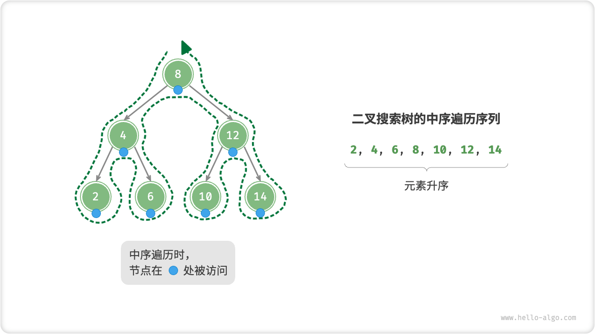
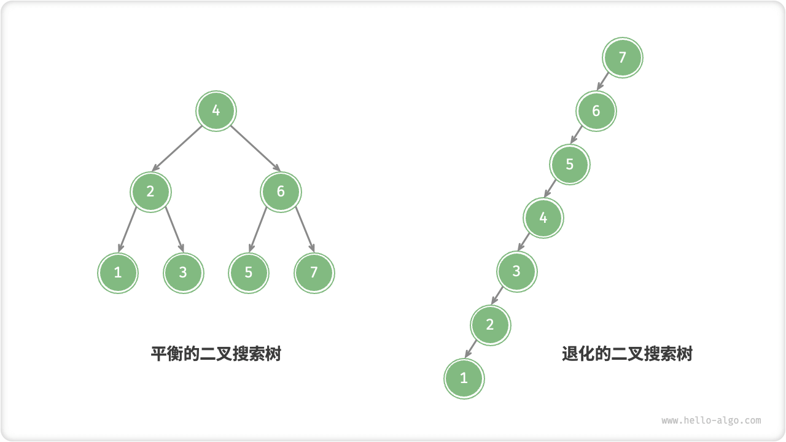

# Binary Search Tree

As shown in the figure below, "binary search tree" satisfies the following conditions.

1. For the root node, the value of all nodes in the left-child node $<$ The value of the root node $<$ The value of all nodes in the right-child node.
2. The left and right subtrees of any node are also binary search trees, i.e., they also satisfy the condition `1.` .


## Operations On Binary Search Trees

We encapsulate the binary search tree as a class `BinarySearchTree` and declare a member variable `root` that points to the root node of the tree.

### Find The Node

Given a target node value `num`, it can be found according to the nature of a binary search tree. As shown in the figure below, we declare a node `cur` and start from the root node `root` of the binary tree, and cyclically compare the size relationship between the node values `cur.val` and `num`.

- If `cur.val < num`, it means that the target node is in the right-child node of `cur`, so execute `cur = cur.right`.
- If `cur.val > num` , then the target node is in the left-child node of `cur` , so execute `cur = cur.left` .
- If `cur.val = num` , the target node is found, the loop is broken and the node is returned.

=== "<1>"
    

=== "<2>"
    

=== "<3>"
    

=== "<4>"
    

The binary search tree lookup operation works in the same way as the binary search algorithm, by eliminating half of the cases per round. The number of rounds is at most the height of the binary tree, using $O(\log n)$ time when the binary tree is balanced.

```src
[file]{binary_search_tree}-[class]{binary_search_tree}-[func]{search}
```

### Insert Node

Given an element `num` to be inserted, in order to maintain the nature of the binary search tree "left subtree < root node < right subtree", the insertion process is shown in the figure below.

1. **Find insertion position**: similar to Find, start from the root node and loop down according to the relationship between the current node value and the size of `num` until the leaf node is crossed (traversing to $\text{None}$ ).
2. **Insert node at this position**: initialize node `num` and place the node at position $\text{None}$.



In the code implementation, the following two points need to be noted.

- A binary search tree node is not allowed to have duplicate nodes, otherwise its definition would be violated. Therefore, if the node to be inserted already exists in the tree node, the insertion is not performed and it is returned directly.
- In order to insert a node, we need to save the node from the previous loop with the help of the node `pre`. This way, when traversing to $\text{None}$, we can get its parent node, and thus complete the node insertion operation.

```src
[file]{binary_search_tree}-[class]{binary_search_tree}-[func]{insert}
```

As with finding nodes, inserting nodes uses $O(\log n)$ time.

### Delete Node

First find the target node in the binary tree and then remove it from the binary tree.

Similar to inserting a node, we need to ensure that the "left subtree < root node < right subtree" property of the binary search tree is still satisfied after the deletion operation is completed.

Therefore, we need to perform the corresponding node deletion operations according to the number of children of the target node, which are categorized into three cases: 0, 1 and 2.

As shown in the figure below, when the degree of the node to be deleted is $0$, it means that the node is a leaf node and can be deleted directly.


As shown in the figure below, when the degree of the node to be deleted is $1$, it is sufficient to replace the node to be deleted with its children.



When the degree of the node to be deleted is $2$, we can't delete it directly, but need to replace it with a node. This node can be the smallest node of the right-child node or the largest node of the left-child node because we want to keep the nature of the binary search tree "left $<$ root $<$ right".

Assuming that we select the smallest node of the right-child node (i.e., the next node in the middle-order traversal), the flow of the deletion operation is shown in the figure below.

1. Find the next node in the "middle-order traversal sequence" of the node to be deleted, denoted as `tmp`.
2. Overwrite the value of `tmp` with the value of the node to be deleted and recursion tree node `tmp` .

=== "<1>"
    

=== "<2>"
    

=== "<3>"
    

=== "<4>"
    

The node deletion operation also uses $O(\log n)$ time, where $O(\log n)$ time is needed to find the node to be deleted, and $O(\log n)$ time is needed to get the succeeding node for mid-order traversal.

```src
[file]{binary_search_tree}-[class]{binary_search_tree}-[func]{remove}
```

### Middle-Order Traversal Is Ordered

As shown in the figure below, the middle-order traversal of a binary tree follows the traversal order of "left $\rightarrow$ root $\rightarrow$ right", and the binary search tree satisfies the size relationship of "left-child node $<$ root node $<$ right-child node". The binary search tree satisfies the "left child $<$ root $<$ right child" size relation.

This means that when performing a mid-order traversal in a binary search tree, the next smallest node will always be traversed preferentially, leading to an important property:**The sequence of mid-order traversals of a binary search tree is ascending**.

Using the ascending nature of the middle-order traversal, it takes only $O(n)$ time to fetch ordered data in a binary search tree without additional sorting operations, which is very efficient.



## Efficiency Of Binary Search Trees

Given a set of data, we consider storing it using an array or a binary search tree. Observing the table below, the time complexity of each operation of the binary search tree is of logarithmic degree, which provides a stable and efficient performance. Arrays are more efficient than binary search trees only in data applicability scenarios with high frequency additions and low frequency lookups for deletions.

<p align="center"> Table <id> &nbsp; Efficiency of arrays vs. search trees </p>

|                | Unordered arrays | Binary search trees |
| -------------- | ---------------- | ------------------- |
| Find Elements  | $O(n)$           | $O(\log n)$         |
| insert element | $O(1)$           | $O(\log n)$         |
| Delete Element | $O(n)$           | $O(\log n)$         |

Ideally, the binary search tree is "balanced" so that any node can be found in a $\log n$ round-robin.

However, if we keep inserting and deleting nodes in the binary search tree, it may cause the binary tree to degenerate into a linked list as shown in the figure below, at which point the time complexity of the various operations also degenerates to $O(n)$ .



## Common Applications Of Binary Search Trees

- Used as a multi-level index in the system for efficient find, insert, and delete operations.
- as the underlying data structure for certain searching algorithms.
- Used to store a stream of data to keep it in an organized state.
