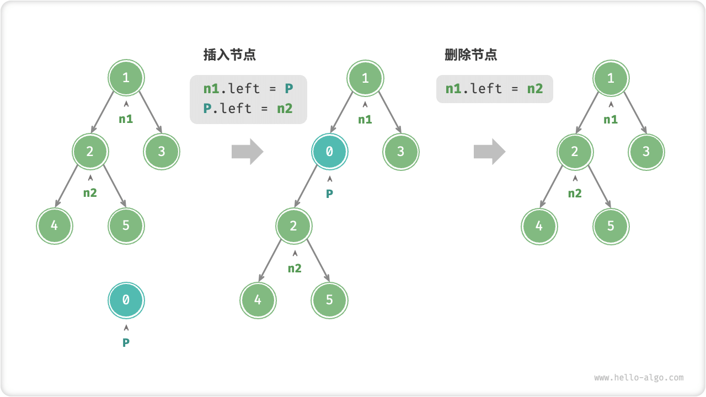
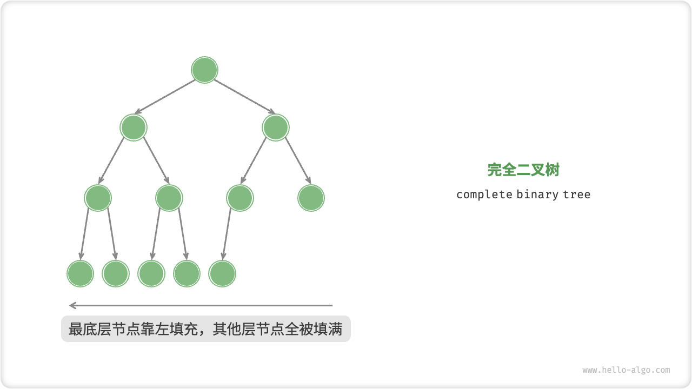

# Binary Tree

"A binary tree is a nonlinear data structure that represents a derived relationship between ancestors and descendants, and embodies the logic of divide and conquer. Similar to a linked list, the basic unit of a binary tree is a node, and each node contains: a value, a reference to a left-child node, and a reference to a right-child node.

=== "Python"

    ```python title=""
    class TreeNode:
        """Binary tree node classes""""
        def __init__(self, val: int):
            self.val: int = val                # node value
            self.left: TreeNode | None = None  # left-child node reference
            self.right: TreeNode | None = None # right-child node reference
    ```

=== "C++"

    ```cpp title=""
    /* Binary tree node structure */
    struct TreeNode {
        int val;          // node value
        TreeNode *left;   // Pointer to left-child node.
        TreeNode *right;  // Pointer to right-child node.
        TreeNode(int x) : val(x), left(nullptr), right(nullptr) {}
    };
    ```

=== "Java"

    ```java title=""
    /* Binary tree node class */
    class TreeNode {
        int val;         // node value
        TreeNode left;   // Reference to left-child node.
        TreeNode right;  // right-child node reference
        TreeNode(int x) { val = x; }
    }
    ```

=== "C#"

    ```csharp title=""
    /* Binary tree node class */
    class TreeNode {
        int val;          // node value
        TreeNode? left;   // Left-child node reference.
        TreeNode? right;  // Reference to right-child node.
        TreeNode(int x) { val = x; }
    }
    ```

=== "Go"

    ```go title=""
    /* Binary tree node structure */
    type TreeNode struct {
        Val   int
        Left  *TreeNode
        Right *TreeNode
    }
    /* Constructor */
    func NewTreeNode(v int) *TreeNode {
        return &TreeNode{
            Left:  nil, // pointer to left-child node
            Right: nil, // pointer to right-child node
            Val:   v,   // node value
        }
    }
    ```

=== "Swift"

    ```swift title=""
    /* Binary tree node class */
    class TreeNode {
        var val: Int // node value
        var left: TreeNode? // Left-child node reference.
        var right: TreeNode? // Right-child node reference.

        init(x: Int) {
            val = x
        }
    }
    ```

=== "JS"

    ```javascript title=""
    /* Binary tree node class */
    class TreeNode {
        val; // node value
        left; // Pointer to the left-child node.
        right; // pointer to right-child node
        constructor(val, left, right) {
            this.val = val === undefined ? 0 : val;
            this.left = left === undefined ? null : left;
            this.right = right === undefined ? null : right;
        }
    }
    ```

=== "TS"

    ```typescript title=""
    /* Binary tree node class */
    class TreeNode {
        val: number;
        left: TreeNode | null;
        right: TreeNode | null;
   
        constructor(val?: number, left?: TreeNode | null, right?: TreeNode | null) {
            this.val = val === undefined ? 0 : val; // node value
            this.left = left === undefined ? null : left; // left-child node reference
            this.right = right === undefined ? null : right; // right-child node reference
        }
    }
    ```

=== "Dart"

    ```dart title=""
    /* Binary tree node class */
    class TreeNode {
      int val;         // node value
      TreeNode? left;  // Left-child node reference.
      TreeNode? right; // Reference to right-child node.
      TreeNode(this.val, [this.left, this.right]);
    }
    ```

=== "Rust"

    ```rust title=""
    use std::rc::Rc;
    use std::cell::RefCell;

    /* Binary tree node structure */
    struct TreeNode {
        val: i32,                               // node value
        left: Option<Rc<RefCell<TreeNode>>>,    // left-child node reference
        right: Option<Rc<RefCell<TreeNode>>>,   // right-child node reference
    }

    impl TreeNode {
        /* Constructor */
        fn new(val: i32) -> Rc<RefCell<Self>> {
            Rc::new(RefCell::new(Self {
                val,
                left: None,
                right: None
            }))
        }
    }
    ```

=== "C"

    ```c title=""
    /* Binary tree node structure */
    typedef struct TreeNode {
        int val;                // node value
        int height;             // height of the node
        struct TreeNode *left;  // Pointer to left-child node.
        struct TreeNode *right; // Pointer to right-child node.
    } TreeNode;

    /* Constructors */
    TreeNode *newTreeNode(int val) {
        TreeNode *node;

        node = (TreeNode *)malloc(sizeof(TreeNode));
        node->val = val;
        node->height = 0;
        node->left = NULL;
        node->right = NULL;
        return node;
    }
    ```

=== "Zig"

    ```zig title=""

    ```

Each node has two references (pointers) to the left-child node and the right-child node, which are called the parent nodes of the two child nodes. When given a node in a binary tree, the tree formed by the left-child node and the following nodes of the node is called the "left subtree" of the node, and similarly, the "right subtree" of the node is called the "right subtree".

**In a binary tree node, all nodes except leaf nodes contain children and non-empty subtrees**. As shown in the figure below, if "node 2" is considered as the parent node, its left-child node and right-child node are "node 4" and "node 5" respectively. The left-child node is "the tree formed by node 4 and its following nodes" and the right-child node is "the tree formed by node 5 and its following nodes".


## Common Terminology For Binary Trees

The common terminology for binary trees is shown in the figure below.

- "root node root node": a node at the top level of a binary tree with no parent node.
- "leaf node": a node with no children, both pointers point to $\text{None}$.
- "edge": a line segment connecting two nodes, i.e. a node reference (pointer).
- The "level" of the node: increasing from top to bottom, the level of the root node is 1.
- Degree of a node degree: the number of children of a node. In a binary tree, the degree can take values in the range 0, 1, 2.
- Height of a binary tree: the number of edges from the root node to the farthest leaf node.
- Depth of a node depth: the number of edges that pass from the root node to the node.
- The "height" of a node: the number of edges passing from the farthest leaf node to the node.


!!! tip

    Note that we usually define "height" and "depth" as "number of edges traveled", but some topics or textbooks may define them as "the number of nodes traveled". In this case, add 1 to both height and depth.

## Basic Binary Tree Operations

### Initialize A Binary Tree

Similar to a linked list, the nodes are initialized first and then the references (pointers) are constructed.

=== "Python"

    ```python title="binary_tree.py"
    # Initialize binary tree
    # Initialize nodes
    n1 = TreeNode(val=1)
    n2 = TreeNode(val=2)
    n3 = TreeNode(val=3)
    n4 = TreeNode(val=4)
    n5 = TreeNode(val=5)
    # Construct references to point (i.e. pointers)
    n1.left = n2
    n1.right = n3
    n2.left = n4
    n2.right = n5
    ```

=== "C++"

    ```cpp title="binary_tree.cpp"
    /* Initialize the binary tree */
    // Initialize nodes
    TreeNode* n1 = new TreeNode(1);
    TreeNode* n2 = new TreeNode(2);
    TreeNode* n3 = new TreeNode(3);
    TreeNode* n4 = new TreeNode(4);
    TreeNode* n5 = new TreeNode(5);
    // Constructing reference pointers (i.e. pointers)
    n1->left = n2;
    n1->right = n3;
    n2->left = n4;
    n2->right = n5;
    ```

=== "Java"

    ```java title="binary_tree.java"
    // Initialize nodes
    TreeNode n1 = new TreeNode(1);
    TreeNode n2 = new TreeNode(2);
    TreeNode n3 = new TreeNode(3);
    TreeNode n4 = new TreeNode(4);
    TreeNode n5 = new TreeNode(5);
    // Constructing reference pointers (i.e. pointers)
    n1.left = n2;
    n1.right = n3;
    n2.left = n4;
    n2.right = n5;
    ```

=== "C#"

    ```csharp title="binary_tree.cs"
    /* Initialize the binary tree */
    // Initialize nodes
    TreeNode n1 = new(1);
    TreeNode n2 = new(2);
    TreeNode n3 = new(3);
    TreeNode n4 = new(4);
    TreeNode n5 = new(5);
    // Constructing reference pointers (i.e. pointers)
    n1.left = n2;
    n1.right = n3;
    n2.left = n4;
    n2.right = n5;
    ```

=== "Go"

    ```go title="binary_tree.go"
    /* Initialize the binary tree */
    // Initialize nodes
    n1 := NewTreeNode(1)
    n2 := NewTreeNode(2)
    n3 := NewTreeNode(3)
    n4 := NewTreeNode(4)
    n5 := NewTreeNode(5)
    // Constructing reference pointers (i.e. pointers)
    n1.Left = n2
    n1.Right = n3
    n2.Left = n4
    n2.Right = n5
    ```

=== "Swift"

    ```swift title="binary_tree.swift"
    // Initialize nodes
    let n1 = TreeNode(x: 1)
    let n2 = TreeNode(x: 2)
    let n3 = TreeNode(x: 3)
    let n4 = TreeNode(x: 4)
    let n5 = TreeNode(x: 5)
    // Constructing reference pointers (i.e. pointers)
    n1.left = n2
    n1.right = n3
    n2.left = n4
    n2.right = n5
    ```

=== "JS"

    ```javascript title="binary_tree.js"
    /* Initialize the binary tree */
    // Initialize nodes
    let n1 = new TreeNode(1),
        n2 = new TreeNode(2),
        n3 = new TreeNode(3),
        n4 = new TreeNode(4),
        n5 = new TreeNode(5);
    // Constructing reference pointers (i.e. pointers)
    n1.left = n2;
    n1.right = n3;
    n2.left = n4;
    n2.right = n5;
    ```

=== "TS"

    ```typescript title="binary_tree.ts"
    /* Initialize the binary tree */
    // Initialize nodes
    let n1 = new TreeNode(1),
        n2 = new TreeNode(2),
        n3 = new TreeNode(3),
        n4 = new TreeNode(4),
        n5 = new TreeNode(5);
    // Constructing reference pointers (i.e. pointers)
    n1.left = n2;
    n1.right = n3;
    n2.left = n4;
    n2.right = n5;
    ```

=== "Dart"

    ```dart title="binary_tree.dart"
    /* Initialize the binary tree */
    // Initialize nodes
    TreeNode n1 = new TreeNode(1);
    TreeNode n2 = new TreeNode(2);
    TreeNode n3 = new TreeNode(3);
    TreeNode n4 = new TreeNode(4);
    TreeNode n5 = new TreeNode(5);
    // Constructing reference pointers (i.e. pointers)
    n1.left = n2;
    n1.right = n3;
    n2.left = n4;
    n2.right = n5;
    ```

=== "Rust"

    ```rust title="binary_tree.rs"
    // Initialize nodes
    let n1 = TreeNode::new(1);
    let n2 = TreeNode::new(2);
    let n3 = TreeNode::new(3);
    let n4 = TreeNode::new(4);
    let n5 = TreeNode::new(5);
    // Constructing reference pointers (i.e. pointers)
    n1.borrow_mut().left = Some(n2.clone());
    n1.borrow_mut().right = Some(n3);
    n2.borrow_mut().left = Some(n4);
    n2.borrow_mut().right = Some(n5);
    ```

=== "C"

    ```c title="binary_tree.c"
    /* Initialize the binary tree */
    // Initialize nodes
    TreeNode *n1 = newTreeNode(1);
    TreeNode *n2 = newTreeNode(2);
    TreeNode *n3 = newTreeNode(3);
    TreeNode *n4 = newTreeNode(4);
    TreeNode *n5 = newTreeNode(5);
    // Constructing reference pointers (i.e. pointers)
    n1->left = n2;
    n1->right = n3;
    n2->left = n4;
    n2->right = n5;
    ```

=== "Zig"

    ```zig title="binary_tree.zig"

    ```

### Insertion And Deletion Of Nodes

Similar to a linked list, insertion and deletion of nodes in a binary tree can be accomplished by modifying pointers. An example is given in the figure below.



=== "Python"

    ```python title="binary_tree.py"
    # Insertion and deletion of nodes
    p = TreeNode(0)
    # Insert node P in the middle of n1 -> n2
    n1.left = p
    p.left = n2
    # Delete node P
    n1.left = n2
    ```

=== "C++"

    ```cpp title="binary_tree.cpp"
    /* Insertion and deletion of nodes */
    TreeNode* P = new TreeNode(0);
    // Insert node P in the middle of n1 -> n2.
    n1->left = P;
    P->left = n2;
    // Delete node P
    n1->left = n2;
    ```

=== "Java"

    ```java title="binary_tree.java"
    TreeNode P = new TreeNode(0);
    // Insert node P in the middle of n1 -> n2.
    n1.left = P;
    P.left = n2;
    // Delete node P
    n1.left = n2;
    ```

=== "C#"

    ```csharp title="binary_tree.cs"
    /* Insertion and deletion of nodes */
    TreeNode P = new(0);
    // Insert node P in the middle of n1 -> n2.
    n1.left = P;
    P.left = n2;
    // Delete node P
    n1.left = n2;
    ```

=== "Go"

    ```go title="binary_tree.go"
    /* Insertion and deletion of nodes */
    // Insert node P in the middle of n1 -> n2.
    p := NewTreeNode(0)
    n1.Left = p
    p.Left = n2
    // Delete node P
    n1.Left = n2
    ```

=== "Swift"

    ```swift title="binary_tree.swift"
    let P = TreeNode(x: 0)
    // Insert node P in the middle of n1 -> n2.
    n1.left = P
    P.left = n2
    // Delete node P
    n1.left = n2
    ```

=== "JS"

    ```javascript title="binary_tree.js"
    /* Insertion and deletion of nodes */
    let P = new TreeNode(0);
    // Insert node P in the middle of n1 -> n2.
    n1.left = P;
    P.left = n2;
    // Delete node P
    n1.left = n2;
    ```

=== "TS"

    ```typescript title="binary_tree.ts"
    /* Insertion and deletion of nodes */
    const P = new TreeNode(0);
    // Insert node P in the middle of n1 -> n2.
    n1.left = P;
    P.left = n2;
    // Delete node P
    n1.left = n2;
    ```

=== "Dart"

    ```dart title="binary_tree.dart"
    /* Insertion and deletion of nodes */
    TreeNode P = new TreeNode(0);
    // Insert node P in the middle of n1 -> n2.
    n1.left = P;
    P.left = n2;
    // Delete node P
    n1.left = n2;
    ```

=== "Rust"

    ```rust title="binary_tree.rs"
    let p = TreeNode::new(0);
    // Insert node P in the middle of n1 -> n2.
    n1.borrow_mut().left = Some(p.clone());
    p.borrow_mut().left = Some(n2.clone());
    // Delete node p
    n1.borrow_mut().left = Some(n2);
    ```

=== "C"

    ```c title="binary_tree.c"
    /* Insertion and deletion of nodes */
    TreeNode *P = newTreeNode(0);
    // Insert node P in the middle of n1 -> n2.
    n1->left = P;
    P->left = n2;
    // Delete node P
    n1->left = n2;
    ```

=== "Zig"

    ```zig title="binary_tree.zig"

    ```

!!! note

    It is important to note that inserting a node may change the original logical structure of a binary tree, while deleting a node usually means deleting the node and all its subtrees. Therefore, in a binary tree, insertion and deletion operations are usually done in conjunction with a set of operations to achieve meaningful operations.

## Common Binary Tree Types

### Perfect Binary Tree

The nodes in all levels of a "perfect binary tree" are completely filled. In a perfect binary tree, the degree of the leaf nodes is $0$, and the degree of all the other nodes is $2$; if the height of the tree is $h$, then the total number of nodes is $2^{h+1} - 1$, which shows the standard exponential relationship, reflecting the common phenomenon of cell division in nature.

!!! tip

    Note that in the Chinese community, a perfect binary tree is often referred to as a "full binary tree".


### Complete Binary Tree

As shown in the figure below, only the nodes at the bottom level of a complete binary tree are not filled, and the nodes at the bottom level are filled as far to the left as possible.



### Full Binary Tree

As shown in the figure below, a "full binary tree full binary tree" has all nodes except leaf nodes with two children.


### Balanced Binary Tree

As shown in the figure below, the absolute value of the difference between the heights of the left-child node and the right subtree of any node in a balanced binary tree does not exceed 1.


## Degeneration Of Binary Trees

The figure below shows the ideal and degenerate states of a binary tree. A binary tree reaches a "perfect binary tree" when each level of nodes is filled, while a binary tree degenerates into a "linked list" when all nodes are skewed to one side.

- A perfect binary tree is the ideal case to take full advantage of the "divide and conquer" of binary trees.
- Linked lists are the other extreme, where each operation becomes linear and the time complexity degrades to $O(n)$ .


As shown in the table below, the number of leaf nodes, the total number of nodes, and the height of the binary tree reaches extreme or minimal values under the best and worst structure.

<p align="center"> Table <id> &nbsp; Best and worst case scenarios for binary trees </p>

|                                             | perfect binary tree | linked list |
| ------------------------------------------- | ------------------- | ----------- |
| Number of nodes in the $i$ level            | $2^{i-1}$           | $1$         |
| height $h$ Number of leaf nodes in the tree | $2^h$               | $1$         |
| height $h$ Total number of tree nodes       | $2^{h+1} - 1$       | $h + 1$     |
| Total number of nodes $n$ Height of tree    | $\log_2 (n+1) - 1$  | $n - 1$     |
