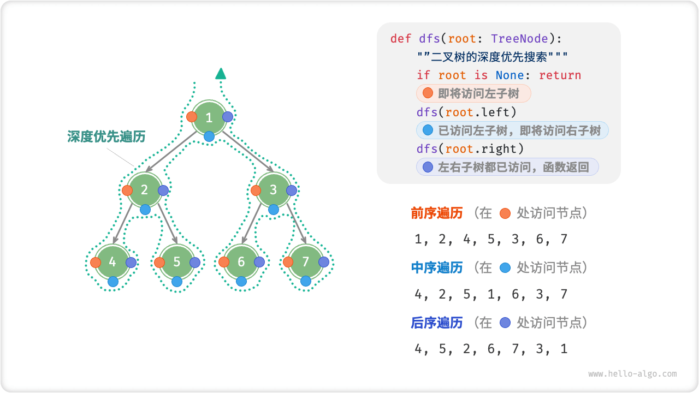
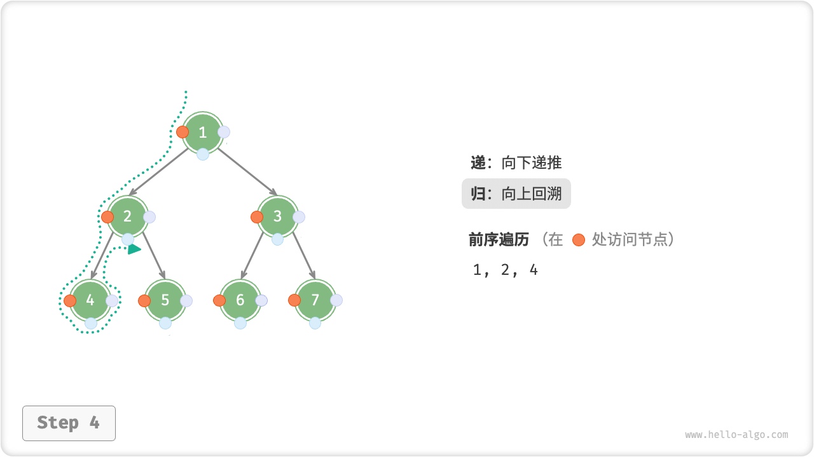
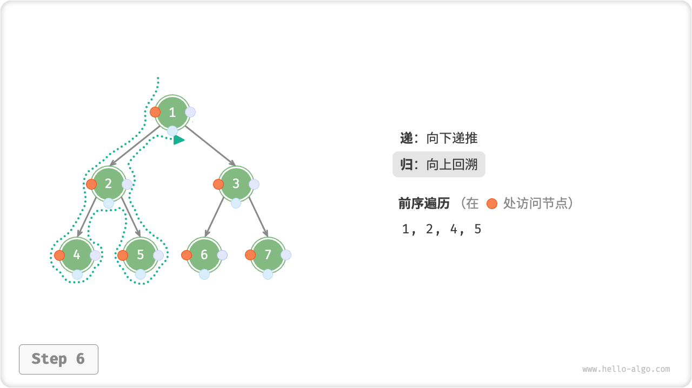
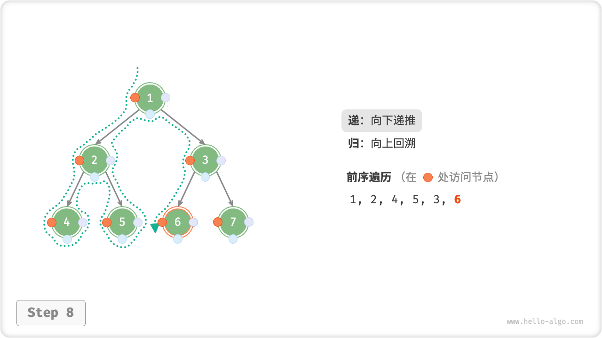
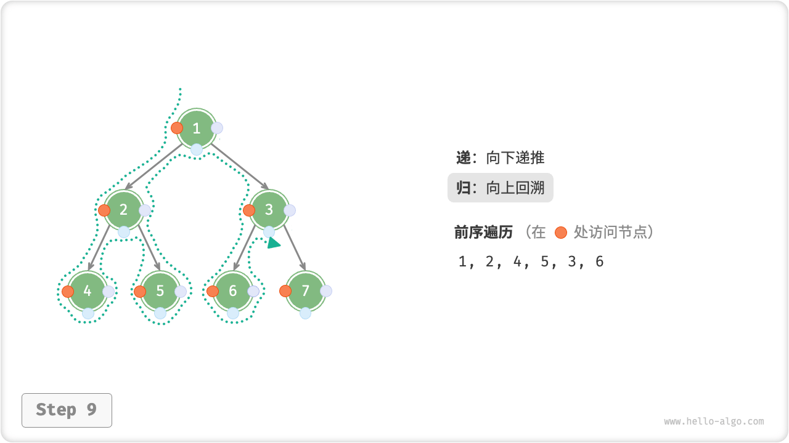

# Binary Tree Traversal

From a physical structure point of view, a tree is a data structure based on a linked list, and therefore its traversal is done by accessing the nodes one by one through pointers. However, a tree is a nonlinear data structure, which makes traversing a tree more complex than traversing a linked list, and needs to be implemented with the help of a searching algorithm.

Common traversals of binary trees include level-order traversal, preorder traversal, middle-order traversal, and postorder traversal.

## Level-Order Traversal

As shown in the figure below, "level-order traversal level-order traversal" traverses the binary tree level by level from the top to the bottom and visits the nodes at each level in the order from left to right.

Level-order traversal essentially belongs to the "breadth-first traversal breadth-first traversal", which embodies a "circle by circle outward" layer-by-layer traversal.


### Code Implementation

Breadth-first traversal is usually implemented with the help of a "queue". While queues follow the "first in, first out" rule, breadth-first traversals follow the "progress by level" rule, but the idea behind both is the same.

```src
[file]{binary_tree_bfs}-[class]{}-[func]{level_order}
```

### Complexity Analysis

- **Time complexity $O(n)$** : All nodes are visited once, using $O(n)$ time, where $n$ is the number of nodes.
- **Space complexity $O(n)$** : In the worst case, i.e., a full binary tree, there are at most $(n + 1) / 2$ nodes in the queue at the same time before traversing to the bottom level, occupying $O(n)$ space.

## Pre-Order, Middle-Order, And Back-Order Traversal

Accordingly, preorder, midorder and postorder traversal are all "depth-first traversal depth-first traversal", which embodies a traversal method of "going to the end first and then backtracking to continue".

The figure below shows how depth-first traversal of a binary tree works. **Depth-first traversal is like "walking" around the entire perimeter of the binary tree**, encountering three positions at each node, corresponding to a preorder traversal, a middle-order traversal, and a postorder traversal.



### Code Implementation

Depth-first search is usually implemented based on recursion:

```src
[file]{binary_tree_dfs}-[class]{}-[func]{post_order}
```

!!! note

    Depth-first search can also be implemented based on iteration, so interested students can do their own research.

The figure below illustrates the recursion of a forward traversal of a binary tree, which can be divided into two inverse parts, "recursion" and "recursion".

1. "Pass" indicates that a new method is opened and the program visits the next node in the process.
2. "Return" means that the function returns and the current node has been visited.

=== "<1>"
    

=== "<2>"
    

=== "<3>"
    

=== "<4>"
    

=== "<5>"
    

=== "<6>"
    

=== "<7>"
    

=== "<8>"
    

=== "<9>"
    

=== "<10>"
    

=== "<11>"
    

### Complexity Analysis

- **Time complexity $O(n)$** : All nodes are visited once, using $O(n)$ time.
- **Space complexity $O(n)$** : In the worst case, i.e., when the tree degenerates to a linked list, the depth of recursion reaches $n$ , and the system occupies $O(n)$ stack frame space.
