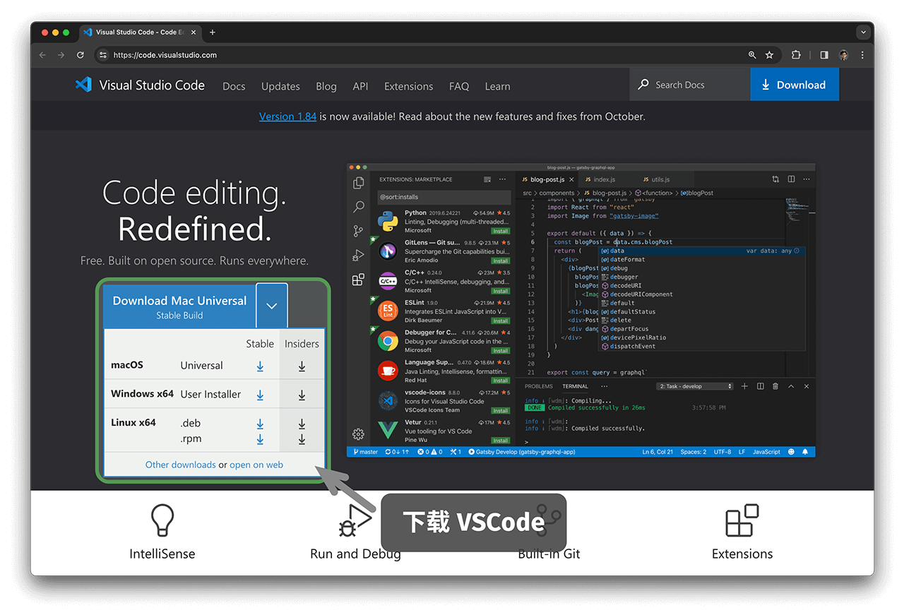
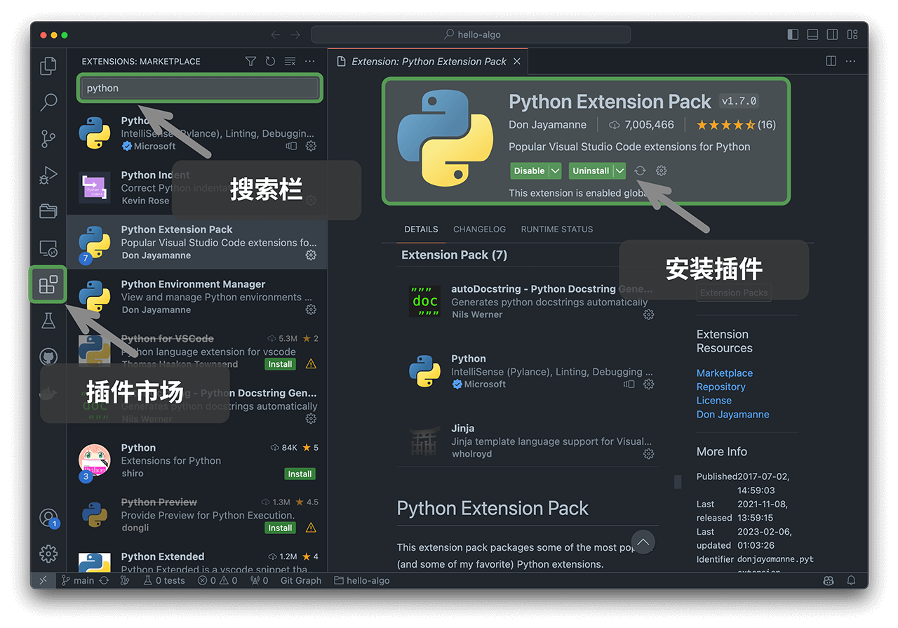

# 编程环境安装

## 安装 IDE

推荐使用开源、轻量的 VS Code 作为本地集成开发环境（IDE）。访问 [VS Code 官网](https://code.visualstudio.com/)，根据操作系统选择相应版本的 VS Code 进行下载和安装。

VS Code 拥有强大的扩展包生态系统，支持大多数编程语言的运行和调试。以 Python 为例，安装“Python Extension Pack”扩展包之后，即可进行 Python 代码调试。安装步骤如下图所示。

## 安装语言环境

### Python 环境

1. 下载并安装 [Miniconda3](https://docs.conda.io/en/latest/miniconda.html) ，需要 Python 3.10 或更新版本。
2. 在 VS Code 的插件市场中搜索 `python` ，安装 Python Extension Pack 。
3. （可选）在命令行输入 `pip install black` ，安装代码格式化工具。

### C/C++ 环境

1. Windows 系统需要安装 [MinGW](https://sourceforge.net/projects/mingw-w64/files/)（[配置教程](https://blog.csdn.net/qq_33698226/article/details/129031241)）；MacOS 自带 Clang ，无须安装。
2. 在 VS Code 的插件市场中搜索 `c++` ，安装 C/C++ Extension Pack 。
3. （可选）打开 Settings 页面，搜索 `Clang_format_fallback Style` 代码格式化选项，设置为 `{ BasedOnStyle: Microsoft, BreakBeforeBraces: Attach }` 。

### Java 环境

1. 下载并安装 [OpenJDK](https://jdk.java.net/18/)（版本需满足 > JDK 9）。
2. 在 VS Code 的插件市场中搜索 `java` ，安装 Extension Pack for Java 。

### C# 环境

1. 下载并安装 [.Net 8.0](https://dotnet.microsoft.com/en-us/download) 。
2. 在 VS Code 的插件市场中搜索 `C# Dev Kit` ，安装 C# Dev Kit （[配置教程](https://code.visualstudio.com/docs/csharp/get-started)）。
3. 也可使用 Visual Studio（[安装教程](https://learn.microsoft.com/zh-cn/visualstudio/install/install-visual-studio?view=vs-2022)）。

### Go 环境

1. 下载并安装 [go](https://go.dev/dl/) 。
2. 在 VS Code 的插件市场中搜索 `go` ，安装 Go 。
3. 按快捷键 `Ctrl + Shift + P` 呼出命令栏，输入 go ，选择 `Go: Install/Update Tools` ，全部勾选并安装即可。

### Swift 环境

1. 下载并安装 [Swift](https://www.swift.org/download/) 。
2. 在 VS Code 的插件市场中搜索 `swift` ，安装 [Swift for Visual Studio Code](https://marketplace.visualstudio.com/items?itemName=sswg.swift-lang) 。

### JavaScript 环境

1. 下载并安装 [Node.js](https://nodejs.org/en/) 。
2. （可选）在 VS Code 的插件市场中搜索 `Prettier` ，安装代码格式化工具。

### TypeScript 环境

1. 同 JavaScript 环境安装步骤。
2. 安装 [TypeScript Execute (tsx)](https://github.com/privatenumber/tsx?tab=readme-ov-file#global-installation) 。
3. 在 VS Code 的插件市场中搜索 `typescript` ，安装 [Pretty TypeScript Errors](https://marketplace.visualstudio.com/items?itemName=yoavbls.pretty-ts-errors) 。

### Dart 环境

1. 下载并安装 [Dart](https://dart.dev/get-dart) 。
2. 在 VS Code 的插件市场中搜索 `dart` ，安装 [Dart](https://marketplace.visualstudio.com/items?itemName=Dart-Code.dart-code) 。

### Rust 环境

1. 下载并安装 [Rust](https://www.rust-lang.org/tools/install) 。
2. 在 VS Code 的插件市场中搜索 `rust` ，安装 [rust-analyzer](https://marketplace.visualstudio.com/items?itemName=rust-lang.rust-analyzer) 。
