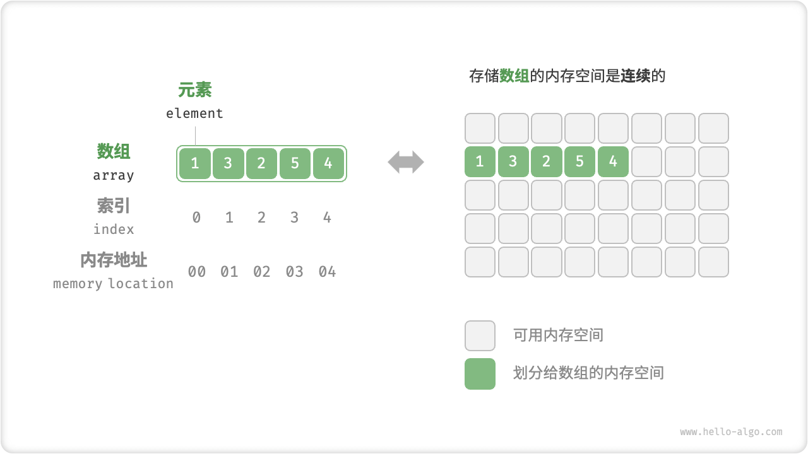
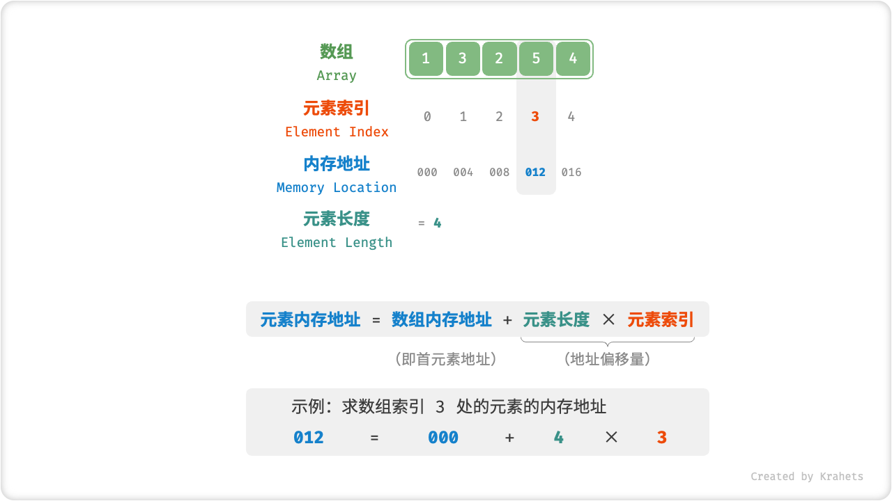
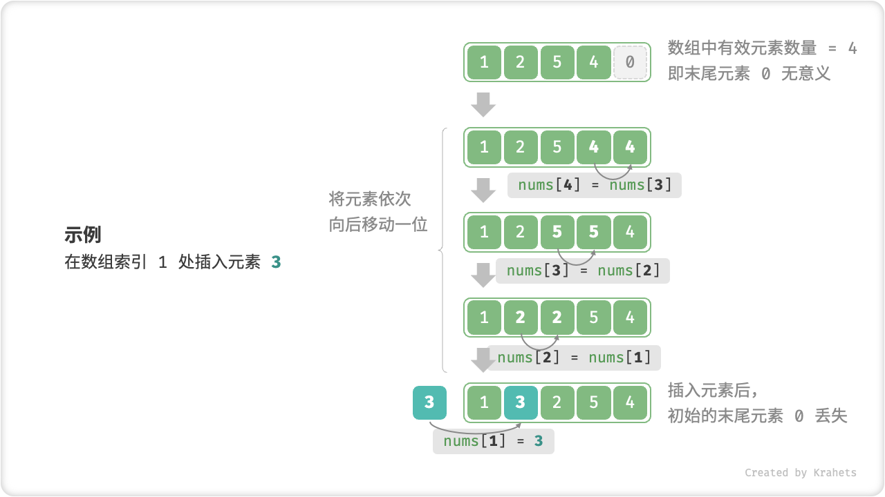
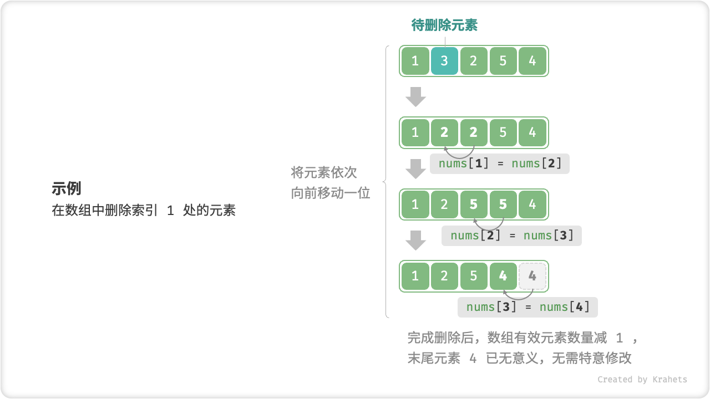

# 数组

<u>数组（array）</u>是一种线性数据结构，其将相同类型的元素存储在连续的内存空间中。我们将元素在数组中的位置称为该元素的<u>索引（index）</u>。下图展示了数组的主要概念和存储方式。



## 数组常用操作

### 初始化数组

我们可以根据需求选用数组的两种初始化方式：无初始值、给定初始值。在未指定初始值的情况下，大多数编程语言会将数组元素初始化为 $0$ ：

=== "Python"

    ```python title="array.py"
    # 初始化数组
    arr: list[int] = [0] * 5  # [ 0, 0, 0, 0, 0 ]
    nums: list[int] = [1, 3, 2, 5, 4]  
    ```

=== "C++"

    ```cpp title="array.cpp"
    /* 初始化数组 */
    // 存储在栈上
    int arr[5];
    int nums[5] = { 1, 3, 2, 5, 4 };
    // 存储在堆上（需要手动释放空间）
    int* arr1 = new int[5];
    int* nums1 = new int[5] { 1, 3, 2, 5, 4 };
    ```

=== "Java"

    ```java title="array.java"
    /* 初始化数组 */
    int[] arr = new int[5]; // { 0, 0, 0, 0, 0 }
    int[] nums = { 1, 3, 2, 5, 4 };
    ```

=== "C#"

    ```csharp title="array.cs"
    /* 初始化数组 */
    int[] arr = new int[5]; // [ 0, 0, 0, 0, 0 ]
    int[] nums = [1, 3, 2, 5, 4];
    ```

=== "Go"

    ```go title="array.go"
    /* 初始化数组 */
    var arr [5]int
    // 在 Go 中，指定长度时（[5]int）为数组，不指定长度时（[]int）为切片
    // 由于 Go 的数组被设计为在编译期确定长度，因此只能使用常量来指定长度
    // 为了方便实现扩容 extend() 方法，以下将切片（Slice）看作数组（Array）
    nums := []int{1, 3, 2, 5, 4}
    ```

=== "Swift"

    ```swift title="array.swift"
    /* 初始化数组 */
    let arr = Array(repeating: 0, count: 5) // [0, 0, 0, 0, 0]
    let nums = [1, 3, 2, 5, 4]
    ```

=== "JS"

    ```javascript title="array.js"
    /* 初始化数组 */
    var arr = new Array(5).fill(0);
    var nums = [1, 3, 2, 5, 4];
    ```

=== "TS"

    ```typescript title="array.ts"
    /* 初始化数组 */
    let arr: number[] = new Array(5).fill(0);
    let nums: number[] = [1, 3, 2, 5, 4];
    ```

=== "Dart"

    ```dart title="array.dart"
    /* 初始化数组 */
    List<int> arr = List.filled(5, 0); // [0, 0, 0, 0, 0]
    List<int> nums = [1, 3, 2, 5, 4];
    ```

=== "Rust"

    ```rust title="array.rs"
    /* 初始化数组 */
    let arr: Vec<i32> = vec![0; 5]; // [0, 0, 0, 0, 0]
    let nums: Vec<i32> = vec![1, 3, 2, 5, 4];
    ```

=== "C"

    ```c title="array.c"
    /* 初始化数组 */
    int arr[5] = { 0 }; // { 0, 0, 0, 0, 0 }
    int nums[5] = { 1, 3, 2, 5, 4 };
    ```

=== "Kotlin"

    ```kotlin title="array.kt"
    /* 初始化数组 */
    var arr = IntArray(5) // { 0, 0, 0, 0, 0 }
    var nums = intArrayOf(1, 3, 2, 5, 4)
    ```

=== "Ruby"

    ```ruby title="array.rb"
    # 初始化数组
    arr = Array.new(5, 0)
    nums = [1, 3, 2, 5, 4]
    ```

=== "Zig"

    ```zig title="array.zig"
    // 初始化数组
    var arr = [_]i32{0} ** 5; // { 0, 0, 0, 0, 0 }
    var nums = [_]i32{ 1, 3, 2, 5, 4 };
    ```

??? pythontutor "可视化运行"

    https://pythontutor.com/render.html#code=%23%20%E5%88%9D%E5%A7%8B%E5%8C%96%E6%95%B0%E7%BB%84%0Aarr%20%3D%20%5B0%5D%20*%205%20%20%23%20%5B%200,%200,%200,%200,%200%20%5D%0Anums%20%3D%20%5B1,%203,%202,%205,%204%5D&cumulative=false&curInstr=0&heapPrimitives=nevernest&mode=display&origin=opt-frontend.js&py=311&rawInputLstJSON=%5B%5D&textReferences=false

### 访问元素

数组元素被存储在连续的内存空间中，这意味着计算数组元素的内存地址非常容易。给定数组内存地址（首元素内存地址）和某个元素的索引，我们可以使用下图所示的公式计算得到该元素的内存地址，从而直接访问该元素。



观察上图，我们发现数组首个元素的索引为 $0$ ，这似乎有些反直觉，因为从 $1$ 开始计数会更自然。但从地址计算公式的角度看，**索引本质上是内存地址的偏移量**。首个元素的地址偏移量是 $0$ ，因此它的索引为 $0$ 是合理的。

在数组中访问元素非常高效，我们可以在 $O(1)$ 时间内随机访问数组中的任意一个元素。

```src
[file]{array}-[class]{}-[func]{random_access}
```

### 插入元素

数组元素在内存中是“紧挨着的”，它们之间没有空间再存放任何数据。如下图所示，如果想在数组中间插入一个元素，则需要将该元素之后的所有元素都向后移动一位，之后再把元素赋值给该索引。



值得注意的是，由于数组的长度是固定的，因此插入一个元素必定会导致数组尾部元素“丢失”。我们将这个问题的解决方案留在“列表”章节中讨论。

```src
[file]{array}-[class]{}-[func]{insert}
```

### 删除元素

同理，如下图所示，若想删除索引 $i$ 处的元素，则需要把索引 $i$ 之后的元素都向前移动一位。



请注意，删除元素完成后，原先末尾的元素变得“无意义”了，所以我们无须特意去修改它。

```src
[file]{array}-[class]{}-[func]{remove}
```

总的来看，数组的插入与删除操作有以下缺点。

- **时间复杂度高**：数组的插入和删除的平均时间复杂度均为 $O(n)$ ，其中 $n$ 为数组长度。
- **丢失元素**：由于数组的长度不可变，因此在插入元素后，超出数组长度范围的元素会丢失。
- **内存浪费**：我们可以初始化一个比较长的数组，只用前面一部分，这样在插入数据时，丢失的末尾元素都是“无意义”的，但这样做会造成部分内存空间浪费。

### 遍历数组

在大多数编程语言中，我们既可以通过索引遍历数组，也可以直接遍历获取数组中的每个元素：

```src
[file]{array}-[class]{}-[func]{traverse}
```

### 查找元素

在数组中查找指定元素需要遍历数组，每轮判断元素值是否匹配，若匹配则输出对应索引。

因为数组是线性数据结构，所以上述查找操作被称为“线性查找”。

```src
[file]{array}-[class]{}-[func]{find}
```

### 扩容数组

在复杂的系统环境中，程序难以保证数组之后的内存空间是可用的，从而无法安全地扩展数组容量。因此在大多数编程语言中，**数组的长度是不可变的**。

如果我们希望扩容数组，则需重新建立一个更大的数组，然后把原数组元素依次复制到新数组。这是一个 $O(n)$ 的操作，在数组很大的情况下非常耗时。代码如下所示：

```src
[file]{array}-[class]{}-[func]{extend}
```

## 数组的优点与局限性

数组存储在连续的内存空间内，且元素类型相同。这种做法包含丰富的先验信息，系统可以利用这些信息来优化数据结构的操作效率。

- **空间效率高**：数组为数据分配了连续的内存块，无须额外的结构开销。
- **支持随机访问**：数组允许在 $O(1)$ 时间内访问任何元素。
- **缓存局部性**：当访问数组元素时，计算机不仅会加载它，还会缓存其周围的其他数据，从而借助高速缓存来提升后续操作的执行速度。

连续空间存储是一把双刃剑，其存在以下局限性。

- **插入与删除效率低**：当数组中元素较多时，插入与删除操作需要移动大量的元素。
- **长度不可变**：数组在初始化后长度就固定了，扩容数组需要将所有数据复制到新数组，开销很大。
- **空间浪费**：如果数组分配的大小超过实际所需，那么多余的空间就被浪费了。

## 数组典型应用

数组是一种基础且常见的数据结构，既频繁应用在各类算法之中，也可用于实现各种复杂数据结构。

- **随机访问**：如果我们想随机抽取一些样本，那么可以用数组存储，并生成一个随机序列，根据索引实现随机抽样。
- **排序和搜索**：数组是排序和搜索算法最常用的数据结构。快速排序、归并排序、二分查找等都主要在数组上进行。
- **查找表**：当需要快速查找一个元素或其对应关系时，可以使用数组作为查找表。假如我们想实现字符到 ASCII 码的映射，则可以将字符的 ASCII 码值作为索引，对应的元素存放在数组中的对应位置。
- **机器学习**：神经网络中大量使用了向量、矩阵、张量之间的线性代数运算，这些数据都是以数组的形式构建的。数组是神经网络编程中最常使用的数据结构。
- **数据结构实现**：数组可以用于实现栈、队列、哈希表、堆、图等数据结构。例如，图的邻接矩阵表示实际上是一个二维数组。
