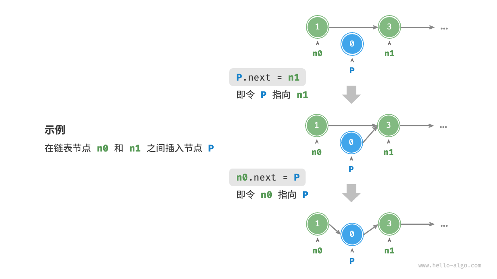
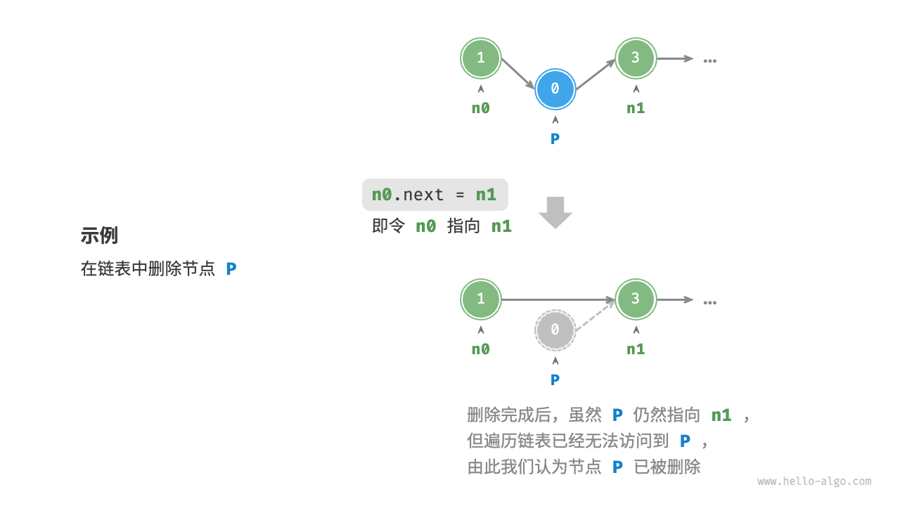
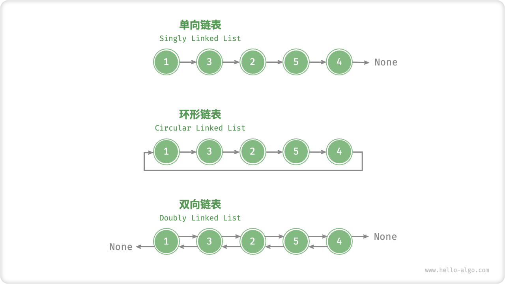

# 链表

内存空间是所有程序的公共资源，在一个复杂的系统运行环境下，空闲的内存空间可能散落在内存各处。我们知道，存储数组的内存空间必须是连续的，而当数组非常大时，内存可能无法提供如此大的连续空间。此时链表的灵活性优势就体现出来了。

<u>链表（linked list）</u>是一种线性数据结构，其中的每个元素都是一个节点对象，各个节点通过“引用”相连接。引用记录了下一个节点的内存地址，通过它可以从当前节点访问到下一个节点。

链表的设计使得各个节点可以分散存储在内存各处，它们的内存地址无须连续。


观察上图，链表的组成单位是<u>节点（node）</u>对象。每个节点都包含两项数据：节点的“值”和指向下一节点的“引用”。

- 链表的首个节点被称为“头节点”，最后一个节点被称为“尾节点”。
- 尾节点指向的是“空”，它在 Java、C++ 和 Python 中分别被记为 `null`、`nullptr` 和 `None` 。
- 在 C、C++、Go 和 Rust 等支持指针的语言中，上述“引用”应被替换为“指针”。

如以下代码所示，链表节点 `ListNode` 除了包含值，还需额外保存一个引用（指针）。因此在相同数据量下，**链表比数组占用更多的内存空间**。

=== "Python"

    ```python title=""
    class ListNode:
        """链表节点类"""
        def __init__(self, val: int):
            self.val: int = val               # 节点值
            self.next: ListNode | None = None # 指向下一节点的引用
    ```

=== "C++"

    ```cpp title=""
    /* 链表节点结构体 */
    struct ListNode {
        int val;         // 节点值
        ListNode *next;  // 指向下一节点的指针
        ListNode(int x) : val(x), next(nullptr) {}  // 构造函数
    };
    ```

=== "Java"

    ```java title=""
    /* 链表节点类 */
    class ListNode {
        int val;        // 节点值
        ListNode next;  // 指向下一节点的引用
        ListNode(int x) { val = x; }  // 构造函数
    }
    ```

=== "C#"

    ```csharp title=""
    /* 链表节点类 */
    class ListNode(int x) {  //构造函数
        int val = x;         // 节点值
        ListNode? next;      // 指向下一节点的引用
    }
    ```

=== "Go"

    ```go title=""
    /* 链表节点结构体 */
    type ListNode struct {
        Val  int       // 节点值
        Next *ListNode // 指向下一节点的指针
    }

    // NewListNode 构造函数，创建一个新的链表
    func NewListNode(val int) *ListNode {
        return &ListNode{
            Val:  val,
            Next: nil,
        }
    }
    ```

=== "Swift"

    ```swift title=""
    /* 链表节点类 */
    class ListNode {
        var val: Int // 节点值
        var next: ListNode? // 指向下一节点的引用

        init(x: Int) { // 构造函数
            val = x
        }
    }
    ```

=== "JS"

    ```javascript title=""
    /* 链表节点类 */
    class ListNode {
        constructor(val, next) {
            this.val = (val === undefined ? 0 : val);       // 节点值
            this.next = (next === undefined ? null : next); // 指向下一节点的引用
        }
    }
    ```

=== "TS"

    ```typescript title=""
    /* 链表节点类 */
    class ListNode {
        val: number;
        next: ListNode | null;
        constructor(val?: number, next?: ListNode | null) {
            this.val = val === undefined ? 0 : val;        // 节点值
            this.next = next === undefined ? null : next;  // 指向下一节点的引用
        }
    }
    ```

=== "Dart"

    ```dart title=""
    /* 链表节点类 */
    class ListNode {
      int val; // 节点值
      ListNode? next; // 指向下一节点的引用
      ListNode(this.val, [this.next]); // 构造函数
    }
    ```

=== "Rust"

    ```rust title=""
    use std::rc::Rc;
    use std::cell::RefCell;
    /* 链表节点类 */
    #[derive(Debug)]
    struct ListNode {
        val: i32, // 节点值
        next: Option<Rc<RefCell<ListNode>>>, // 指向下一节点的指针
    }
    ```

=== "C"

    ```c title=""
    /* 链表节点结构体 */
    typedef struct ListNode {
        int val;               // 节点值
        struct ListNode *next; // 指向下一节点的指针
    } ListNode;

    /* 构造函数 */
    ListNode *newListNode(int val) {
        ListNode *node;
        node = (ListNode *) malloc(sizeof(ListNode));
        node->val = val;
        node->next = NULL;
        return node;
    }
    ```

=== "Kotlin"

    ```kotlin title=""
    /* 链表节点类 */
    // 构造方法
    class ListNode(x: Int) {
        val _val: Int = x          // 节点值
        val next: ListNode? = null // 指向下一个节点的引用
    }
    ```

=== "Ruby"

    ```ruby title=""
    # 链表节点类
    class ListNode
      attr_accessor :val  # 节点值
      attr_accessor :next # 指向下一节点的引用

      def initialize(val=0, next_node=nil)
        @val = val
        @next = next_node
      end
    end
    ```

=== "Zig"

    ```zig title=""
    // 链表节点类
    pub fn ListNode(comptime T: type) type {
        return struct {
            const Self = @This();

            val: T = 0, // 节点值
            next: ?*Self = null, // 指向下一节点的指针

            // 构造函数
            pub fn init(self: *Self, x: i32) void {
                self.val = x;
                self.next = null;
            }
        };
    }
    ```

## 链表常用操作

### 初始化链表

建立链表分为两步，第一步是初始化各个节点对象，第二步是构建节点之间的引用关系。初始化完成后，我们就可以从链表的头节点出发，通过引用指向 `next` 依次访问所有节点。

=== "Python"

    ```python title="linked_list.py"
    # 初始化链表 1 -> 3 -> 2 -> 5 -> 4
    # 初始化各个节点
    n0 = ListNode(1)
    n1 = ListNode(3)
    n2 = ListNode(2)
    n3 = ListNode(5)
    n4 = ListNode(4)
    # 构建节点之间的引用
    n0.next = n1
    n1.next = n2
    n2.next = n3
    n3.next = n4
    ```

=== "C++"

    ```cpp title="linked_list.cpp"
    /* 初始化链表 1 -> 3 -> 2 -> 5 -> 4 */
    // 初始化各个节点
    ListNode* n0 = new ListNode(1);
    ListNode* n1 = new ListNode(3);
    ListNode* n2 = new ListNode(2);
    ListNode* n3 = new ListNode(5);
    ListNode* n4 = new ListNode(4);
    // 构建节点之间的引用
    n0->next = n1;
    n1->next = n2;
    n2->next = n3;
    n3->next = n4;
    ```

=== "Java"

    ```java title="linked_list.java"
    /* 初始化链表 1 -> 3 -> 2 -> 5 -> 4 */
    // 初始化各个节点
    ListNode n0 = new ListNode(1);
    ListNode n1 = new ListNode(3);
    ListNode n2 = new ListNode(2);
    ListNode n3 = new ListNode(5);
    ListNode n4 = new ListNode(4);
    // 构建节点之间的引用
    n0.next = n1;
    n1.next = n2;
    n2.next = n3;
    n3.next = n4;
    ```

=== "C#"

    ```csharp title="linked_list.cs"
    /* 初始化链表 1 -> 3 -> 2 -> 5 -> 4 */
    // 初始化各个节点
    ListNode n0 = new(1);
    ListNode n1 = new(3);
    ListNode n2 = new(2);
    ListNode n3 = new(5);
    ListNode n4 = new(4);
    // 构建节点之间的引用
    n0.next = n1;
    n1.next = n2;
    n2.next = n3;
    n3.next = n4;
    ```

=== "Go"

    ```go title="linked_list.go"
    /* 初始化链表 1 -> 3 -> 2 -> 5 -> 4 */
    // 初始化各个节点
    n0 := NewListNode(1)
    n1 := NewListNode(3)
    n2 := NewListNode(2)
    n3 := NewListNode(5)
    n4 := NewListNode(4)
    // 构建节点之间的引用
    n0.Next = n1
    n1.Next = n2
    n2.Next = n3
    n3.Next = n4
    ```

=== "Swift"

    ```swift title="linked_list.swift"
    /* 初始化链表 1 -> 3 -> 2 -> 5 -> 4 */
    // 初始化各个节点
    let n0 = ListNode(x: 1)
    let n1 = ListNode(x: 3)
    let n2 = ListNode(x: 2)
    let n3 = ListNode(x: 5)
    let n4 = ListNode(x: 4)
    // 构建节点之间的引用
    n0.next = n1
    n1.next = n2
    n2.next = n3
    n3.next = n4
    ```

=== "JS"

    ```javascript title="linked_list.js"
    /* 初始化链表 1 -> 3 -> 2 -> 5 -> 4 */
    // 初始化各个节点
    const n0 = new ListNode(1);
    const n1 = new ListNode(3);
    const n2 = new ListNode(2);
    const n3 = new ListNode(5);
    const n4 = new ListNode(4);
    // 构建节点之间的引用
    n0.next = n1;
    n1.next = n2;
    n2.next = n3;
    n3.next = n4;
    ```

=== "TS"

    ```typescript title="linked_list.ts"
    /* 初始化链表 1 -> 3 -> 2 -> 5 -> 4 */
    // 初始化各个节点
    const n0 = new ListNode(1);
    const n1 = new ListNode(3);
    const n2 = new ListNode(2);
    const n3 = new ListNode(5);
    const n4 = new ListNode(4);
    // 构建节点之间的引用
    n0.next = n1;
    n1.next = n2;
    n2.next = n3;
    n3.next = n4;
    ```

=== "Dart"

    ```dart title="linked_list.dart"
    /* 初始化链表 1 -> 3 -> 2 -> 5 -> 4 */\
    // 初始化各个节点
    ListNode n0 = ListNode(1);
    ListNode n1 = ListNode(3);
    ListNode n2 = ListNode(2);
    ListNode n3 = ListNode(5);
    ListNode n4 = ListNode(4);
    // 构建节点之间的引用
    n0.next = n1;
    n1.next = n2;
    n2.next = n3;
    n3.next = n4;
    ```

=== "Rust"

    ```rust title="linked_list.rs"
    /* 初始化链表 1 -> 3 -> 2 -> 5 -> 4 */
    // 初始化各个节点
    let n0 = Rc::new(RefCell::new(ListNode { val: 1, next: None }));
    let n1 = Rc::new(RefCell::new(ListNode { val: 3, next: None }));
    let n2 = Rc::new(RefCell::new(ListNode { val: 2, next: None }));
    let n3 = Rc::new(RefCell::new(ListNode { val: 5, next: None }));
    let n4 = Rc::new(RefCell::new(ListNode { val: 4, next: None }));

    // 构建节点之间的引用
    n0.borrow_mut().next = Some(n1.clone());
    n1.borrow_mut().next = Some(n2.clone());
    n2.borrow_mut().next = Some(n3.clone());
    n3.borrow_mut().next = Some(n4.clone());
    ```

=== "C"

    ```c title="linked_list.c"
    /* 初始化链表 1 -> 3 -> 2 -> 5 -> 4 */
    // 初始化各个节点
    ListNode* n0 = newListNode(1);
    ListNode* n1 = newListNode(3);
    ListNode* n2 = newListNode(2);
    ListNode* n3 = newListNode(5);
    ListNode* n4 = newListNode(4);
    // 构建节点之间的引用
    n0->next = n1;
    n1->next = n2;
    n2->next = n3;
    n3->next = n4;
    ```

=== "Kotlin"

    ```kotlin title="linked_list.kt"
    /* 初始化链表 1 -> 3 -> 2 -> 5 -> 4 */
    // 初始化各个节点
    val n0 = ListNode(1)
    val n1 = ListNode(3)
    val n2 = ListNode(2)
    val n3 = ListNode(5)
    val n4 = ListNode(4)
    // 构建节点之间的引用
    n0.next = n1;
    n1.next = n2;
    n2.next = n3;
    n3.next = n4;
    ```

=== "Ruby"

    ```ruby title="linked_list.rb"
    # 初始化链表 1 -> 3 -> 2 -> 5 -> 4
    # 初始化各个节点
    n0 = ListNode.new(1)
    n1 = ListNode.new(3)
    n2 = ListNode.new(2)
    n3 = ListNode.new(5)
    n4 = ListNode.new(4)
    # 构建节点之间的引用
    n0.next = n1
    n1.next = n2
    n2.next = n3
    n3.next = n4
    ```

=== "Zig"

    ```zig title="linked_list.zig"
    // 初始化链表
    // 初始化各个节点
    var n0 = inc.ListNode(i32){.val = 1};
    var n1 = inc.ListNode(i32){.val = 3};
    var n2 = inc.ListNode(i32){.val = 2};
    var n3 = inc.ListNode(i32){.val = 5};
    var n4 = inc.ListNode(i32){.val = 4};
    // 构建节点之间的引用
    n0.next = &n1;
    n1.next = &n2;
    n2.next = &n3;
    n3.next = &n4;
    ```

??? pythontutor "可视化运行"

    https://pythontutor.com/render.html#code=class%20ListNode%3A%0A%20%20%20%20%22%22%22%E9%93%BE%E8%A1%A8%E8%8A%82%E7%82%B9%E7%B1%BB%22%22%22%0A%20%20%20%20def%20__init__%28self,%20val%3A%20int%29%3A%0A%20%20%20%20%20%20%20%20self.val%3A%20int%20%3D%20val%20%20%23%20%E8%8A%82%E7%82%B9%E5%80%BC%0A%20%20%20%20%20%20%20%20self.next%3A%20ListNode%20%7C%20None%20%3D%20None%20%20%23%20%E5%90%8E%E7%BB%A7%E8%8A%82%E7%82%B9%E5%BC%95%E7%94%A8%0A%0A%22%22%22Driver%20Code%22%22%22%0Aif%20__name__%20%3D%3D%20%22__main__%22%3A%0A%20%20%20%20%23%20%E5%88%9D%E5%A7%8B%E5%8C%96%E9%93%BE%E8%A1%A8%201%20-%3E%203%20-%3E%202%20-%3E%205%20-%3E%204%0A%20%20%20%20%23%20%E5%88%9D%E5%A7%8B%E5%8C%96%E5%90%84%E4%B8%AA%E8%8A%82%E7%82%B9%0A%20%20%20%20n0%20%3D%20ListNode%281%29%0A%20%20%20%20n1%20%3D%20ListNode%283%29%0A%20%20%20%20n2%20%3D%20ListNode%282%29%0A%20%20%20%20n3%20%3D%20ListNode%285%29%0A%20%20%20%20n4%20%3D%20ListNode%284%29%0A%20%20%20%20%23%20%E6%9E%84%E5%BB%BA%E8%8A%82%E7%82%B9%E4%B9%8B%E9%97%B4%E7%9A%84%E5%BC%95%E7%94%A8%0A%20%20%20%20n0.next%20%3D%20n1%0A%20%20%20%20n1.next%20%3D%20n2%0A%20%20%20%20n2.next%20%3D%20n3%0A%20%20%20%20n3.next%20%3D%20n4&cumulative=false&curInstr=3&heapPrimitives=nevernest&mode=display&origin=opt-frontend.js&py=311&rawInputLstJSON=%5B%5D&textReferences=false

数组整体是一个变量，比如数组 `nums` 包含元素 `nums[0]` 和 `nums[1]` 等，而链表是由多个独立的节点对象组成的。**我们通常将头节点当作链表的代称**，比如以上代码中的链表可记作链表 `n0` 。

### 插入节点

在链表中插入节点非常容易。如下图所示，假设我们想在相邻的两个节点 `n0` 和 `n1` 之间插入一个新节点 `P` ，**则只需改变两个节点引用（指针）即可**，时间复杂度为 $O(1)$ 。

相比之下，在数组中插入元素的时间复杂度为 $O(n)$ ，在大数据量下的效率较低。



```src
[file]{linked_list}-[class]{}-[func]{insert}
```

### 删除节点

如下图所示，在链表中删除节点也非常方便，**只需改变一个节点的引用（指针）即可**。

请注意，尽管在删除操作完成后节点 `P` 仍然指向 `n1` ，但实际上遍历此链表已经无法访问到 `P` ，这意味着 `P` 已经不再属于该链表了。



```src
[file]{linked_list}-[class]{}-[func]{remove}
```

### 访问节点

**在链表中访问节点的效率较低**。如上一节所述，我们可以在 $O(1)$ 时间下访问数组中的任意元素。链表则不然，程序需要从头节点出发，逐个向后遍历，直至找到目标节点。也就是说，访问链表的第 $i$ 个节点需要循环 $i - 1$ 轮，时间复杂度为 $O(n)$ 。

```src
[file]{linked_list}-[class]{}-[func]{access}
```

### 查找节点

遍历链表，查找其中值为 `target` 的节点，输出该节点在链表中的索引。此过程也属于线性查找。代码如下所示：

```src
[file]{linked_list}-[class]{}-[func]{find}
```

## 数组 vs. 链表

下表总结了数组和链表的各项特点并对比了操作效率。由于它们采用两种相反的存储策略，因此各种性质和操作效率也呈现对立的特点。

<p align="center"> 表 <id> &nbsp; 数组与链表的效率对比 </p>

|          | 数组                           | 链表           |
| -------- | ------------------------------ | -------------- |
| 存储方式 | 连续内存空间                   | 分散内存空间   |
| 容量扩展 | 长度不可变                     | 可灵活扩展     |
| 内存效率 | 元素占用内存少、但可能浪费空间 | 元素占用内存多 |
| 访问元素 | $O(1)$                         | $O(n)$         |
| 添加元素 | $O(n)$                         | $O(1)$         |
| 删除元素 | $O(n)$                         | $O(1)$         |

## 常见链表类型

如下图所示，常见的链表类型包括三种。

- **单向链表**：即前面介绍的普通链表。单向链表的节点包含值和指向下一节点的引用两项数据。我们将首个节点称为头节点，将最后一个节点称为尾节点，尾节点指向空 `None` 。
- **环形链表**：如果我们令单向链表的尾节点指向头节点（首尾相接），则得到一个环形链表。在环形链表中，任意节点都可以视作头节点。
- **双向链表**：与单向链表相比，双向链表记录了两个方向的引用。双向链表的节点定义同时包含指向后继节点（下一个节点）和前驱节点（上一个节点）的引用（指针）。相较于单向链表，双向链表更具灵活性，可以朝两个方向遍历链表，但相应地也需要占用更多的内存空间。

=== "Python"

    ```python title=""
    class ListNode:
        """双向链表节点类"""
        def __init__(self, val: int):
            self.val: int = val                # 节点值
            self.next: ListNode | None = None  # 指向后继节点的引用
            self.prev: ListNode | None = None  # 指向前驱节点的引用
    ```

=== "C++"

    ```cpp title=""
    /* 双向链表节点结构体 */
    struct ListNode {
        int val;         // 节点值
        ListNode *next;  // 指向后继节点的指针
        ListNode *prev;  // 指向前驱节点的指针
        ListNode(int x) : val(x), next(nullptr), prev(nullptr) {}  // 构造函数
    };
    ```

=== "Java"

    ```java title=""
    /* 双向链表节点类 */
    class ListNode {
        int val;        // 节点值
        ListNode next;  // 指向后继节点的引用
        ListNode prev;  // 指向前驱节点的引用
        ListNode(int x) { val = x; }  // 构造函数
    }
    ```

=== "C#"

    ```csharp title=""
    /* 双向链表节点类 */
    class ListNode(int x) {  // 构造函数
        int val = x;    // 节点值
        ListNode next;  // 指向后继节点的引用
        ListNode prev;  // 指向前驱节点的引用
    }
    ```

=== "Go"

    ```go title=""
    /* 双向链表节点结构体 */
    type DoublyListNode struct {
        Val  int             // 节点值
        Next *DoublyListNode // 指向后继节点的指针
        Prev *DoublyListNode // 指向前驱节点的指针
    }

    // NewDoublyListNode 初始化
    func NewDoublyListNode(val int) *DoublyListNode {
        return &DoublyListNode{
            Val:  val,
            Next: nil,
            Prev: nil,
        }
    }
    ```

=== "Swift"

    ```swift title=""
    /* 双向链表节点类 */
    class ListNode {
        var val: Int // 节点值
        var next: ListNode? // 指向后继节点的引用
        var prev: ListNode? // 指向前驱节点的引用

        init(x: Int) { // 构造函数
            val = x
        }
    }
    ```

=== "JS"

    ```javascript title=""
    /* 双向链表节点类 */
    class ListNode {
        constructor(val, next, prev) {
            this.val = val  ===  undefined ? 0 : val;        // 节点值
            this.next = next  ===  undefined ? null : next;  // 指向后继节点的引用
            this.prev = prev  ===  undefined ? null : prev;  // 指向前驱节点的引用
        }
    }
    ```

=== "TS"

    ```typescript title=""
    /* 双向链表节点类 */
    class ListNode {
        val: number;
        next: ListNode | null;
        prev: ListNode | null;
        constructor(val?: number, next?: ListNode | null, prev?: ListNode | null) {
            this.val = val  ===  undefined ? 0 : val;        // 节点值
            this.next = next  ===  undefined ? null : next;  // 指向后继节点的引用
            this.prev = prev  ===  undefined ? null : prev;  // 指向前驱节点的引用
        }
    }
    ```

=== "Dart"

    ```dart title=""
    /* 双向链表节点类 */
    class ListNode {
        int val;        // 节点值
        ListNode next;  // 指向后继节点的引用
        ListNode prev;  // 指向前驱节点的引用
        ListNode(this.val, [this.next, this.prev]);  // 构造函数
    }
    ```

=== "Rust"

    ```rust title=""
    use std::rc::Rc;
    use std::cell::RefCell;

    /* 双向链表节点类型 */
    #[derive(Debug)]
    struct ListNode {
        val: i32, // 节点值
        next: Option<Rc<RefCell<ListNode>>>, // 指向后继节点的指针
        prev: Option<Rc<RefCell<ListNode>>>, // 指向前驱节点的指针
    }

    /* 构造函数 */
    impl ListNode {
        fn new(val: i32) -> Self {
            ListNode {
                val,
                next: None,
                prev: None,
            }
        }
    }
    ```

=== "C"

    ```c title=""
    /* 双向链表节点结构体 */
    typedef struct ListNode {
        int val;               // 节点值
        struct ListNode *next; // 指向后继节点的指针
        struct ListNode *prev; // 指向前驱节点的指针
    } ListNode;

    /* 构造函数 */
    ListNode *newListNode(int val) {
        ListNode *node;
        node = (ListNode *) malloc(sizeof(ListNode));
        node->val = val;
        node->next = NULL;
        node->prev = NULL;
        return node;
    }
    ```

=== "Kotlin"

    ```kotlin title=""
    /* 双向链表节点类 */
    // 构造方法
    class ListNode(x: Int) {
        val _val: Int = x           // 节点值
        val next: ListNode? = null  // 指向后继节点的引用
        val prev: ListNode? = null  // 指向前驱节点的引用
    }
    ```

=== "Ruby"

    ```ruby title=""
    # 双向链表节点类
    class ListNode
      attr_accessor :val    # 节点值
      attr_accessor :next   # 指向后继节点的引用
      attr_accessor :prev   # 指向前驱节点的引用

      def initialize(val=0, next_node=nil, prev_node=nil)
        @val = val
        @next = next_node
        @prev = prev_node
      end
    end
    ```

=== "Zig"

    ```zig title=""
    // 双向链表节点类
    pub fn ListNode(comptime T: type) type {
        return struct {
            const Self = @This();

            val: T = 0, // 节点值
            next: ?*Self = null, // 指向后继节点的指针
            prev: ?*Self = null, // 指向前驱节点的指针

            // 构造函数
            pub fn init(self: *Self, x: i32) void {
                self.val = x;
                self.next = null;
                self.prev = null;
            }
        };
    }
    ```



## 链表典型应用

单向链表通常用于实现栈、队列、哈希表和图等数据结构。

- **栈与队列**：当插入和删除操作都在链表的一端进行时，它表现的特性为先进后出，对应栈；当插入操作在链表的一端进行，删除操作在链表的另一端进行，它表现的特性为先进先出，对应队列。
- **哈希表**：链式地址是解决哈希冲突的主流方案之一，在该方案中，所有冲突的元素都会被放到一个链表中。
- **图**：邻接表是表示图的一种常用方式，其中图的每个顶点都与一个链表相关联，链表中的每个元素都代表与该顶点相连的其他顶点。

双向链表常用于需要快速查找前一个和后一个元素的场景。

- **高级数据结构**：比如在红黑树、B 树中，我们需要访问节点的父节点，这可以通过在节点中保存一个指向父节点的引用来实现，类似于双向链表。
- **浏览器历史**：在网页浏览器中，当用户点击前进或后退按钮时，浏览器需要知道用户访问过的前一个和后一个网页。双向链表的特性使得这种操作变得简单。
- **LRU 算法**：在缓存淘汰（LRU）算法中，我们需要快速找到最近最少使用的数据，以及支持快速添加和删除节点。这时候使用双向链表就非常合适。

环形链表常用于需要周期性操作的场景，比如操作系统的资源调度。

- **时间片轮转调度算法**：在操作系统中，时间片轮转调度算法是一种常见的 CPU 调度算法，它需要对一组进程进行循环。每个进程被赋予一个时间片，当时间片用完时，CPU 将切换到下一个进程。这种循环操作可以通过环形链表来实现。
- **数据缓冲区**：在某些数据缓冲区的实现中，也可能会使用环形链表。比如在音频、视频播放器中，数据流可能会被分成多个缓冲块并放入一个环形链表，以便实现无缝播放。
