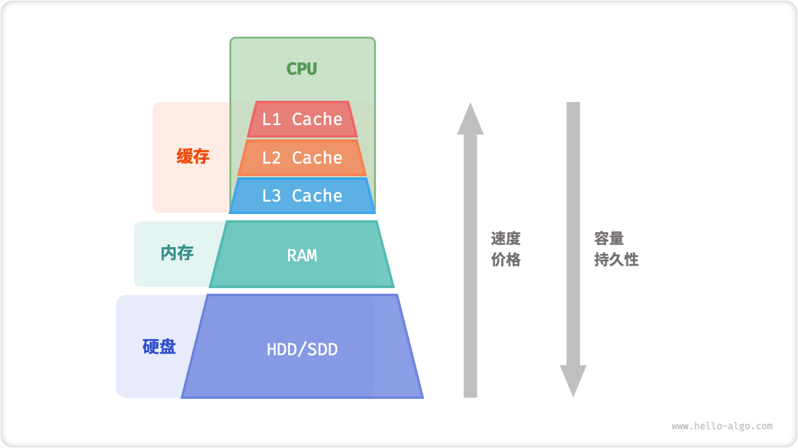
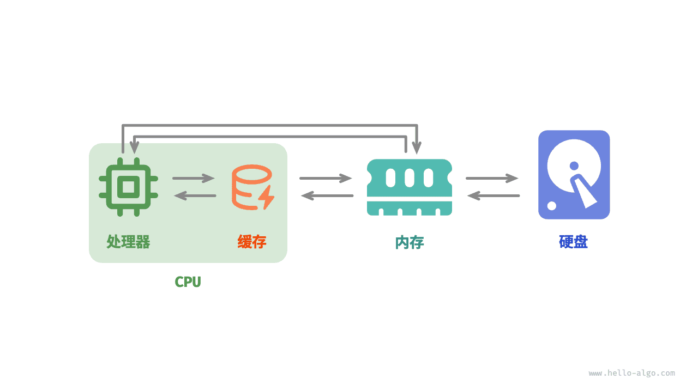

# 内存与缓存 *

在本章的前两节中，我们探讨了数组和链表这两种基础且重要的数据结构，它们分别代表了“连续存储”和“分散存储”两种物理结构。

实际上，**物理结构在很大程度上决定了程序对内存和缓存的使用效率**，进而影响算法程序的整体性能。

## 计算机存储设备

计算机中包括三种类型的存储设备：<u>硬盘（hard disk）</u>、<u>内存（random-access memory, RAM）</u>、<u>缓存（cache memory）</u>。下表展示了它们在计算机系统中的不同角色和性能特点。

 表 <id> &nbsp; 计算机的存储设备 

|        | 硬盘                                     | 内存                                   | 缓存                                              |
| ------ | ---------------------------------------- | -------------------------------------- | ------------------------------------------------- |
| 用途   | 长期存储数据，包括操作系统、程序、文件等 | 临时存储当前运行的程序和正在处理的数据 | 存储经常访问的数据和指令，减少 CPU 访问内存的次数 |
| 易失性 | 断电后数据不会丢失                       | 断电后数据会丢失                       | 断电后数据会丢失                                  |
| 容量   | 较大，TB 级别                            | 较小，GB 级别                          | 非常小，MB 级别                                   |
| 速度   | 较慢，几百到几千 MB/s                    | 较快，几十 GB/s                        | 非常快，几十到几百 GB/s                           |
| 价格   | 较便宜，几毛到几元 / GB                  | 较贵，几十到几百元 / GB                | 非常贵，随 CPU 打包计价                           |

我们可以将计算机存储系统想象为下图所示的金字塔结构。越靠近金字塔顶端的存储设备的速度越快、容量越小、成本越高。这种多层级的设计并非偶然，而是计算机科学家和工程师们经过深思熟虑的结果。

- **硬盘难以被内存取代**。首先，内存中的数据在断电后会丢失，因此它不适合长期存储数据；其次，内存的成本是硬盘的几十倍，这使得它难以在消费者市场普及。
- **缓存的大容量和高速度难以兼得**。随着 L1、L2、L3 缓存的容量逐步增大，其物理尺寸会变大，与 CPU 核心之间的物理距离会变远，从而导致数据传输时间增加，元素访问延迟变高。在当前技术下，多层级的缓存结构是容量、速度和成本之间的最佳平衡点。

!!! note

    计算机的存储层次结构体现了速度、容量和成本三者之间的精妙平衡。实际上，这种权衡普遍存在于所有工业领域，它要求我们在不同的优势和限制之间找到最佳平衡点。

总的来说，**硬盘用于长期存储大量数据，内存用于临时存储程序运行中正在处理的数据，而缓存则用于存储经常访问的数据和指令**，以提高程序运行效率。三者共同协作，确保计算机系统高效运行。

如下图所示，在程序运行时，数据会从硬盘中被读取到内存中，供 CPU 计算使用。缓存可以看作 CPU 的一部分，**它通过智能地从内存加载数据**，给 CPU 提供高速的数据读取，从而显著提升程序的执行效率，减少对较慢的内存的依赖。

## 数据结构的内存效率

在内存空间利用方面，数组和链表各自具有优势和局限性。

一方面，**内存是有限的，且同一块内存不能被多个程序共享**，因此我们希望数据结构能够尽可能高效地利用空间。数组的元素紧密排列，不需要额外的空间来存储链表节点间的引用（指针），因此空间效率更高。然而，数组需要一次性分配足够的连续内存空间，这可能导致内存浪费，数组扩容也需要额外的时间和空间成本。相比之下，链表以“节点”为单位进行动态内存分配和回收，提供了更大的灵活性。

另一方面，在程序运行时，**随着反复申请与释放内存，空闲内存的碎片化程度会越来越高**，从而导致内存的利用效率降低。数组由于其连续的存储方式，相对不容易导致内存碎片化。相反，链表的元素是分散存储的，在频繁的插入与删除操作中，更容易导致内存碎片化。

## 数据结构的缓存效率

缓存虽然在空间容量上远小于内存，但它比内存快得多，在程序执行速度上起着至关重要的作用。由于缓存的容量有限，只能存储一小部分频繁访问的数据，因此当 CPU 尝试访问的数据不在缓存中时，就会发生<u>缓存未命中（cache miss）</u>，此时 CPU 不得不从速度较慢的内存中加载所需数据。

显然，**“缓存未命中”越少，CPU 读写数据的效率就越高**，程序性能也就越好。我们将 CPU 从缓存中成功获取数据的比例称为<u>缓存命中率（cache hit rate）</u>，这个指标通常用来衡量缓存效率。

为了尽可能达到更高的效率，缓存会采取以下数据加载机制。

- **缓存行**：缓存不是单个字节地存储与加载数据，而是以缓存行为单位。相比于单个字节的传输，缓存行的传输形式更加高效。
- **预取机制**：处理器会尝试预测数据访问模式（例如顺序访问、固定步长跳跃访问等），并根据特定模式将数据加载至缓存之中，从而提升命中率。
- **空间局部性**：如果一个数据被访问，那么它附近的数据可能近期也会被访问。因此，缓存在加载某一数据时，也会加载其附近的数据，以提高命中率。
- **时间局部性**：如果一个数据被访问，那么它在不久的将来很可能再次被访问。缓存利用这一原理，通过保留最近访问过的数据来提高命中率。

实际上，**数组和链表对缓存的利用效率是不同的**，主要体现在以下几个方面。

- **占用空间**：链表元素比数组元素占用空间更多，导致缓存中容纳的有效数据量更少。
- **缓存行**：链表数据分散在内存各处，而缓存是“按行加载”的，因此加载到无效数据的比例更高。
- **预取机制**：数组比链表的数据访问模式更具“可预测性”，即系统更容易猜出即将被加载的数据。
- **空间局部性**：数组被存储在集中的内存空间中，因此被加载数据附近的数据更有可能即将被访问。

总体而言，**数组具有更高的缓存命中率，因此它在操作效率上通常优于链表**。这使得在解决算法问题时，基于数组实现的数据结构往往更受欢迎。

需要注意的是，**高缓存效率并不意味着数组在所有情况下都优于链表**。实际应用中选择哪种数据结构，应根据具体需求来决定。例如，数组和链表都可以实现“栈”数据结构（下一章会详细介绍），但它们适用于不同场景。

- 在做算法题时，我们会倾向于选择基于数组实现的栈，因为它提供了更高的操作效率和随机访问的能力，代价仅是需要预先为数组分配一定的内存空间。
- 如果数据量非常大、动态性很高、栈的预期大小难以估计，那么基于链表实现的栈更加合适。链表能够将大量数据分散存储于内存的不同部分，并且避免了数组扩容产生的额外开销。
