# 回溯算法

<u>回溯算法（backtracking algorithm）</u>是一种通过穷举来解决问题的方法，它的核心思想是从一个初始状态出发，暴力搜索所有可能的解决方案，当遇到正确的解则将其记录，直到找到解或者尝试了所有可能的选择都无法找到解为止。

回溯算法通常采用“深度优先搜索”来遍历解空间。在“二叉树”章节中，我们提到前序、中序和后序遍历都属于深度优先搜索。接下来，我们利用前序遍历构造一个回溯问题，逐步了解回溯算法的工作原理。

!!! question "例题一"

    给定一棵二叉树，搜索并记录所有值为 $7$ 的节点，请返回节点列表。

对于此题，我们前序遍历这棵树，并判断当前节点的值是否为 $7$ ，若是，则将该节点的值加入结果列表 `res` 之中。相关过程实现如下图和以下代码所示：

```src
[file]{preorder_traversal_i_compact}-[class]{}-[func]{pre_order}
```

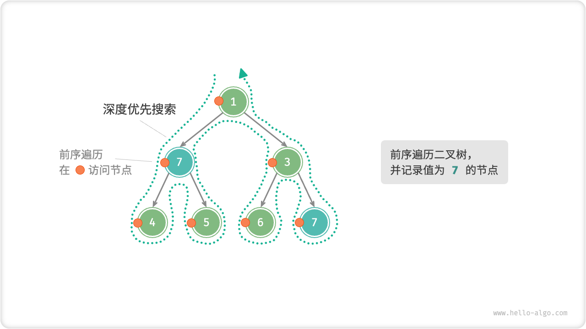

## 尝试与回退

**之所以称之为回溯算法，是因为该算法在搜索解空间时会采用“尝试”与“回退”的策略**。当算法在搜索过程中遇到某个状态无法继续前进或无法得到满足条件的解时，它会撤销上一步的选择，退回到之前的状态，并尝试其他可能的选择。

对于例题一，访问每个节点都代表一次“尝试”，而越过叶节点或返回父节点的 `return` 则表示“回退”。

值得说明的是，**回退并不仅仅包括函数返回**。为解释这一点，我们对例题一稍作拓展。

!!! question "例题二"

    在二叉树中搜索所有值为 $7$ 的节点，**请返回根节点到这些节点的路径**。

在例题一代码的基础上，我们需要借助一个列表 `path` 记录访问过的节点路径。当访问到值为 $7$ 的节点时，则复制 `path` 并添加进结果列表 `res` 。遍历完成后，`res` 中保存的就是所有的解。代码如下所示：

```src
[file]{preorder_traversal_ii_compact}-[class]{}-[func]{pre_order}
```

在每次“尝试”中，我们通过将当前节点添加进 `path` 来记录路径；而在“回退”前，我们需要将该节点从 `path` 中弹出，**以恢复本次尝试之前的状态**。

观察下图所示的过程，**我们可以将尝试和回退理解为“前进”与“撤销”**，两个操作互为逆向。

=== "<1>"
    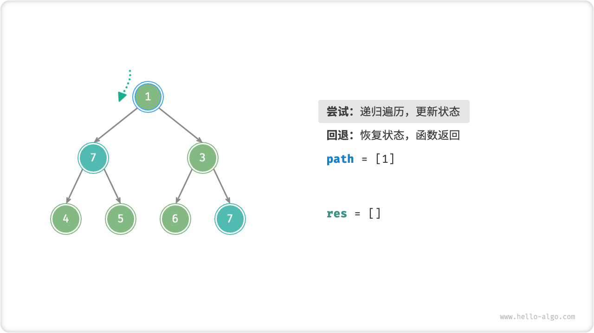

=== "<2>"
    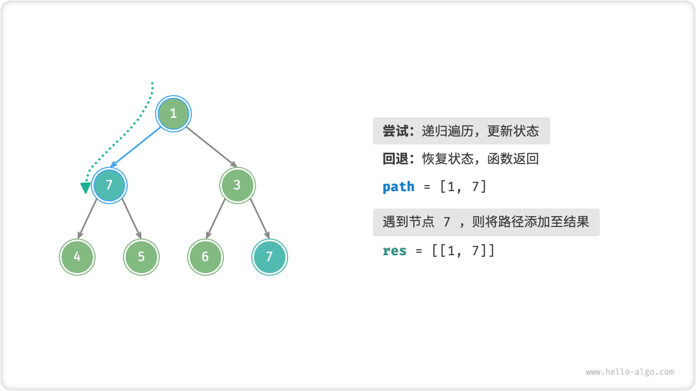

=== "<3>"
    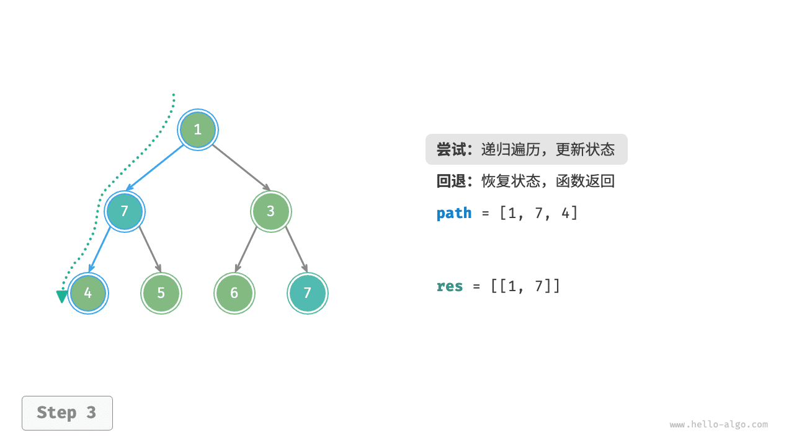

=== "<4>"
    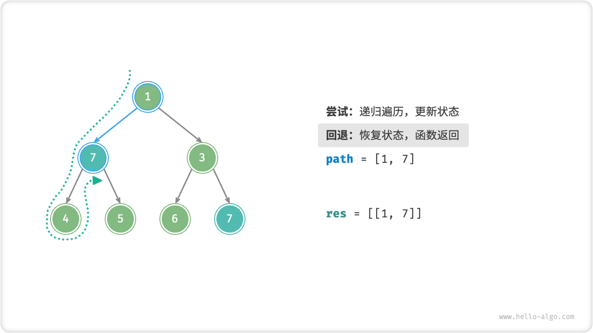

=== "<5>"
    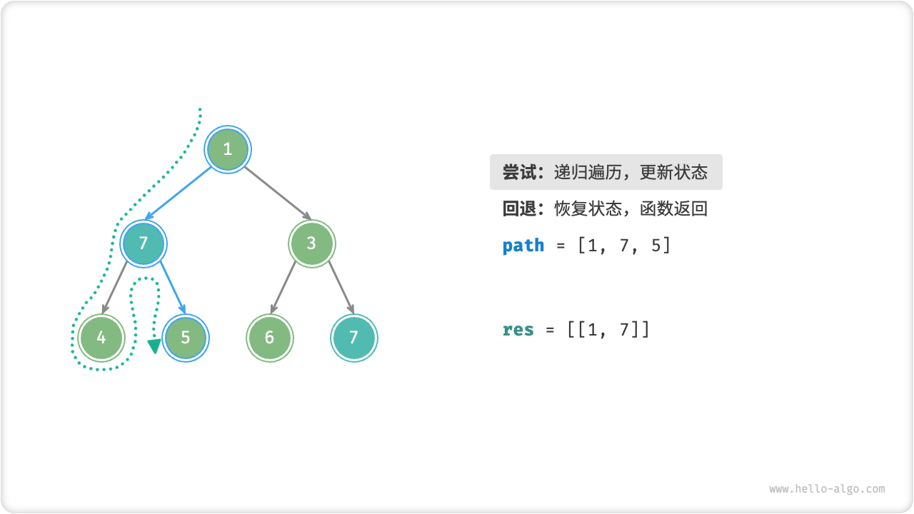

=== "<6>"
    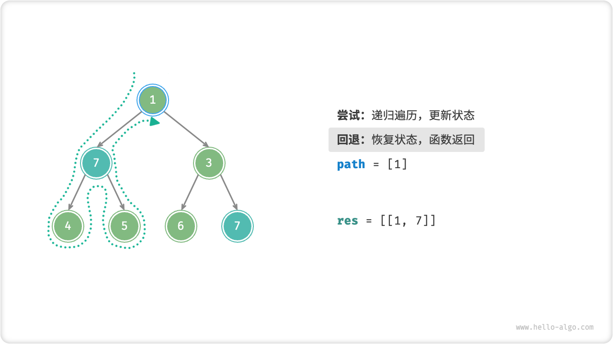

=== "<7>"
    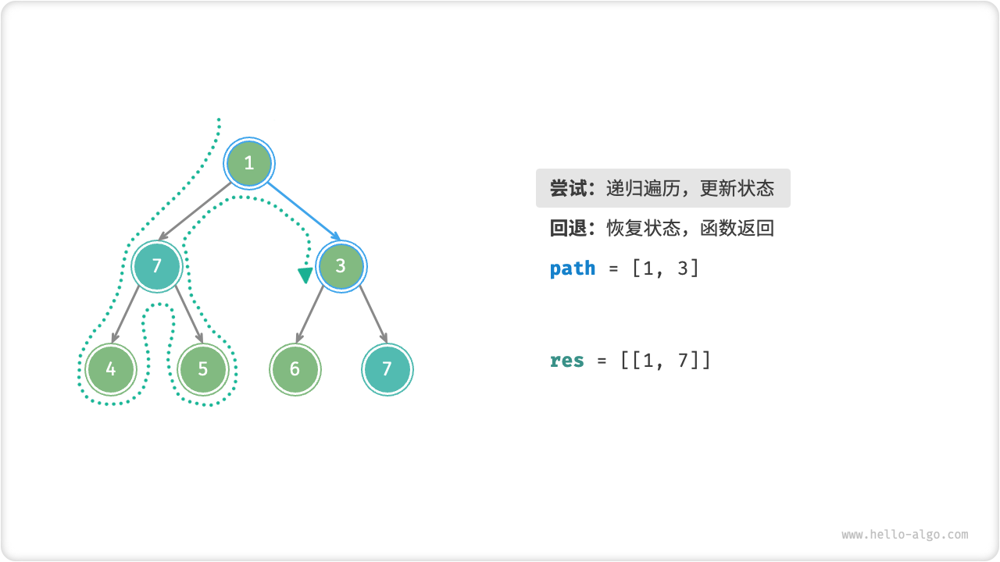

=== "<8>"
    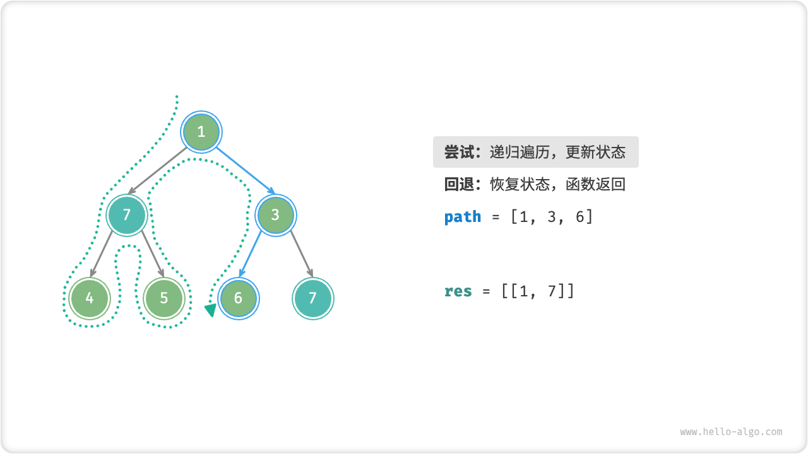

=== "<9>"
    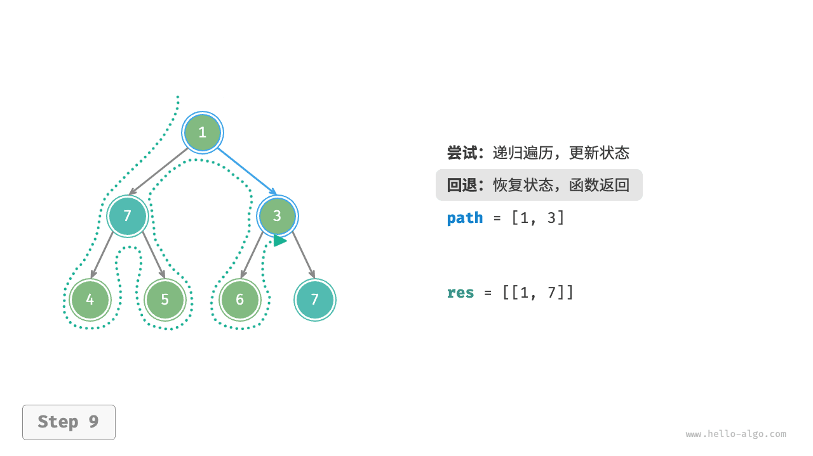

=== "<10>"
    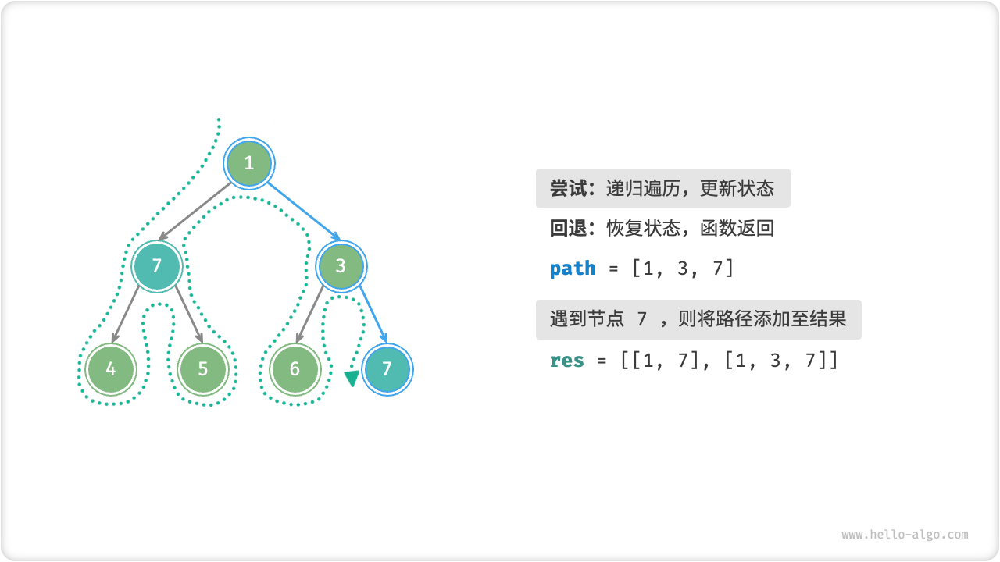

=== "<11>"
    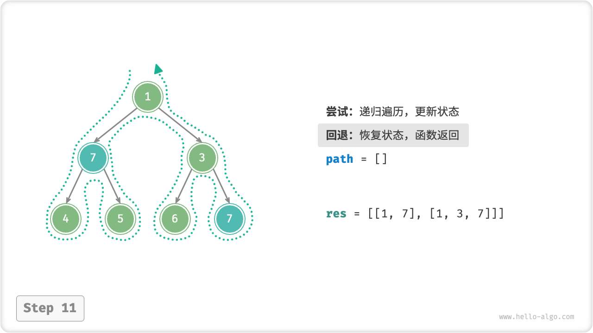

## 剪枝

复杂的回溯问题通常包含一个或多个约束条件，**约束条件通常可用于“剪枝”**。

!!! question "例题三"

    在二叉树中搜索所有值为 $7$ 的节点，请返回根节点到这些节点的路径，**并要求路径中不包含值为 $3$ 的节点**。

为了满足以上约束条件，**我们需要添加剪枝操作**：在搜索过程中，若遇到值为 $3$ 的节点，则提前返回，不再继续搜索。代码如下所示：

```src
[file]{preorder_traversal_iii_compact}-[class]{}-[func]{pre_order}
```

“剪枝”是一个非常形象的名词。如下图所示，在搜索过程中，**我们“剪掉”了不满足约束条件的搜索分支**，避免许多无意义的尝试，从而提高了搜索效率。

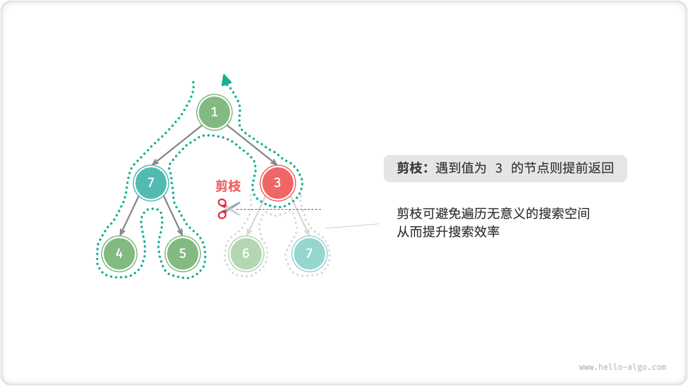

## 框架代码

接下来，我们尝试将回溯的“尝试、回退、剪枝”的主体框架提炼出来，提升代码的通用性。

在以下框架代码中，`state` 表示问题的当前状态，`choices` 表示当前状态下可以做出的选择：

=== "Python"

    ```python title=""
    def backtrack(state: State, choices: list[choice], res: list[state]):
        """回溯算法框架"""
        # 判断是否为解
        if is_solution(state):
            # 记录解
            record_solution(state, res)
            # 不再继续搜索
            return
        # 遍历所有选择
        for choice in choices:
            # 剪枝：判断选择是否合法
            if is_valid(state, choice):
                # 尝试：做出选择，更新状态
                make_choice(state, choice)
                backtrack(state, choices, res)
                # 回退：撤销选择，恢复到之前的状态
                undo_choice(state, choice)
    ```

=== "C++"

    ```cpp title=""
    /* 回溯算法框架 */
    void backtrack(State *state, vector<Choice *> &choices, vector<State *> &res) {
        // 判断是否为解
        if (isSolution(state)) {
            // 记录解
            recordSolution(state, res);
            // 不再继续搜索
            return;
        }
        // 遍历所有选择
        for (Choice choice : choices) {
            // 剪枝：判断选择是否合法
            if (isValid(state, choice)) {
                // 尝试：做出选择，更新状态
                makeChoice(state, choice);
                backtrack(state, choices, res);
                // 回退：撤销选择，恢复到之前的状态
                undoChoice(state, choice);
            }
        }
    }
    ```

=== "Java"

    ```java title=""
    /* 回溯算法框架 */
    void backtrack(State state, List<Choice> choices, List<State> res) {
        // 判断是否为解
        if (isSolution(state)) {
            // 记录解
            recordSolution(state, res);
            // 不再继续搜索
            return;
        }
        // 遍历所有选择
        for (Choice choice : choices) {
            // 剪枝：判断选择是否合法
            if (isValid(state, choice)) {
                // 尝试：做出选择，更新状态
                makeChoice(state, choice);
                backtrack(state, choices, res);
                // 回退：撤销选择，恢复到之前的状态
                undoChoice(state, choice);
            }
        }
    }
    ```

=== "C#"

    ```csharp title=""
    /* 回溯算法框架 */
    void Backtrack(State state, List<Choice> choices, List<State> res) {
        // 判断是否为解
        if (IsSolution(state)) {
            // 记录解
            RecordSolution(state, res);
            // 不再继续搜索
            return;
        }
        // 遍历所有选择
        foreach (Choice choice in choices) {
            // 剪枝：判断选择是否合法
            if (IsValid(state, choice)) {
                // 尝试：做出选择，更新状态
                MakeChoice(state, choice);
                Backtrack(state, choices, res);
                // 回退：撤销选择，恢复到之前的状态
                UndoChoice(state, choice);
            }
        }
    }
    ```

=== "Go"

    ```go title=""
    /* 回溯算法框架 */
    func backtrack(state *State, choices []Choice, res *[]State) {
        // 判断是否为解
        if isSolution(state) {
            // 记录解
            recordSolution(state, res)
            // 不再继续搜索
            return
        }
        // 遍历所有选择
        for _, choice := range choices {
            // 剪枝：判断选择是否合法
            if isValid(state, choice) {
                // 尝试：做出选择，更新状态
                makeChoice(state, choice)
                backtrack(state, choices, res)
                // 回退：撤销选择，恢复到之前的状态
                undoChoice(state, choice)
            }
        }
    }
    ```

=== "Swift"

    ```swift title=""
    /* 回溯算法框架 */
    func backtrack(state: inout State, choices: [Choice], res: inout [State]) {
        // 判断是否为解
        if isSolution(state: state) {
            // 记录解
            recordSolution(state: state, res: &res)
            // 不再继续搜索
            return
        }
        // 遍历所有选择
        for choice in choices {
            // 剪枝：判断选择是否合法
            if isValid(state: state, choice: choice) {
                // 尝试：做出选择，更新状态
                makeChoice(state: &state, choice: choice)
                backtrack(state: &state, choices: choices, res: &res)
                // 回退：撤销选择，恢复到之前的状态
                undoChoice(state: &state, choice: choice)
            }
        }
    }
    ```

=== "JS"

    ```javascript title=""
    /* 回溯算法框架 */
    function backtrack(state, choices, res) {
        // 判断是否为解
        if (isSolution(state)) {
            // 记录解
            recordSolution(state, res);
            // 不再继续搜索
            return;
        }
        // 遍历所有选择
        for (let choice of choices) {
            // 剪枝：判断选择是否合法
            if (isValid(state, choice)) {
                // 尝试：做出选择，更新状态
                makeChoice(state, choice);
                backtrack(state, choices, res);
                // 回退：撤销选择，恢复到之前的状态
                undoChoice(state, choice);
            }
        }
    }
    ```

=== "TS"

    ```typescript title=""
    /* 回溯算法框架 */
    function backtrack(state: State, choices: Choice[], res: State[]): void {
        // 判断是否为解
        if (isSolution(state)) {
            // 记录解
            recordSolution(state, res);
            // 不再继续搜索
            return;
        }
        // 遍历所有选择
        for (let choice of choices) {
            // 剪枝：判断选择是否合法
            if (isValid(state, choice)) {
                // 尝试：做出选择，更新状态
                makeChoice(state, choice);
                backtrack(state, choices, res);
                // 回退：撤销选择，恢复到之前的状态
                undoChoice(state, choice);
            }
        }
    }
    ```

=== "Dart"

    ```dart title=""
    /* 回溯算法框架 */
    void backtrack(State state, List<Choice>, List<State> res) {
      // 判断是否为解
      if (isSolution(state)) {
        // 记录解
        recordSolution(state, res);
        // 不再继续搜索
        return;
      }
      // 遍历所有选择
      for (Choice choice in choices) {
        // 剪枝：判断选择是否合法
        if (isValid(state, choice)) {
          // 尝试：做出选择，更新状态
          makeChoice(state, choice);
          backtrack(state, choices, res);
          // 回退：撤销选择，恢复到之前的状态
          undoChoice(state, choice);
        }
      }
    }
    ```

=== "Rust"

    ```rust title=""
    /* 回溯算法框架 */
    fn backtrack(state: &mut State, choices: &Vec<Choice>, res: &mut Vec<State>) {
        // 判断是否为解
        if is_solution(state) {
            // 记录解
            record_solution(state, res);
            // 不再继续搜索
            return;
        }
        // 遍历所有选择
        for choice in choices {
            // 剪枝：判断选择是否合法
            if is_valid(state, choice) {
                // 尝试：做出选择，更新状态
                make_choice(state, choice);
                backtrack(state, choices, res);
                // 回退：撤销选择，恢复到之前的状态
                undo_choice(state, choice);
            }
        }
    }
    ```

=== "C"

    ```c title=""
    /* 回溯算法框架 */
    void backtrack(State *state, Choice *choices, int numChoices, State *res, int numRes) {
        // 判断是否为解
        if (isSolution(state)) {
            // 记录解
            recordSolution(state, res, numRes);
            // 不再继续搜索
            return;
        }
        // 遍历所有选择
        for (int i = 0; i < numChoices; i++) {
            // 剪枝：判断选择是否合法
            if (isValid(state, &choices[i])) {
                // 尝试：做出选择，更新状态
                makeChoice(state, &choices[i]);
                backtrack(state, choices, numChoices, res, numRes);
                // 回退：撤销选择，恢复到之前的状态
                undoChoice(state, &choices[i]);
            }
        }
    }
    ```

=== "Kotlin"

    ```kotlin title=""
    /* 回溯算法框架 */
    fun backtrack(state: State?, choices: List<Choice?>, res: List<State?>?) {
        // 判断是否为解
        if (isSolution(state)) {
            // 记录解
            recordSolution(state, res)
            // 不再继续搜索
            return
        }
        // 遍历所有选择
        for (choice in choices) {
            // 剪枝：判断选择是否合法
            if (isValid(state, choice)) {
                // 尝试：做出选择，更新状态
                makeChoice(state, choice)
                backtrack(state, choices, res)
                // 回退：撤销选择，恢复到之前的状态
                undoChoice(state, choice)
            }
        }
    }
    ```

=== "Ruby"

    ```ruby title=""

    ```

=== "Zig"

    ```zig title=""

    ```

接下来，我们基于框架代码来解决例题三。状态 `state` 为节点遍历路径，选择 `choices` 为当前节点的左子节点和右子节点，结果 `res` 是路径列表：

```src
[file]{preorder_traversal_iii_template}-[class]{}-[func]{backtrack}
```

根据题意，我们在找到值为 $7$ 的节点后应该继续搜索，**因此需要将记录解之后的 `return` 语句删除**。下图对比了保留或删除 `return` 语句的搜索过程。

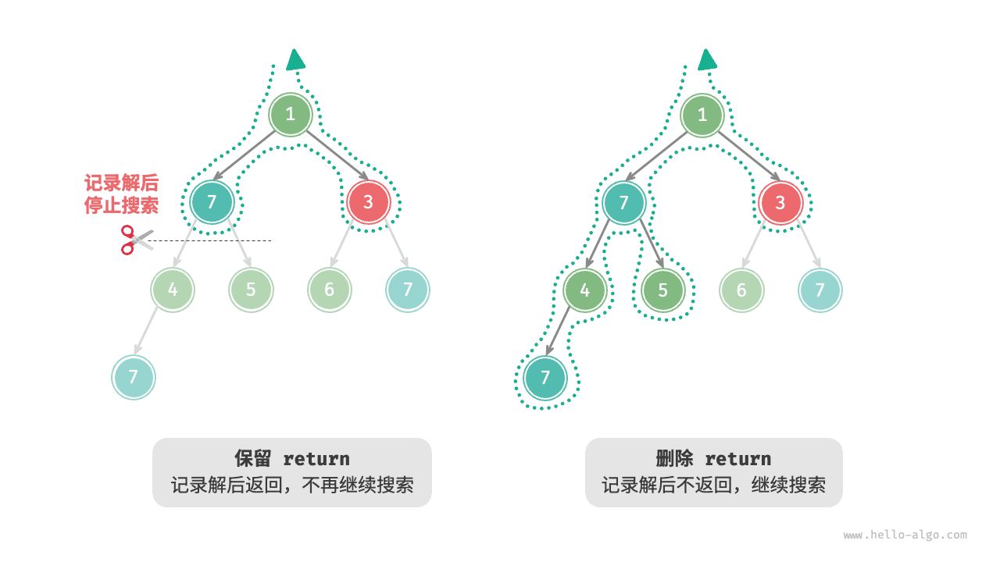

相比基于前序遍历的代码实现，基于回溯算法框架的代码实现虽然显得啰唆，但通用性更好。实际上，**许多回溯问题可以在该框架下解决**。我们只需根据具体问题来定义 `state` 和 `choices` ，并实现框架中的各个方法即可。

## 常用术语

为了更清晰地分析算法问题，我们总结一下回溯算法中常用术语的含义，并对照例题三给出对应示例，如下表所示。

<p align="center"> 表 <id> &nbsp; 常见的回溯算法术语 </p>

| 名词                   | 定义                                                                       | 例题三                                                               |
| ---------------------- | -------------------------------------------------------------------------- | -------------------------------------------------------------------- |
| 解（solution）         | 解是满足问题特定条件的答案，可能有一个或多个                               | 根节点到节点 $7$ 的满足约束条件的所有路径                            |
| 约束条件（constraint） | 约束条件是问题中限制解的可行性的条件，通常用于剪枝                         | 路径中不包含节点 $3$                                                 |
| 状态（state）          | 状态表示问题在某一时刻的情况，包括已经做出的选择                           | 当前已访问的节点路径，即 `path` 节点列表                             |
| 尝试（attempt）        | 尝试是根据可用选择来探索解空间的过程，包括做出选择，更新状态，检查是否为解 | 递归访问左（右）子节点，将节点添加进 `path` ，判断节点的值是否为 $7$ |
| 回退（backtracking）   | 回退指遇到不满足约束条件的状态时，撤销前面做出的选择，回到上一个状态       | 当越过叶节点、结束节点访问、遇到值为 $3$ 的节点时终止搜索，函数返回  |
| 剪枝（pruning）        | 剪枝是根据问题特性和约束条件避免无意义的搜索路径的方法，可提高搜索效率     | 当遇到值为 $3$ 的节点时，则不再继续搜索                              |

!!! tip

    问题、解、状态等概念是通用的，在分治、回溯、动态规划、贪心等算法中都有涉及。

## 优点与局限性

回溯算法本质上是一种深度优先搜索算法，它尝试所有可能的解决方案直到找到满足条件的解。这种方法的优点在于能够找到所有可能的解决方案，而且在合理的剪枝操作下，具有很高的效率。

然而，在处理大规模或者复杂问题时，**回溯算法的运行效率可能难以接受**。

- **时间**：回溯算法通常需要遍历状态空间的所有可能，时间复杂度可以达到指数阶或阶乘阶。
- **空间**：在递归调用中需要保存当前的状态（例如路径、用于剪枝的辅助变量等），当深度很大时，空间需求可能会变得很大。

即便如此，**回溯算法仍然是某些搜索问题和约束满足问题的最佳解决方案**。对于这些问题，由于无法预测哪些选择可生成有效的解，因此我们必须对所有可能的选择进行遍历。在这种情况下，**关键是如何优化效率**，常见的效率优化方法有两种。

- **剪枝**：避免搜索那些肯定不会产生解的路径，从而节省时间和空间。
- **启发式搜索**：在搜索过程中引入一些策略或者估计值，从而优先搜索最有可能产生有效解的路径。

## 回溯典型例题

回溯算法可用于解决许多搜索问题、约束满足问题和组合优化问题。

**搜索问题**：这类问题的目标是找到满足特定条件的解决方案。

- 全排列问题：给定一个集合，求出其所有可能的排列组合。
- 子集和问题：给定一个集合和一个目标和，找到集合中所有和为目标和的子集。
- 汉诺塔问题：给定三根柱子和一系列大小不同的圆盘，要求将所有圆盘从一根柱子移动到另一根柱子，每次只能移动一个圆盘，且不能将大圆盘放在小圆盘上。

**约束满足问题**：这类问题的目标是找到满足所有约束条件的解。

- $n$ 皇后：在 $n \times n$ 的棋盘上放置 $n$ 个皇后，使得它们互不攻击。
- 数独：在 $9 \times 9$ 的网格中填入数字 $1$ ~ $9$ ，使得每行、每列和每个 $3 \times 3$ 子网格中的数字不重复。
- 图着色问题：给定一个无向图，用最少的颜色给图的每个顶点着色，使得相邻顶点颜色不同。

**组合优化问题**：这类问题的目标是在一个组合空间中找到满足某些条件的最优解。

- 0-1 背包问题：给定一组物品和一个背包，每个物品有一定的价值和重量，要求在背包容量限制内，选择物品使得总价值最大。
- 旅行商问题：在一个图中，从一个点出发，访问所有其他点恰好一次后返回起点，求最短路径。
- 最大团问题：给定一个无向图，找到最大的完全子图，即子图中的任意两个顶点之间都有边相连。

请注意，对于许多组合优化问题，回溯不是最优解决方案。

- 0-1 背包问题通常使用动态规划解决，以达到更高的时间效率。
- 旅行商是一个著名的 NP-Hard 问题，常用解法有遗传算法和蚁群算法等。
- 最大团问题是图论中的一个经典问题，可用贪心算法等启发式算法来解决。
