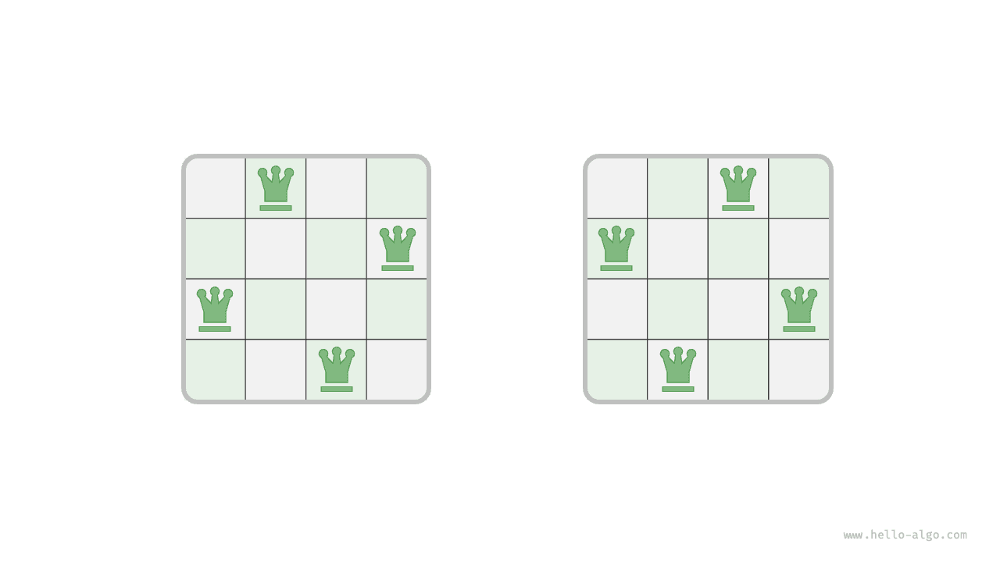
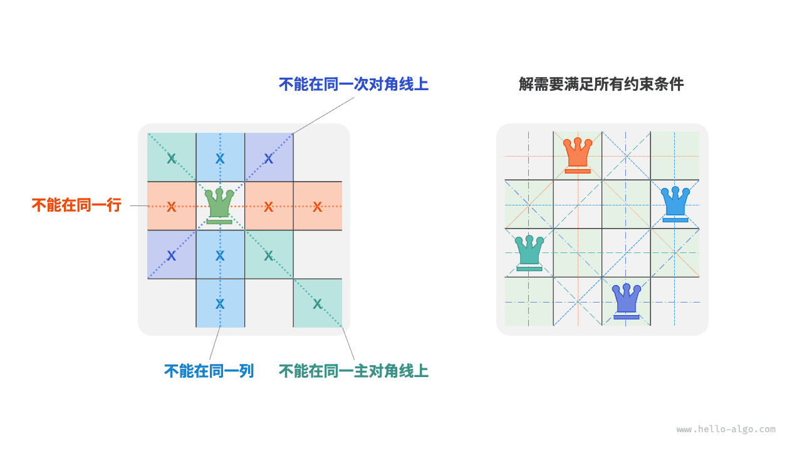
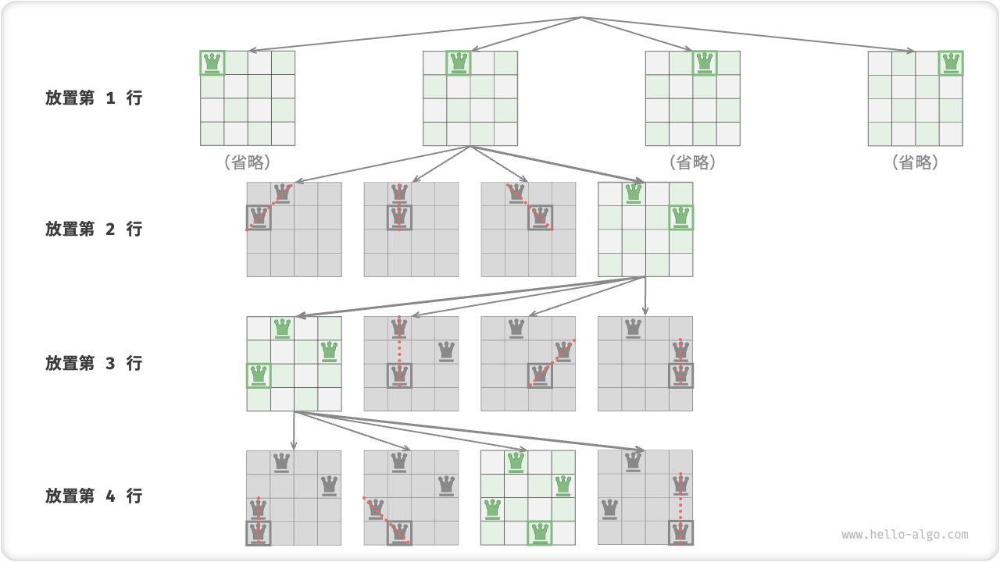
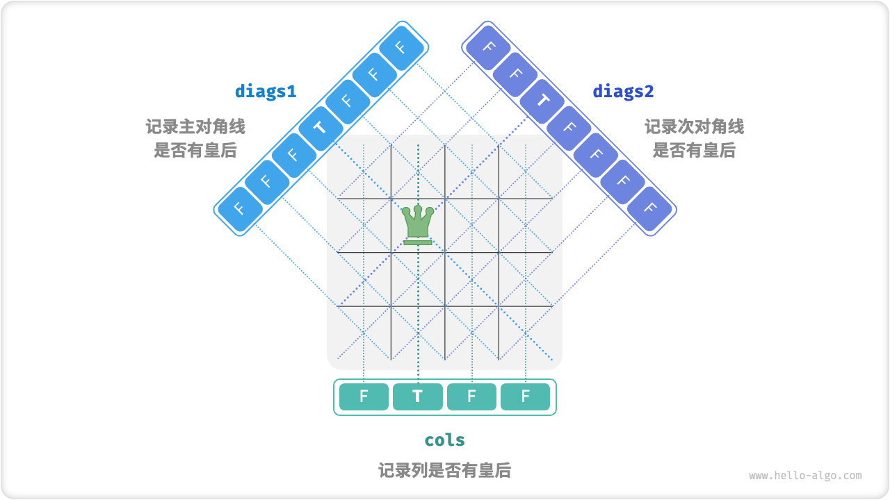

# n 皇后问题

!!! question

    根据国际象棋的规则，皇后可以攻击与同处一行、一列或一条斜线上的棋子。给定 $n$ 个皇后和一个 $n \times n$ 大小的棋盘，寻找使得所有皇后之间无法相互攻击的摆放方案。

如下图所示，当 $n = 4$ 时，共可以找到两个解。从回溯算法的角度看，$n \times n$ 大小的棋盘共有 $n^2$ 个格子，给出了所有的选择 `choices` 。在逐个放置皇后的过程中，棋盘状态在不断地变化，每个时刻的棋盘就是状态 `state` 。



下图展示了本题的三个约束条件：**多个皇后不能在同一行、同一列、同一条对角线上**。值得注意的是，对角线分为主对角线 `\` 和次对角线 `/` 两种。



### 逐行放置策略

皇后的数量和棋盘的行数都为 $n$ ，因此我们容易得到一个推论：**棋盘每行都允许且只允许放置一个皇后**。

也就是说，我们可以采取逐行放置策略：从第一行开始，在每行放置一个皇后，直至最后一行结束。

下图所示为 $4$ 皇后问题的逐行放置过程。受画幅限制，下图仅展开了第一行的其中一个搜索分支，并且将不满足列约束和对角线约束的方案都进行了剪枝。



从本质上看，**逐行放置策略起到了剪枝的作用**，它避免了同一行出现多个皇后的所有搜索分支。

### 列与对角线剪枝

为了满足列约束，我们可以利用一个长度为 $n$ 的布尔型数组 `cols` 记录每一列是否有皇后。在每次决定放置前，我们通过 `cols` 将已有皇后的列进行剪枝，并在回溯中动态更新 `cols` 的状态。

那么，如何处理对角线约束呢？设棋盘中某个格子的行列索引为 $(row, col)$ ，选定矩阵中的某条主对角线，我们发现该对角线上所有格子的行索引减列索引都相等，**即对角线上所有格子的 $row - col$ 为恒定值**。

也就是说，如果两个格子满足 $row_1 - col_1 = row_2 - col_2$ ，则它们一定处在同一条主对角线上。利用该规律，我们可以借助下图所示的数组 `diags1` 记录每条主对角线上是否有皇后。

同理，**次对角线上的所有格子的 $row + col$ 是恒定值**。我们同样也可以借助数组 `diags2` 来处理次对角线约束。



### 代码实现

请注意，$n$ 维方阵中 $row - col$ 的范围是 $[-n + 1, n - 1]$ ，$row + col$ 的范围是 $[0, 2n - 2]$ ，所以主对角线和次对角线的数量都为 $2n - 1$ ，即数组 `diags1` 和 `diags2` 的长度都为 $2n - 1$ 。

```src
[file]{n_queens}-[class]{}-[func]{n_queens}
```

逐行放置 $n$ 次，考虑列约束，则从第一行到最后一行分别有 $n$、$n-1$、$\dots$、$2$、$1$ 个选择，使用 $O(n!)$ 时间。当记录解时，需要复制矩阵 `state` 并添加进 `res` ，复制操作使用 $O(n^2)$ 时间。因此，**总体时间复杂度为 $O(n! \cdot n^2)$** 。实际上，根据对角线约束的剪枝也能够大幅缩小搜索空间，因而搜索效率往往优于以上时间复杂度。

数组 `state` 使用 $O(n^2)$ 空间，数组 `cols`、`diags1` 和 `diags2` 皆使用 $O(n)$ 空间。最大递归深度为 $n$ ，使用 $O(n)$ 栈帧空间。因此，**空间复杂度为 $O(n^2)$** 。
