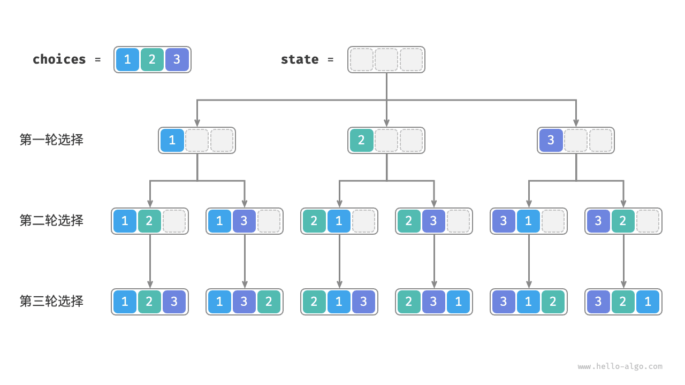
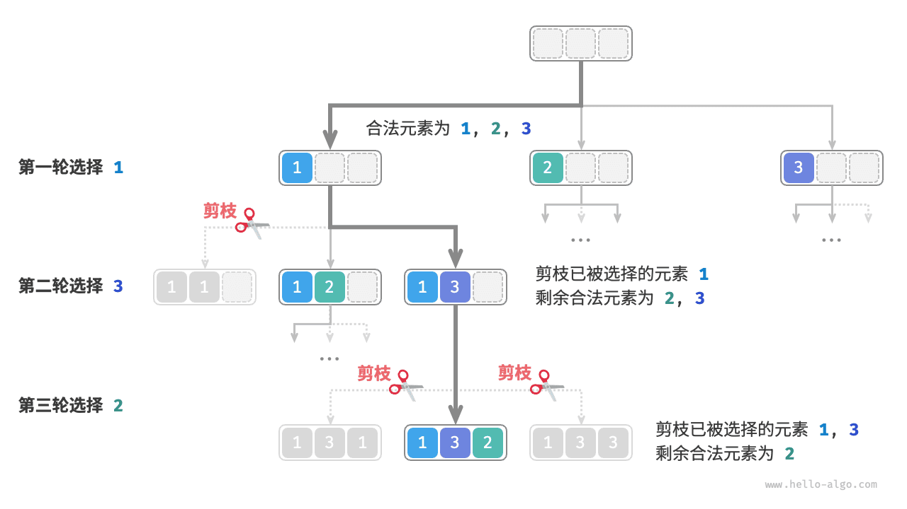
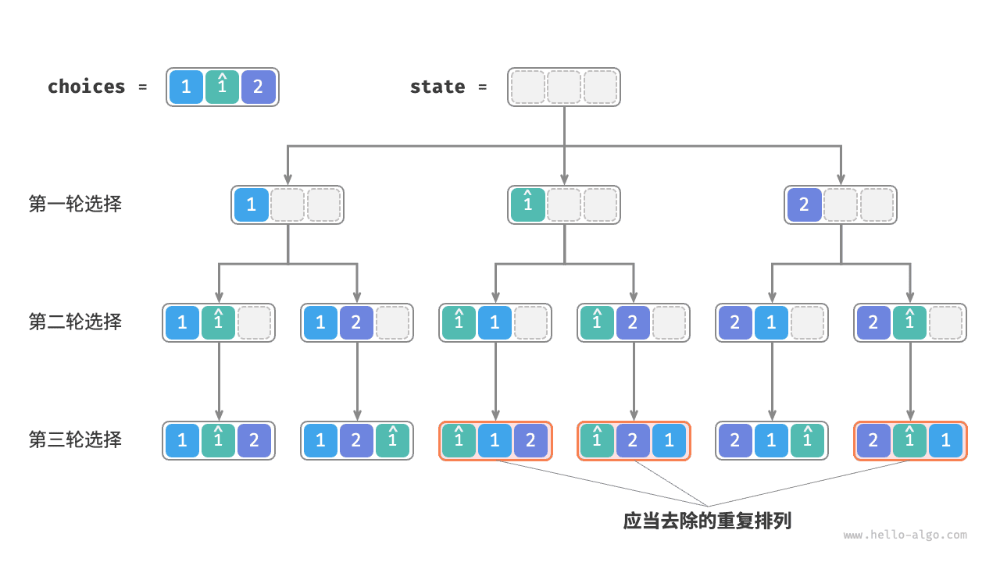
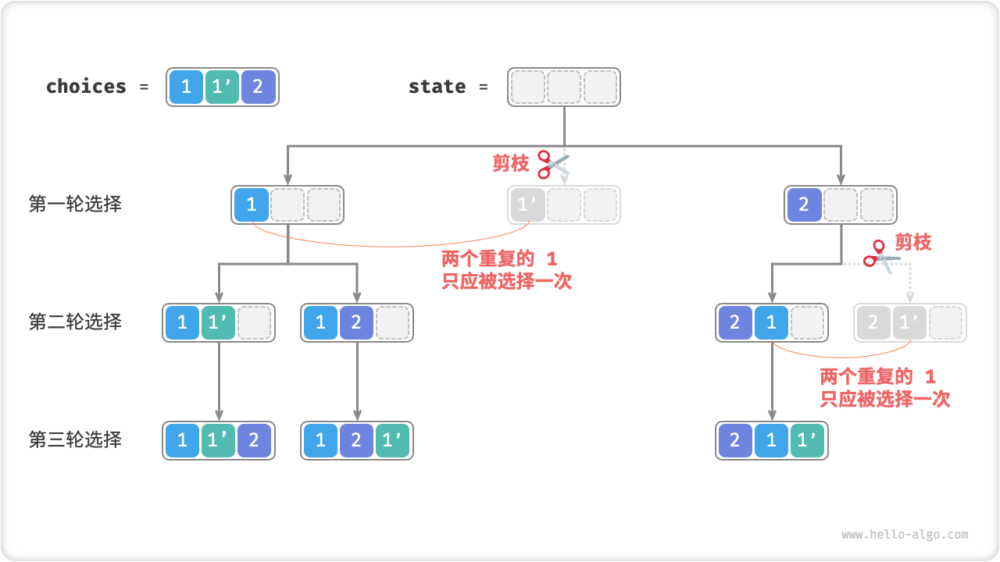
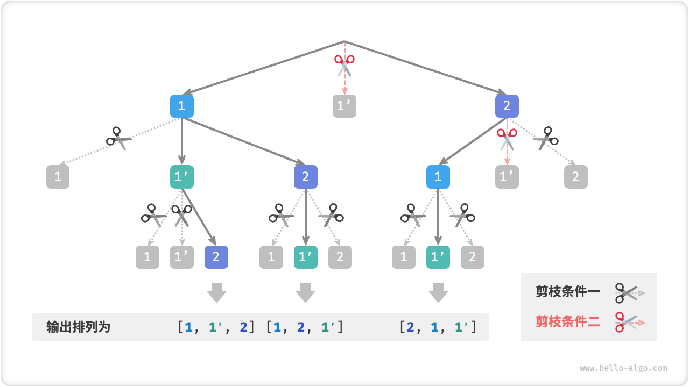

# 13.2 &nbsp; 全排列问题

全排列问题是回溯算法的一个典型应用。它的定义是在给定一个集合（如一个数组或字符串）的情况下，找出其中元素的所有可能的排列。

表 13-2 列举了几个示例数据，包括输入数组和对应的所有排列。

<p align="center"> 表 13-2 &nbsp; 全排列示例 </p>

<div class="center-table" markdown>

| 输入数组    | 所有排列                                                           |
| :---------- | :----------------------------------------------------------------- |
| $[1]$       | $[1]$                                                              |
| $[1, 2]$    | $[1, 2], [2, 1]$                                                   |
| $[1, 2, 3]$ | $[1, 2, 3], [1, 3, 2], [2, 1, 3], [2, 3, 1], [3, 1, 2], [3, 2, 1]$ |

</div>

## 13.2.1 &nbsp; 无相等元素的情况

!!! question

    输入一个整数数组，其中不包含重复元素，返回所有可能的排列。

从回溯算法的角度看，**我们可以把生成排列的过程想象成一系列选择的结果**。假设输入数组为 $[1, 2, 3]$ ，如果我们先选择 $1$ ，再选择 $3$ ，最后选择 $2$ ，则获得排列 $[1, 3, 2]$ 。回退表示撤销一个选择，之后继续尝试其他选择。

从回溯代码的角度看，候选集合 `choices` 是输入数组中的所有元素，状态 `state` 是直至目前已被选择的元素。请注意，每个元素只允许被选择一次，**因此 `state` 中的所有元素都应该是唯一的**。

如图 13-5 所示，我们可以将搜索过程展开成一棵递归树，树中的每个节点代表当前状态 `state` 。从根节点开始，经过三轮选择后到达叶节点，每个叶节点都对应一个排列。

{ class="animation-figure" }

<p align="center"> 图 13-5 &nbsp; 全排列的递归树 </p>

### 1. &nbsp; 重复选择剪枝

为了实现每个元素只被选择一次，我们考虑引入一个布尔型数组 `selected` ，其中 `selected[i]` 表示 `choices[i]` 是否已被选择，并基于它实现以下剪枝操作。

- 在做出选择 `choice[i]` 后，我们就将 `selected[i]` 赋值为 $\text{True}$ ，代表它已被选择。
- 遍历选择列表 `choices` 时，跳过所有已被选择的节点，即剪枝。

如图 13-6 所示，假设我们第一轮选择 1 ，第二轮选择 3 ，第三轮选择 2 ，则需要在第二轮剪掉元素 1 的分支，在第三轮剪掉元素 1 和元素 3 的分支。

{ class="animation-figure" }

<p align="center"> 图 13-6 &nbsp; 全排列剪枝示例 </p>

观察图 13-6 发现，该剪枝操作将搜索空间大小从 $O(n^n)$ 减小至 $O(n!)$ 。

### 2. &nbsp; 代码实现

想清楚以上信息之后，我们就可以在框架代码中做“完形填空”了。为了缩短整体代码，我们不单独实现框架代码中的各个函数，而是将它们展开在 `backtrack()` 函数中：

=== "Python"

    ```python title="permutations_i.py"
    def backtrack(
        state: list[int], choices: list[int], selected: list[bool], res: list[list[int]]
    ):
        """回溯算法：全排列 I"""
        # 当状态长度等于元素数量时，记录解
        if len(state) == len(choices):
            res.append(list(state))
            return
        # 遍历所有选择
        for i, choice in enumerate(choices):
            # 剪枝：不允许重复选择元素
            if not selected[i]:
                # 尝试：做出选择，更新状态
                selected[i] = True
                state.append(choice)
                # 进行下一轮选择
                backtrack(state, choices, selected, res)
                # 回退：撤销选择，恢复到之前的状态
                selected[i] = False
                state.pop()

    def permutations_i(nums: list[int]) -> list[list[int]]:
        """全排列 I"""
        res = []
        backtrack(state=[], choices=nums, selected=[False] * len(nums), res=res)
        return res
    ```

=== "C++"

    ```cpp title="permutations_i.cpp"
    /* 回溯算法：全排列 I */
    void backtrack(vector<int> &state, const vector<int> &choices, vector<bool> &selected, vector<vector<int>> &res) {
        // 当状态长度等于元素数量时，记录解
        if (state.size() == choices.size()) {
            res.push_back(state);
            return;
        }
        // 遍历所有选择
        for (int i = 0; i < choices.size(); i++) {
            int choice = choices[i];
            // 剪枝：不允许重复选择元素
            if (!selected[i]) {
                // 尝试：做出选择，更新状态
                selected[i] = true;
                state.push_back(choice);
                // 进行下一轮选择
                backtrack(state, choices, selected, res);
                // 回退：撤销选择，恢复到之前的状态
                selected[i] = false;
                state.pop_back();
            }
        }
    }

    /* 全排列 I */
    vector<vector<int>> permutationsI(vector<int> nums) {
        vector<int> state;
        vector<bool> selected(nums.size(), false);
        vector<vector<int>> res;
        backtrack(state, nums, selected, res);
        return res;
    }
    ```

=== "Java"

    ```java title="permutations_i.java"
    /* 回溯算法：全排列 I */
    void backtrack(List<Integer> state, int[] choices, boolean[] selected, List<List<Integer>> res) {
        // 当状态长度等于元素数量时，记录解
        if (state.size() == choices.length) {
            res.add(new ArrayList<Integer>(state));
            return;
        }
        // 遍历所有选择
        for (int i = 0; i < choices.length; i++) {
            int choice = choices[i];
            // 剪枝：不允许重复选择元素
            if (!selected[i]) {
                // 尝试：做出选择，更新状态
                selected[i] = true;
                state.add(choice);
                // 进行下一轮选择
                backtrack(state, choices, selected, res);
                // 回退：撤销选择，恢复到之前的状态
                selected[i] = false;
                state.remove(state.size() - 1);
            }
        }
    }

    /* 全排列 I */
    List<List<Integer>> permutationsI(int[] nums) {
        List<List<Integer>> res = new ArrayList<List<Integer>>();
        backtrack(new ArrayList<Integer>(), nums, new boolean[nums.length], res);
        return res;
    }
    ```

=== "C#"

    ```csharp title="permutations_i.cs"
    /* 回溯算法：全排列 I */
    void Backtrack(List<int> state, int[] choices, bool[] selected, List<List<int>> res) {
        // 当状态长度等于元素数量时，记录解
        if (state.Count == choices.Length) {
            res.Add(new List<int>(state));
            return;
        }
        // 遍历所有选择
        for (int i = 0; i < choices.Length; i++) {
            int choice = choices[i];
            // 剪枝：不允许重复选择元素
            if (!selected[i]) {
                // 尝试：做出选择，更新状态
                selected[i] = true;
                state.Add(choice);
                // 进行下一轮选择
                Backtrack(state, choices, selected, res);
                // 回退：撤销选择，恢复到之前的状态
                selected[i] = false;
                state.RemoveAt(state.Count - 1);
            }
        }
    }

    /* 全排列 I */
    List<List<int>> PermutationsI(int[] nums) {
        List<List<int>> res = [];
        Backtrack([], nums, new bool[nums.Length], res);
        return res;
    }
    ```

=== "Go"

    ```go title="permutations_i.go"
    /* 回溯算法：全排列 I */
    func backtrackI(state *[]int, choices *[]int, selected *[]bool, res *[][]int) {
        // 当状态长度等于元素数量时，记录解
        if len(*state) == len(*choices) {
            newState := append([]int{}, *state...)
            *res = append(*res, newState)
        }
        // 遍历所有选择
        for i := 0; i < len(*choices); i++ {
            choice := (*choices)[i]
            // 剪枝：不允许重复选择元素
            if !(*selected)[i] {
                // 尝试：做出选择，更新状态
                (*selected)[i] = true
                *state = append(*state, choice)
                // 进行下一轮选择
                backtrackI(state, choices, selected, res)
                // 回退：撤销选择，恢复到之前的状态
                (*selected)[i] = false
                *state = (*state)[:len(*state)-1]
            }
        }
    }

    /* 全排列 I */
    func permutationsI(nums []int) [][]int {
        res := make([][]int, 0)
        state := make([]int, 0)
        selected := make([]bool, len(nums))
        backtrackI(&state, &nums, &selected, &res)
        return res
    }
    ```

=== "Swift"

    ```swift title="permutations_i.swift"
    /* 回溯算法：全排列 I */
    func backtrack(state: inout [Int], choices: [Int], selected: inout [Bool], res: inout [[Int]]) {
        // 当状态长度等于元素数量时，记录解
        if state.count == choices.count {
            res.append(state)
            return
        }
        // 遍历所有选择
        for (i, choice) in choices.enumerated() {
            // 剪枝：不允许重复选择元素
            if !selected[i] {
                // 尝试：做出选择，更新状态
                selected[i] = true
                state.append(choice)
                // 进行下一轮选择
                backtrack(state: &state, choices: choices, selected: &selected, res: &res)
                // 回退：撤销选择，恢复到之前的状态
                selected[i] = false
                state.removeLast()
            }
        }
    }

    /* 全排列 I */
    func permutationsI(nums: [Int]) -> [[Int]] {
        var state: [Int] = []
        var selected = Array(repeating: false, count: nums.count)
        var res: [[Int]] = []
        backtrack(state: &state, choices: nums, selected: &selected, res: &res)
        return res
    }
    ```

=== "JS"

    ```javascript title="permutations_i.js"
    /* 回溯算法：全排列 I */
    function backtrack(state, choices, selected, res) {
        // 当状态长度等于元素数量时，记录解
        if (state.length === choices.length) {
            res.push([...state]);
            return;
        }
        // 遍历所有选择
        choices.forEach((choice, i) => {
            // 剪枝：不允许重复选择元素
            if (!selected[i]) {
                // 尝试：做出选择，更新状态
                selected[i] = true;
                state.push(choice);
                // 进行下一轮选择
                backtrack(state, choices, selected, res);
                // 回退：撤销选择，恢复到之前的状态
                selected[i] = false;
                state.pop();
            }
        });
    }

    /* 全排列 I */
    function permutationsI(nums) {
        const res = [];
        backtrack([], nums, Array(nums.length).fill(false), res);
        return res;
    }
    ```

=== "TS"

    ```typescript title="permutations_i.ts"
    /* 回溯算法：全排列 I */
    function backtrack(
        state: number[],
        choices: number[],
        selected: boolean[],
        res: number[][]
    ): void {
        // 当状态长度等于元素数量时，记录解
        if (state.length === choices.length) {
            res.push([...state]);
            return;
        }
        // 遍历所有选择
        choices.forEach((choice, i) => {
            // 剪枝：不允许重复选择元素
            if (!selected[i]) {
                // 尝试：做出选择，更新状态
                selected[i] = true;
                state.push(choice);
                // 进行下一轮选择
                backtrack(state, choices, selected, res);
                // 回退：撤销选择，恢复到之前的状态
                selected[i] = false;
                state.pop();
            }
        });
    }

    /* 全排列 I */
    function permutationsI(nums: number[]): number[][] {
        const res: number[][] = [];
        backtrack([], nums, Array(nums.length).fill(false), res);
        return res;
    }
    ```

=== "Dart"

    ```dart title="permutations_i.dart"
    /* 回溯算法：全排列 I */
    void backtrack(
      List<int> state,
      List<int> choices,
      List<bool> selected,
      List<List<int>> res,
    ) {
      // 当状态长度等于元素数量时，记录解
      if (state.length == choices.length) {
        res.add(List.from(state));
        return;
      }
      // 遍历所有选择
      for (int i = 0; i < choices.length; i++) {
        int choice = choices[i];
        // 剪枝：不允许重复选择元素
        if (!selected[i]) {
          // 尝试：做出选择，更新状态
          selected[i] = true;
          state.add(choice);
          // 进行下一轮选择
          backtrack(state, choices, selected, res);
          // 回退：撤销选择，恢复到之前的状态
          selected[i] = false;
          state.removeLast();
        }
      }
    }

    /* 全排列 I */
    List<List<int>> permutationsI(List<int> nums) {
      List<List<int>> res = [];
      backtrack([], nums, List.filled(nums.length, false), res);
      return res;
    }
    ```

=== "Rust"

    ```rust title="permutations_i.rs"
    /* 回溯算法：全排列 I */
    fn backtrack(mut state: Vec<i32>, choices: &[i32], selected: &mut [bool], res: &mut Vec<Vec<i32>>) {
        // 当状态长度等于元素数量时，记录解
        if state.len() == choices.len() {
            res.push(state);
            return;
        }
        // 遍历所有选择
        for i in 0..choices.len() {
            let choice = choices[i];
            // 剪枝：不允许重复选择元素
            if !selected[i] {
                // 尝试：做出选择，更新状态
                selected[i] = true;
                state.push(choice);
                // 进行下一轮选择
                backtrack(state.clone(), choices, selected, res);
                // 回退：撤销选择，恢复到之前的状态
                selected[i] = false;
                state.remove(state.len() - 1);
            }
        }
    }

    /* 全排列 I */
    fn permutations_i(nums: &mut [i32]) -> Vec<Vec<i32>> {
        let mut res = Vec::new(); // 状态（子集）
        backtrack(Vec::new(), nums, &mut vec![false; nums.len()], &mut res);
        res
    }
    ```

=== "C"

    ```c title="permutations_i.c"
    /* 回溯算法：全排列 I */
    void backtrack(int *state, int stateSize, int *choices, int choicesSize, bool *selected, int **res, int *resSize) {
        // 当状态长度等于元素数量时，记录解
        if (stateSize == choicesSize) {
            res[*resSize] = (int *)malloc(choicesSize * sizeof(int));
            for (int i = 0; i < choicesSize; i++) {
                res[*resSize][i] = state[i];
            }
            (*resSize)++;
            return;
        }
        // 遍历所有选择
        for (int i = 0; i < choicesSize; i++) {
            int choice = choices[i];
            // 剪枝：不允许重复选择元素
            if (!selected[i]) {
                // 尝试：做出选择，更新状态
                selected[i] = true;
                state[stateSize] = choice;
                // 进行下一轮选择
                backtrack(state, stateSize + 1, choices, choicesSize, selected, res, resSize);
                // 回退：撤销选择，恢复到之前的状态
                selected[i] = false;
            }
        }
    }

    /* 全排列 I */
    int **permutationsI(int *nums, int numsSize, int *returnSize) {
        int *state = (int *)malloc(numsSize * sizeof(int));
        bool *selected = (bool *)malloc(numsSize * sizeof(bool));
        for (int i = 0; i < numsSize; i++) {
            selected[i] = false;
        }
        int **res = (int **)malloc(MAX_SIZE * sizeof(int *));
        *returnSize = 0;

        backtrack(state, 0, nums, numsSize, selected, res, returnSize);

        free(state);
        free(selected);

        return res;
    }
    ```

=== "Zig"

    ```zig title="permutations_i.zig"
    [class]{}-[func]{backtrack}

    [class]{}-[func]{permutationsI}
    ```

??? pythontutor "可视化运行"

    <div style="height: 560px; width: 100%;"><iframe class="pythontutor-iframe" src="https://pythontutor.com/iframe-embed.html#code=def%20backtrack%28%0A%20%20%20%20state%3A%20list%5Bint%5D,%20choices%3A%20list%5Bint%5D,%20selected%3A%20list%5Bbool%5D,%20res%3A%20list%5Blist%5Bint%5D%5D%0A%29%3A%0A%20%20%20%20%22%22%22%E5%9B%9E%E6%BA%AF%E7%AE%97%E6%B3%95%EF%BC%9A%E5%85%A8%E6%8E%92%E5%88%97%20I%22%22%22%0A%20%20%20%20%23%20%E5%BD%93%E7%8A%B6%E6%80%81%E9%95%BF%E5%BA%A6%E7%AD%89%E4%BA%8E%E5%85%83%E7%B4%A0%E6%95%B0%E9%87%8F%E6%97%B6%EF%BC%8C%E8%AE%B0%E5%BD%95%E8%A7%A3%0A%20%20%20%20if%20len%28state%29%20%3D%3D%20len%28choices%29%3A%0A%20%20%20%20%20%20%20%20res.append%28list%28state%29%29%0A%20%20%20%20%20%20%20%20return%0A%20%20%20%20%23%20%E9%81%8D%E5%8E%86%E6%89%80%E6%9C%89%E9%80%89%E6%8B%A9%0A%20%20%20%20for%20i,%20choice%20in%20enumerate%28choices%29%3A%0A%20%20%20%20%20%20%20%20%23%20%E5%89%AA%E6%9E%9D%EF%BC%9A%E4%B8%8D%E5%85%81%E8%AE%B8%E9%87%8D%E5%A4%8D%E9%80%89%E6%8B%A9%E5%85%83%E7%B4%A0%0A%20%20%20%20%20%20%20%20if%20not%20selected%5Bi%5D%3A%0A%20%20%20%20%20%20%20%20%20%20%20%20%23%20%E5%B0%9D%E8%AF%95%EF%BC%9A%E5%81%9A%E5%87%BA%E9%80%89%E6%8B%A9%EF%BC%8C%E6%9B%B4%E6%96%B0%E7%8A%B6%E6%80%81%0A%20%20%20%20%20%20%20%20%20%20%20%20selected%5Bi%5D%20%3D%20True%0A%20%20%20%20%20%20%20%20%20%20%20%20state.append%28choice%29%0A%20%20%20%20%20%20%20%20%20%20%20%20%23%20%E8%BF%9B%E8%A1%8C%E4%B8%8B%E4%B8%80%E8%BD%AE%E9%80%89%E6%8B%A9%0A%20%20%20%20%20%20%20%20%20%20%20%20backtrack%28state,%20choices,%20selected,%20res%29%0A%20%20%20%20%20%20%20%20%20%20%20%20%23%20%E5%9B%9E%E9%80%80%EF%BC%9A%E6%92%A4%E9%94%80%E9%80%89%E6%8B%A9%EF%BC%8C%E6%81%A2%E5%A4%8D%E5%88%B0%E4%B9%8B%E5%89%8D%E7%9A%84%E7%8A%B6%E6%80%81%0A%20%20%20%20%20%20%20%20%20%20%20%20selected%5Bi%5D%20%3D%20False%0A%20%20%20%20%20%20%20%20%20%20%20%20state.pop%28%29%0A%0A%0Adef%20permutations_i%28nums%3A%20list%5Bint%5D%29%20-%3E%20list%5Blist%5Bint%5D%5D%3A%0A%20%20%20%20%22%22%22%E5%85%A8%E6%8E%92%E5%88%97%20I%22%22%22%0A%20%20%20%20res%20%3D%20%5B%5D%0A%20%20%20%20backtrack%28state%3D%5B%5D,%20choices%3Dnums,%20selected%3D%5BFalse%5D%20*%20len%28nums%29,%20res%3Dres%29%0A%20%20%20%20return%20res%0A%0A%0A%22%22%22Driver%20Code%22%22%22%0Aif%20__name__%20%3D%3D%20%22__main__%22%3A%0A%20%20%20%20nums%20%3D%20%5B1,%202,%203%5D%0A%0A%20%20%20%20res%20%3D%20permutations_i%28nums%29%0A%0A%20%20%20%20print%28f%22%E8%BE%93%E5%85%A5%E6%95%B0%E7%BB%84%20nums%20%3D%20%7Bnums%7D%22%29%0A%20%20%20%20print%28f%22%E6%89%80%E6%9C%89%E6%8E%92%E5%88%97%20res%20%3D%20%7Bres%7D%22%29&codeDivHeight=470&codeDivWidth=350&cumulative=false&curInstr=13&heapPrimitives=nevernest&origin=opt-frontend.js&py=311&rawInputLstJSON=%5B%5D&textReferences=false"> </iframe></div>
    <a href="https://pythontutor.com/iframe-embed.html#code=def%20backtrack%28%0A%20%20%20%20state%3A%20list%5Bint%5D,%20choices%3A%20list%5Bint%5D,%20selected%3A%20list%5Bbool%5D,%20res%3A%20list%5Blist%5Bint%5D%5D%0A%29%3A%0A%20%20%20%20%22%22%22%E5%9B%9E%E6%BA%AF%E7%AE%97%E6%B3%95%EF%BC%9A%E5%85%A8%E6%8E%92%E5%88%97%20I%22%22%22%0A%20%20%20%20%23%20%E5%BD%93%E7%8A%B6%E6%80%81%E9%95%BF%E5%BA%A6%E7%AD%89%E4%BA%8E%E5%85%83%E7%B4%A0%E6%95%B0%E9%87%8F%E6%97%B6%EF%BC%8C%E8%AE%B0%E5%BD%95%E8%A7%A3%0A%20%20%20%20if%20len%28state%29%20%3D%3D%20len%28choices%29%3A%0A%20%20%20%20%20%20%20%20res.append%28list%28state%29%29%0A%20%20%20%20%20%20%20%20return%0A%20%20%20%20%23%20%E9%81%8D%E5%8E%86%E6%89%80%E6%9C%89%E9%80%89%E6%8B%A9%0A%20%20%20%20for%20i,%20choice%20in%20enumerate%28choices%29%3A%0A%20%20%20%20%20%20%20%20%23%20%E5%89%AA%E6%9E%9D%EF%BC%9A%E4%B8%8D%E5%85%81%E8%AE%B8%E9%87%8D%E5%A4%8D%E9%80%89%E6%8B%A9%E5%85%83%E7%B4%A0%0A%20%20%20%20%20%20%20%20if%20not%20selected%5Bi%5D%3A%0A%20%20%20%20%20%20%20%20%20%20%20%20%23%20%E5%B0%9D%E8%AF%95%EF%BC%9A%E5%81%9A%E5%87%BA%E9%80%89%E6%8B%A9%EF%BC%8C%E6%9B%B4%E6%96%B0%E7%8A%B6%E6%80%81%0A%20%20%20%20%20%20%20%20%20%20%20%20selected%5Bi%5D%20%3D%20True%0A%20%20%20%20%20%20%20%20%20%20%20%20state.append%28choice%29%0A%20%20%20%20%20%20%20%20%20%20%20%20%23%20%E8%BF%9B%E8%A1%8C%E4%B8%8B%E4%B8%80%E8%BD%AE%E9%80%89%E6%8B%A9%0A%20%20%20%20%20%20%20%20%20%20%20%20backtrack%28state,%20choices,%20selected,%20res%29%0A%20%20%20%20%20%20%20%20%20%20%20%20%23%20%E5%9B%9E%E9%80%80%EF%BC%9A%E6%92%A4%E9%94%80%E9%80%89%E6%8B%A9%EF%BC%8C%E6%81%A2%E5%A4%8D%E5%88%B0%E4%B9%8B%E5%89%8D%E7%9A%84%E7%8A%B6%E6%80%81%0A%20%20%20%20%20%20%20%20%20%20%20%20selected%5Bi%5D%20%3D%20False%0A%20%20%20%20%20%20%20%20%20%20%20%20state.pop%28%29%0A%0A%0Adef%20permutations_i%28nums%3A%20list%5Bint%5D%29%20-%3E%20list%5Blist%5Bint%5D%5D%3A%0A%20%20%20%20%22%22%22%E5%85%A8%E6%8E%92%E5%88%97%20I%22%22%22%0A%20%20%20%20res%20%3D%20%5B%5D%0A%20%20%20%20backtrack%28state%3D%5B%5D,%20choices%3Dnums,%20selected%3D%5BFalse%5D%20*%20len%28nums%29,%20res%3Dres%29%0A%20%20%20%20return%20res%0A%0A%0A%22%22%22Driver%20Code%22%22%22%0Aif%20__name__%20%3D%3D%20%22__main__%22%3A%0A%20%20%20%20nums%20%3D%20%5B1,%202,%203%5D%0A%0A%20%20%20%20res%20%3D%20permutations_i%28nums%29%0A%0A%20%20%20%20print%28f%22%E8%BE%93%E5%85%A5%E6%95%B0%E7%BB%84%20nums%20%3D%20%7Bnums%7D%22%29%0A%20%20%20%20print%28f%22%E6%89%80%E6%9C%89%E6%8E%92%E5%88%97%20res%20%3D%20%7Bres%7D%22%29&codeDivHeight=470&codeDivWidth=350&cumulative=false&curInstr=13&heapPrimitives=nevernest&origin=opt-frontend.js&py=311&rawInputLstJSON=%5B%5D&textReferences=false" target="_blank" rel="noopener noreferrer">全屏观看 ></a>

## 13.2.2 &nbsp; 考虑相等元素的情况

!!! question

    输入一个整数数组，**数组中可能包含重复元素**，返回所有不重复的排列。

假设输入数组为 $[1, 1, 2]$ 。为了方便区分两个重复元素 $1$ ，我们将第二个 $1$ 记为 $\hat{1}$ 。

如图 13-7 所示，上述方法生成的排列有一半是重复的。

{ class="animation-figure" }

<p align="center"> 图 13-7 &nbsp; 重复排列 </p>

那么如何去除重复的排列呢？最直接地，考虑借助一个哈希表，直接对排列结果进行去重。然而这样做不够优雅，**因为生成重复排列的搜索分支没有必要，应当提前识别并剪枝**，这样可以进一步提升算法效率。

### 1. &nbsp; 相等元素剪枝

观察图 13-8 ，在第一轮中，选择 $1$ 或选择 $\hat{1}$ 是等价的，在这两个选择之下生成的所有排列都是重复的。因此应该把 $\hat{1}$ 剪枝。

同理，在第一轮选择 $2$ 之后，第二轮选择中的 $1$ 和 $\hat{1}$ 也会产生重复分支，因此也应将第二轮的 $\hat{1}$ 剪枝。

从本质上看，**我们的目标是在某一轮选择中，保证多个相等的元素仅被选择一次**。

{ class="animation-figure" }

<p align="center"> 图 13-8 &nbsp; 重复排列剪枝 </p>

### 2. &nbsp; 代码实现

在上一题的代码的基础上，我们考虑在每一轮选择中开启一个哈希表 `duplicated` ，用于记录该轮中已经尝试过的元素，并将重复元素剪枝：

=== "Python"

    ```python title="permutations_ii.py"
    def backtrack(
        state: list[int], choices: list[int], selected: list[bool], res: list[list[int]]
    ):
        """回溯算法：全排列 II"""
        # 当状态长度等于元素数量时，记录解
        if len(state) == len(choices):
            res.append(list(state))
            return
        # 遍历所有选择
        duplicated = set[int]()
        for i, choice in enumerate(choices):
            # 剪枝：不允许重复选择元素 且 不允许重复选择相等元素
            if not selected[i] and choice not in duplicated:
                # 尝试：做出选择，更新状态
                duplicated.add(choice)  # 记录选择过的元素值
                selected[i] = True
                state.append(choice)
                # 进行下一轮选择
                backtrack(state, choices, selected, res)
                # 回退：撤销选择，恢复到之前的状态
                selected[i] = False
                state.pop()

    def permutations_ii(nums: list[int]) -> list[list[int]]:
        """全排列 II"""
        res = []
        backtrack(state=[], choices=nums, selected=[False] * len(nums), res=res)
        return res
    ```

=== "C++"

    ```cpp title="permutations_ii.cpp"
    /* 回溯算法：全排列 II */
    void backtrack(vector<int> &state, const vector<int> &choices, vector<bool> &selected, vector<vector<int>> &res) {
        // 当状态长度等于元素数量时，记录解
        if (state.size() == choices.size()) {
            res.push_back(state);
            return;
        }
        // 遍历所有选择
        unordered_set<int> duplicated;
        for (int i = 0; i < choices.size(); i++) {
            int choice = choices[i];
            // 剪枝：不允许重复选择元素 且 不允许重复选择相等元素
            if (!selected[i] && duplicated.find(choice) == duplicated.end()) {
                // 尝试：做出选择，更新状态
                duplicated.emplace(choice); // 记录选择过的元素值
                selected[i] = true;
                state.push_back(choice);
                // 进行下一轮选择
                backtrack(state, choices, selected, res);
                // 回退：撤销选择，恢复到之前的状态
                selected[i] = false;
                state.pop_back();
            }
        }
    }

    /* 全排列 II */
    vector<vector<int>> permutationsII(vector<int> nums) {
        vector<int> state;
        vector<bool> selected(nums.size(), false);
        vector<vector<int>> res;
        backtrack(state, nums, selected, res);
        return res;
    }
    ```

=== "Java"

    ```java title="permutations_ii.java"
    /* 回溯算法：全排列 II */
    void backtrack(List<Integer> state, int[] choices, boolean[] selected, List<List<Integer>> res) {
        // 当状态长度等于元素数量时，记录解
        if (state.size() == choices.length) {
            res.add(new ArrayList<Integer>(state));
            return;
        }
        // 遍历所有选择
        Set<Integer> duplicated = new HashSet<Integer>();
        for (int i = 0; i < choices.length; i++) {
            int choice = choices[i];
            // 剪枝：不允许重复选择元素 且 不允许重复选择相等元素
            if (!selected[i] && !duplicated.contains(choice)) {
                // 尝试：做出选择，更新状态
                duplicated.add(choice); // 记录选择过的元素值
                selected[i] = true;
                state.add(choice);
                // 进行下一轮选择
                backtrack(state, choices, selected, res);
                // 回退：撤销选择，恢复到之前的状态
                selected[i] = false;
                state.remove(state.size() - 1);
            }
        }
    }

    /* 全排列 II */
    List<List<Integer>> permutationsII(int[] nums) {
        List<List<Integer>> res = new ArrayList<List<Integer>>();
        backtrack(new ArrayList<Integer>(), nums, new boolean[nums.length], res);
        return res;
    }
    ```

=== "C#"

    ```csharp title="permutations_ii.cs"
    /* 回溯算法：全排列 II */
    void Backtrack(List<int> state, int[] choices, bool[] selected, List<List<int>> res) {
        // 当状态长度等于元素数量时，记录解
        if (state.Count == choices.Length) {
            res.Add(new List<int>(state));
            return;
        }
        // 遍历所有选择
        HashSet<int> duplicated = [];
        for (int i = 0; i < choices.Length; i++) {
            int choice = choices[i];
            // 剪枝：不允许重复选择元素 且 不允许重复选择相等元素
            if (!selected[i] && !duplicated.Contains(choice)) {
                // 尝试：做出选择，更新状态
                duplicated.Add(choice); // 记录选择过的元素值
                selected[i] = true;
                state.Add(choice);
                // 进行下一轮选择
                Backtrack(state, choices, selected, res);
                // 回退：撤销选择，恢复到之前的状态
                selected[i] = false;
                state.RemoveAt(state.Count - 1);
            }
        }
    }

    /* 全排列 II */
    List<List<int>> PermutationsII(int[] nums) {
        List<List<int>> res = [];
        Backtrack([], nums, new bool[nums.Length], res);
        return res;
    }
    ```

=== "Go"

    ```go title="permutations_ii.go"
    /* 回溯算法：全排列 II */
    func backtrackII(state *[]int, choices *[]int, selected *[]bool, res *[][]int) {
        // 当状态长度等于元素数量时，记录解
        if len(*state) == len(*choices) {
            newState := append([]int{}, *state...)
            *res = append(*res, newState)
        }
        // 遍历所有选择
        duplicated := make(map[int]struct{}, 0)
        for i := 0; i < len(*choices); i++ {
            choice := (*choices)[i]
            // 剪枝：不允许重复选择元素 且 不允许重复选择相等元素
            if _, ok := duplicated[choice]; !ok && !(*selected)[i] {
                // 尝试：做出选择，更新状态
                // 记录选择过的元素值
                duplicated[choice] = struct{}{}
                (*selected)[i] = true
                *state = append(*state, choice)
                // 进行下一轮选择
                backtrackI(state, choices, selected, res)
                // 回退：撤销选择，恢复到之前的状态
                (*selected)[i] = false
                *state = (*state)[:len(*state)-1]
            }
        }
    }

    /* 全排列 II */
    func permutationsII(nums []int) [][]int {
        res := make([][]int, 0)
        state := make([]int, 0)
        selected := make([]bool, len(nums))
        backtrackII(&state, &nums, &selected, &res)
        return res
    }
    ```

=== "Swift"

    ```swift title="permutations_ii.swift"
    /* 回溯算法：全排列 II */
    func backtrack(state: inout [Int], choices: [Int], selected: inout [Bool], res: inout [[Int]]) {
        // 当状态长度等于元素数量时，记录解
        if state.count == choices.count {
            res.append(state)
            return
        }
        // 遍历所有选择
        var duplicated: Set<Int> = []
        for (i, choice) in choices.enumerated() {
            // 剪枝：不允许重复选择元素 且 不允许重复选择相等元素
            if !selected[i], !duplicated.contains(choice) {
                // 尝试：做出选择，更新状态
                duplicated.insert(choice) // 记录选择过的元素值
                selected[i] = true
                state.append(choice)
                // 进行下一轮选择
                backtrack(state: &state, choices: choices, selected: &selected, res: &res)
                // 回退：撤销选择，恢复到之前的状态
                selected[i] = false
                state.removeLast()
            }
        }
    }

    /* 全排列 II */
    func permutationsII(nums: [Int]) -> [[Int]] {
        var state: [Int] = []
        var selected = Array(repeating: false, count: nums.count)
        var res: [[Int]] = []
        backtrack(state: &state, choices: nums, selected: &selected, res: &res)
        return res
    }
    ```

=== "JS"

    ```javascript title="permutations_ii.js"
    /* 回溯算法：全排列 II */
    function backtrack(state, choices, selected, res) {
        // 当状态长度等于元素数量时，记录解
        if (state.length === choices.length) {
            res.push([...state]);
            return;
        }
        // 遍历所有选择
        const duplicated = new Set();
        choices.forEach((choice, i) => {
            // 剪枝：不允许重复选择元素 且 不允许重复选择相等元素
            if (!selected[i] && !duplicated.has(choice)) {
                // 尝试：做出选择，更新状态
                duplicated.add(choice); // 记录选择过的元素值
                selected[i] = true;
                state.push(choice);
                // 进行下一轮选择
                backtrack(state, choices, selected, res);
                // 回退：撤销选择，恢复到之前的状态
                selected[i] = false;
                state.pop();
            }
        });
    }

    /* 全排列 II */
    function permutationsII(nums) {
        const res = [];
        backtrack([], nums, Array(nums.length).fill(false), res);
        return res;
    }
    ```

=== "TS"

    ```typescript title="permutations_ii.ts"
    /* 回溯算法：全排列 II */
    function backtrack(
        state: number[],
        choices: number[],
        selected: boolean[],
        res: number[][]
    ): void {
        // 当状态长度等于元素数量时，记录解
        if (state.length === choices.length) {
            res.push([...state]);
            return;
        }
        // 遍历所有选择
        const duplicated = new Set();
        choices.forEach((choice, i) => {
            // 剪枝：不允许重复选择元素 且 不允许重复选择相等元素
            if (!selected[i] && !duplicated.has(choice)) {
                // 尝试：做出选择，更新状态
                duplicated.add(choice); // 记录选择过的元素值
                selected[i] = true;
                state.push(choice);
                // 进行下一轮选择
                backtrack(state, choices, selected, res);
                // 回退：撤销选择，恢复到之前的状态
                selected[i] = false;
                state.pop();
            }
        });
    }

    /* 全排列 II */
    function permutationsII(nums: number[]): number[][] {
        const res: number[][] = [];
        backtrack([], nums, Array(nums.length).fill(false), res);
        return res;
    }
    ```

=== "Dart"

    ```dart title="permutations_ii.dart"
    /* 回溯算法：全排列 II */
    void backtrack(
      List<int> state,
      List<int> choices,
      List<bool> selected,
      List<List<int>> res,
    ) {
      // 当状态长度等于元素数量时，记录解
      if (state.length == choices.length) {
        res.add(List.from(state));
        return;
      }
      // 遍历所有选择
      Set<int> duplicated = {};
      for (int i = 0; i < choices.length; i++) {
        int choice = choices[i];
        // 剪枝：不允许重复选择元素 且 不允许重复选择相等元素
        if (!selected[i] && !duplicated.contains(choice)) {
          // 尝试：做出选择，更新状态
          duplicated.add(choice); // 记录选择过的元素值
          selected[i] = true;
          state.add(choice);
          // 进行下一轮选择
          backtrack(state, choices, selected, res);
          // 回退：撤销选择，恢复到之前的状态
          selected[i] = false;
          state.removeLast();
        }
      }
    }

    /* 全排列 II */
    List<List<int>> permutationsII(List<int> nums) {
      List<List<int>> res = [];
      backtrack([], nums, List.filled(nums.length, false), res);
      return res;
    }
    ```

=== "Rust"

    ```rust title="permutations_ii.rs"
    /* 回溯算法：全排列 II */
    fn backtrack(mut state: Vec<i32>, choices: &[i32], selected: &mut [bool], res: &mut Vec<Vec<i32>>) {
        // 当状态长度等于元素数量时，记录解
        if state.len() == choices.len() {
            res.push(state);
            return;
        }
        // 遍历所有选择
        let mut duplicated = HashSet::<i32>::new();
        for i in 0..choices.len() {
            let choice = choices[i];
            // 剪枝：不允许重复选择元素 且 不允许重复选择相等元素
            if !selected[i] && !duplicated.contains(&choice) {
                // 尝试：做出选择，更新状态
                duplicated.insert(choice); // 记录选择过的元素值
                selected[i] = true;
                state.push(choice);
                // 进行下一轮选择
                backtrack(state.clone(), choices, selected, res);
                // 回退：撤销选择，恢复到之前的状态
                selected[i] = false;
                state.remove(state.len() - 1);
            }
        }
    }

    /* 全排列 II */
    fn permutations_ii(nums: &mut [i32]) -> Vec<Vec<i32>> {
        let mut res = Vec::new();
        backtrack(Vec::new(), nums, &mut vec![false; nums.len()], &mut res);
        res
    }
    ```

=== "C"

    ```c title="permutations_ii.c"
    /* 回溯算法：全排列 II */
    void backtrack(int *state, int stateSize, int *choices, int choicesSize, bool *selected, int **res, int *resSize) {
        // 当状态长度等于元素数量时，记录解
        if (stateSize == choicesSize) {
            res[*resSize] = (int *)malloc(choicesSize * sizeof(int));
            for (int i = 0; i < choicesSize; i++) {
                res[*resSize][i] = state[i];
            }
            (*resSize)++;
            return;
        }
        // 遍历所有选择
        bool duplicated[MAX_SIZE] = {false};
        for (int i = 0; i < choicesSize; i++) {
            int choice = choices[i];
            // 剪枝：不允许重复选择元素 且 不允许重复选择相等元素
            if (!selected[i] && !duplicated[choice]) {
                // 尝试：做出选择，更新状态
                duplicated[choice] = true; // 记录选择过的元素值
                selected[i] = true;
                state[stateSize] = choice;
                // 进行下一轮选择
                backtrack(state, stateSize + 1, choices, choicesSize, selected, res, resSize);
                // 回退：撤销选择，恢复到之前的状态
                selected[i] = false;
            }
        }
    }

    /* 全排列 II */
    int **permutationsII(int *nums, int numsSize, int *returnSize) {
        int *state = (int *)malloc(numsSize * sizeof(int));
        bool *selected = (bool *)malloc(numsSize * sizeof(bool));
        for (int i = 0; i < numsSize; i++) {
            selected[i] = false;
        }
        int **res = (int **)malloc(MAX_SIZE * sizeof(int *));
        *returnSize = 0;

        backtrack(state, 0, nums, numsSize, selected, res, returnSize);

        free(state);
        free(selected);

        return res;
    }
    ```

=== "Zig"

    ```zig title="permutations_ii.zig"
    [class]{}-[func]{backtrack}

    [class]{}-[func]{permutationsII}
    ```

??? pythontutor "可视化运行"

    <div style="height: 560px; width: 100%;"><iframe class="pythontutor-iframe" src="https://pythontutor.com/iframe-embed.html#code=def%20backtrack%28%0A%20%20%20%20state%3A%20list%5Bint%5D,%20choices%3A%20list%5Bint%5D,%20selected%3A%20list%5Bbool%5D,%20res%3A%20list%5Blist%5Bint%5D%5D%0A%29%3A%0A%20%20%20%20%22%22%22%E5%9B%9E%E6%BA%AF%E7%AE%97%E6%B3%95%EF%BC%9A%E5%85%A8%E6%8E%92%E5%88%97%20II%22%22%22%0A%20%20%20%20%23%20%E5%BD%93%E7%8A%B6%E6%80%81%E9%95%BF%E5%BA%A6%E7%AD%89%E4%BA%8E%E5%85%83%E7%B4%A0%E6%95%B0%E9%87%8F%E6%97%B6%EF%BC%8C%E8%AE%B0%E5%BD%95%E8%A7%A3%0A%20%20%20%20if%20len%28state%29%20%3D%3D%20len%28choices%29%3A%0A%20%20%20%20%20%20%20%20res.append%28list%28state%29%29%0A%20%20%20%20%20%20%20%20return%0A%20%20%20%20%23%20%E9%81%8D%E5%8E%86%E6%89%80%E6%9C%89%E9%80%89%E6%8B%A9%0A%20%20%20%20duplicated%20%3D%20set%5Bint%5D%28%29%0A%20%20%20%20for%20i,%20choice%20in%20enumerate%28choices%29%3A%0A%20%20%20%20%20%20%20%20%23%20%E5%89%AA%E6%9E%9D%EF%BC%9A%E4%B8%8D%E5%85%81%E8%AE%B8%E9%87%8D%E5%A4%8D%E9%80%89%E6%8B%A9%E5%85%83%E7%B4%A0%20%E4%B8%94%20%E4%B8%8D%E5%85%81%E8%AE%B8%E9%87%8D%E5%A4%8D%E9%80%89%E6%8B%A9%E7%9B%B8%E7%AD%89%E5%85%83%E7%B4%A0%0A%20%20%20%20%20%20%20%20if%20not%20selected%5Bi%5D%20and%20choice%20not%20in%20duplicated%3A%0A%20%20%20%20%20%20%20%20%20%20%20%20%23%20%E5%B0%9D%E8%AF%95%EF%BC%9A%E5%81%9A%E5%87%BA%E9%80%89%E6%8B%A9%EF%BC%8C%E6%9B%B4%E6%96%B0%E7%8A%B6%E6%80%81%0A%20%20%20%20%20%20%20%20%20%20%20%20duplicated.add%28choice%29%20%20%23%20%E8%AE%B0%E5%BD%95%E9%80%89%E6%8B%A9%E8%BF%87%E7%9A%84%E5%85%83%E7%B4%A0%E5%80%BC%0A%20%20%20%20%20%20%20%20%20%20%20%20selected%5Bi%5D%20%3D%20True%0A%20%20%20%20%20%20%20%20%20%20%20%20state.append%28choice%29%0A%20%20%20%20%20%20%20%20%20%20%20%20%23%20%E8%BF%9B%E8%A1%8C%E4%B8%8B%E4%B8%80%E8%BD%AE%E9%80%89%E6%8B%A9%0A%20%20%20%20%20%20%20%20%20%20%20%20backtrack%28state,%20choices,%20selected,%20res%29%0A%20%20%20%20%20%20%20%20%20%20%20%20%23%20%E5%9B%9E%E9%80%80%EF%BC%9A%E6%92%A4%E9%94%80%E9%80%89%E6%8B%A9%EF%BC%8C%E6%81%A2%E5%A4%8D%E5%88%B0%E4%B9%8B%E5%89%8D%E7%9A%84%E7%8A%B6%E6%80%81%0A%20%20%20%20%20%20%20%20%20%20%20%20selected%5Bi%5D%20%3D%20False%0A%20%20%20%20%20%20%20%20%20%20%20%20state.pop%28%29%0A%0A%0Adef%20permutations_ii%28nums%3A%20list%5Bint%5D%29%20-%3E%20list%5Blist%5Bint%5D%5D%3A%0A%20%20%20%20%22%22%22%E5%85%A8%E6%8E%92%E5%88%97%20II%22%22%22%0A%20%20%20%20res%20%3D%20%5B%5D%0A%20%20%20%20backtrack%28state%3D%5B%5D,%20choices%3Dnums,%20selected%3D%5BFalse%5D%20*%20len%28nums%29,%20res%3Dres%29%0A%20%20%20%20return%20res%0A%0A%0A%22%22%22Driver%20Code%22%22%22%0Aif%20__name__%20%3D%3D%20%22__main__%22%3A%0A%20%20%20%20nums%20%3D%20%5B1,%202,%202%5D%0A%0A%20%20%20%20res%20%3D%20permutations_ii%28nums%29%0A%0A%20%20%20%20print%28f%22%E8%BE%93%E5%85%A5%E6%95%B0%E7%BB%84%20nums%20%3D%20%7Bnums%7D%22%29%0A%20%20%20%20print%28f%22%E6%89%80%E6%9C%89%E6%8E%92%E5%88%97%20res%20%3D%20%7Bres%7D%22%29&codeDivHeight=470&codeDivWidth=350&cumulative=false&curInstr=13&heapPrimitives=nevernest&origin=opt-frontend.js&py=311&rawInputLstJSON=%5B%5D&textReferences=false"> </iframe></div>
    <a href="https://pythontutor.com/iframe-embed.html#code=def%20backtrack%28%0A%20%20%20%20state%3A%20list%5Bint%5D,%20choices%3A%20list%5Bint%5D,%20selected%3A%20list%5Bbool%5D,%20res%3A%20list%5Blist%5Bint%5D%5D%0A%29%3A%0A%20%20%20%20%22%22%22%E5%9B%9E%E6%BA%AF%E7%AE%97%E6%B3%95%EF%BC%9A%E5%85%A8%E6%8E%92%E5%88%97%20II%22%22%22%0A%20%20%20%20%23%20%E5%BD%93%E7%8A%B6%E6%80%81%E9%95%BF%E5%BA%A6%E7%AD%89%E4%BA%8E%E5%85%83%E7%B4%A0%E6%95%B0%E9%87%8F%E6%97%B6%EF%BC%8C%E8%AE%B0%E5%BD%95%E8%A7%A3%0A%20%20%20%20if%20len%28state%29%20%3D%3D%20len%28choices%29%3A%0A%20%20%20%20%20%20%20%20res.append%28list%28state%29%29%0A%20%20%20%20%20%20%20%20return%0A%20%20%20%20%23%20%E9%81%8D%E5%8E%86%E6%89%80%E6%9C%89%E9%80%89%E6%8B%A9%0A%20%20%20%20duplicated%20%3D%20set%5Bint%5D%28%29%0A%20%20%20%20for%20i,%20choice%20in%20enumerate%28choices%29%3A%0A%20%20%20%20%20%20%20%20%23%20%E5%89%AA%E6%9E%9D%EF%BC%9A%E4%B8%8D%E5%85%81%E8%AE%B8%E9%87%8D%E5%A4%8D%E9%80%89%E6%8B%A9%E5%85%83%E7%B4%A0%20%E4%B8%94%20%E4%B8%8D%E5%85%81%E8%AE%B8%E9%87%8D%E5%A4%8D%E9%80%89%E6%8B%A9%E7%9B%B8%E7%AD%89%E5%85%83%E7%B4%A0%0A%20%20%20%20%20%20%20%20if%20not%20selected%5Bi%5D%20and%20choice%20not%20in%20duplicated%3A%0A%20%20%20%20%20%20%20%20%20%20%20%20%23%20%E5%B0%9D%E8%AF%95%EF%BC%9A%E5%81%9A%E5%87%BA%E9%80%89%E6%8B%A9%EF%BC%8C%E6%9B%B4%E6%96%B0%E7%8A%B6%E6%80%81%0A%20%20%20%20%20%20%20%20%20%20%20%20duplicated.add%28choice%29%20%20%23%20%E8%AE%B0%E5%BD%95%E9%80%89%E6%8B%A9%E8%BF%87%E7%9A%84%E5%85%83%E7%B4%A0%E5%80%BC%0A%20%20%20%20%20%20%20%20%20%20%20%20selected%5Bi%5D%20%3D%20True%0A%20%20%20%20%20%20%20%20%20%20%20%20state.append%28choice%29%0A%20%20%20%20%20%20%20%20%20%20%20%20%23%20%E8%BF%9B%E8%A1%8C%E4%B8%8B%E4%B8%80%E8%BD%AE%E9%80%89%E6%8B%A9%0A%20%20%20%20%20%20%20%20%20%20%20%20backtrack%28state,%20choices,%20selected,%20res%29%0A%20%20%20%20%20%20%20%20%20%20%20%20%23%20%E5%9B%9E%E9%80%80%EF%BC%9A%E6%92%A4%E9%94%80%E9%80%89%E6%8B%A9%EF%BC%8C%E6%81%A2%E5%A4%8D%E5%88%B0%E4%B9%8B%E5%89%8D%E7%9A%84%E7%8A%B6%E6%80%81%0A%20%20%20%20%20%20%20%20%20%20%20%20selected%5Bi%5D%20%3D%20False%0A%20%20%20%20%20%20%20%20%20%20%20%20state.pop%28%29%0A%0A%0Adef%20permutations_ii%28nums%3A%20list%5Bint%5D%29%20-%3E%20list%5Blist%5Bint%5D%5D%3A%0A%20%20%20%20%22%22%22%E5%85%A8%E6%8E%92%E5%88%97%20II%22%22%22%0A%20%20%20%20res%20%3D%20%5B%5D%0A%20%20%20%20backtrack%28state%3D%5B%5D,%20choices%3Dnums,%20selected%3D%5BFalse%5D%20*%20len%28nums%29,%20res%3Dres%29%0A%20%20%20%20return%20res%0A%0A%0A%22%22%22Driver%20Code%22%22%22%0Aif%20__name__%20%3D%3D%20%22__main__%22%3A%0A%20%20%20%20nums%20%3D%20%5B1,%202,%202%5D%0A%0A%20%20%20%20res%20%3D%20permutations_ii%28nums%29%0A%0A%20%20%20%20print%28f%22%E8%BE%93%E5%85%A5%E6%95%B0%E7%BB%84%20nums%20%3D%20%7Bnums%7D%22%29%0A%20%20%20%20print%28f%22%E6%89%80%E6%9C%89%E6%8E%92%E5%88%97%20res%20%3D%20%7Bres%7D%22%29&codeDivHeight=470&codeDivWidth=350&cumulative=false&curInstr=13&heapPrimitives=nevernest&origin=opt-frontend.js&py=311&rawInputLstJSON=%5B%5D&textReferences=false" target="_blank" rel="noopener noreferrer">全屏观看 ></a>

假设元素两两之间互不相同，则 $n$ 个元素共有 $n!$  种排列（阶乘）；在记录结果时，需要复制长度为 $n$ 的列表，使用 $O(n)$ 时间。**因此时间复杂度为 $O(n!n)$** 。

最大递归深度为 $n$ ，使用 $O(n)$ 栈帧空间。`selected` 使用 $O(n)$ 空间。同一时刻最多共有 $n$ 个 `duplicated` ，使用 $O(n^2)$ 空间。**因此空间复杂度为 $O(n^2)$** 。

### 3. &nbsp; 两种剪枝对比

请注意，虽然 `selected` 和 `duplicated` 都用于剪枝，但两者的目标不同。

- **重复选择剪枝**：整个搜索过程中只有一个 `selected` 。它记录的是当前状态中包含哪些元素，其作用是避免某个元素在 `state` 中重复出现。
- **相等元素剪枝**：每轮选择（每个调用的 `backtrack` 函数）都包含一个 `duplicated` 。它记录的是在本轮遍历（`for` 循环）中哪些元素已被选择过，其作用是保证相等元素只被选择一次。

图 13-9 展示了两个剪枝条件的生效范围。注意，树中的每个节点代表一个选择，从根节点到叶节点的路径上的各个节点构成一个排列。

{ class="animation-figure" }

<p align="center"> 图 13-9 &nbsp; 两种剪枝条件的作用范围 </p>
