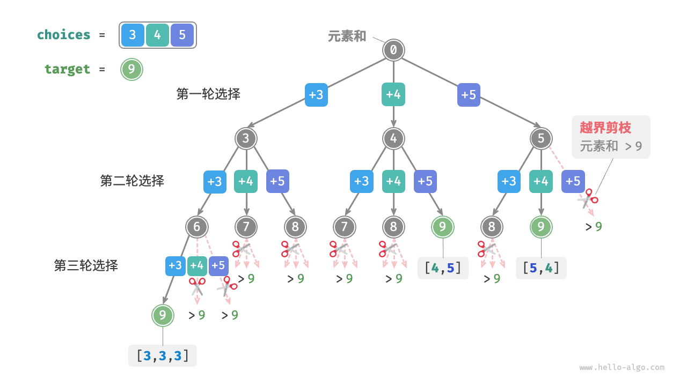
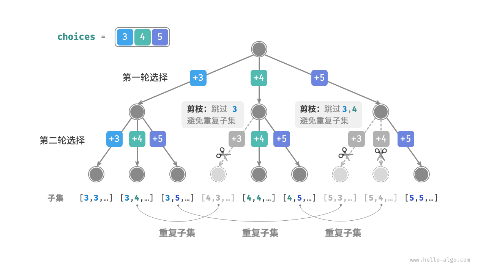
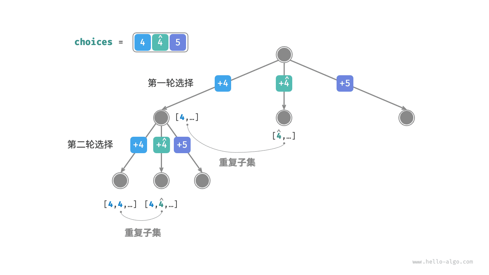
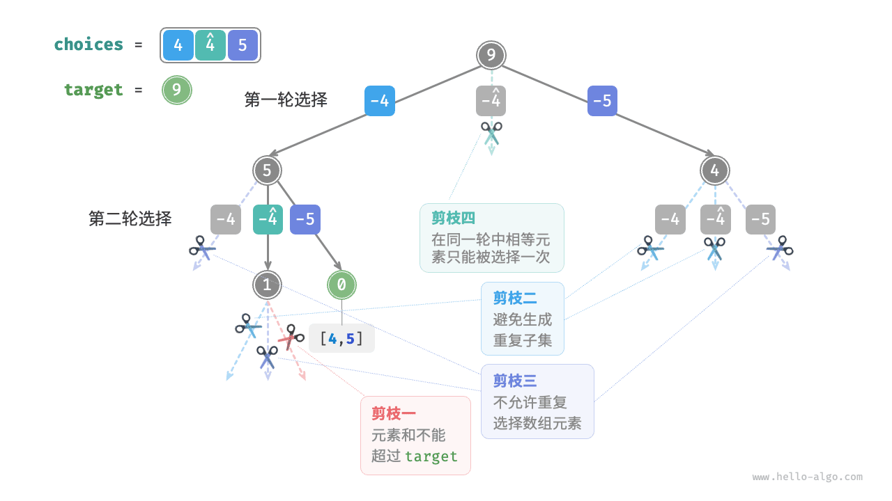

# 子集和问题

!!! question

    给定一个正整数数组 `nums` 和一个目标正整数 `target` ，请找出所有可能的组合，使得组合中的元素和等于 `target` 。给定数组无重复元素，每个元素可以被选取多次。请以列表形式返回这些组合，列表中不应包含重复组合。

例如，输入集合 $\{3, 4, 5\}$ 和目标整数 $9$ ，由于集合中的数字可以被重复选取，因此解为 $\{3, 3, 3\}, \{4, 5\}$ 。请注意，子集是不区分元素顺序的，例如 $\{4, 5\}$ 和 $\{5, 4\}$ 是同一个子集。

## 从全排列引出解法

类似于上节全排列问题的解法，我们可以把子集的生成过程想象成一系列选择的结果，并在选择过程中实时更新“元素和”，当元素和等于 `target` 时，就将子集记录至结果列表。

而与全排列问题不同的是，本题允许重复选取同一元素，因此无需借助 `selected` 布尔列表来记录元素是否已被选择。我们可以对全排列代码进行小幅修改，初步得到解题代码。

=== "Java"

    ```java title="subset_sum_i_naive.java"
    [class]{subset_sum_i_naive}-[func]{backtrack}

    [class]{subset_sum_i_naive}-[func]{subsetSumINaive}
    ```

=== "C++"

    ```cpp title="subset_sum_i_naive.cpp"
    [class]{}-[func]{backtrack}

    [class]{}-[func]{subsetSumINaive}
    ```

=== "Python"

    ```python title="subset_sum_i_naive.py"
    [class]{}-[func]{backtrack}

    [class]{}-[func]{subset_sum_i_naive}
    ```

=== "Go"

    ```go title="subset_sum_i_naive.go"
    [class]{}-[func]{backtrackSubsetSumINaive}

    [class]{}-[func]{subsetSumINaive}
    ```

=== "JavaScript"

    ```javascript title="subset_sum_i_naive.js"
    [class]{}-[func]{backtrack}

    [class]{}-[func]{subsetSumINaive}
    ```

=== "TypeScript"

    ```typescript title="subset_sum_i_naive.ts"
    [class]{}-[func]{backtrack}

    [class]{}-[func]{subsetSumINaive}
    ```

=== "C"

    ```c title="subset_sum_i_naive.c"
    [class]{}-[func]{backtrack}

    [class]{}-[func]{subsetSumINaive}
    ```

=== "C#"

    ```csharp title="subset_sum_i_naive.cs"
    [class]{subset_sum_i_naive}-[func]{backtrack}

    [class]{subset_sum_i_naive}-[func]{subsetSumINaive}
    ```

=== "Swift"

    ```swift title="subset_sum_i_naive.swift"
    [class]{}-[func]{backtrack}

    [class]{}-[func]{subsetSumINaive}
    ```

=== "Zig"

    ```zig title="subset_sum_i_naive.zig"
    [class]{}-[func]{backtrack}

    [class]{}-[func]{subsetSumINaive}
    ```

=== "Dart"

    ```dart title="subset_sum_i_naive.dart"
    [class]{}-[func]{backtrack}

    [class]{}-[func]{subsetSumINaive}
    ```

向以上代码输入数组 $[3, 4, 5]$ 和目标元素 $9$ ，输出结果为 $[3, 3, 3], [4, 5], [5, 4]$ 。**虽然成功找出了所有和为 $9$ 的子集，但其中存在重复的子集 $[4, 5]$ 和 $[5, 4]$** 。这是因为搜索过程是区分选择顺序的，如下图所示，先选 $4$ 后选 $5$ 与先选 $5$ 后选 $4$ 是两种不同的情况。



## 重复子集剪枝

为了去除重复子集，**一种直接的思路是对结果列表进行去重**。但这个方法效率很低，因为：

- 当数组元素较多，尤其是当 `target` 较大时，搜索过程会产生大量的重复子集。
- 比较子集（数组）的异同是很耗时的，需要先排序数组，再比较数组中每个元素的异同。

为了达到最佳效率，**我们希望在搜索过程中通过剪枝进行去重**。观察下图，重复子集是在以不同顺序选择数组元素时产生的，具体来看：

1. 第一轮和第二轮分别选择 $3$ , $4$ ，会生成包含这两个元素的所有子集，记为 $[3, 4, \cdots]$ 。
2. 若第一轮选择 $4$ ，**则第二轮应该跳过 $3$** ，因为该选择产生的子集 $[4, 3, \cdots]$ 和 `1.` 中提到的子集完全重复。
3. 同理，若第一轮选择 $5$ ，**则第二轮应该跳过 $3$ 和 $4$** ，因为子集 $[5, 3, \cdots]$ 和子集 $[5, 4, \cdots]$ 和之前的子集重复。



总结来看，给定输入数组 $[x_1, x_2, \cdots, x_n]$ ，设搜索过程中的选择序列为 $[x_{i_1}, x_{i_2}, \cdots , x_{i_m}]$ ，则该选择序列需要满足 $i_1 \leq i_2 \leq \cdots \leq i_m$ 。**不满足该条件的选择序列都是重复子集**。

为实现该剪枝，我们初始化变量 `start` ，用于指示遍历起点。**当做出选择 $x_{i}$ 后，设定下一轮从索引 $i$ 开始遍历**，从而完成子集去重。

除此之外，我们还对代码进行了两项优化。首先，我们在开启搜索前将数组 `nums` 排序，在搜索过程中，**当子集和超过 `target` 时直接结束循环**，因为后边的元素更大，其子集和都一定会超过 `target` 。其次，**我们通过在 `target` 上执行减法来统计元素和**，当 `target` 等于 $0$ 时记录解，省去了元素和变量 `total` 。

=== "Java"

    ```java title="subset_sum_i.java"
    [class]{subset_sum_i}-[func]{backtrack}

    [class]{subset_sum_i}-[func]{subsetSumI}
    ```

=== "C++"

    ```cpp title="subset_sum_i.cpp"
    [class]{}-[func]{backtrack}

    [class]{}-[func]{subsetSumI}
    ```

=== "Python"

    ```python title="subset_sum_i.py"
    [class]{}-[func]{backtrack}

    [class]{}-[func]{subset_sum_i}
    ```

=== "Go"

    ```go title="subset_sum_i.go"
    [class]{}-[func]{backtrackSubsetSumI}

    [class]{}-[func]{subsetSumI}
    ```

=== "JavaScript"

    ```javascript title="subset_sum_i.js"
    [class]{}-[func]{backtrack}

    [class]{}-[func]{subsetSumI}
    ```

=== "TypeScript"

    ```typescript title="subset_sum_i.ts"
    [class]{}-[func]{backtrack}

    [class]{}-[func]{subsetSumI}
    ```

=== "C"

    ```c title="subset_sum_i.c"
    [class]{}-[func]{backtrack}

    [class]{}-[func]{subsetSumI}
    ```

=== "C#"

    ```csharp title="subset_sum_i.cs"
    [class]{subset_sum_i}-[func]{backtrack}

    [class]{subset_sum_i}-[func]{subsetSumI}
    ```

=== "Swift"

    ```swift title="subset_sum_i.swift"
    [class]{}-[func]{backtrack}

    [class]{}-[func]{subsetSumI}
    ```

=== "Zig"

    ```zig title="subset_sum_i.zig"
    [class]{}-[func]{backtrack}

    [class]{}-[func]{subsetSumI}
    ```

=== "Dart"

    ```dart title="subset_sum_i.dart"
    [class]{}-[func]{backtrack}

    [class]{}-[func]{subsetSumI}
    ```

如下图所示，为将数组 $[3, 4, 5]$ 和目标元素 $9$ 输入到以上代码后的整体回溯过程。


## 相等元素剪枝

!!! question

    给定一个正整数数组 `nums` 和一个目标正整数 `target` ，请找出所有可能的组合，使得组合中的元素和等于 `target` 。**给定数组可能包含重复元素，每个元素只可被选择一次**。请以列表形式返回这些组合，列表中不应包含重复组合。

相比于上题，**本题的输入数组可能包含重复元素**，这引入了新的问题。例如，给定数组 $[4, \hat{4}, 5]$ 和目标元素 $9$ ，则现有代码的输出结果为 $[4, 5], [\hat{4}, 5]$ ，也出现了重复子集。**造成这种重复的原因是相等元素在某轮中被多次选择**。如下图所示，第一轮共有三个选择，其中两个都为 $4$ ，会产生两个重复的搜索分支，从而输出重复子集；同理，第二轮的两个 $4$ 也会产生重复子集。



为解决此问题，**我们需要限制相等元素在每一轮中只被选择一次**。实现方式比较巧妙：由于数组是已排序的，因此相等元素都是相邻的。利用该特性，在某轮选择中，若当前元素与其左边元素相等，则说明它已经被选择过，因此直接跳过当前元素。

与此同时，**本题规定数组元素只能被选择一次**。幸运的是，我们也可以利用变量 `start` 来满足该约束：当做出选择 $x_{i}$ 后，设定下一轮从索引 $i + 1$ 开始向后遍历。这样即能去除重复子集，也能避免重复选择相等元素。

=== "Java"

    ```java title="subset_sum_ii.java"
    [class]{subset_sum_ii}-[func]{backtrack}

    [class]{subset_sum_ii}-[func]{subsetSumII}
    ```

=== "C++"

    ```cpp title="subset_sum_ii.cpp"
    [class]{}-[func]{backtrack}

    [class]{}-[func]{subsetSumII}
    ```

=== "Python"

    ```python title="subset_sum_ii.py"
    [class]{}-[func]{backtrack}

    [class]{}-[func]{subset_sum_ii}
    ```

=== "Go"

    ```go title="subset_sum_ii.go"
    [class]{}-[func]{backtrackSubsetSumII}

    [class]{}-[func]{subsetSumII}
    ```

=== "JavaScript"

    ```javascript title="subset_sum_ii.js"
    [class]{}-[func]{backtrack}

    [class]{}-[func]{subsetSumII}
    ```

=== "TypeScript"

    ```typescript title="subset_sum_ii.ts"
    [class]{}-[func]{backtrack}

    [class]{}-[func]{subsetSumII}
    ```

=== "C"

    ```c title="subset_sum_ii.c"
    [class]{}-[func]{backtrack}

    [class]{}-[func]{subsetSumII}
    ```

=== "C#"

    ```csharp title="subset_sum_ii.cs"
    [class]{subset_sum_ii}-[func]{backtrack}

    [class]{subset_sum_ii}-[func]{subsetSumII}
    ```

=== "Swift"

    ```swift title="subset_sum_ii.swift"
    [class]{}-[func]{backtrack}

    [class]{}-[func]{subsetSumII}
    ```

=== "Zig"

    ```zig title="subset_sum_ii.zig"
    [class]{}-[func]{backtrack}

    [class]{}-[func]{subsetSumII}
    ```

=== "Dart"

    ```dart title="subset_sum_ii.dart"
    [class]{}-[func]{backtrack}

    [class]{}-[func]{subsetSumII}
    ```

下图展示了数组 $[4, 4, 5]$ 和目标元素 $9$ 的回溯过程，共包含四种剪枝操作。建议你将图示与代码注释相结合，理解整个搜索过程，以及每种剪枝操作是如何工作的。


