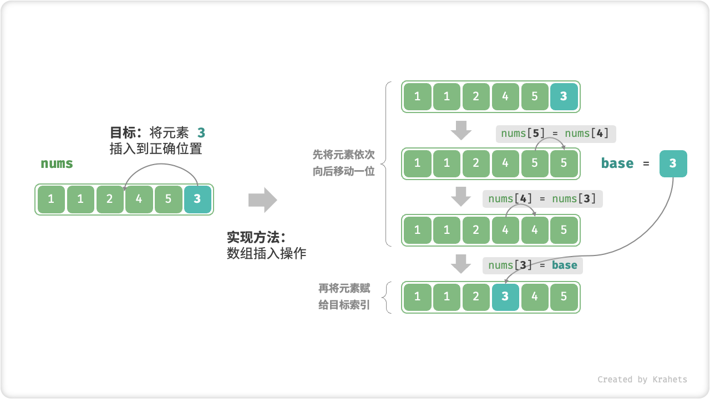

# 插入排序

「插入排序 Insertion Sort」是一种基于 **数组插入操作** 的排序算法。

「插入操作」原理：选定某个待排序元素为基准数 `base`，将 `base` 与其左侧已排序区间元素依次对比大小，并插入到正确位置。

回忆数组插入操作，我们需要将从目标索引到 `base` 之间的所有元素向右移动一位，然后再将 `base` 赋值给目标索引。



## 算法流程

1. 第 1 轮先选取数组的 **第 2 个元素** 为 `base` ，执行「插入操作」后，**数组前 2 个元素已完成排序**。
2. 第 2 轮选取 **第 3 个元素** 为 `base` ，执行「插入操作」后，**数组前 3 个元素已完成排序**。
3. 以此类推……最后一轮选取 **数组尾元素** 为 `base` ，执行「插入操作」后，**所有元素已完成排序**。


=== "Java"

    ```java title="insertion_sort.java"
    [class]{insertion_sort}-[func]{insertionSort}
    ```

=== "C++"

    ```cpp title="insertion_sort.cpp"
    [class]{}-[func]{insertionSort}
    ```

=== "Python"

    ```python title="insertion_sort.py"
    [class]{}-[func]{insertion_sort}
    ```

=== "Go"

    ```go title="insertion_sort.go"
    [class]{}-[func]{insertionSort}
    ```

=== "JavaScript"

    ```javascript title="insertion_sort.js"
    [class]{}-[func]{insertionSort}
    ```

=== "TypeScript"

    ```typescript title="insertion_sort.ts"
    [class]{}-[func]{insertionSort}
    ```

=== "C"

    ```c title="insertion_sort.c"
    [class]{}-[func]{insertionSort}
    ```

=== "C#"

    ```csharp title="insertion_sort.cs"
    [class]{insertion_sort}-[func]{insertionSort}
    ```

=== "Swift"

    ```swift title="insertion_sort.swift"
    [class]{}-[func]{insertionSort}
    ```

=== "Zig"

    ```zig title="insertion_sort.zig"
    [class]{}-[func]{insertionSort}
    ```

## 算法特性

**时间复杂度 $O(n^2)$** ：最差情况下，各轮插入操作循环 $n - 1$ , $n-2$ , $\cdots$ , $2$ , $1$ 次，求和为 $\frac{(n - 1) n}{2}$ ，使用 $O(n^2)$ 时间。

**空间复杂度 $O(1)$** ：指针 $i$ , $j$ 使用常数大小的额外空间。

**原地排序**：指针变量仅使用常数大小额外空间。

**稳定排序**：不交换相等元素。

**自适应排序**：最佳情况下，时间复杂度为 $O(n)$  。

## 插入排序 vs 冒泡排序

!!! question

    虽然「插入排序」和「冒泡排序」的时间复杂度皆为 $O(n^2)$ ，但实际运行速度却有很大差别，这是为什么呢？

回顾复杂度分析，两个方法的循环次数都是 $\frac{(n - 1) n}{2}$ 。但不同的是，「冒泡操作」是在做 **元素交换**，需要借助一个临时变量实现，共 3 个单元操作；而「插入操作」是在做 **赋值**，只需 1 个单元操作；因此，可以粗略估计出冒泡排序的计算开销约为插入排序的 3 倍。

插入排序运行速度快，并且具有原地、稳定、自适应的优点，因此很受欢迎。实际上，包括 Java 在内的许多编程语言的排序库函数的实现都用到了插入排序。库函数的大致思路：

- 对于 **长数组**，采用基于分治的排序算法，例如「快速排序」，时间复杂度为 $O(n \log n)$ ；
- 对于 **短数组**，直接使用「插入排序」，时间复杂度为 $O(n^2)$ ；

在数组较短时，复杂度中的常数项（即每轮中的单元操作数量）占主导作用，此时插入排序运行地更快。这个现象与「线性查找」和「二分查找」的情况类似。
