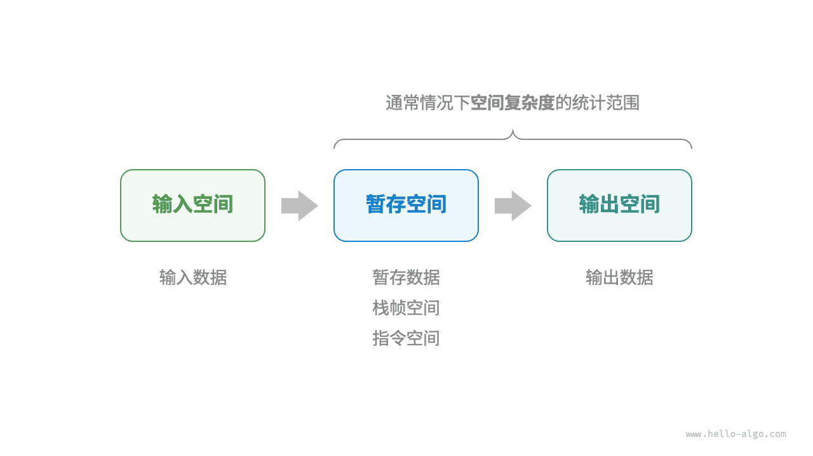
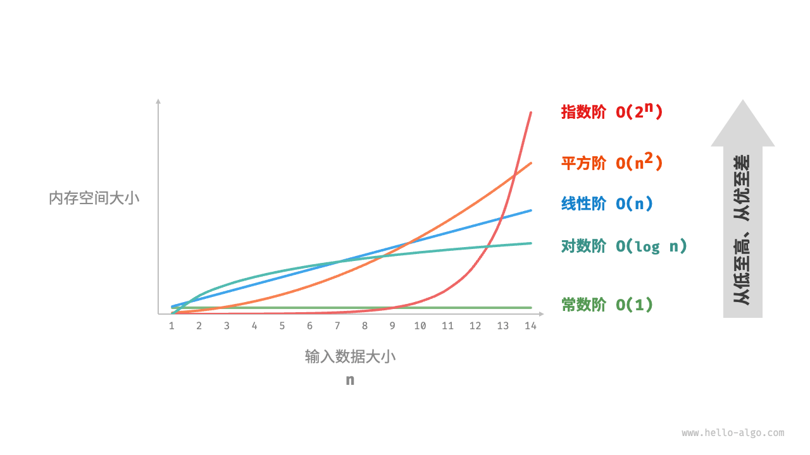
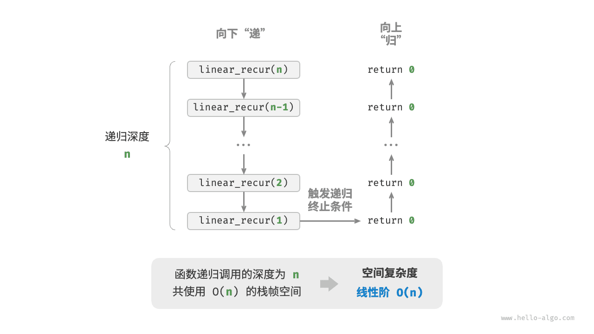
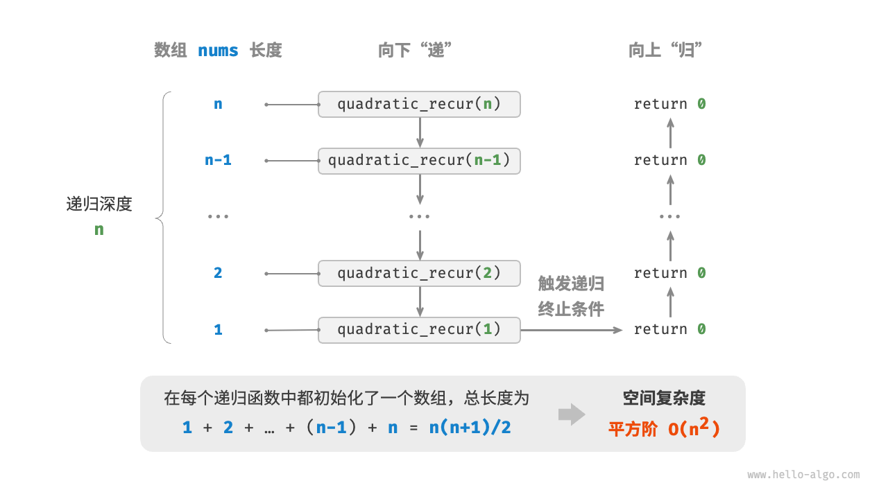
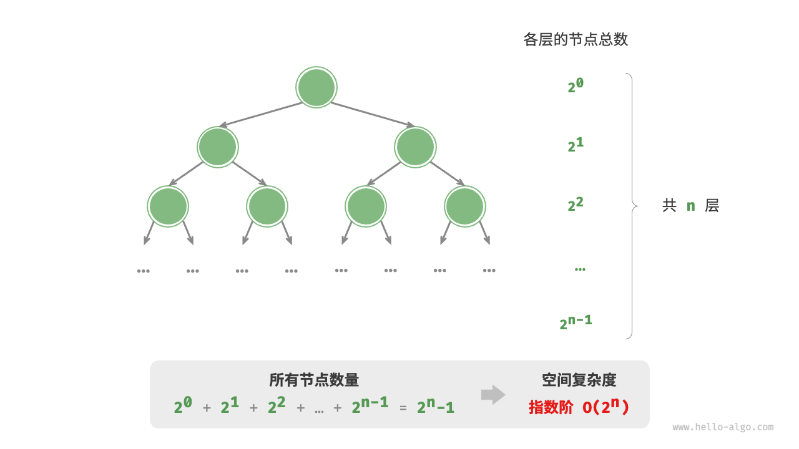

# 空间复杂度

<u>空间复杂度（space complexity）</u>用于衡量算法占用内存空间随着数据量变大时的增长趋势。这个概念与时间复杂度非常类似，只需将“运行时间”替换为“占用内存空间”。

## 算法相关空间

算法在运行过程中使用的内存空间主要包括以下几种。

- **输入空间**：用于存储算法的输入数据。
- **暂存空间**：用于存储算法在运行过程中的变量、对象、函数上下文等数据。
- **输出空间**：用于存储算法的输出数据。

一般情况下，空间复杂度的统计范围是“暂存空间”加上“输出空间”。

暂存空间可以进一步划分为三个部分。

- **暂存数据**：用于保存算法运行过程中的各种常量、变量、对象等。
- **栈帧空间**：用于保存调用函数的上下文数据。系统在每次调用函数时都会在栈顶部创建一个栈帧，函数返回后，栈帧空间会被释放。
- **指令空间**：用于保存编译后的程序指令，在实际统计中通常忽略不计。

在分析一段程序的空间复杂度时，**我们通常统计暂存数据、栈帧空间和输出数据三部分**，如下图所示。



相关代码如下：

=== "Python"

    ```python title=""
    class Node:
        """类"""
        def __init__(self, x: int):
            self.val: int = x              # 节点值
            self.next: Node | None = None  # 指向下一节点的引用

    def function() -> int:
        """函数"""
        # 执行某些操作...
        return 0

    def algorithm(n) -> int:  # 输入数据
        A = 0                 # 暂存数据（常量，一般用大写字母表示）
        b = 0                 # 暂存数据（变量）
        node = Node(0)        # 暂存数据（对象）
        c = function()        # 栈帧空间（调用函数）
        return A + b + c      # 输出数据
    ```

=== "C++"

    ```cpp title=""
    /* 结构体 */
    struct Node {
        int val;
        Node *next;
        Node(int x) : val(x), next(nullptr) {}
    };

    /* 函数 */
    int func() {
        // 执行某些操作...
        return 0;
    }

    int algorithm(int n) {        // 输入数据
        const int a = 0;          // 暂存数据（常量）
        int b = 0;                // 暂存数据（变量）
        Node* node = new Node(0); // 暂存数据（对象）
        int c = func();           // 栈帧空间（调用函数）
        return a + b + c;         // 输出数据
    }
    ```

=== "Java"

    ```java title=""
    /* 类 */
    class Node {
        int val;
        Node next;
        Node(int x) { val = x; }
    }
    
    /* 函数 */
    int function() {
        // 执行某些操作...
        return 0;
    }
    
    int algorithm(int n) {        // 输入数据
        final int a = 0;          // 暂存数据（常量）
        int b = 0;                // 暂存数据（变量）
        Node node = new Node(0);  // 暂存数据（对象）
        int c = function();       // 栈帧空间（调用函数）
        return a + b + c;         // 输出数据
    }
    ```

=== "C#"

    ```csharp title=""
    /* 类 */
    class Node(int x) {
        int val = x;
        Node next;
    }

    /* 函数 */
    int Function() {
        // 执行某些操作...
        return 0;
    }

    int Algorithm(int n) {        // 输入数据
        const int a = 0;          // 暂存数据（常量）
        int b = 0;                // 暂存数据（变量）
        Node node = new(0);       // 暂存数据（对象）
        int c = Function();       // 栈帧空间（调用函数）
        return a + b + c;         // 输出数据
    }
    ```

=== "Go"

    ```go title=""
    /* 结构体 */
    type node struct {
        val  int
        next *node
    }

    /* 创建 node 结构体  */
    func newNode(val int) *node {
        return &node{val: val}
    }
    
    /* 函数 */
    func function() int {
        // 执行某些操作...
        return 0
    }

    func algorithm(n int) int { // 输入数据
        const a = 0             // 暂存数据（常量）
        b := 0                  // 暂存数据（变量）
        newNode(0)              // 暂存数据（对象）
        c := function()         // 栈帧空间（调用函数）
        return a + b + c        // 输出数据
    }
    ```

=== "Swift"

    ```swift title=""
    /* 类 */
    class Node {
        var val: Int
        var next: Node?

        init(x: Int) {
            val = x
        }
    }

    /* 函数 */
    func function() -> Int {
        // 执行某些操作...
        return 0
    }

    func algorithm(n: Int) -> Int { // 输入数据
        let a = 0             // 暂存数据（常量）
        var b = 0             // 暂存数据（变量）
        let node = Node(x: 0) // 暂存数据（对象）
        let c = function()    // 栈帧空间（调用函数）
        return a + b + c      // 输出数据
    }
    ```

=== "JS"

    ```javascript title=""
    /* 类 */
    class Node {
        val;
        next;
        constructor(val) {
            this.val = val === undefined ? 0 : val; // 节点值
            this.next = null;                       // 指向下一节点的引用
        }
    }

    /* 函数 */
    function constFunc() {
        // 执行某些操作
        return 0;
    }

    function algorithm(n) {       // 输入数据
        const a = 0;              // 暂存数据（常量）
        let b = 0;                // 暂存数据（变量）
        const node = new Node(0); // 暂存数据（对象）
        const c = constFunc();    // 栈帧空间（调用函数）
        return a + b + c;         // 输出数据
    }
    ```

=== "TS"

    ```typescript title=""
    /* 类 */
    class Node {
        val: number;
        next: Node | null;
        constructor(val?: number) {
            this.val = val === undefined ? 0 : val; // 节点值
            this.next = null;                       // 指向下一节点的引用
        }
    }

    /* 函数 */
    function constFunc(): number {
        // 执行某些操作
        return 0;
    }

    function algorithm(n: number): number { // 输入数据
        const a = 0;                        // 暂存数据（常量）
        let b = 0;                          // 暂存数据（变量）
        const node = new Node(0);           // 暂存数据（对象）
        const c = constFunc();              // 栈帧空间（调用函数）
        return a + b + c;                   // 输出数据
    }
    ```

=== "Dart"

    ```dart title=""
    /* 类 */
    class Node {
      int val;
      Node next;
      Node(this.val, [this.next]);
    }

    /* 函数 */
    int function() {
      // 执行某些操作...
      return 0;
    }

    int algorithm(int n) {  // 输入数据
      const int a = 0;      // 暂存数据（常量）
      int b = 0;            // 暂存数据（变量）
      Node node = Node(0);  // 暂存数据（对象）
      int c = function();   // 栈帧空间（调用函数）
      return a + b + c;     // 输出数据
    }
    ```

=== "Rust"

    ```rust title=""
    use std::rc::Rc;
    use std::cell::RefCell;
    
    /* 结构体 */
    struct Node {
        val: i32,
        next: Option<Rc<RefCell<Node>>>,
    }

    /* 创建 Node 结构体 */
    impl Node {
        fn new(val: i32) -> Self {
            Self { val: val, next: None }
        }
    }

    /* 函数 */
    fn function() -> i32 {      
        // 执行某些操作...
        return 0;
    }

    fn algorithm(n: i32) -> i32 {       // 输入数据
        const a: i32 = 0;               // 暂存数据（常量）
        let mut b = 0;                  // 暂存数据（变量）
        let node = Node::new(0);        // 暂存数据（对象）
        let c = function();             // 栈帧空间（调用函数）
        return a + b + c;               // 输出数据
    }
    ```

=== "C"

    ```c title=""
    /* 函数 */
    int func() {
        // 执行某些操作...
        return 0;
    }

    int algorithm(int n) { // 输入数据
        const int a = 0;   // 暂存数据（常量）
        int b = 0;         // 暂存数据（变量）
        int c = func();    // 栈帧空间（调用函数）
        return a + b + c;  // 输出数据
    }
    ```

=== "Kotlin"

    ```kotlin title=""
    /* 类 */
    class Node(var _val: Int) {
        var next: Node? = null
    }

    /* 函数 */
    fun function(): Int {
        // 执行某些操作...
        return 0
    }

    fun algorithm(n: Int): Int { // 输入数据
        val a = 0                // 暂存数据（常量）
        var b = 0                // 暂存数据（变量）
        val node = Node(0)       // 暂存数据（对象）
        val c = function()       // 栈帧空间（调用函数）
        return a + b + c         // 输出数据
    }
    ```

=== "Ruby"

    ```ruby title=""
    ### 类 ###
    class Node
        attr_accessor :val      # 节点值
        attr_accessor :next     # 指向下一节点的引用

        def initialize(x)
            @val = x
        end
    end

    ### 函数 ###
    def function
        # 执行某些操作...
        0
    end

    ### 算法 ###
    def algorithm(n)        # 输入数据
        a = 0               # 暂存数据（常量）
        b = 0               # 暂存数据（变量）
        node = Node.new(0)  # 暂存数据（对象）
        c = function        # 栈帧空间（调用函数）
        a + b + c           # 输出数据
    end
    ```

=== "Zig"

    ```zig title=""

    ```

## 推算方法

空间复杂度的推算方法与时间复杂度大致相同，只需将统计对象从“操作数量”转为“使用空间大小”。

而与时间复杂度不同的是，**我们通常只关注最差空间复杂度**。这是因为内存空间是一项硬性要求，我们必须确保在所有输入数据下都有足够的内存空间预留。

观察以下代码，最差空间复杂度中的“最差”有两层含义。

1. **以最差输入数据为准**：当 $n < 10$ 时，空间复杂度为 $O(1)$ ；但当 $n > 10$ 时，初始化的数组 `nums` 占用 $O(n)$ 空间，因此最差空间复杂度为 $O(n)$ 。
2. **以算法运行中的峰值内存为准**：例如，程序在执行最后一行之前，占用 $O(1)$ 空间；当初始化数组 `nums` 时，程序占用 $O(n)$ 空间，因此最差空间复杂度为 $O(n)$ 。

=== "Python"

    ```python title=""
    def algorithm(n: int):
        a = 0               # O(1)
        b = [0] * 10000     # O(1)
        if n > 10:
            nums = [0] * n  # O(n)
    ```

=== "C++"

    ```cpp title=""
    void algorithm(int n) {
        int a = 0;               // O(1)
        vector<int> b(10000);    // O(1)
        if (n > 10)
            vector<int> nums(n); // O(n)
    }
    ```

=== "Java"

    ```java title=""
    void algorithm(int n) {
        int a = 0;                   // O(1)
        int[] b = new int[10000];    // O(1)
        if (n > 10)
            int[] nums = new int[n]; // O(n)
    }
    ```

=== "C#"

    ```csharp title=""
    void Algorithm(int n) {
        int a = 0;                   // O(1)
        int[] b = new int[10000];    // O(1)
        if (n > 10) {
            int[] nums = new int[n]; // O(n)
        }
    }
    ```

=== "Go"

    ```go title=""
    func algorithm(n int) {
        a := 0                      // O(1)
        b := make([]int, 10000)     // O(1)
        var nums []int
        if n > 10 {
            nums := make([]int, n)  // O(n)
        }
        fmt.Println(a, b, nums)
    }
    ```

=== "Swift"

    ```swift title=""
    func algorithm(n: Int) {
        let a = 0 // O(1)
        let b = Array(repeating: 0, count: 10000) // O(1)
        if n > 10 {
            let nums = Array(repeating: 0, count: n) // O(n)
        }
    }
    ```

=== "JS"

    ```javascript title=""
    function algorithm(n) {
        const a = 0;                   // O(1)
        const b = new Array(10000);    // O(1)
        if (n > 10) {
            const nums = new Array(n); // O(n)
        }
    }
    ```

=== "TS"

    ```typescript title=""
    function algorithm(n: number): void {
        const a = 0;                   // O(1)
        const b = new Array(10000);    // O(1)
        if (n > 10) {
            const nums = new Array(n); // O(n)
        }
    }
    ```

=== "Dart"

    ```dart title=""
    void algorithm(int n) {
      int a = 0;                            // O(1)
      List<int> b = List.filled(10000, 0);  // O(1)
      if (n > 10) {
        List<int> nums = List.filled(n, 0); // O(n)
      }
    }
    ```

=== "Rust"

    ```rust title=""
    fn algorithm(n: i32) {
        let a = 0;                              // O(1)
        let b = [0; 10000];                     // O(1)
        if n > 10 {
            let nums = vec![0; n as usize];     // O(n)
        }
    }
    ```

=== "C"

    ```c title=""
    void algorithm(int n) {
        int a = 0;               // O(1)
        int b[10000];            // O(1)
        if (n > 10)
            int nums[n] = {0};   // O(n)
    }
    ```

=== "Kotlin"

    ```kotlin title=""
    fun algorithm(n: Int) {
        val a = 0                    // O(1)
        val b = IntArray(10000)      // O(1)
        if (n > 10) {
            val nums = IntArray(n)   // O(n)
        }
    }
    ```

=== "Ruby"

    ```ruby title=""
    def algorithm(n)
        a = 0                           # O(1)
        b = Array.new(10000)            # O(1)
        nums = Array.new(n) if n > 10   # O(n)
    end
    ```

=== "Zig"

    ```zig title=""

    ```

**在递归函数中，需要注意统计栈帧空间**。观察以下代码：

=== "Python"

    ```python title=""
    def function() -> int:
        # 执行某些操作
        return 0

    def loop(n: int):
        """循环的空间复杂度为 O(1)"""
        for _ in range(n):
            function()

    def recur(n: int):
        """递归的空间复杂度为 O(n)"""
        if n == 1:
            return
        return recur(n - 1)
    ```

=== "C++"

    ```cpp title=""
    int func() {
        // 执行某些操作
        return 0;
    }
    /* 循环的空间复杂度为 O(1) */
    void loop(int n) {
        for (int i = 0; i < n; i++) {
            func();
        }
    }
    /* 递归的空间复杂度为 O(n) */
    void recur(int n) {
        if (n == 1) return;
        return recur(n - 1);
    }
    ```

=== "Java"

    ```java title=""
    int function() {
        // 执行某些操作
        return 0;
    }
    /* 循环的空间复杂度为 O(1) */
    void loop(int n) {
        for (int i = 0; i < n; i++) {
            function();
        }
    }
    /* 递归的空间复杂度为 O(n) */
    void recur(int n) {
        if (n == 1) return;
        return recur(n - 1);
    }
    ```

=== "C#"

    ```csharp title=""
    int Function() {
        // 执行某些操作
        return 0;
    }
    /* 循环的空间复杂度为 O(1) */
    void Loop(int n) {
        for (int i = 0; i < n; i++) {
            Function();
        }
    }
    /* 递归的空间复杂度为 O(n) */
    int Recur(int n) {
        if (n == 1) return 1;
        return Recur(n - 1);
    }
    ```

=== "Go"

    ```go title=""
    func function() int {
        // 执行某些操作
        return 0
    }
    
    /* 循环的空间复杂度为 O(1) */
    func loop(n int) {
        for i := 0; i < n; i++ {
            function()
        }
    }
    
    /* 递归的空间复杂度为 O(n) */
    func recur(n int) {
        if n == 1 {
            return
        }
        recur(n - 1)
    }
    ```

=== "Swift"

    ```swift title=""
    @discardableResult
    func function() -> Int {
        // 执行某些操作
        return 0
    }

    /* 循环的空间复杂度为 O(1) */
    func loop(n: Int) {
        for _ in 0 ..< n {
            function()
        }
    }

    /* 递归的空间复杂度为 O(n) */
    func recur(n: Int) {
        if n == 1 {
            return
        }
        recur(n: n - 1)
    }
    ```

=== "JS"

    ```javascript title=""
    function constFunc() {
        // 执行某些操作
        return 0;
    }
    /* 循环的空间复杂度为 O(1) */
    function loop(n) {
        for (let i = 0; i < n; i++) {
            constFunc();
        }
    }
    /* 递归的空间复杂度为 O(n) */
    function recur(n) {
        if (n === 1) return;
        return recur(n - 1);
    }
    ```

=== "TS"

    ```typescript title=""
    function constFunc(): number {
        // 执行某些操作
        return 0;
    }
    /* 循环的空间复杂度为 O(1) */
    function loop(n: number): void {
        for (let i = 0; i < n; i++) {
            constFunc();
        }
    }
    /* 递归的空间复杂度为 O(n) */
    function recur(n: number): void {
        if (n === 1) return;
        return recur(n - 1);
    }
    ```

=== "Dart"

    ```dart title=""
    int function() {
      // 执行某些操作
      return 0;
    }
    /* 循环的空间复杂度为 O(1) */
    void loop(int n) {
      for (int i = 0; i < n; i++) {
        function();
      }
    }
    /* 递归的空间复杂度为 O(n) */
    void recur(int n) {
      if (n == 1) return;
      return recur(n - 1);
    }
    ```

=== "Rust"

    ```rust title=""
    fn function() -> i32 {
        // 执行某些操作
        return 0;
    }
    /* 循环的空间复杂度为 O(1) */
    fn loop(n: i32) {
        for i in 0..n {
            function();
        }
    }
    /* 递归的空间复杂度为 O(n) */
    fn recur(n: i32) {
        if n == 1 {
            return;
        }
        recur(n - 1);
    }
    ```

=== "C"

    ```c title=""
    int func() {
        // 执行某些操作
        return 0;
    }
    /* 循环的空间复杂度为 O(1) */
    void loop(int n) {
        for (int i = 0; i < n; i++) {
            func();
        }
    }
    /* 递归的空间复杂度为 O(n) */
    void recur(int n) {
        if (n == 1) return;
        return recur(n - 1);
    }
    ```

=== "Kotlin"

    ```kotlin title=""
    fun function(): Int {
        // 执行某些操作
        return 0
    }
    /* 循环的空间复杂度为 O(1) */
    fun loop(n: Int) {
        for (i in 0..<n) {
            function()
        }
    }
    /* 递归的空间复杂度为 O(n) */
    fun recur(n: Int) {
        if (n == 1) return
        return recur(n - 1)
    }
    ```

=== "Ruby"

    ```ruby title=""
    def function
        # 执行某些操作
        0
    end

    ### 循环的空间复杂度为 O(1) ###
    def loop(n)
        (0...n).each { function }
    end

    ### 递归的空间复杂度为 O(n) ###
    def recur(n)
        return if n == 1
        recur(n - 1)
    end
    ```

=== "Zig"

    ```zig title=""

    ```

函数 `loop()` 和 `recur()` 的时间复杂度都为 $O(n)$ ，但空间复杂度不同。

- 函数 `loop()` 在循环中调用了 $n$ 次 `function()` ，每轮中的 `function()` 都返回并释放了栈帧空间，因此空间复杂度仍为 $O(1)$ 。
- 递归函数 `recur()` 在运行过程中会同时存在 $n$ 个未返回的 `recur()` ，从而占用 $O(n)$ 的栈帧空间。

## 常见类型

设输入数据大小为 $n$ ，下图展示了常见的空间复杂度类型（从低到高排列）。

$$
\begin{aligned}
O(1) < O(\log n) < O(n) < O(n^2) < O(2^n) \newline
\text{常数阶} < \text{对数阶} < \text{线性阶} < \text{平方阶} < \text{指数阶}
\end{aligned}
$$



### 常数阶 $O(1)$

常数阶常见于数量与输入数据大小 $n$ 无关的常量、变量、对象。

需要注意的是，在循环中初始化变量或调用函数而占用的内存，在进入下一循环后就会被释放，因此不会累积占用空间，空间复杂度仍为 $O(1)$ ：

```src
[file]{space_complexity}-[class]{}-[func]{constant}
```

### 线性阶 $O(n)$

线性阶常见于元素数量与 $n$ 成正比的数组、链表、栈、队列等：

```src
[file]{space_complexity}-[class]{}-[func]{linear}
```

如下图所示，此函数的递归深度为 $n$ ，即同时存在 $n$ 个未返回的 `linear_recur()` 函数，使用 $O(n)$ 大小的栈帧空间：

```src
[file]{space_complexity}-[class]{}-[func]{linear_recur}
```



### 平方阶 $O(n^2)$

平方阶常见于矩阵和图，元素数量与 $n$ 成平方关系：

```src
[file]{space_complexity}-[class]{}-[func]{quadratic}
```

如下图所示，该函数的递归深度为 $n$ ，在每个递归函数中都初始化了一个数组，长度分别为 $n$、$n-1$、$\dots$、$2$、$1$ ，平均长度为 $n / 2$ ，因此总体占用 $O(n^2)$ 空间：

```src
[file]{space_complexity}-[class]{}-[func]{quadratic_recur}
```



### 指数阶 $O(2^n)$

指数阶常见于二叉树。观察下图，层数为 $n$ 的“满二叉树”的节点数量为 $2^n - 1$ ，占用 $O(2^n)$ 空间：

```src
[file]{space_complexity}-[class]{}-[func]{build_tree}
```



### 对数阶 $O(\log n)$

对数阶常见于分治算法。例如归并排序，输入长度为 $n$ 的数组，每轮递归将数组从中点处划分为两半，形成高度为 $\log n$ 的递归树，使用 $O(\log n)$ 栈帧空间。

再例如将数字转化为字符串，输入一个正整数 $n$ ，它的位数为 $\lfloor \log_{10} n \rfloor + 1$ ，即对应字符串长度为 $\lfloor \log_{10} n \rfloor + 1$ ，因此空间复杂度为 $O(\log_{10} n + 1) = O(\log n)$ 。

## 权衡时间与空间

理想情况下，我们希望算法的时间复杂度和空间复杂度都能达到最优。然而在实际情况中，同时优化时间复杂度和空间复杂度通常非常困难。

**降低时间复杂度通常需要以提升空间复杂度为代价，反之亦然**。我们将牺牲内存空间来提升算法运行速度的思路称为“以空间换时间”；反之，则称为“以时间换空间”。

选择哪种思路取决于我们更看重哪个方面。在大多数情况下，时间比空间更宝贵，因此“以空间换时间”通常是更常用的策略。当然，在数据量很大的情况下，控制空间复杂度也非常重要。
